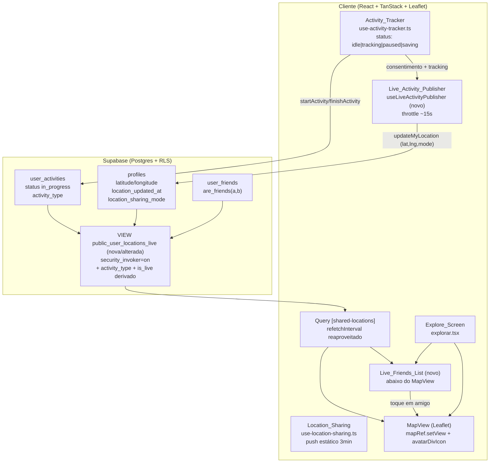
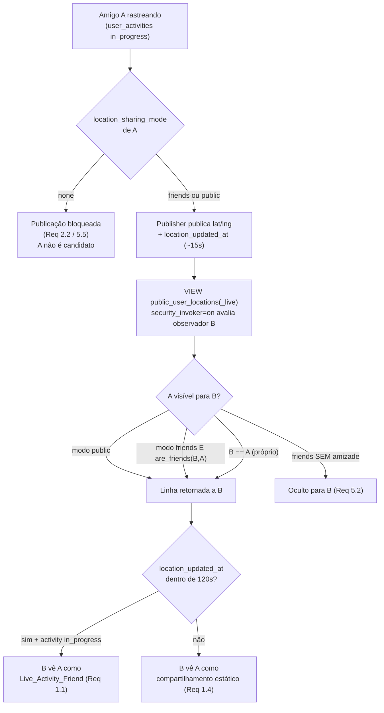
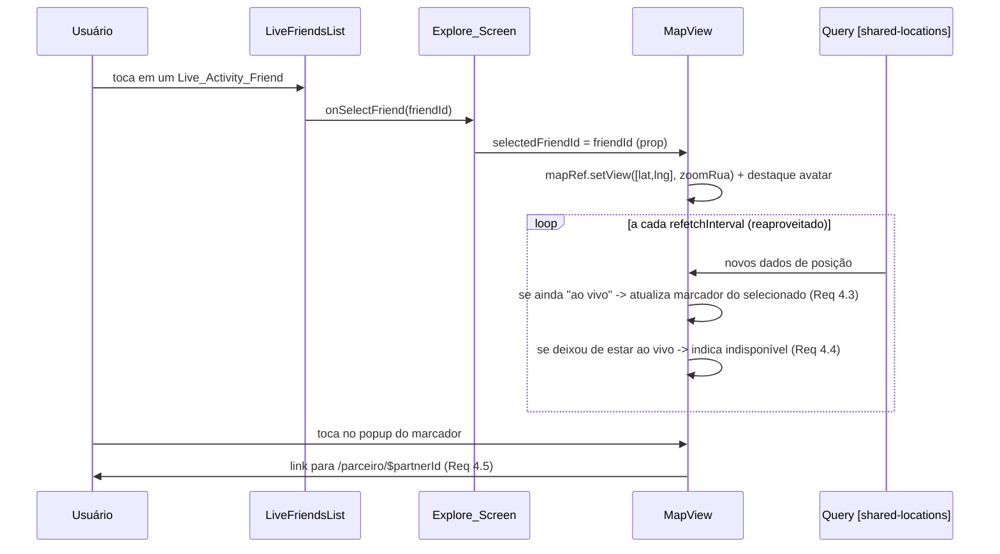
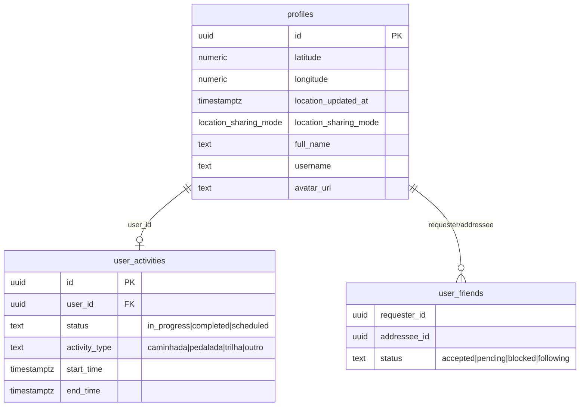

# Design Document — Amigos em Atividade ao Vivo

## Overview

Esta feature conecta dois subsistemas hoje independentes do OutLife —
o **rastreamento de atividade** (`use-activity-tracker.ts`) e o
**compartilhamento de localização** (`use-location-sharing.ts` +
VIEW `public.public_user_locations`) — para entregar a experiência de
"amigos em atividade ao vivo" descrita no requirements.md.

A ideia central, fixada nos requisitos, é **não inventar um segundo modelo de
privacidade nem uma flag redundante**. O estado "ao vivo" é **derivado**
(DECISÃO-D) da combinação de dois fatos que já existem no banco:

1. o amigo tem uma `user_activities` com `status = 'in_progress'`; e
2. a posição desse amigo em `profiles.location_updated_at` está dentro do
   **Live_Recency_Window de 120s** (DECISÃO-B).

A visibilidade continua sendo a que a VIEW `public_user_locations` já impõe
(`security_invoker=on` + `are_friends` + janela de 24h), e o consentimento
reaproveita o `location_sharing_mode` existente (DECISÃO-A). A única novidade
de dados é **expor na camada de consulta o `activity_type` e o vínculo com a
atividade `in_progress`** — feito com uma alteração idempotente da VIEW
(ou VIEW irmã), preservando `security_invoker=on`.

No cliente, adicionamos:

- um hook **`useLiveActivityPublisher`** que, durante o `tracking` e com
  consentimento, publica a posição a cada ~15s (Live_Publish_Interval,
  DECISÃO-C) reaproveitando `updateMyLocation`;
- um componente **`LiveFriendsList`** exibido abaixo do `MapView` na
  `explorar.tsx`;
- uma pequena extensão do **`MapView`** para permitir centralizar/destacar o
  marcador de um amigo selecionado e atualizá-lo em (quase) tempo real,
  reaproveitando a query `["shared-locations"]`.

O documento traz **dois níveis de design**, conforme pedido:

- **Alto nível**: diagramas de arquitetura, componentes, modelos de dados e
  fluxos de consentimento/visibilidade.
- **Baixo nível**: assinaturas de função/hook, pseudocódigo dos algoritmos de
  derivação de estado e throttle, SQL da migração e alterações concretas em
  `MapView`/`explorar.tsx`.

### Premissas e verificação de terreno

> Esta seção registra o que foi **confirmado no código real** durante o design
> e o que permanece **a confirmar** na fase de tarefas antes de alterar.
> O requirements.md é o ground-truth; abaixo o mapeamento para o código.

Durante o design, os símbolos citados nos requisitos **foram localizados e
lidos** nos seguintes caminhos reais (uma primeira indexação não os encontrou;
a leitura direta confirmou a existência):

| Símbolo (requisitos) | Local real confirmado | Observações |
|---|---|---|
| `fetchSharedUserLocations`, `updateMyLocation`, `updateLocationSharingMode`, tipo `SharedLocation`, `LocationSharingMode` | `src/lib/api.ts` | `@/lib/api` é um **único arquivo grande**, não um barrel de pasta. |
| `startActivity`, `updateActivityProgress`, `finishActivity`, `discardActivity`, tipos `ActivityType`/`UserActivity` | `src/lib/api.ts` | `user_activities` gravada com `status: 'in_progress'` e `activity_type`. |
| VIEW `public.public_user_locations` (`security_invoker=on`), função `public.are_friends`, colunas `profiles.location_*`, tabela `public.user_friends` | `supabase/migrations/20260525181443_68fbc422-*.sql` | VIEW filtra lat/lng não nulos, janela de 24h e visibilidade public/friends+amizade/self. |
| Tabela `public.user_activities` (colunas `id`, `user_id`, `status`, `activity_type`, `start_time`, `end_time`, ...) | `supabase/migrations/20260522214044_*.sql` (criação), `20260715160200_*` (CHECK status), `20260721000000_*` (activity_type), `20260820090000_*` (finish) | `status` é **TEXT com CHECK** `('in_progress','completed','scheduled')`, não ENUM. `activity_type` TEXT CHECK `('caminhada','pedalada','trilha','outro')`. |
| `MapView` com `mapRef` (`L.Map`) | `src/components/MapView.tsx` | Hoje `mapRef` é **interno** (não é prop). Query `["shared-locations"]` com `refetchInterval: 60_000`. Marcador de amigo via `avatarDivIcon`. |
| `Explore_Screen` | `src/routes/explorar.tsx` | `MapView` é montado via `lazy`; a lista deve entrar **logo após** `<MapView />`. |
| Hook `use-activity-tracker` (`idle|tracking|paused|saving`) | `src/hooks/use-activity-tracker.ts` | Expõe `status`, `currentPos`, `permissionDenied`, `revokedDuringTracking`, `activityId`, `activityType`. |
| Hook `use-location-sharing` | `src/hooks/use-location-sharing.ts` | Push a cada 3 min via `updateMyLocation`; invalida `["shared-locations"]`. |

**A confirmar na fase de tarefas (antes de qualquer alteração):**

1. **Colunas exatas de `user_activities`** — a criação (`20260522214044_*.sql`)
   não foi aberta neste design; confirmar nomes exatos de `user_id`,
   `start_time`, `end_time`, e se há índice utilizável por `user_id` + `status`.
   O design assume `user_id UUID`, `status TEXT`, `activity_type TEXT`.
2. **`security_invoker=on` na VIEW** — confirmado no arquivo de migração; a
   migração nova **deve reafirmar** essa propriedade (Requirement 7.5).
3. **RLS de `user_activities`** — confirmar que a política de SELECT permite
   ao observador ler linhas de **outros usuários** o suficiente para a VIEW
   com `security_invoker=on` funcionar (ver "Nota crítica de segurança" em
   Data Models). Se a RLS de `user_activities` **não** permitir leitura
   cruzada, o vínculo precisa ser resolvido por **função `SECURITY DEFINER`**
   (padrão já usado por `are_friends`) em vez de JOIN direto na VIEW
   `security_invoker`.
4. **`@/lib/api`** — confirmado como arquivo único; as novas funções entram
   nesse mesmo arquivo, seguindo o padrão existente.
5. **Chave i18n `search.activeNow`** — citada nos requisitos como reaproveitável
   para o título; confirmar existência em `src/lib/i18n.ts`/locales antes de usar
   (fallback: criar a chave).

Onde houver incerteza, o item está marcado como **a confirmar** e a primeira
tarefa do plano deve ser justamente essa verificação de terreno.

## Architecture

### Diagrama de alto nível



### Fluxo de consentimento e visibilidade (DECISÃO-A + Requirement 5)



### Diagrama de sequência — toque leva ao mapa em tempo real (Requirement 4)



## Components and Interfaces

### Visão geral dos componentes (novos e alterados)

| Componente | Tipo | Situação | Responsabilidade |
|---|---|---|---|
| `useLiveActivityPublisher` | hook | **novo** (`src/hooks/use-live-activity-publisher.ts`) | Publica posição ao vivo durante `tracking` com throttle ~15s e consentimento. |
| `fetchLiveActivityFriends` + tipo `LiveActivityFriend` | função/tipo em `@/lib/api` | **novo** | SELECT na VIEW nova/alterada; deriva `is_live` e expõe `activity_type`. |
| `deriveIsLive` | função pura (`src/lib/live-activity.ts`) | **novo** | Regra pura de "ao vivo" (in_progress + recência) reutilizável e testável. |
| `formatLiveRecency` | função pura (`src/lib/live-activity.ts`) | **novo** | Rótulo de recência ("ao vivo" / "há N min") a partir de `location_updated_at`. |
| `LiveFriendsList` | componente React | **novo** (`src/components/LiveFriendsList.tsx`) | Lista abaixo do mapa; estado vazio; toque seleciona amigo. |
| `MapView` | componente React | **alterado** | Aceitar `selectedFriendId`/`onReady`; centralizar/destacar/atualizar marcador ao vivo; indicar indisponibilidade. |
| `explorar.tsx` | rota | **alterado** | Montar `LiveFriendsList` abaixo do `MapView` e ligar a seleção ao `MapView`. |
| VIEW `public_user_locations_live` | objeto SQL | **novo/alterado** | Expor `activity_type` + `is_live` preservando `security_invoker=on`. |

### Baixo nível — assinatura do `useLiveActivityPublisher`

Integra `use-activity-tracker` (fonte de `status`, `currentPos`,
`permissionDenied`) com `use-location-sharing`/`updateMyLocation` (canal de
publicação), aplicando o Live_Publish_Interval.

```ts
// src/hooks/use-live-activity-publisher.ts
import type { LocationSharingMode } from "@/lib/api";
import type { TrackerStatus, TrackPoint } from "@/hooks/use-activity-tracker";

export const LIVE_PUBLISH_INTERVAL_MS = 15_000; // DECISÃO-C (~15s)

export interface UseLiveActivityPublisherArgs {
  status: TrackerStatus;                 // do use-activity-tracker
  currentPos: TrackPoint | null;         // última posição capturada
  sharingMode: LocationSharingMode | undefined; // de profiles.location_sharing_mode
  permissionDenied: boolean;             // do tracker
}

export interface UseLiveActivityPublisher {
  /** true enquanto o publisher está autorizado e ativo (tracking + consentimento). */
  isPublishing: boolean;
  /** epoch ms da última publicação bem-sucedida, ou null. */
  lastPublishedAt: number | null;
}

export function useLiveActivityPublisher(
  args: UseLiveActivityPublisherArgs,
): UseLiveActivityPublisher;
```

**Regras (baixo nível), derivadas dos Requirements 2 e 6:**

- **Autorização (Req 2.2, 2.6, 5.5):** publicar somente se
  `sharingMode !== 'none'` **e** `status === 'tracking'`. Caso contrário, o
  publisher fica inerte (não obtém nem envia posição).
- **Throttle (Req 2.3, 6.1):** no máximo uma publicação a cada
  `LIVE_PUBLISH_INTERVAL_MS`. Reaproveita a posição já capturada pelo tracker
  (`currentPos`) — **não** abre um segundo `watchPosition`, evitando custo de
  bateria duplicado.
- **`location_updated_at` (Req 2.4):** `updateMyLocation` já grava
  `location_updated_at = now()` no servidor a cada publicação; nenhuma escrita
  adicional é necessária.
- **Falha de obtenção/rede (Req 2.5, 6.4):** se `currentPos` é `null` ou o
  `updateMyLocation` falha, **não** sobrescreve com dados inválidos e **não**
  interrompe a captura local do tracker; apenas adia até a próxima janela.
- **Pausa (Req 6.2):** em `status === 'paused'` o publisher suspende novas
  publicações; a última posição envelhece naturalmente e ultrapassa o
  Live_Recency_Window, encerrando o "ao vivo" (DECISÃO-E).

Pseudocódigo do laço de publicação:

```
efeito(dispara quando status/sharingMode mudam):
  se status != 'tracking' OU sharingMode == 'none':
     isPublishing = false; limpar timer; retornar
  isPublishing = true
  timer = setInterval(a cada LIVE_PUBLISH_INTERVAL_MS):
     se currentPos == null: retornar          # Req 2.5 (sem dados válidos)
     se offline: retornar                      # Req 6.4 (adia, não interrompe)
     tentar:
        updateMyLocation({ lat, lng, mode: sharingMode })  # grava location_updated_at
        lastPublishedAt = agora
        invalidar/So permitir refetch de ["shared-locations"]
     capturar erro:
        # Req 2.5 — mantém última posição publicada, não sobrescreve
  ao desmontar/mudar deps: limpar timer
```

### Baixo nível — `deriveIsLive`, `formatLiveRecency` e `fetchLiveActivityFriends`

```ts
// src/lib/live-activity.ts
export const LIVE_RECENCY_WINDOW_MS = 120_000; // DECISÃO-B (120s)

/**
 * Regra pura de "ao vivo" (Req 1.1, 1.4, 1.5, 5.3):
 * ao vivo <=> tem atividade in_progress E posição dentro do Live_Recency_Window.
 * `nowMs` é injetado para testabilidade determinística.
 */
export function deriveIsLive(input: {
  hasInProgressActivity: boolean;
  locationUpdatedAtMs: number | null;
  nowMs: number;
}): boolean {
  if (!input.hasInProgressActivity) return false;
  if (input.locationUpdatedAtMs == null) return false;
  return input.nowMs - input.locationUpdatedAtMs <= LIVE_RECENCY_WINDOW_MS;
}

/** Rótulo de recência (Req 3.3). "ao vivo" dentro da janela; senão "há N min". */
export function formatLiveRecency(input: {
  locationUpdatedAtMs: number;
  nowMs: number;
}): { live: boolean; label: string };
```

```ts
// @/lib/api (mesmo arquivo api.ts)
export type LiveActivityFriend = SharedLocation & {
  /** activity_type da User_Activity in_progress associada (Req 1.3). */
  activity_type: ActivityType | null;
  /** true quando o servidor considerou a linha "ao vivo" (in_progress + recência). */
  is_live: boolean;
};

/**
 * SELECT na VIEW nova/alterada. O filtro de recência de 120s pode ser aplicado
 * no servidor (coluna is_live) e reconfirmado no cliente via deriveIsLive para
 * a reclassificação imediata (Req 1.4) entre refetches.
 */
export async function fetchLiveActivityFriends(): Promise<LiveActivityFriend[]>;
```

### Baixo nível — alteração do `MapView`

Hoje `mapRef` é interno. Introduzimos **props opcionais** para seleção, mantendo
o componente utilizável sem props (retrocompatível com outros usos):

```ts
// src/components/MapView.tsx
export interface MapViewProps {
  /** id do amigo selecionado na Live_Friends_List (Req 4.1/4.2/4.3). */
  selectedFriendId?: string | null;
  /** callback quando a posição ao vivo do selecionado ficar indisponível (Req 4.4). */
  onSelectedFriendUnavailable?: (friendId: string) => void;
}
```

Comportamento adicionado (baixo nível):

- Quando `selectedFriendId` muda e existe na lista `shared`, chamar
  `mapRef.current?.setView([lat, lng], ZOOM_RUA, { animate: true })` com
  `ZOOM_RUA ≈ 16` (Req 4.1) e destacar o marcador (ex.: `zIndexOffset` alto +
  classe CSS de destaque no `avatarDivIcon`) (Req 4.2).
- A cada atualização da query `["shared-locations"]`, se o selecionado
  permanece "ao vivo", o marcador acompanha a nova posição (Req 4.3, sem ação
  do usuário — o `react-leaflet` re-renderiza o `Marker` na nova `position`).
- Se o selecionado **some** da lista ou deixa de estar "ao vivo"
  (`deriveIsLive` falso), chamar `onSelectedFriendUnavailable(friendId)` para a
  `Explore_Screen` exibir aviso (Req 4.4).
- O popup do marcador **preserva** o `Link` para `/parceiro/$partnerId`
  (Req 4.5), já existente.

### Baixo nível — `LiveFriendsList`

```ts
// src/components/LiveFriendsList.tsx
export interface LiveFriendsListProps {
  friends: LiveActivityFriend[];      // já filtrados por is_live e visibilidade
  onSelectFriend: (friendId: string) => void; // Req 4.1
}
```

- Título reaproveitando i18n `search.activeNow` (a confirmar).
- Para cada amigo (Req 3.2/3.3): avatar (`avatar_url`), nome
  (`full_name ?? username`), `activity_type` traduzido e rótulo de recência via
  `formatLiveRecency`.
- Exclui o próprio usuário (Req 3.5) — já garantido por `fetchSharedUserLocations`
  que filtra `r.id !== myId`; a nova função deve manter esse filtro.
- Estado vazio (Req 3.4) quando `friends.length === 0`.

### Alteração em `explorar.tsx`

```tsx
// dentro de Explore(), logo após <MapView .../>
const [selectedFriendId, setSelectedFriendId] = useState<string | null>(null);
const { data: liveFriends = [] } = useQuery({
  queryKey: ["shared-locations"],          // Req 6.3 — reaproveita a MESMA key
  queryFn: fetchLiveActivityFriends,
  refetchInterval: 60_000,
  enabled: !!user,
});
// ...
<MapView
  selectedFriendId={selectedFriendId}
  onSelectedFriendUnavailable={(id) => { /* toast + limpar seleção */ }}
/>
<LiveFriendsList
  friends={liveFriends.filter((f) => f.is_live)}
  onSelectFriend={setSelectedFriendId}
/>
```

> **Nota (Req 6.3):** a lista e o mapa **compartilham a mesma queryKey**
> `["shared-locations"]`. Para evitar duas `queryFn` divergentes na mesma key,
> a fase de tarefas deve decidir por **uma** das opções: (a) `fetchLiveActivityFriends`
> passa a ser a única `queryFn` da key e o `MapView` consome os mesmos dados
> (superset de `SharedLocation`); ou (b) manter `fetchSharedUserLocations` e
> derivar `is_live` no cliente. **Recomendação:** opção (a) — a VIEW nova é um
> superset e elimina divergência de cache.

## Data Models

### Modelo lógico (entidades já existentes)



Nenhuma coluna nova em `profiles` (DECISÃO-D: sem flag redundante). A única
mudança de dados é a **camada de consulta** (VIEW).

### VIEW nova/alterada — `public_user_locations_live`

Objetivo (Req 1.3, 5.1–5.4, 7.5): expor, além dos campos já retornados por
`public_user_locations`, o `activity_type` da atividade `in_progress` e um
indicador `is_live` derivado — **preservando** `security_invoker=on`, a regra
das 24h e as regras de visibilidade `public`/`friends`+amizade/`self`.

Escolha de design: **criar uma VIEW irmã** `public_user_locations_live` em vez
de mudar a assinatura da VIEW existente, para não quebrar `fetchSharedUserLocations`
e outros consumidores atuais durante a transição. A VIEW existente permanece
intacta (Req 7.3). A nova VIEW é um **superset** de colunas.

```sql
-- LATERAL contra user_activities pega a atividade in_progress MAIS RECENTE do usuário.
DROP VIEW IF EXISTS public.public_user_locations_live;
CREATE VIEW public.public_user_locations_live
WITH (security_invoker=on) AS
SELECT
  p.id,
  p.full_name,
  p.username,
  p.avatar_url,
  p.latitude,
  p.longitude,
  p.location_updated_at,
  p.location_sharing_mode,
  ua.activity_type,
  (ua.id IS NOT NULL
     AND p.location_updated_at > (now() - interval '120 seconds')) AS is_live
FROM public.profiles p
LEFT JOIN LATERAL (
  SELECT a.id, a.activity_type
  FROM public.user_activities a
  WHERE a.user_id = p.id
    AND a.status = 'in_progress'
  ORDER BY a.start_time DESC
  LIMIT 1
) ua ON TRUE
WHERE p.latitude IS NOT NULL
  AND p.longitude IS NOT NULL
  AND p.location_updated_at IS NOT NULL
  AND p.location_updated_at > (now() - interval '24 hours')  -- Req 5.4 / 7.5
  AND (
    p.location_sharing_mode = 'public'
    OR (p.location_sharing_mode = 'friends' AND public.are_friends(auth.uid(), p.id))
    OR p.id = auth.uid()
  );

GRANT SELECT ON public.public_user_locations_live TO anon, authenticated;
```

> **Nota crítica de segurança (a confirmar na fase de tarefas):** com
> `security_invoker=on`, o JOIN em `user_activities` roda **com as permissões do
> observador**. Se a RLS de `user_activities` **não** permitir que o observador
> leia linhas de outros usuários, o `LEFT JOIN LATERAL` retornará `NULL` para
> amigos (nunca "ao vivo"), quebrando o Req 1.1. **Duas saídas:**
> 1. adicionar uma policy de SELECT em `user_activities` que exponha **apenas**
>    `status = 'in_progress'` de usuários com quem `are_friends(auth.uid(), user_id)`
>    (ou `location_sharing_mode = 'public'`), sem vazar histórico; **ou**
> 2. substituir o JOIN por uma função **`SECURITY DEFINER`**
>    `public.has_live_activity(_user_id uuid) RETURNS TABLE(activity_type text)`
>    que encapsula a checagem e é chamada na VIEW (padrão de `are_friends`).
> A **recomendação** é a opção 2 (menor superfície de exposição de dados de
> atividade e sem depender de nova policy ampla). A decisão final depende de ler
> a RLS real de `user_activities` — marcada como **a confirmar**.

### Migração idempotente (Requirement 7)

Novo arquivo timestampado em `supabase/migrations/`, seguindo o padrão do repo
(nome `AAAAMMDDHHMMSS_descricao.sql`), **posterior** ao último existente
(`20260820090000_*`). Exemplo de nome: `20260821090000_live-activity-friends-view.sql`.

Requisitos atendidos:

- **7.1** — todas as mudanças de dados (VIEW + eventual função/policy) em **um**
  arquivo novo.
- **7.2** — idempotência: `CREATE OR REPLACE FUNCTION`, `DROP VIEW IF EXISTS` +
  `CREATE VIEW`, `DROP POLICY IF EXISTS` + `CREATE POLICY`,
  `CREATE INDEX IF NOT EXISTS`.
- **7.3** — não editar migrações já aplicadas (arquivo novo).
- **7.4** — o repo já valida integridade das migrações aplicadas (ver
  `tests/migration/`); migrações divergentes bloqueiam o deploy. A fase de
  tarefas deve rodar essa suíte após criar o arquivo.
- **7.5** — a VIEW mantém `WITH (security_invoker=on)` e as regras de
  visibilidade/24h.

Esboço do conteúdo da migração (idempotente):

```sql
-- 20260821090000_live-activity-friends-view.sql
-- Amigos em Atividade ao Vivo — expõe activity_type + is_live derivado,
-- preservando security_invoker=on e as regras de visibilidade/24h da
-- public_user_locations. NUNCA editar migrations já aplicadas — arquivo novo.

-- (opção 2 recomendada) função SECURITY DEFINER que encapsula o vínculo
CREATE OR REPLACE FUNCTION public.live_activity_type(_user_id uuid)
RETURNS text
LANGUAGE sql
STABLE
SECURITY DEFINER
SET search_path = public
AS $$
  SELECT a.activity_type
  FROM public.user_activities a
  WHERE a.user_id = _user_id
    AND a.status = 'in_progress'
  ORDER BY a.start_time DESC
  LIMIT 1;
$$;

DROP VIEW IF EXISTS public.public_user_locations_live;
CREATE VIEW public.public_user_locations_live
WITH (security_invoker=on) AS
SELECT
  p.id, p.full_name, p.username, p.avatar_url,
  p.latitude, p.longitude, p.location_updated_at, p.location_sharing_mode,
  public.live_activity_type(p.id) AS activity_type,
  (public.live_activity_type(p.id) IS NOT NULL
     AND p.location_updated_at > (now() - interval '120 seconds')) AS is_live
FROM public.profiles p
WHERE p.latitude IS NOT NULL
  AND p.longitude IS NOT NULL
  AND p.location_updated_at IS NOT NULL
  AND p.location_updated_at > (now() - interval '24 hours')
  AND (
    p.location_sharing_mode = 'public'
    OR (p.location_sharing_mode = 'friends' AND public.are_friends(auth.uid(), p.id))
    OR p.id = auth.uid()
  );

GRANT SELECT ON public.public_user_locations_live TO anon, authenticated;
```

> Índice de apoio (opcional, avaliado na fase de tarefas): 
> `CREATE INDEX IF NOT EXISTS idx_user_activities_user_status ON public.user_activities(user_id, status) WHERE status = 'in_progress';`
> acelera `live_activity_type`.

## Correctness Properties

*Uma propriedade é uma característica ou comportamento que deve ser verdadeiro
em todas as execuções válidas do sistema — essencialmente, uma afirmação formal
sobre o que o sistema deve fazer. As propriedades servem de ponte entre a
especificação legível por humanos e garantias de correção verificáveis por
máquina.*

Esta feature tem um **núcleo de lógica pura** claramente isolável
(`deriveIsLive`, decisão de publicação/throttle, `canView`, `formatLiveRecency`,
exclusão do próprio usuário), que é exatamente onde o teste baseado em
propriedades agrega valor. As camadas de UI (Leaflet/render), a VIEW SQL, o
processo de migração e o refetch do React Query **não** são cobertas por PBT —
usam testes de exemplo/integração (ver Testing Strategy). O raciocínio de
derivação de cada propriedade a partir das acceptance criteria está registrado
no prework.

### Property 1: Derivação do estado "ao vivo"

*Para todo* amigo, para toda combinação de "possui atividade `in_progress`"
(booleano) e de instante de última atualização de posição, e para todo instante
atual `now`, o amigo é classificado como `Live_Activity_Friend` **se e somente
se** possui atividade `in_progress` **e** `now - location_updated_at <= 120s`.
Em particular, se ultrapassa 120s, é reclassificado como estático imediatamente,
mesmo com atividade `in_progress`.

**Validates: Requirements 1.1, 1.2, 1.4, 1.5, 5.3, 6.2**

### Property 2: Decisão de publicação — autorização e throttle

*Para todo* status do `Activity_Tracker` (`idle|tracking|paused|saving`), todo
`location_sharing_mode` (`none|friends|public`) e toda sequência de instantes de
publicação, o `Live_Activity_Publisher` publica a posição **se e somente se**
`status == 'tracking'` **e** `mode != 'none'` **e** o intervalo desde a última
publicação é `>= 15s`. Consequentemente: com `mode == 'none'` nunca publica; com
status diferente de `tracking` (incluindo `paused`) nunca publica; e duas
publicações consecutivas nunca ocorrem com intervalo menor que 15s.

**Validates: Requirements 2.1, 2.2, 2.3, 2.6, 6.1, 6.2**

### Property 3: Visibilidade da posição ao vivo

*Para todo* par (observador, publicador), todo `location_sharing_mode` do
publicador e todo estado de amizade, a posição ao vivo do publicador é visível
ao observador **se e somente se** o modo é `public`, **ou** o modo é `friends` e
existe `Friendship` aceita entre ambos, **ou** o observador é o próprio
publicador. Em particular, modo `friends` sem amizade aceita oculta a posição, e
modo `none` oculta para qualquer observador.

**Validates: Requirements 5.1, 5.2, 5.5**

### Property 4: Rótulo de recência

*Para todo* `location_updated_at` e todo instante `now` com `now >= location_updated_at`,
`formatLiveRecency` retorna `live = true` (rótulo "ao vivo") **se e somente se**
`now - location_updated_at <= 120s`; caso contrário retorna `live = false` com um
rótulo de minutos consistente (`floor((now - location_updated_at)/60000)`).

**Validates: Requirements 3.3**

### Property 5: Exclusão do próprio usuário

*Para todo* conjunto de localizações retornado pela consulta (contendo ou não a
linha do próprio usuário), a `Live_Friends_List` resultante **nunca** contém o
`id` do usuário autenticado.

**Validates: Requirements 3.5**

### Property 6: Conteúdo do card de amigo ao vivo

*Para todo* `LiveActivityFriend` renderizado, o card exibido contém o nome
resolvido (`full_name` quando presente, senão `username`) **e** o rótulo do
`activity_type` da atividade em andamento.

**Validates: Requirements 3.2, 1.3**

## Error Handling

| Cenário | Tratamento | Requisito |
|---|---|---|
| Consentimento ausente (`mode = 'none'`) durante tracking | `useLiveActivityPublisher` fica inerte; não obtém nem envia posição. | 2.2, 5.5 |
| Falha ao obter posição / `currentPos` nulo | Pula a janela; **não** publica dado inválido; mantém última posição publicada. | 2.5 |
| Falha de rede na publicação (`updateMyLocation` rejeita) | Erro capturado e ignorado silenciosamente na janela; captura local do tracker continua; tenta na próxima janela. | 6.4 |
| Permissão de localização perdida durante tracking | Tracker já expõe `permissionDenied`/`revokedDuringTracking` e passa a `paused`; publisher para; posição envelhece e encerra o "ao vivo". | 4.4 (DECISÃO-E) |
| Amigo selecionado deixa de estar ao vivo | `deriveIsLive` falso -> `onSelectedFriendUnavailable(id)`; `Explore_Screen` exibe aviso (toast) e limpa seleção. | 4.4 |
| VIEW não retorna atividade por RLS (`security_invoker`) | `activity_type` vem `NULL` e `is_live` falso — o amigo aparece como estático, nunca vaza dado. Se isso ocorrer indevidamente, é sinal de que a policy/função `SECURITY DEFINER` de vínculo precisa ser aplicada (ver "Nota crítica de segurança"). | 1.1, 5.x |
| Erro ao carregar a lista (`fetchLiveActivityFriends` falha) | React Query mantém último cache; UI degrada para estado vazio/erro sem quebrar a tela. | 3.4 |
| Lista vazia (nenhum amigo ao vivo) | Estado vazio com mensagem apropriada. | 3.4 |
| Coordenada inválida em `updateMyLocation` | `validateCoord` já lança erro antes do envio (reaproveitado). | 2.5 |

**Princípios de tratamento de erro:**

- Nenhuma falha de publicação ao vivo pode **interromper** ou **corromper** o
  rastreamento local da atividade (o tracker é a fonte de verdade da atividade).
- Nenhuma falha pode **vazar** posição de um usuário para observador não
  autorizado — a autoridade final de visibilidade é a VIEW `security_invoker=on`
  no servidor; o cliente nunca é a barreira de privacidade.
- Falhas de UI/mapa (Leaflet) são isoladas e não derrubam a `Explore_Screen`.

## Testing Strategy

Abordagem dupla: **testes de propriedade** para o núcleo de lógica pura e
**testes de exemplo/integração** para UI, VIEW SQL, migração e refetch. O
projeto já usa **Vitest + fast-check** (padrão do repo), então as propriedades
serão implementadas com `fast-check`, **sem** reimplementar PBT do zero.

### Testes de propriedade (fast-check)

- Biblioteca: `fast-check` sobre Vitest.
- **Mínimo de 100 iterações por propriedade** (`fc.assert(..., { numRuns: 100 })`).
- Relógio sempre **injetado** (`nowMs`) para determinismo — nunca `Date.now()`
  dentro da função sob teste.
- Cada teste anota o comentário de rastreio no formato:
  `// Feature: amigos-em-atividade-ao-vivo, Property {n}: {texto da propriedade}`.

Mapa de implementação (uma property = um teste de propriedade):

| Property | Alvo (função pura) | Arquivo de teste sugerido |
|---|---|---|
| P1 | `deriveIsLive` | `src/lib/live-activity.test.ts` |
| P2 | `shouldPublish(status, mode, nowMs, lastPublishedAtMs)` (extraída do publisher) | `src/lib/live-publish.test.ts` |
| P3 | `canView(mode, areFriends, isSelf)` (modelo puro da regra da VIEW) | `src/lib/live-visibility.test.ts` |
| P4 | `formatLiveRecency` | `src/lib/live-activity.test.ts` |
| P5 | filtro de exclusão do próprio usuário (`fetchLiveActivityFriends` com auth mockado) | `src/lib/live-friends.test.ts` |
| P6 | render de `LiveFriendsList` (Testing Library + fast-check nos dados do amigo) | `src/components/LiveFriendsList.test.tsx` |

> Para P2 e P3 a fase de tarefas deve **extrair funções puras**
> (`shouldPublish`, `canView`) dos hooks/componentes para permitir teste
> determinístico sem tocar IO — as regras já estão descritas em Components and
> Interfaces.

### Testes de exemplo (unitários)

- `activity_type` exibido na lista (Req 1.3) — exemplo com um amigo in_progress.
- Estado vazio da `LiveFriendsList` (Req 3.4).
- Toque em amigo chama `setView` com coords e zoom de rua (Req 4.1), destaca
  marcador (Req 4.2) e mantém `Link` para `/parceiro/$partnerId` (Req 4.5) —
  com `mapRef.setView` mockado.
- Selecionado que deixa de estar ao vivo dispara aviso (Req 4.4).
- `LiveFriendsList` renderizada abaixo do `MapView` em `explorar.tsx` (Req 3.1).

### Testes de integração

- **VIEW `public_user_locations_live`** (Req 1.3, 5.1, 5.2, 5.4, 7.5): contra um
  Postgres de teste, verificar com 1–3 exemplos: (a) amigo com atividade
  in_progress e posição recente aparece com `activity_type` e `is_live=true`;
  (b) modo `friends` sem amizade não aparece; (c) posição > 24h não aparece;
  (d) introspecção confirma `security_invoker=on`.
- **Refetch reaproveitado** (Req 3.6, 6.3): a lista usa a queryKey
  `["shared-locations"]` e atualiza ao chegar nova resposta, sem `setInterval`
  adicional.
- **Migração idempotente** (Req 7.2): aplicar a migração **duas vezes** no banco
  de teste — a segunda execução não pode falhar nem duplicar objetos.

### Testes de smoke / estrutura

- **Sem flag redundante** (Req 1.5): confirmar que nenhuma coluna de flag de
  "ao vivo" foi adicionada a `profiles`; `is_live` é derivado.
- **Processo de migração** (Req 7.1, 7.3, 7.4): novo arquivo timestampado
  presente, nenhuma migração antiga editada; a suíte `tests/migration/` detecta
  divergências e bloqueia deploy.

### Justificativa de escopo do PBT

PBT é aplicado **apenas** ao núcleo de lógica pura (derivação de estado,
autorização/throttle, visibilidade, formatação de recência, filtro de exclusão),
onde "para todo input, P(input) vale" é uma afirmação significativa e barata de
iterar 100+ vezes. Não é aplicado a: renderização Leaflet/UI (snapshot/exemplo),
comportamento da VIEW/RLS e da migração (integração), e refetch do React Query
(exemplo/integração) — conforme o guia de quando PBT **não** se aplica.
