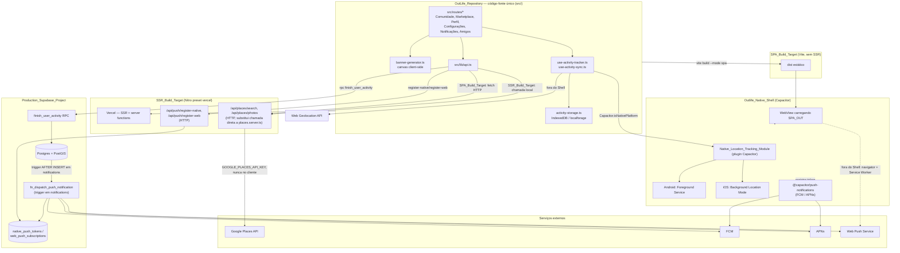

# Design Document

## Overview

Este design cobre a implementação técnica do `app-hibrido-nativo`: transformar a OutLife_Application, hoje um único alvo de build SSR/PWA na Vercel, em um sistema com **dois alvos de build a partir da mesma base de código** — o SSR_Build_Target existente (inalterado na sua funcionalidade) e um novo SPA_Build_Target estático, empacotado dentro de um shell nativo Capacitor (`Outlife_Native_Shell`) para Android e iOS.

A decisão arquitetural híbrida (inspirada no modelo Instagram) já está confirmada e é o ponto de partida: **nenhuma tela do Outlife_Web_Core é reescrita**. Comunidade, Marketplace, Perfil, Configurações, Notificações e Amigos continuam sendo exatamente os mesmos componentes React/TanStack Router hoje em `src/routes/*` e `src/components/*`, apenas compilados para um alvo diferente e executados dentro de um `WebView` nativo em vez de um navegador. A única peça verdadeiramente nova de código nativo é o `Native_Location_Tracking_Module` — um plugin Capacitor dedicado ao rastreamento de GPS em segundo plano, porque é a única capacidade que a Web Geolocation API (usada hoje em `use-activity-tracker.ts`) não pode garantir de forma confiável fora do navegador em foreground.

O trabalho se divide em seis frentes:

1. **Dois alvos de build (Req. 1)**: `SPA_Build_Target` (Vite build estático, sem SSR/server functions) ao lado do `SSR_Build_Target` (Nitro/Vercel) já existente, selecionados por variável de ambiente/modo de build, mantendo o mesmo código-fonte.
2. **Rastreamento nativo em segundo plano (Req. 2, 3)**: plugin Capacitor `Native_Location_Tracking_Module` (Foreground Service Android, Background Location Mode iOS), com a mesma lógica de checkpoint/persistência/recuperação já existente em `use-activity-tracker.ts`/`activity-storage.ts`, apenas trocando a fonte dos pontos GPS.
3. **Tipo de atividade e métricas (Req. 4)**: nova coluna `activity_type`, seletor no formulário de rastreamento, e uma função pura de cálculo de pace/velocidade reaproveitada tanto durante o rastreamento (live) quanto no resumo final.
4. **Salvamento confiável e snapshot (Req. 5, 6)**: extensão de `activity-storage.ts`/`use-activity-sync.ts` já existentes (fila de sync já implementada) e nova coluna `map_snapshot_url`, gerada via captura de tile estático no momento da finalização.
5. **Banners de compartilhamento (Req. 7, 10) e categorias de comunidade (Req. 8, 9)**: `Banner_Generator` client-side (canvas), reaproveitando `shareContent` já existente; extensão do CHECK constraint de `community_posts.category` e da função pura `filterPostsByTab` já existente em `comunidade.tsx`.
6. **Push nativo/Web Push (Req. 11) e proxy remoto do Google Places (Req. 12)**: novas tabelas `native_push_tokens`/`web_push_subscriptions`, trigger Postgres que estende `notify_on_friend_request`/`notify_on_post_like` para também disparar push; novo endpoint HTTP (`/api/places/*`) no SSR_Build_Target consumido via `fetch` pelo SPA_Build_Target, substituindo a chamada direta a `places.server.ts`.

Nenhuma dessas frentes introduz um backend novo. O padrão já estabelecido no projeto é mantido: **TanStack Start server functions/endpoints HTTP no SSR_Build_Target** para o que exige servidor (Google Places, disparo de push), e **funções/triggers Postgres no Production_Supabase_Project** para regras que devem valer independentemente do cliente (validação de categoria, disparo de notificação+push, RLS de tokens).

## Architecture



**Decisões de arquitetura por requirement:**

- **Dois alvos de build (Req. 1)**: em vez de um repositório/projeto Vite separado, usamos o **mesmo `vite.config.ts`** com um modo condicional (`vite build --mode native-spa`), que desativa os plugins `tanstackStart`/`nitro` e ativa um plugin de SPA puro (`@vitejs/plugin-react` + roteamento client-side via `@tanstack/react-router` sem o wrapper `@tanstack/react-start`). Isso evita duplicar `package.json`/dependências e garante que qualquer mudança de tela feita para a Vercel se propaga automaticamente para o app nativo no próximo build, sem passo manual de sincronização — respeitando diretamente o Requirement 1.1 (nenhuma implementação paralela de tela).
- **Seletor de transporte para server functions (Req. 1.6, 1.7, 12)**: as funções em `src/services/external-api.ts` já são o único ponto de chamada usado pela UI (`fetchDestinationsFromGoogle`, `fetchPlacesPhotos`). Hoje elas importam `places.server.ts` diretamente. Passam a checar `import.meta.env.VITE_BUILD_TARGET` (injetada no build): se `"native"`, chamam `fetch()` contra um endpoint HTTP absoluto configurado por `VITE_API_BASE_URL` (a URL pública do SSR_Build_Target); caso contrário, mantêm a chamada local à server function. A assinatura pública e o formato de retorno não mudam — só a estratégia de transporte.
- **Native_Location_Tracking_Module (Req. 2, 3)**: implementado como um plugin Capacitor customizado (`@outlife/capacitor-location-tracking`, dentro do próprio monorepo em `native/capacitor-location-tracking/`), com uma interface TypeScript única. `use-activity-tracker.ts` passa a decidir a fonte de pontos checando `Capacitor.isNativePlatform()`: nativo usa o plugin (que internamente roda `ForegroundService` no Android e `CLLocationManager` com `allowsBackgroundLocationUpdates` no iOS); fora do shell, mantém exatamente o código já existente (`navigator.geolocation.watchPosition`). A lógica de **checkpoint (10s/50m)**, **persistência em `activity-storage.ts`**, e **recuperação de órfã** é reaproveitada sem alteração — ela já é agnóstica à fonte dos pontos, pois opera sobre o array `TrackPoint[]` recebido, venha ele do listener nativo ou do `watchPosition`.
- **Activity_Type e métricas (Req. 4)**: nova coluna `user_activities.activity_type`. Uma função pura nova (`src/lib/activity-metrics.ts`) calcula `Average_Pace`/`Average_Speed` a partir de `{distanceMeters, durationSeconds}`, reaproveitada tanto pelo hook de tracking (live, a cada 1s) quanto pela `Activity_Detail_Screen` (final, a partir dos totais persistidos) — um único ponto de verdade para a fórmula.
- **Salvamento confiável (Req. 5)**: `activity-storage.ts`/`use-activity-sync.ts` **já implementam** a fila de sincronização (`enqueueActivity`, `flushQueue`, listener de `online`) e o timeout de 15s é a única peça que falta ser adicionada explicitamente à chamada em `finishActivity`/`startActivity` dentro de `flushQueue`. O indicador visual de fila pendente (5.6) é um hook novo e pequeno (`useSyncQueueSize`) consumido no header global.
- **Activity_Map_Snapshot (Req. 6)**: gerado client-side a partir dos mesmos tiles do OpenStreetMap já usados por `ActivityMap.tsx`, desenhando o `Polyline` sobre um `<canvas>` (sem exigir um serviço de "static maps" remoto, evitando custo/latência de servidor e mantendo consistência com a decisão de Banner_Generator client-side). Resultado é enviado para o bucket `activity-images` (já existente) e a URL persistida em `user_activities.map_snapshot_url`.
- **Banner_Generator (Req. 7, 10)**: módulo `src/lib/banner-generator.ts`, puramente client-side, usando `<canvas>` para compor camadas (mapa/foto de fundo + textos de métricas/categoria). Reaproveita `shareContent` (`src/lib/share.ts`) já existente, apenas passando um `Blob`/`File` de imagem em vez de um `url` de texto — `shareContent` precisa de uma pequena extensão para aceitar arquivos (`navigator.share({ files: [...] })`), com fallback de download quando `files` não é suportado.
- **Categorias de Comunidade (Req. 8, 9)**: extensão do `CHECK CONSTRAINT` de `community_posts.category` (mesmo padrão incremental já usado em `20260720090000_community-post-category.sql`) e do union type `CommunityPostCategory` em `api.ts`. A função pura `filterPostsByTab` em `comunidade.tsx` já é genérica por categoria — só precisa de duas novas entradas no mapa `TAB_TO_CATEGORY` e nas abas renderizadas. O rótulo visual no card (Req. 9) reaproveita a mesma chave i18n `community.categories.<valor>` já usada no seletor do formulário, garantindo consistência por construção (mesma fonte de tradução).
- **Push nativo/Web Push (Req. 11)**: duas tabelas novas (`native_push_tokens`, `web_push_subscriptions`), ambas com RLS restrita ao próprio usuário. O trigger existente `notify_on_friend_request` (e o equivalente de curtida) passam a chamar uma função central `fn_dispatch_push_notification(_notification_id)` (SECURITY DEFINER) que lê os tokens/subscriptions ativos do destinatário e dispara chamadas HTTP (via `pg_net`, já disponível no Supabase, ou via uma Edge Function dedicada) para FCM/APNs/Web Push — cada envio isolado em seu próprio bloco de erro, nunca impedindo os demais nem a criação da `Notification` in-app (que já ocorreu antes do trigger disparar).
- **Proxy remoto do Google Places (Req. 12)**: dois novos endpoints HTTP no SSR_Build_Target (`src/routes/api.places.search.ts`, `src/routes/api.places.photos.ts`, usando o mecanismo de rota de API do TanStack Start/Nitro), que internamente chamam exatamente a mesma lógica hoje em `places.server.ts` (reaproveitada como função interna, não duplicada), adicionando: (1) validação de sessão via `Authorization: Bearer <supabase access token>`, (2) cabeçalhos CORS permitindo a origem do shell nativo, (3) timeout de 10s.

## Components and Interfaces

### `SPA_Build_Target` vs `SSR_Build_Target`

```ts
// vite.config.ts — trecho condicional novo
const buildTarget = process.env.BUILD_TARGET ?? "ssr"; // "ssr" | "native-spa"

export default defineConfig({
  plugins: [
    tsConfigPaths({ projects: ["./tsconfig.json"] }),
    tailwindcss(),
    ...(buildTarget === "ssr"
      ? [tanstackStart({ importProtection: { enabled: !process.env.VITEST } }), nitro({ preset: "vercel" })]
      : []),
    react(),
  ],
  define: {
    "import.meta.env.VITE_BUILD_TARGET": JSON.stringify(buildTarget),
  },
  build: buildTarget === "native-spa" ? { outDir: "dist/native-spa" } : undefined,
  ...
});
```

Novo script em `package.json`:

```json
"build:native": "cross-env BUILD_TARGET=native-spa vite build"
```

Rotas que hoje dependem de `createServerFn` (Google Places) são as únicas que precisam do seletor de transporte; todo o restante do `Outlife_Web_Core` (Comunidade, Marketplace, Perfil etc.) já fala diretamente com o Supabase via `supabase-js` no cliente e funciona identicamente em ambos os alvos, sem alteração.

### `Native_Location_Tracking_Module` (plugin Capacitor)

Interface TypeScript exposta ao `use-activity-tracker.ts` (contrato único, independente de plataforma):

```ts
// native/capacitor-location-tracking/src/definitions.ts
export interface LocationTrackingPlugin {
  requestBackgroundPermission(): Promise<{ granted: boolean }>;
  checkBackgroundPermission(): Promise<{ granted: boolean }>;
  startTracking(options: { minIntervalMs: number; minDistanceMeters: number }): Promise<void>;
  stopTracking(): Promise<void>;
  addListener(
    eventName: "locationUpdate",
    listener: (point: { lat: number; lng: number; ts: number; accuracy: number }) => void,
  ): Promise<PluginListenerHandle>;
  addListener(
    eventName: "permissionRevoked",
    listener: () => void,
  ): Promise<PluginListenerHandle>;
}
```

- **Android**: implementação nativa via `ForegroundService` com `foregroundServiceType="location"`, `FusedLocationProviderClient` com `PRIORITY_HIGH_ACCURACY`, notificação persistente obrigatória (canal dedicado "Rastreamento ativo") enquanto o serviço roda — satisfaz diretamente o Requirement 2.4.
- **iOS**: `CLLocationManager` com `allowsBackgroundLocationUpdates = true` e a capability `Background Modes → Location updates` habilitada no `Info.plist`; requer `NSLocationAlwaysAndWhenInUseUsageDescription`.
- **Integração em `use-activity-tracker.ts`**: a função `startWatch`/`stopWatch` passa a ramificar:

```ts
import { Capacitor } from "@capacitor/core";
import { LocationTracking } from "@outlife/capacitor-location-tracking";

const startWatch = useCallback(() => {
  if (Capacitor.isNativePlatform()) {
    LocationTracking.startTracking({ minIntervalMs: 5000, minDistanceMeters: 10 });
    // listener já registrado no mount, alimenta o mesmo pointsRef/setPoints
    return;
  }
  // ramo existente, inalterado: navigator.geolocation.watchPosition(...)
}, []);
```

A lógica de checkpoint (`Location_Persistence_Checkpoint`, extraída para uma função pura testável — ver Correctness Properties) roda no lado JS igualmente para ambas as fontes, mantendo um único ponto de verdade para "quando persistir".

### `Activity_Sync_Queue` — extensão de `activity-storage.ts`

Sem mudança estrutural; adiciona timeout explícito e contagem de retry já prevista no schema (`attempts`, já existe):

```ts
// activity-storage.ts (modificado)
const SYNC_TIMEOUT_MS = 15_000;

async function withTimeout<T>(p: Promise<T>, ms: number): Promise<T> {
  return Promise.race([
    p,
    new Promise<never>((_, reject) => setTimeout(() => reject(new Error("timeout")), ms)),
  ]);
}
// flushQueue passa a envolver startActivity/finishActivity com withTimeout(SYNC_TIMEOUT_MS)
```

Novo hook `useSyncQueueSize()` (lê `listQueued().length`, polling leve de 5s enquanto a fila não estiver vazia) alimenta o indicador visual do Requirement 5.6.

Retry de enfileiramento (Requirement 5.9) fica em `enqueueActivity`, envolvendo `queueStore.setItem` em até 3 tentativas:

```ts
export async function enqueueActivity(a: Omit<QueuedActivity, "attempts">): Promise<void> {
  for (let attempt = 1; attempt <= 3; attempt++) {
    try {
      await queueStore.setItem(a.localId, { ...a, attempts: 0 });
      return;
    } catch (e) {
      if (attempt === 3) throw e;
    }
  }
}
```

### `Activity_Map_Snapshot` (geração client-side)

```ts
// src/lib/activity-map-snapshot.ts
export async function generateActivityMapSnapshot(
  points: { lat: number; lng: number }[],
): Promise<Blob | null> {
  if (points.length < 2) return null;
  // 1. calcula bounding box + zoom
  // 2. desenha os tiles do OSM correspondentes num <canvas> offscreen
  // 3. desenha a polyline do trajeto por cima (mesma lógica visual do ActivityMap.tsx)
  // 4. canvas.toBlob("image/webp", 0.85)
}
```

Chamado em `atividade.rastrear.tsx`, dentro de `finishMut.mutationFn`, **depois** de `finalize()` e **antes/em paralelo** ao upload da foto — envolto em `try/catch` isolado (Requirement 6.3: falha na geração não impede o `finishActivity`):

```ts
let map_snapshot_url: string | undefined;
try {
  const snapshotBlob = await generateActivityMapSnapshot(result.points);
  if (snapshotBlob) map_snapshot_url = await uploadActivityMapSnapshot(snapshotBlob);
} catch {
  // Requirement 6.3 — falha na geração do snapshot nunca impede o salvamento da atividade.
}
```

### `Banner_Generator` (canvas client-side)

```ts
// src/lib/banner-generator.ts
export type ActivityBannerInput = {
  mapSnapshotUrl?: string | null;
  distanceMeters: number;
  durationSeconds: number;
  averagePaceLabel?: string | null; // já formatado "mm:ss/km" ou null
  averageSpeedLabel: string; // já formatado "xx.x km/h"
};

export type PostBannerInput = {
  photoUrl?: string | null; // null -> usa imagem de fundo padrão
  categoryLabel: string;
  text: string; // truncamento em 200 chars é feito aqui
};

export async function generateActivityBanner(
  input: ActivityBannerInput,
  opts?: { timeoutMs?: number },
): Promise<Blob>;

export async function generatePostBanner(
  input: PostBannerInput,
  opts?: { timeoutMs?: number },
): Promise<Blob>;
```

Ambas as funções compartilham um helper interno `withRenderTimeout(promise, ms)` (Requirements 7.2/7.7 → 5000ms; 10.2/10.4 → 10000ms), que rejeita com um erro tipado `BannerTimeoutError` distinto de erros de renderização — usado pela UI para decidir a mensagem exibida, mas em ambos os casos o comportamento é "erro + permitir tentar novamente, nunca compartilhar algo incompleto".

Truncamento de texto (Requirement 10.2), função pura isolada e testável:

```ts
export function truncateForBanner(text: string, maxLength = 200): string {
  if (text.length <= maxLength) return text;
  return `${text.slice(0, maxLength)}…`;
}
```

`shareContent` (`src/lib/share.ts`) ganha uma sobrecarga para arquivos:

```ts
export type ShareContentInput =
  | { title?: string; text?: string; url: string }
  | { title?: string; text?: string; file: Blob; fileName: string };
// navigator.share({ files: [new File([file], fileName, {type: file.type})] })
// fallback quando navigator.canShare({files}) é false: aciona download via <a download> + toast
```

Uso em `atividade.$activityId.tsx`:

```ts
const [generating, setGenerating] = useState(false);
const handleShareBanner = async () => {
  setGenerating(true);
  try {
    const blob = await generateActivityBanner({
      mapSnapshotUrl: activity.map_snapshot_url,
      distanceMeters: activity.distance_meters,
      durationSeconds: activity.duration_seconds,
      averagePaceLabel: computeAveragePace(activity),
      averageSpeedLabel: computeAverageSpeed(activity),
    });
    await shareContent({ file: blob, fileName: "outlife-atividade.webp", title: "Minha atividade Outlife" });
  } catch {
    toast.error(t("activity.bannerError"));
  } finally {
    setGenerating(false);
  }
};
```

### `Community_Post_Category` — extensão

```ts
// src/lib/api.ts (modificado)
export type CommunityPostCategory =
  | "trilha" | "camping" | "relato" | "outro" | "pedalada" | "caminhada";
```

```ts
// comunidade.tsx (modificado)
export type CommunityTab =
  | "forYou" | "following" | "trails" | "camping" | "stories" | "biking" | "walking";

const TAB_TO_CATEGORY: Record<Exclude<CommunityTab, "forYou" | "following">, CommunityPostCategory> = {
  trails: "trilha",
  camping: "camping",
  stories: "relato",
  biking: "pedalada",
  walking: "caminhada",
};
// filterPostsByTab permanece inalterada — já é genérica por TAB_TO_CATEGORY
```

Rótulo de categoria no card (Requirement 9), função pura compartilhada entre card e seletor do formulário:

```ts
// src/lib/community-category-label.ts
const KNOWN_CATEGORIES: CommunityPostCategory[] = ["trilha", "camping", "relato", "outro", "pedalada", "caminhada"];

export function communityCategoryTranslationKey(category: string | null | undefined): string {
  if (category && (KNOWN_CATEGORIES as string[]).includes(category)) {
    return `community.categories.${category}`;
  }
  return "community.categories.unspecified"; // nova chave i18n, rótulo padrão
}
```

Usada tanto em `<SelectItem>` do formulário quanto no novo elemento de rótulo do card (`<span>{t(communityCategoryTranslationKey(p.category))}</span>`), garantindo que ambos sempre exibam exatamente a mesma string traduzida por construção (Requirement 9.2).

### `Native_Push_Token` / `Web_Push_Subscription` — registro dual

```ts
// src/lib/push-registration.ts
export async function registerPushForCurrentPlatform(): Promise<void> {
  if (Capacitor.isNativePlatform()) {
    const { receive } = await PushNotifications.checkPermissions();
    if (receive !== "granted") {
      const req = await PushNotifications.requestPermissions();
      if (req.receive !== "granted") return;
    }
    await PushNotifications.register();
    PushNotifications.addListener("registration", async (token) => {
      await registerNativePushToken(token.value, Capacitor.getPlatform() as "android" | "ios");
    });
    return;
  }

  // Fora do shell: Web Push, exceto iOS Safari sem instalação como PWA (Req. 11.7)
  if (isIosBrowserWithoutInstalledPwa()) {
    return; // limitação de plataforma informada na UI de configurações
  }
  if (!("serviceWorker" in navigator) || !("PushManager" in window)) return;
  const permission = await Notification.requestPermission();
  if (permission !== "granted") return;
  const registration = await navigator.serviceWorker.ready;
  const subscription = await registration.pushManager.subscribe({
    userVisibleOnly: true,
    applicationServerKey: VAPID_PUBLIC_KEY,
  });
  await registerWebPushSubscription(subscription.toJSON());
}
```

`registerNativePushToken`/`registerWebPushSubscription` chamam os novos endpoints `/api/push/register-native` e `/api/push/register-web` (SSR_Build_Target, chamados via HTTP absoluto quando `VITE_BUILD_TARGET === "native"`, mesmo padrão do proxy do Google Places), que fazem upsert nas tabelas correspondentes associadas ao `user_id` autenticado.

Invalidação (Requirement 11.8) ocorre em três pontos já existentes no código — `signOut()` em `use-auth.ts`, e um novo listener de `PushNotifications`/evento de permissão revogada — todos chamando `invalidatePushRegistration()`, que marca `is_active = false` na linha correspondente (nunca faz `DELETE`, preservando histórico para auditoria).

### Proxy remoto do Google Places

```ts
// src/routes/api.places.search.ts (novo, TanStack Start API route)
export const Route = createFileRoute("/api/places/search")({
  server: {
    handlers: {
      POST: async ({ request }) => {
        const user = await requireSupabaseAuthFromRequest(request); // 401 se ausente/inválido
        const body = await request.json();
        const result = await fetchDestinationsFromGooglePlacesInternal(body); // lógica hoje em places.server.ts, extraída
        return json(result, { headers: CORS_HEADERS });
      },
    },
  },
});
```

`src/services/external-api.ts` passa a ramificar pela mesma variável `VITE_BUILD_TARGET`:

```ts
export async function fetchDestinationsFromGoogle(params: FetchDestinationsParams) {
  if (import.meta.env.VITE_BUILD_TARGET === "native") {
    return fetchWithTimeoutAndFallback(`${API_BASE_URL}/api/places/search`, params, []); // Req. 12.5: vazio em falha/timeout 10s
  }
  const { fetchDestinationsFromGooglePlaces } = await import("./places.server");
  return fetchDestinationsFromGooglePlaces({ data: params });
}
```

## Data Models

### `user_activities` (alteração)

```sql
ALTER TABLE public.user_activities
  ADD COLUMN IF NOT EXISTS activity_type TEXT,
  ADD COLUMN IF NOT EXISTS map_snapshot_url TEXT;

ALTER TABLE public.user_activities
  DROP CONSTRAINT IF EXISTS user_activities_activity_type_check;

ALTER TABLE public.user_activities
  ADD CONSTRAINT user_activities_activity_type_check
  CHECK (activity_type IS NULL OR activity_type IN ('caminhada', 'pedalada', 'trilha', 'outro'));
```

`finish_user_activity` (RPC existente) ganha dois parâmetros opcionais adicionais (`_activity_type`, `_map_snapshot_url`), seguindo o mesmo padrão incremental já usado para `_description`/`_image_url` em `20260719090000_activity-description-and-image.sql`. `activity_type` também é gravado em `start_user_activity`/`startActivity` (é selecionado *antes* de iniciar o rastreamento, Requirement 4.1/4.2), não apenas ao finalizar.

### `community_posts` (alteração)

```sql
ALTER TABLE public.community_posts
  DROP CONSTRAINT IF EXISTS community_posts_category_check;

ALTER TABLE public.community_posts
  ADD CONSTRAINT community_posts_category_check
  CHECK (category IN ('trilha', 'camping', 'relato', 'outro', 'pedalada', 'caminhada'));
```

### `native_push_tokens` (nova tabela)

```sql
CREATE TABLE public.native_push_tokens (
  id UUID PRIMARY KEY DEFAULT gen_random_uuid(),
  user_id UUID NOT NULL REFERENCES public.profiles(id) ON DELETE CASCADE,
  token TEXT NOT NULL,
  platform TEXT NOT NULL CHECK (platform IN ('android', 'ios')),
  device_id TEXT NOT NULL, -- identificador estável de instalação, para permitir múltiplos dispositivos por usuário
  is_active BOOLEAN NOT NULL DEFAULT true,
  created_at TIMESTAMPTZ NOT NULL DEFAULT now(),
  updated_at TIMESTAMPTZ NOT NULL DEFAULT now(),
  UNIQUE (user_id, device_id)
);

ALTER TABLE public.native_push_tokens ENABLE ROW LEVEL SECURITY;

CREATE POLICY "Users manage their own native push tokens"
  ON public.native_push_tokens FOR ALL
  USING (auth.uid() = user_id) WITH CHECK (auth.uid() = user_id);
```

### `web_push_subscriptions` (nova tabela)

```sql
CREATE TABLE public.web_push_subscriptions (
  id UUID PRIMARY KEY DEFAULT gen_random_uuid(),
  user_id UUID NOT NULL REFERENCES public.profiles(id) ON DELETE CASCADE,
  endpoint TEXT NOT NULL,
  p256dh TEXT NOT NULL,
  auth TEXT NOT NULL,
  is_active BOOLEAN NOT NULL DEFAULT true,
  created_at TIMESTAMPTZ NOT NULL DEFAULT now(),
  updated_at TIMESTAMPTZ NOT NULL DEFAULT now(),
  UNIQUE (user_id, endpoint)
);

ALTER TABLE public.web_push_subscriptions ENABLE ROW LEVEL SECURITY;

CREATE POLICY "Users manage their own web push subscriptions"
  ON public.web_push_subscriptions FOR ALL
  USING (auth.uid() = user_id) WITH CHECK (auth.uid() = user_id);
```

### `fn_dispatch_push_notification` (nova função, chamada por trigger em `notifications`)

```sql
CREATE OR REPLACE FUNCTION public.fn_dispatch_push_notification()
RETURNS TRIGGER
LANGUAGE plpgsql
SECURITY DEFINER
SET search_path = public
AS $$
DECLARE
  token_row RECORD;
BEGIN
  -- Cada envio isolado; falha em um token/subscription nunca aborta a
  -- transação nem impede os demais (Requirement 11.3).
  FOR token_row IN
    SELECT token, platform FROM public.native_push_tokens
    WHERE user_id = NEW.recipient_id AND is_active
  LOOP
    BEGIN
      PERFORM public.fn_send_native_push(token_row.token, token_row.platform, NEW.type, NEW.payload);
    EXCEPTION WHEN OTHERS THEN
      -- log via tabela de auditoria; nunca RAISE
      NULL;
    END;
  END LOOP;

  FOR token_row IN
    SELECT id, endpoint, p256dh, auth FROM public.web_push_subscriptions
    WHERE user_id = NEW.recipient_id AND is_active
  LOOP
    BEGIN
      PERFORM public.fn_send_web_push(token_row.endpoint, token_row.p256dh, token_row.auth, NEW.type, NEW.payload);
    EXCEPTION WHEN OTHERS THEN
      NULL;
    END;
  END LOOP;

  RETURN NEW; -- a criação da Notification já ocorreu antes deste trigger AFTER INSERT disparar
END;
$$;

CREATE TRIGGER trg_dispatch_push_notification
  AFTER INSERT ON public.notifications
  FOR EACH ROW EXECUTE FUNCTION public.fn_dispatch_push_notification();
```

Isso estende (não substitui) o ponto de criação de `Notification` já existente — os triggers `notify_on_friend_request`/o equivalente de curtida continuam responsáveis por criar a linha em `notifications`; o novo trigger só reage a essa criação, cumprindo Requirement 11.3/11.6 de forma centralizada (não é necessário duplicar a lógica de disparo em cada trigger de evento).

## Correctness Properties

*A property is a characteristic or behavior that should hold true across all valid executions of a system-essentially, a formal statement about what the system should do. Properties serve as the bridge between human-readable specifications and machine-verifiable correctness guarantees.*

### Property 1: Chamada remota equivalente à server function local

For any conjunto válido de parâmetros de busca de destinos/fotos, e para a mesma fonte de dados mockada subjacente, o resultado retornado pela estratégia de transporte "HTTP remoto" e pela estratégia "server function local" SHALL ter a mesma estrutura de dados (mesmos campos, mesma ordem de resultados relevante).

**Validates: Requirements 1.6**

### Property 2: Falha de rede preserva estado da tela anterior

For any estado de tela válido contendo resultados já carregados, quando uma chamada ao endpoint remoto equivalente falha (erro de rede ou erro do servidor), o estado da tela após a falha SHALL ser idêntico ao estado anterior à tentativa, exceto pela adição de uma indicação de erro observável.

**Validates: Requirements 1.7**

### Property 3: Seleção exclusiva de estratégia de localização

For any valor de `Capacitor.isNativePlatform()`, o hook de rastreamento SHALL usar exatamente uma fonte de localização — o Native_Location_Tracking_Module quando verdadeiro, a Web Geolocation API quando falso — nunca ambas simultaneamente nem nenhuma.

**Validates: Requirements 2.5**

### Property 4: Início de rastreamento respeita o estado de permissão de localização

For any estado de permissão de localização em segundo plano (concedida, negada, indeterminada), o início do rastreamento dentro do Outlife_Native_Shell SHALL ser permitido se e somente se esse estado for "concedida".

**Validates: Requirements 2.6**

### Property 5: Revogação de permissão durante rastreamento preserva pontos já persistidos

For any User_Activity com uma lista arbitrária de pontos de localização já persistidos e status `in_progress`, quando a permissão de localização em segundo plano é revogada, os pontos persistidos SHALL permanecer inalterados e nenhum novo ponto SHALL ser adicionado após o evento de revogação.

**Validates: Requirements 2.7**

### Property 6: Checkpoint de persistência dispara exatamente a cada 10s ou 50m

For any sequência de pontos de localização capturados com timestamps e distâncias arbitrários, um Location_Persistence_Checkpoint SHALL ocorrer se e somente se ao menos 10 segundos tiverem transcorrido ou ao menos 50 metros tiverem sido percorridos desde o checkpoint anterior (o que ocorrer primeiro), nunca antes disso e nunca a cada ponto individual.

**Validates: Requirements 3.1**

### Property 7: Falha de persistência local nunca perde pontos capturados

For any sequência de pontos de localização e qualquer padrão de falhas simuladas na escrita local em checkpoints intercalados, todo ponto capturado SHALL eventualmente aparecer na próxima tentativa de persistência que tiver sucesso, sem perda de dados.

**Validates: Requirements 3.2**

### Property 8: Round-trip de persistência de atividade ativa

For any `ActivePersisted` válido (pontos, distância, duração, status), salvar via `saveActive` e em seguida carregar via `loadActive` SHALL retornar um valor estruturalmente idêntico ao original.

**Validates: Requirements 3.3**

### Property 9: Dados corrompidos nunca produzem métricas derivadas

For any payload malformado persistido localmente (schema incorreto, campos faltantes ou tipos inválidos), a rotina de carregamento SHALL sinalizar um estado "não recuperável" e SHALL NOT retornar uma distância, duração ou trajeto numérico derivado desses dados.

**Validates: Requirements 3.4**

### Property 10: Atividade recuperada expõe estado de decisão pendente sem alterar os pontos

For any `ActivePersisted` válido carregado com sucesso após uma interrupção, o estado exposto SHALL indicar uma atividade órfã pendente de decisão, e os pontos armazenados SHALL permanecer idênticos aos persistidos até que uma ação explícita de retomar ou descartar seja executada.

**Validates: Requirements 3.5**

### Property 11: Distância/duração exibidas nunca excedem os pontos persistidos

For any lista de pontos de localização persistidos até uma interrupção, a distância e a duração exibidas para a User_Activity recuperada SHALL ser exatamente as calculadas a partir desses pontos, nunca um valor maior.

**Validates: Requirements 3.6**

### Property 12: Início de rastreamento exige Activity_Type válido

For any estado de seleção de Activity_Type (incluindo ausente, nulo, string vazia, ou um dos 4 valores válidos), o início do rastreamento SHALL ser permitido se e somente se o valor selecionado for exatamente um de `caminhada`, `pedalada`, `trilha` ou `outro`.

**Validates: Requirements 4.1, 4.2**

### Property 13: Round-trip de persistência do Activity_Type

For any Activity_Type válido, persistir uma User_Activity com esse valor e em seguida lê-lo de volta do Production_Supabase_Project SHALL retornar exatamente o mesmo valor.

**Validates: Requirements 4.3**

### Property 14: Cálculo de pace/velocidade é correto e exibido condicionalmente

For any Activity_Type válido, distância (metros) e tempo decorrido (segundos) não-negativos, a função de cálculo de métricas SHALL: (a) sempre produzir um Average_Speed válido em km/h com 1 casa decimal quando tempo > 0 e distância é um número válido; (b) produzir um Average_Pace válido em mm:ss/km apenas quando o Activity_Type for `caminhada` ou `pedalada`, e nunca quando for `trilha` ou `outro`; (c) produzir um indicador de "indisponível" (nunca NaN, Infinity, ou um número calculado a partir de dados inválidos) quando o tempo decorrido for zero ou a distância não puder ser determinada.

**Validates: Requirements 4.4, 4.5, 4.6, 4.7**

### Property 15: Falha na finalização sempre resulta em enfileiramento, nunca em perda

For any dados válidos de User_Activity finalizada e qualquer tipo de falha simulada na chamada remota de finalização (erro de rede, erro do servidor, timeout acima de 15s), a User_Activity SHALL sempre aparecer na Activity_Sync_Queue local após a falha, nunca ser descartada.

**Validates: Requirements 5.1**

### Property 16: Comportamento de `flushQueue` por item é determinístico

For any fila de sincronização com N itens arbitrários e qualquer combinação de sucesso/falha simulada por item (incluindo timeout), a rotina de sincronização SHALL tentar sincronizar cada um dos N itens exatamente uma vez por chamada; para cada item, sucesso na sincronização SHALL implicar ausência do item na fila resultante (com contagem `synced` incrementada), e falha SHALL implicar presença do item na fila resultante com o contador `attempts` estritamente maior que o valor anterior (com contagem `failed` incrementada), independentemente do número de tentativas anteriores.

**Validates: Requirements 5.2, 5.3, 5.4**

### Property 17: Indicador de fila pendente reflete exatamente o estado da fila

For any tamanho de Activity_Sync_Queue (incluindo zero), o indicador visual de sincronização pendente SHALL ser exibido se e somente se a fila não estiver vazia.

**Validates: Requirements 5.6**

### Property 18: Recuperação pós-interrupção conclui persistência sem exigir novo rastreamento

For any dado de atividade salvo localmente antes de uma interrupção simulada (pontos, distância, duração), a rotina executada ao reabrir a aplicação SHALL conseguir concluir a persistência (salvamento direto ou enfileiramento) dessa User_Activity usando exclusivamente os dados já salvos localmente, sem exigir nenhum novo ponto de localização capturado.

**Validates: Requirements 5.7**

### Property 19: Retry de enfileiramento é limitado a 3 tentativas

For any padrão de falhas simuladas na operação de escrita local do enfileiramento (0 a N falhas consecutivas antes de um eventual sucesso ou de todas falharem), a rotina de enfileiramento SHALL realizar no máximo 3 tentativas, e a mensagem de erro ao usuário SHALL ser exibida se e somente se todas as 3 tentativas falharem.

**Validates: Requirements 5.9**

### Property 20: Ausência ou falha de Activity_Map_Snapshot nunca bloqueia persistência ou exibição

For any trajeto válido (>= 2 pontos) cuja geração de Activity_Map_Snapshot falhe (simulada), a finalização da User_Activity SHALL prosseguir e persistir com sucesso, apenas sem o campo de snapshot; e for any User_Activity sem Activity_Map_Snapshot disponível (ausente, nulo, ou falha ao carregar), a Activity_Detail_Screen SHALL exibir métricas, descrição e foto normalmente, sem exibir nenhuma mensagem de erro.

**Validates: Requirements 6.3, 6.4**

### Property 21: Geração de banner de atividade compõe todas as camadas disponíveis dentro do prazo

For any combinação válida de métricas de User_Activity (distância, duração, pace/velocidade, com ou sem Activity_Map_Snapshot presente), a composição do Share_Banner_Image SHALL incluir todas as camadas de métricas disponíveis, SHALL omitir a camada de mapa se e somente se o Activity_Map_Snapshot estiver ausente, e SHALL resolver dentro do limite de 5 segundos.

**Validates: Requirements 7.2, 7.3**

### Property 22: Falha na geração de banner nunca aciona compartilhamento com resultado incompleto

For any tipo de conteúdo (User_Activity ou Community_Post) e qualquer forma de falha simulada na composição do Share_Banner_Image (exceção síncrona, rejeição assíncrona, ou exceder o limite de tempo do respectivo conteúdo — 5s para atividade, 10s para publicação), o mecanismo de compartilhamento (`shareContent`) SHALL NUNCA ser invocado, e um estado de erro reexecutável SHALL ser exposto ao usuário.

**Validates: Requirements 7.7, 10.4**

### Property 23: Truncamento de texto do banner de publicação respeita o limite de 200 caracteres

For any string de texto de comprimento arbitrário, o texto usado na composição do Share_Banner_Image de um Community_Post SHALL ter no máximo 201 caracteres (200 + "…") quando o texto original exceder 200 caracteres, e SHALL ser preservado integralmente quando não exceder.

**Validates: Requirements 10.2**

### Property 24: Falha em funcionalidade não relacionada nunca impede o compartilhamento do banner de publicação

For any erro simulado em uma função não relacionada à geração da imagem ou ao mecanismo de compartilhamento (por exemplo, registro de estatísticas), executada durante a mesma operação de compartilhamento de um Community_Post, a chamada a `shareContent` com o Share_Banner_Image gerado com sucesso SHALL ocorrer normalmente, independentemente do resultado dessa função não relacionada.

**Validates: Requirements 10.3**

### Property 25: Validação de Community_Post_Category aceita exatamente o conjunto de valores válidos

For any string arbitrária usada como categoria, a validação SHALL aceitá-la como válida se e somente se for exatamente um de `trilha`, `camping`, `relato`, `outro`, `pedalada` ou `caminhada`.

**Validates: Requirements 8.1**

### Property 26: Filtro por aba retorna exclusivamente posts da categoria correspondente

For any lista arbitrária de Community_Post com categorias variadas e for any aba de filtro por categoria (incluindo Pedalada e Caminhada), a lista filtrada SHALL conter exclusivamente os posts cuja categoria corresponde à aba selecionada, incluindo o caso em que a lista resultante é vazia.

**Validates: Requirements 8.4, 8.5, 8.6**

### Property 27: Rótulo de categoria no card é consistente com o seletor e nunca fica vazio

For any Community_Post_Category válida, o rótulo exibido no card SHALL ser idêntico ao rótulo exibido na opção correspondente do seletor de criação de publicação; e for any valor de categoria ausente ou não reconhecido, o card SHALL exibir o rótulo padrão de categoria não especificada, nunca uma string vazia.

**Validates: Requirements 9.1, 9.2, 9.3**

### Property 28: Registro de Web_Push_Subscription respeita a restrição de iOS sem PWA instalada

For any combinação de plataforma (iOS, Android, desktop), status de instalação como PWA (instalada ou não) e suporte a Web Push (com ou sem permissão concedida), o registro de uma Web_Push_Subscription SHALL ocorrer se e somente se houver suporte a Web Push, a permissão tiver sido concedida, e a combinação não for exatamente (iOS E não instalada como PWA).

**Validates: Requirements 11.2, 11.7**

### Property 29: Disparo de push é isolado por destino e nunca impede a Notification in-app

For any lista de Native_Push_Token/Web_Push_Subscription ativos de um destinatário (incluindo lista vazia) e qualquer combinação de sucesso/falha simulada no envio a cada um, todos os destinos SHALL ser tentados exatamente uma vez, a falha em um destino SHALL NOT impedir a tentativa nos demais, e a criação da Notification in-app SHALL sempre ocorrer independentemente dos resultados de envio de push.

**Validates: Requirements 11.3, 11.6**

### Property 30: Invalidação de token/subscription afeta exclusivamente o registro correspondente

For any conjunto de Native_Push_Token e Web_Push_Subscription pertencentes a múltiplos usuários/dispositivos, quando um evento de invalidação (logout, revogação de permissão, ou desinstalação detectada) ocorre para um usuário/dispositivo específico, exclusivamente o registro correspondente a esse usuário/dispositivo SHALL deixar de ser considerado ativo, e todos os demais registros SHALL permanecer inalterados.

**Validates: Requirements 11.8**

### Property 31: Autorização do endpoint de proxy do Google Places é estritamente por sessão válida

For any valor de token de autorização (válido, expirado, ausente, malformado), o endpoint HTTP remoto SHALL executar a busca real no Google Places se e somente se o token corresponder a uma sessão autenticada válida.

**Validates: Requirements 12.4**

### Property 32: Falha ou timeout do proxy do Google Places sempre resolve com resultado vazio

For any tipo de falha simulada na chamada ao endpoint HTTP remoto do proxy do Google Places (timeout acima de 10s, erro de rede, erro do servidor), a função de busca do lado do cliente SHALL sempre resolver com uma lista vazia, nunca lançar uma exceção não tratada nem exibir uma mensagem de erro bloqueante.

**Validates: Requirements 12.5**

## Error Handling

| Cenário de falha (requirement) | Camada responsável | Tratamento |
|---|---|---|
| Empacotamento do SPA_Build_Target falha em Android ou iOS (1.4) | CI/pipeline de release | Job de publicação depende (`needs`) do sucesso dos dois builds; nenhuma publicação ocorre se um dos dois falhar |
| Server function local indisponível no SPA_Build_Target (1.6) | `external-api.ts` | Ramifica para `fetch` HTTP contra o endpoint remoto equivalente, mesma assinatura de retorno |
| Chamada HTTP ao endpoint remoto falha (1.7) | Camada de UI que consome `external-api.ts` | Preserva estado anterior da tela; exibe indicação de erro observável (toast), sem reset de estado |
| Permissão de localização em segundo plano negada (2.6) | `use-activity-tracker.ts` + `Native_Location_Tracking_Module` | Bloqueia botão de iniciar; exibe mensagem explicativa antes de qualquer tentativa de start |
| Permissão revogada durante rastreamento (2.7) | Listener `permissionRevoked` do plugin | Interrompe captura de novos pontos; preserva pontos já persistidos; notifica usuário |
| Falha ao persistir checkpoint localmente (3.2) | `activity-storage.ts` (`saveActive`, já com `try/catch`) | Mantém pontos em memória (`pointsRef`); rastreamento continua; nova tentativa no próximo checkpoint |
| Dados persistidos corrompidos ao reabrir (3.4) | `loadActive` (estendida com validação de schema) | Retorna estado "não recuperável"; UI oferece apenas descartar, sem exibir métricas derivadas |
| Tempo decorrido zero / distância indeterminada (4.7) | `src/lib/activity-metrics.ts` | Retorna indicador "indisponível" tipado, nunca `NaN`/`Infinity` |
| Finalização falha (rede, erro servidor, timeout 15s, shell encerrado) (5.1) | `atividade.rastrear.tsx` (`finishMut`) | `catch` já existente enfileira via `enqueueActivity`; nunca descarta dados capturados |
| Sincronização de item da fila falha, incluindo timeout (5.3) | `flushQueue` | Mantém item na fila, incrementa `attempts`, registra `lastError` |
| Enfileiramento falha por armazenamento indisponível (5.9) | `enqueueActivity` (retry novo) | Até 3 tentativas; mensagem de erro ao usuário apenas se todas falharem |
| Geração do Activity_Map_Snapshot falha (6.3) | `atividade.rastrear.tsx` | `try/catch` isolado ao redor de `generateActivityMapSnapshot`/upload; `finishActivity` prossegue sem o campo |
| Activity_Map_Snapshot ausente/corrompido ao abrir detalhe (6.4) | `atividade.$activityId.tsx` | Renderização condicional; nenhuma mensagem de erro exibida |
| Geração do banner (atividade ou post) falha ou excede o tempo (7.7, 10.4) | `banner-generator.ts` + tela chamadora | Erro tipado (`BannerTimeoutError`/erro de renderização); toast de erro; botão permite tentar novamente; `shareContent` nunca chamado |
| Mecanismo de compartilhamento nativo indisponível (7.6) | `share.ts` (já existente) | Fallback já implementado: copia para área de transferência / oferece salvar arquivo |
| Falha em função não relacionada durante compartilhamento de post (10.3) | `handleShare` em `comunidade.tsx` | Função não relacionada (ex.: registro de estatística) envolta em `try/catch` próprio, isolado do fluxo principal de `shareContent` |
| Community_Post sem categoria reconhecida (9.3) | `communityCategoryTranslationKey` | Retorna chave de rótulo padrão "não especificada" |
| Envio de push falha para um token/subscription específico (11.3) | `fn_dispatch_push_notification` (Postgres) | Cada envio em bloco `BEGIN...EXCEPTION WHEN OTHERS THEN NULL`; não aborta o loop nem a transação |
| Usuário sem nenhum token/subscription ativo (11.6) | `fn_dispatch_push_notification` | Loops simplesmente não iteram; `Notification` in-app já foi criada antes do trigger disparar |
| iOS browser sem PWA instalada tenta registrar Web Push (11.7) | `push-registration.ts` | Bloqueia registro; exibe mensagem de limitação de plataforma na tela de Configurações |
| Revogação de permissão / logout / desinstalação (11.8) | `invalidatePushRegistration` | `UPDATE ... SET is_active = false` restrito ao `user_id`+dispositivo corrente; nunca afeta outros registros |
| Endpoint de proxy do Google Places sem sessão válida (12.4) | `api.places.search.ts`/`api.places.photos.ts` | Retorna `401` sem executar busca no Google Places |
| Proxy do Google Places falha ou excede 10s (12.5) | `external-api.ts` (lado do SPA_Build_Target) | `fetchWithTimeoutAndFallback` sempre resolve com `[]`; nenhuma exceção propaga à UI; nenhuma funcionalidade adicional é interrompida |

## Testing Strategy

**Abordagem dual**: testes unitários para exemplos concretos, casos de borda e pontos de integração; testes de propriedade (fast-check, já usado no projeto) para as 32 propriedades universais listadas acima. Testes E2E (Playwright, já configurado) cobrem os fluxos de tela completos no SSR_Build_Target; testes de integração/smoke cobrem os aspectos que dependem de infraestrutura real (build nativo, APIs de push, GPS real) e não são candidatos a PBT.

### Property-based tests (vitest + fast-check)

- Biblioteca: `fast-check` (já é dependência do projeto), mínimo 100 execuções por propriedade (`{ numRuns: 100 }`, mesmo padrão de `image-resize.property.test.ts`).
- Cada teste referencia a propriedade do design via comentário de tag: `// Feature: app-hibrido-nativo, Property N: <título>`.
- Um teste por propriedade (1:1), seguindo o padrão de arquivo já usado (`tests/property/*.property.test.ts`).
- Novas funções puras extraídas especificamente para serem testáveis sem depender de APIs de navegador/nativas reais:
  - `src/lib/location-checkpoint.ts` — lógica pura do Location_Persistence_Checkpoint (Property 6), operando sobre `{ points, lastCheckpointTs, lastCheckpointDistance }`.
  - `src/lib/activity-metrics.ts` — cálculo de pace/velocidade (Property 14).
  - `src/lib/banner-generator.ts` — separar composição pura (camadas a desenhar, truncamento) da chamada real a `<canvas>`, permitindo testar a lógica de composição/timeout sem um canvas real disponível em Node (mesmo padrão de `image-resize.property.test.ts`, que testa o *plano* de redimensionamento em vez do canvas real).
  - `src/lib/community-category-label.ts` — mapeamento categoria→chave i18n (Property 27).
  - `src/lib/activity-storage.ts` — já testável diretamente com `localforage` em modo memória (Properties 7, 8, 9, 10, 16, 17, 18, 19).
- Mapeamento propriedade → arquivo de teste sugerido:

| Properties | Arquivo de teste |
|---|---|
| 1, 32 | `tests/property/places-proxy-transport.property.test.ts` |
| 2 | `tests/property/places-proxy-error-state.property.test.ts` |
| 3, 4, 5 | `tests/property/location-tracking-strategy.property.test.ts` |
| 6, 7 | `tests/property/location-checkpoint.property.test.ts` |
| 8, 9, 10, 11 | `tests/property/activity-recovery.property.test.ts` |
| 12, 13 | `tests/property/activity-type-selection.property.test.ts` |
| 14 | `tests/property/activity-metrics.property.test.ts` |
| 15, 16, 17, 18, 19 | `tests/property/activity-sync-queue.property.test.ts` |
| 20 | `tests/property/activity-map-snapshot-resilience.property.test.ts` |
| 21, 22, 23, 24 | `tests/property/banner-generator.property.test.ts` |
| 25, 26 | `tests/property/community-post-category-filter.property.test.ts` |
| 27 | `tests/property/community-category-label.property.test.ts` |
| 28 | `tests/property/push-registration-eligibility.property.test.ts` |
| 29, 30 | `tests/property/push-dispatch-and-invalidation.property.test.ts` (Property 30 via banco de teste, mesmo padrão de `achievement-rules.property.test.ts`) |
| 31 | `tests/property/places-proxy-authorization.property.test.ts` |

### Unit tests (exemplos e casos de borda)

- Presença/ordem dos elementos de UI: seletor de Activity_Type, opções Pedalada/Caminhada no formulário e nas abas (Requirements 4.1, 8.2, 8.3).
- Renderização condicional: Activity_Map_Snapshot presente/ausente na `Activity_Detail_Screen` (6.2); indicador de progresso durante geração de banner (7.4); botão de compartilhar no card de post (10.1).
- Integração com `shareContent`: spy confirmando chamada com a imagem gerada após sucesso (7.5), reaproveitando a suíte já existente de `share.ts` com um novo caso de `Blob`.
- Navegação por deep-link de push: clique em notificação (nativa ou Web Push) navega para `/notificacoes` (11.5).
- Listener do evento `online` chama `flushQueue` exatamente uma vez por evento (5.8).

### Testes de integração/smoke (não candidatos a PBT)

- Empacotamento do SPA_Build_Target no WebView Android/iOS via CI (`cap sync` + build Gradle/Xcode), 1-2 execuções (1.3, 1.4).
- Notificação persistente do Foreground Service Android ao iniciar rastreamento nativo (2.4) — verificação manual/emulador.
- Cadência aproximada de captura em segundo plano com tela bloqueada / app em background, em dispositivo real ou emulador com mock de localização (2.1, 2.2, 2.3).
- Exibição de Push_Notification na central nativa com app fechado/background (11.1, 11.4) — mock do plugin de push retornando token fixo, 1-2 exemplos.
- Ausência da `GOOGLE_PLACES_API_KEY` no bundle do SPA_Build_Target e cabeçalhos CORS do proxy (12.2, 12.3) — teste único de build, reaproveitando o padrão já usado em `outlife-production-plan`.
- Regressão do SSR_Build_Target/PWA na Vercel após introdução do SPA_Build_Target (1.5) — reexecução da suíte Playwright já existente.

### Testes nativos (plugin Capacitor)

O `Native_Location_Tracking_Module` é testado em duas camadas:

1. **Lógica JS do plugin (mockável)**: a interface `LocationTrackingPlugin` é mockada em todos os testes de `use-activity-tracker.ts` via `vi.mock("@outlife/capacitor-location-tracking")`, permitindo testar toda a lógica de checkpoint/persistência/recuperação (Properties 3, 4, 5, 6, 7) sem executar código nativo real.
2. **Código nativo real (Android/iOS)**: fora do escopo do Vitest; validado por testes manuais em dispositivo/emulador (Foreground Service ativo, sobrevivência a bloqueio de tela, revogação de permissão em runtime) como parte do checklist de release, não como parte da suíte automatizada de CI.

## Dependencies

| Pacote | Escopo | Motivo |
|---|---|---|
| `@capacitor/core`, `@capacitor/cli` | shell nativo | Runtime e CLI do Capacitor, base do Outlife_Native_Shell |
| `@capacitor/android`, `@capacitor/ios` | shell nativo | Plataformas nativas Android/iOS |
| `@capacitor/push-notifications` | push nativo | Integração oficial com FCM (Android) e APNs (iOS) |
| `@capacitor/app` | shell nativo | Deep-link/lifecycle (abrir app a partir de notificação, Requirement 11.5) |
| plugin customizado `@outlife/capacitor-location-tracking` (novo, dentro do repositório) | Native_Location_Tracking_Module | Não existe plugin de terceiros que cobre exatamente Foreground Service Android + Background Location Mode iOS com a granularidade de checkpoint exigida (10 metros/5 segundos); implementado como plugin local seguindo o template oficial `@capacitor/plugin` |
| `cross-env` | build | Definir `BUILD_TARGET` de forma portátil entre Windows/Mac/Linux no script `build:native` |
| `web-push` (ou geração de VAPID equivalente) | servidor (SSR_Build_Target) | Assinatura de payloads Web Push conforme o padrão VAPID |
| Firebase Admin SDK (ou chamada HTTP direta à API FCM v1) | servidor/Postgres (`fn_send_native_push`) | Envio de push Android via FCM |
| APNs HTTP/2 provider (biblioteca ou chamada HTTP direta) | servidor/Postgres (`fn_send_native_push`) | Envio de push iOS via APNs |
| `pg_net` (extensão já disponível no Supabase) | Postgres | Permite que `fn_dispatch_push_notification` faça chamadas HTTP assíncronas para FCM/APNs/Web Push a partir de uma função/trigger Postgres, sem exigir uma Edge Function separada |

Todas as versões devem ser fixadas (sem `^`/`~` abertos) no `package.json`, seguindo a prática já usada no projeto. Contas de desenvolvedor (Google Play Console, Apple Developer Program), certificados de assinatura e credenciais de projeto Firebase/APNs são pré-requisitos operacionais do usuário, já registrados como Fora de Escopo no requirements.md — não fazem parte deste design.
