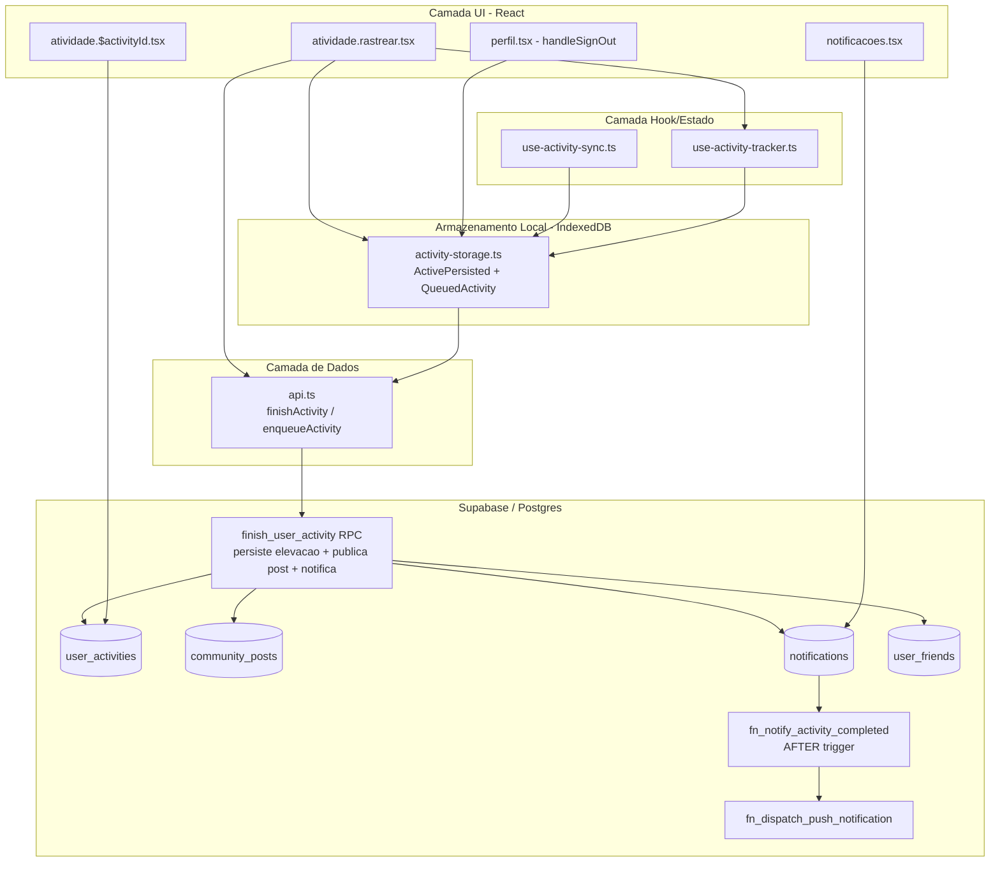
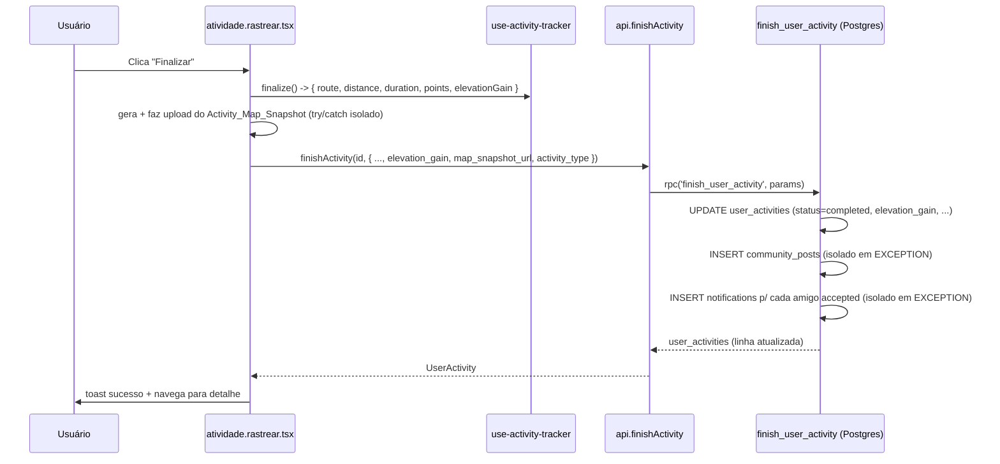
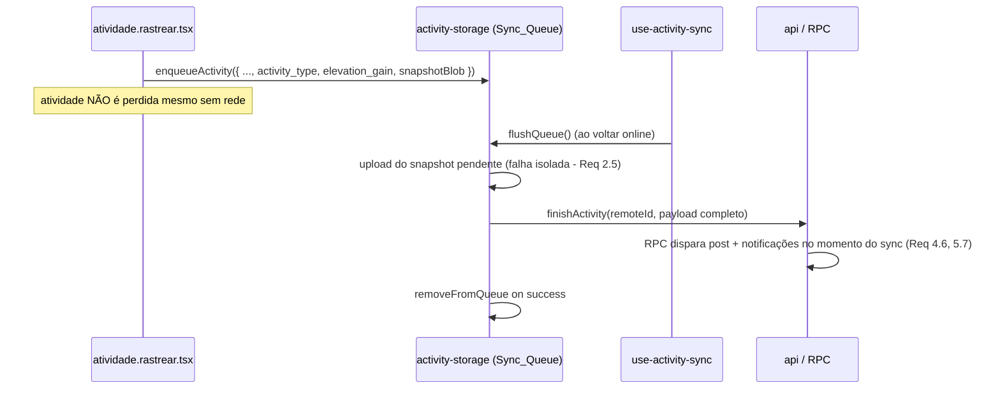
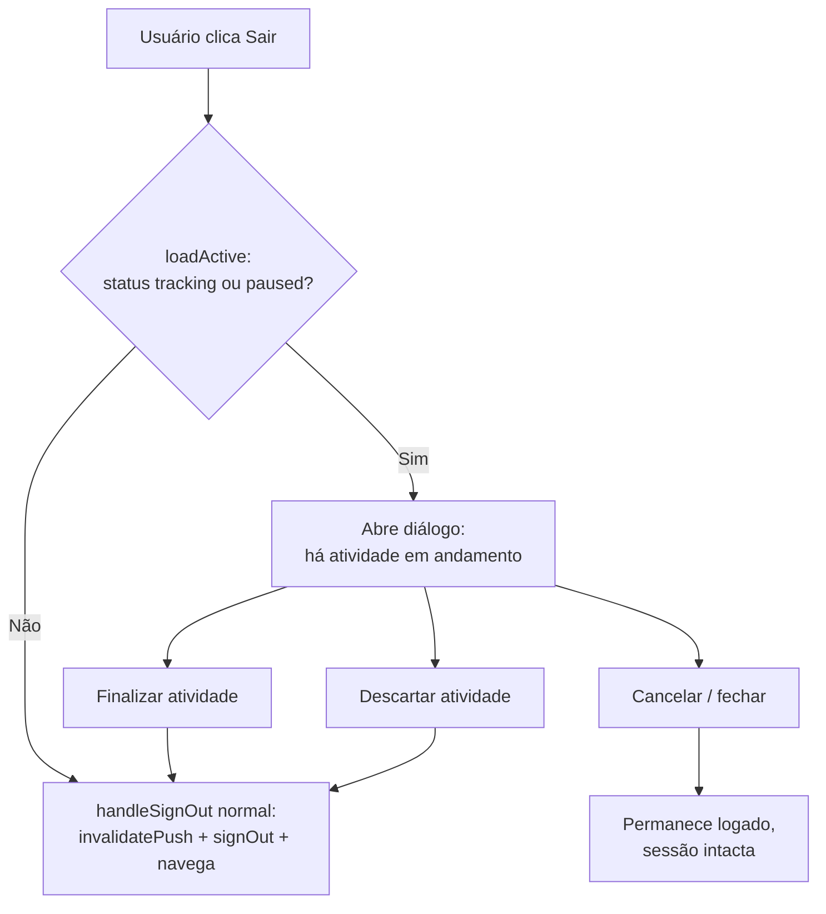

# Design Document

Melhorias na Atividade Rastreada

## Overview

Este documento descreve o design técnico das melhorias na Atividade
Rastreada do OutLife, cobrindo os seis requisitos do
`requirements.md`:

1. Persistência do ganho de elevação (Elevation_Gain).
2. Preservação de Activity_Type e Activity_Map_Snapshot no fluxo offline.
3. Feedback visual de pausa automática (estilo Strava).
4. Compartilhamento automático da atividade na comunidade.
5. Notificação de amigos ao concluir uma atividade.
6. Bloqueio de logout com atividade em andamento.

O princípio norteador é **estender a base existente sem reescrevê-la**. A
funcionalidade atual já implementa rastreamento GPS, auto-pause, geração
de snapshot, fila offline (`Sync_Queue`) e finalização via RPC
`finish_user_activity`. As melhorias se encaixam nos pontos de extensão
que essa arquitetura já oferece:

- Camada **hook/estado** (`use-activity-tracker.ts`): já rastreia
  `elevationGainMeters` e distingue auto-pause de pausa manual via
  `autoPausedRef`; falta expor esses sinais de forma consumível pela UI e
  incluí-los na persistência.
- Camada **armazenamento local** (`activity-storage.ts`): a `Sync_Queue`
  já existe, mas o tipo `QueuedActivity` não carrega `activity_type`,
  `elevation_gain` nem o snapshot pendente.
- Camada **dados/RPC** (`api.ts` + migrations Supabase): `finishActivity`
  já aceita `map_snapshot_url` e `activity_type`; falta o parâmetro de
  elevação e as regras de negócio "publicar na comunidade" e "notificar
  amigos".
- Camada **triggers Postgres**: o padrão `notify_on_friend_request` /
  `notify_on_post_like` + `fn_dispatch_push_notification` já resolve
  in-app notification + push de forma isolada e idempotente — a
  notificação de atividade concluída reusa exatamente esse padrão.
- Camada **UI de rastreamento** (`atividade.rastrear.tsx`) e **detalhe**
  (`atividade.$activityId.tsx`): pontos de exibição de elevação, indicador
  de auto-pause e bloqueio de logout.

Decisão transversal importante: **os efeitos de negócio de "finalizar uma
atividade" (persistir elevação, publicar Community_Post, notificar amigos)
são concentrados na RPC `finish_user_activity` no Postgres**, não
espalhados em múltiplas chamadas do cliente. Isso garante que:

- O fluxo online e o fluxo de `Offline_Sync` disparam os mesmos efeitos
  automaticamente, sem duplicar lógica no cliente (Requirements 4.6, 5.7).
- Cada efeito colateral (post, notificações) é isolado dentro de blocos
  `EXCEPTION WHEN OTHERS THEN NULL`, de modo que a atividade nunca é
  perdida nem revertida por falha de um efeito secundário (Requirements
  4.5, 5.6, 5.8).

## Architecture



### Fluxo de finalização (online)



### Fluxo de finalização (offline → sync)



## Components and Interfaces

### 1. Elevation_Gain — persistência e exibição (Requirement 1)

O hook `use-activity-tracker.ts` já calcula e expõe `elevationGainMeters`.
As mudanças:

**`finalize()` passa a retornar `elevationGain`:**

```typescript
// use-activity-tracker.ts
const finalize = useCallback(() => {
  stopWatch();
  stopTimer();
  setStatus("saving");
  const route: GeoJSON.LineString | null = /* ...inalterado... */;
  return {
    route,
    distance: distanceRef.current,
    duration: durationRef.current,
    points: pointsRef.current,
    elevationGain: elevationGainRef.current, // NOVO
  };
}, []);
```

**`ActivePersisted` passa a incluir `elevationGain`** para sobreviver à
navegação e ser resgatado na restauração (`persist()` já grava o estado a
cada checkpoint; adicionamos o campo e sua validação em
`isValidActivePersisted`):

```typescript
// activity-storage.ts
export type ActivePersisted = {
  points: TrackPoint[];
  distance: number;
  duration: number;
  elevationGain: number; // NOVO - opcional na validação (retrocompat)
  status: TrackerStatus;
  updatedAt: number;
  activityId?: string | null;
  activityType?: string | null;
};
```

`elevationGain` é validado como "número finito >= 0 **quando presente**".
Registros antigos sem o campo são tratados como `0` (não invalidam o
`ActivePersisted`), preservando retrocompatibilidade com a `Sync_Queue`/
`active_activity` já existente no dispositivo do usuário.

**`finishActivity` (api.ts) ganha `elevation_gain`** e o repassa à RPC:

```typescript
export async function finishActivity(
  id: string,
  payload: {
    distance_meters: number;
    duration_seconds: number;
    route_geojson: GeoJSON.LineString;
    description?: string | null;
    image_url?: string | null;
    activity_type?: ActivityType | null;
    map_snapshot_url?: string | null;
    elevation_gain?: number | null; // NOVO
  },
): Promise<UserActivity> { /* rpc('finish_user_activity', { ..., _elevation_gain }) */ }
```

**Exibição no resumo** (`atividade.$activityId.tsx`): a tela já tem o
padrão de card de métrica. Adiciona-se um card "Elevação" que exibe
`Math.round(elevation_gain)` seguido de `m` quando `elevation_gain > 0`, e
`"—"` quando ausente/zero (Requirement 1.2/1.3) — exatamente o mesmo
padrão de fallback `"—"` já usado nos cards de velocidade/pace, nunca
`NaN` nem `0m` derivado de dado ausente.

### 2. Preservação de Activity_Type e Snapshot no offline (Requirement 2)

Hoje o `catch` de fallback offline em `atividade.rastrear.tsx` chama
`enqueueActivity` com um payload **incompleto** — sem `activity_type`, sem
elevação, sem snapshot. Correções:

**`QueuedActivity` expandido:**

```typescript
// activity-storage.ts
export type QueuedActivity = {
  localId: string;
  remoteId?: string | null;
  destinationId?: string | null;
  startTime: string;
  endTime: string;
  distance_meters: number;
  duration_seconds: number;
  route_geojson: GeoJSON.LineString;
  activity_type?: ActivityType | null;   // NOVO (Req 2.1)
  elevation_gain?: number | null;        // NOVO (Req 1.4)
  map_snapshot_blob?: Blob | null;       // NOVO (Req 2.2) - blob WebP pendente de upload
  attempts: number;
  lastError?: string;
};
```

`localforage` (IndexedDB) serializa `Blob` nativamente, então o snapshot
pode ser guardado como blob na fila e enviado apenas na sincronização
(evita depender de rede no momento da finalização offline).

**`enqueueActivity`** em `atividade.rastrear.tsx` passa a incluir os novos
campos (o snapshot já foi gerado no `try` antes da falha de rede; se a
geração também falhou, `map_snapshot_blob` fica `null` — Requirement 2.5).

**`flushQueue`** (a mudança central do Requirement 2):

```typescript
for (const item of items) {
  try {
    let remoteId = item.remoteId;
    if (!remoteId) {
      const created = await withTimeout(
        startActivity(item.destinationId ?? null, item.activity_type ?? null), // Req 2.3
        SYNC_TIMEOUT_MS,
      );
      remoteId = created.id;
    }

    // Req 2.4/2.5: upload do snapshot pendente, isolado — falha NÃO bloqueia o sync
    let map_snapshot_url: string | undefined;
    if (item.map_snapshot_blob) {
      try {
        map_snapshot_url = await withTimeout(
          uploadActivityMapSnapshot(item.map_snapshot_blob),
          SYNC_TIMEOUT_MS,
        );
      } catch {
        // snapshot fica ausente; sincronização da atividade prossegue
      }
    }

    await withTimeout(
      finishActivity(remoteId!, {
        distance_meters: item.distance_meters,
        duration_seconds: item.duration_seconds,
        route_geojson: item.route_geojson,
        activity_type: item.activity_type ?? null,   // Req 2.3
        elevation_gain: item.elevation_gain ?? null,  // Req 1.4
        map_snapshot_url,                              // Req 2.4
      }),
      SYNC_TIMEOUT_MS,
    );
    await removeFromQueue(item.localId);
    synced += 1;
  } catch (e) { /* mantém na fila, incrementa attempts - inalterado */ }
}
```

Como a RPC `finish_user_activity` concentra os efeitos de negócio, o
`Community_Post` e as `Notifications` são criados **automaticamente no
momento do sync bem-sucedido** (Requirements 4.6, 5.7), sem lógica extra
no cliente.

### 3. Feedback visual de pausa automática (Requirement 3)

O hook já distingue auto-pause (via `autoPausedRef`) de pausa manual, mas
não expõe essa distinção. Adiciona-se um estado derivado observável:

```typescript
// use-activity-tracker.ts
const [autoPaused, setAutoPaused] = useState(false);
```

Sincroniza-se `setAutoPaused(true)` quando o auto-pause dispara (no
`useEffect` de auto-pause) e `setAutoPaused(false)` no auto-resume (dentro
de `startWatch`) e em qualquer ação manual (`pause`, `resume`, `finalize`,
`discard`). O retorno do hook expõe `autoPaused`.

Regras de precedência (Requirement 3.4/3.5):

- `pause()` (manual): seta `autoPausedRef.current = false` e
  `setAutoPaused(false)` — o estado exibido reflete pausa manual, não
  auto-pause.
- `resume()` / `finalize()` / `discard()`: idem, limpam o auto-pause antes
  de agir (ação manual tem precedência).

**UI em `atividade.rastrear.tsx`** — um indicador visual distinto quando
`tracker.autoPaused` é `true`:

```tsx
{tracker.autoPaused && (
  <div className="mx-5 mt-3 flex items-center gap-2 rounded-2xl border
       border-amber-400/40 bg-amber-50 p-3 text-xs text-amber-700
       animate-pulse">
    <PauseCircle size={16} />
    {t("activity.autoPaused")}
  </div>
)}
```

Distinção visual clara: o indicador de auto-pause (âmbar, "pausado
automaticamente") é diferente do estado de pausa manual, em que o botão
"Retomar" é exibido sem esse banner (Requirement 3.1/3.4). O banner
permanece enquanto `autoPaused` for `true` e desaparece no auto-resume
(Requirement 3.2/3.3), pois o `startWatch` já retoma automaticamente ao
detectar movimento.

Novas chaves i18n: `activity.autoPaused` em `pt-BR` e `en`.

### 4. Compartilhamento automático na comunidade (Requirement 4)

Implementado **dentro da RPC `finish_user_activity`** para cobrir online e
offline com um só ponto de verdade e isolamento transacional.

Mapeamento de categoria (Requirement 4.2) — `Activity_Type` →
`Community_Post_Category`:

| Activity_Type | Community_Post_Category |
|---------------|-------------------------|
| `caminhada`   | `caminhada`             |
| `pedalada`    | `pedalada`             |
| `trilha`      | `trilha`                |
| `outro`       | `outro`                 |
| `null`        | `outro`                 |

Ambos os vocabulários já compartilham esses valores (ver
`20260721010000_community-post-category-pedalada-caminhada.sql`), então o
mapeamento é direto com fallback `outro`.

Texto do post (Requirement 4.4): métricas principais (distância + duração
formatadas) e a descrição do usuário quando houver. Exemplo:
`"Concluí uma pedalada de 12.4 km em 47:12. <descrição>"`.

Imagem do post (Requirement 4.3): usa `map_snapshot_url` quando presente.

```sql
-- dentro de finish_user_activity, após o UPDATE que marca completed:
BEGIN
  INSERT INTO public.community_posts (author_id, text, category, image_url, place)
  VALUES (
    result.user_id,
    public.fn_build_activity_post_text(result),   -- métricas + descrição
    public.fn_map_activity_type_to_category(result.activity_type),
    result.map_snapshot_url,
    NULL
  );
EXCEPTION WHEN OTHERS THEN
  NULL; -- Req 4.5: falha da publicação não reverte/perde a atividade
END;
```

O `INSERT` roda no contexto do `auth.uid()` (a RPC é `SECURITY INVOKER`),
satisfazendo a RLS `WITH CHECK (auth.uid() = author_id)` de
`community_posts`. Como o INSERT ocorre depois do `UPDATE ... status =
'completed'` e está isolado em `EXCEPTION`, uma falha na publicação nunca
desfaz a finalização já persistida (Requirement 4.5).

### 5. Notificar amigos ao concluir (Requirement 5)

Reusa o padrão consolidado de notificação + push. Duas opções de local
para a criação das `Notifications`:

**Opção escolhida: dentro da RPC `finish_user_activity`**, logo após o
`UPDATE`, e não em um trigger `AFTER UPDATE` em `user_activities`.

Motivo: um trigger `AFTER UPDATE` dispararia também nas atualizações
incrementais de progresso (`updateActivityProgress` chama `UPDATE` a cada
10 pontos) e exigiria detectar a transição `in_progress → completed` com
cuidado. Concentrar na RPC — que é o único ponto onde a atividade
transiciona para `completed` — é mais simples e à prova de disparos
duplicados (Requirement 5.8: falha é definitiva, sem reprocessamento).

```sql
-- dentro de finish_user_activity, isolado:
BEGIN
  INSERT INTO public.notifications (recipient_id, type, payload)
  SELECT
    CASE WHEN uf.requester_id = result.user_id
         THEN uf.addressee_id ELSE uf.requester_id END,
    'activity_completed',
    jsonb_build_object('authorId', result.user_id, 'activityId', result.id)
  FROM public.user_friends uf
  WHERE uf.status = 'accepted'
    AND (uf.requester_id = result.user_id OR uf.addressee_id = result.user_id);
EXCEPTION WHEN OTHERS THEN
  NULL; -- Req 5.6/5.8: falha isolada, sem reprocessar
END;
```

- **Req 5.1**: uma `Notification` por amigo `accepted` (o `SELECT`
  seleciona o "outro lado" de cada Friendship aceita).
- **Req 5.2**: `payload` contém `authorId` e `activityId`.
- **Req 5.3**: o `AFTER INSERT` já existente
  (`fn_dispatch_push_notification`) dispara o Push_Notification
  automaticamente — nenhum código adicional necessário.
- **Req 5.5**: quando não há amigos `accepted`, o `SELECT` não retorna
  linhas e nenhum `INSERT` ocorre.
- **Req 5.6/5.8**: bloco `EXCEPTION` isola a falha; como é um único
  `INSERT ... SELECT` em massa dentro da RPC, não há loop de retry.

**Política de INSERT em `notifications`**: a tabela não tem policy de
INSERT do cliente (por design — ver `20260716090300_notifications.sql`).
`finish_user_activity` é `SECURITY INVOKER`, então o INSERT direto do
usuário seria barrado pela RLS. Para preservar o modelo de segurança (o
usuário não pode forjar notificações arbitrárias), a criação das
notificações de atividade é extraída para uma função auxiliar
`SECURITY DEFINER` `fn_notify_activity_completed(_activity user_activities)`,
chamada de dentro da RPC. Isso espelha exatamente o padrão
`notify_on_friend_request` / `notify_on_post_like` (ambas `SECURITY
DEFINER`), mantendo a criação de notificações restrita a funções
controladas pelo servidor.

**Renderização** (`notificacoes.tsx`, Requirement 5.4): adiciona-se um
ramo `n.type === "activity_completed"` em `renderNotification`, seguindo o
padrão dos ramos `friend_request`/`post_like`:

- resolve o perfil do autor via `payload.authorId` (incluído em
  `relatedProfileIds`);
- exibe avatar + nome + texto "concluiu uma atividade"
  (`t("notifications.activityCompletedText")`);
- torna o card um link/navegação para
  `/atividade/$activityId` usando `payload.activityId` (Requirement 5.4 —
  ao tocar, leva aos detalhes da atividade).

O deep-link de push nativo já navega para `/notificacoes`
(`registerPushNotificationTapNavigation`), de onde o usuário chega ao
detalhe — consistente com o comportamento atual dos demais tipos.

### 6. Bloqueio de logout com atividade em andamento (Requirement 6)

O logout vive em `handleSignOut` (`perfil.tsx`). O `perfil.tsx` já carrega
o estado de atividade ativa em `hasActiveTracking` via `loadActive()` (usado
hoje só para trocar o CTA). Reaproveitamos esse mesmo sinal como guarda de
logout.

Fluxo:



Implementação em `perfil.tsx`:

```typescript
const [logoutBlockedOpen, setLogoutBlockedOpen] = useState(false);

const handleSignOut = async () => {
  // Req 6.1: re-checa o estado atual (não confia só no snapshot do mount)
  const active = await loadActive();
  const inProgress =
    active != null && !("corrupted" in active) &&
    (active.status === "tracking" || active.status === "paused"); // inclui Auto_Pause
  if (inProgress) {
    setLogoutBlockedOpen(true); // Req 6.1/6.2 - bloqueia e informa
    return;                     // Req 6.6 - sessão permanece ativa, sem efeitos de logout
  }
  await performSignOut();       // Req 6.5 - sem atividade, logout normal
};

const performSignOut = async () => {
  await invalidatePushRegistration();
  await supabase.auth.signOut();
  toast.success(t("profile.signedOut"));
  navigate({ to: "/login" });
};
```

O diálogo (`Sheet`/`AlertDialog`, seguindo os componentes já usados em
`perfil.tsx`) oferece:

- **Finalizar**: navega para `/atividade/rastrear` (onde o usuário conclui
  o fluxo de finalização já existente). Após finalizar, `loadActive()`
  volta a `null`/`completed` e o logout subsequente é permitido
  (Requirement 6.3).
- **Descartar**: chama `clearActive()` (limpa o `active_activity`), depois
  `performSignOut()` (Requirement 6.4).
- **Cancelar**: fecha o diálogo, mantém a sessão e a atividade intactas
  (Requirement 6.6).

Ponto de atenção (Requirement 6.6): nenhum efeito de logout
(`invalidatePushRegistration`, `signOut`, navegação para `/login`) é
executado no caminho bloqueado — `handleSignOut` retorna antes de qualquer
um deles.

## Data Models

### Alteração em `user_activities` (nova coluna)

```sql
ALTER TABLE public.user_activities
  ADD COLUMN IF NOT EXISTS elevation_gain NUMERIC;
```

`elevation_gain` é opcional (nullable), em metros, seguindo o mesmo padrão
incremental de `activity_type`/`map_snapshot_url`
(`20260721000000_activity-type-and-map-snapshot.sql`). Ausente/`NULL`
significa "não disponível" e é exibido como `"—"` (Requirement 1.3).

### `finish_user_activity` — assinatura estendida

A RPC ganha o parâmetro opcional `_elevation_gain` **no final da
assinatura** (preserva compatibilidade com chamadores que não o informem,
igual ao padrão já adotado nas extensões anteriores) e passa a executar os
efeitos de post + notificações:

```sql
CREATE OR REPLACE FUNCTION public.finish_user_activity(
  _id UUID,
  _geojson JSONB,
  _distance NUMERIC,
  _duration INTEGER,
  _description TEXT DEFAULT NULL,
  _image_url TEXT DEFAULT NULL,
  _activity_type TEXT DEFAULT NULL,
  _map_snapshot_url TEXT DEFAULT NULL,
  _elevation_gain NUMERIC DEFAULT NULL   -- NOVO
) RETURNS public.user_activities
LANGUAGE plpgsql
SECURITY INVOKER
SET search_path = public
AS $$
DECLARE
  result public.user_activities;
BEGIN
  IF auth.uid() IS NOT NULL THEN
    PERFORM public.fn_check_rate_limit(auth.uid(), 'finish_user_activity', 20, 3600);
  END IF;

  UPDATE public.user_activities
     SET route_geojson    = _geojson,
         route            = ST_GeogFromText(ST_AsText(ST_GeomFromGeoJSON(_geojson::text))),
         distance_meters  = _distance,
         duration_seconds = _duration,
         description      = COALESCE(_description, description),
         image_url        = COALESCE(_image_url, image_url),
         activity_type    = COALESCE(_activity_type, activity_type),
         map_snapshot_url = COALESCE(_map_snapshot_url, map_snapshot_url),
         elevation_gain   = COALESCE(_elevation_gain, elevation_gain),  -- Req 1.1/1.4
         end_time         = now(),
         status           = 'completed'
   WHERE id = _id AND user_id = auth.uid()
   RETURNING * INTO result;

  -- Req 4: publica na comunidade (isolado)
  BEGIN
    INSERT INTO public.community_posts (author_id, text, category, image_url)
    VALUES (
      result.user_id,
      public.fn_build_activity_post_text(result),
      public.fn_map_activity_type_to_category(result.activity_type),
      result.map_snapshot_url
    );
  EXCEPTION WHEN OTHERS THEN NULL; -- Req 4.5
  END;

  -- Req 5: notifica amigos accepted (SECURITY DEFINER, isolado)
  BEGIN
    PERFORM public.fn_notify_activity_completed(result);
  EXCEPTION WHEN OTHERS THEN NULL; -- Req 5.6/5.8
  END;

  RETURN result;
END;
$$;
```

### Novas funções auxiliares Postgres

- `fn_map_activity_type_to_category(_type TEXT) RETURNS TEXT` — função pura
  `IMMUTABLE` com o mapeamento da tabela acima (fallback `'outro'`).
- `fn_build_activity_post_text(_a public.user_activities) RETURNS TEXT` —
  formata distância (km/m) + duração (mm:ss ou h:mm:ss) + descrição do
  usuário quando presente.
- `fn_notify_activity_completed(_a public.user_activities) RETURNS VOID` —
  `SECURITY DEFINER`, faz o `INSERT ... SELECT` das notificações a partir
  de `user_friends` (status `accepted`), com `payload` `{authorId,
  activityId}`. Espelha `notify_on_friend_request`.

O `AFTER INSERT` `fn_dispatch_push_notification` em `public.notifications`
já existente cuida do push automaticamente para o novo `type`
`'activity_completed'` sem alteração (Requirement 5.3).

### Regra de migração (obrigatória para este repositório)

> Observação: diferentemente do backend VisioFab, o OutLife usa migrations
> versionadas do Supabase em `supabase/migrations/`. A alteração é aplicada
> como **uma nova migration** (novo arquivo timestampado), nunca editando
> migrations já aplicadas. A nova migration deve ser idempotente
> (`ADD COLUMN IF NOT EXISTS`, `CREATE OR REPLACE FUNCTION`,
> `DROP TRIGGER IF EXISTS`), seguindo o padrão dos arquivos existentes.

### Tipos TypeScript afetados (`api.ts`)

```typescript
export type UserActivity = {
  // ...campos existentes...
  elevation_gain: number | null; // NOVO
};

export type CommunityPostCategory = // inalterado - já cobre os valores necessários
  | "trilha" | "camping" | "relato" | "outro" | "pedalada" | "caminhada";
```

E a extensão de `Notification` (o tipo já é genérico com `payload: jsonb`);
`notificacoes.tsx` apenas adiciona o novo `type` no `switch` de
renderização e inclui `authorId` na extração de `relatedProfileIds`.

## Correctness Properties

Propriedades executáveis que o software deve satisfazer, para orientar os
testes (property-based quando aplicável, exemplo-based no restante).

### Property 1: Elevation_Gain nunca produz valor inválido na exibição
Para qualquer `elevation_gain` persistido (incluindo `null`, `0`,
negativos espúrios e valores grandes), a Activity_Detail_Screen exibe ou um
inteiro em metros `>= 1` seguido de `"m"`, ou o literal `"—"`; nunca
`"NaN"`, `"Infinity"`, `"0m"` derivado de ausência, nem string vazia.

**Validates: Requirements 1.2, 1.3**

### Property 2: Round-trip da Sync_Queue preserva os campos completos
Para qualquer atividade enfileirada com `activity_type`, `elevation_gain` e
`map_snapshot_blob`, após um `flushQueue` bem-sucedido, os valores
persistidos na User_Activity correspondem aos enfileirados (o
`activity_type` e o `elevation_gain` são idênticos; a `map_snapshot_url`
existe se e somente se o upload não falhou).

**Validates: Requirements 2.1, 2.2, 2.3, 2.4, 1.4**

### Property 3: Falha de snapshot no sync não bloqueia a atividade
Para qualquer item da fila cujo upload de snapshot falhe (exceção ou
timeout), a chamada `finishActivity` ainda é executada e o item é removido
da fila em caso de sucesso da atividade — apenas `map_snapshot_url` fica
ausente.

**Validates: Requirements 2.5**

### Property 4: Auto-pause e pausa manual são estados mutuamente exclusivos na UI
Em qualquer sequência de eventos (auto-pause, movimento, pausa manual,
retomar), quando `autoPaused` é `true` a UI mostra o indicador de pausa
automática; quando o usuário aciona qualquer ação manual, `autoPaused`
torna-se `false` no mesmo passo (ação manual tem precedência).

**Validates: Requirements 3.1, 3.4, 3.5**

### Property 5: Categoria do post é sempre válida
Para qualquer `activity_type` em `{caminhada, pedalada, trilha, outro,
null}`, `fn_map_activity_type_to_category` retorna um valor pertencente ao
conjunto de `Community_Post_Category` aceito pelo CHECK constraint de
`community_posts.category`.

**Validates: Requirements 4.2**

### Property 6: Isolamento dos efeitos de finalização
Para qualquer finalização em que a criação do Community_Post e/ou das
Notifications falhe, a linha de `user_activities` permanece com
`status = 'completed'` e os totais persistidos — a atividade nunca é
revertida nem perdida.

**Validates: Requirements 4.5, 5.6**

### Property 7: Notificações exatamente para amigos accepted
Para qualquer conjunto de linhas em `user_friends`, o número de
`notifications` do tipo `activity_completed` criadas por uma finalização é
igual ao número de Friendships com `status = 'accepted'` que envolvem o
autor, e cada `recipient_id` é o "outro lado" dessas amizades — zero
notificações quando não há amigos accepted.

**Validates: Requirements 5.1, 5.5**

### Property 8: Idempotência de disparo por finalização
Uma finalização de atividade cria no máximo um conjunto de notificações;
atualizações incrementais de progresso (`updateActivityProgress`) não criam
notificação alguma.

**Validates: Requirements 5.8**

### Property 9: Logout bloqueado preserva a sessão
Quando existe atividade em andamento (`tracking`/`paused`), acionar o
logout não chama `signOut`, `invalidatePushRegistration` nem navega para
`/login`; a sessão permanece ativa. Quando não há atividade em andamento, o
logout ocorre normalmente.

**Validates: Requirements 6.1, 6.5, 6.6**

## Error Handling

- **Falha de rede na finalização (online → offline)**: mantido o
  comportamento atual — `catch` enfileira em `Sync_Queue` (agora com
  payload completo) e informa o usuário que a atividade foi salva offline.
- **Rate limit** (`finish_user_activity` tem limite de 20/h): mantido — a
  mensagem de rate limit não enfileira para retry (voltaria a falhar até a
  janela expirar).
- **Falha na geração/upload do snapshot**: isolada em `try/catch` no
  cliente (online) e em `try` interno no `flushQueue` (offline); a
  atividade prossegue sem snapshot (Requirements 2.5, mantém o já feito no
  spec anterior 6.3).
- **Falha na publicação do post / criação de notificações**: isolada em
  blocos `EXCEPTION WHEN OTHERS THEN NULL` dentro da RPC; nunca reverte a
  atividade (Requirements 4.5, 5.6). Não há retry (Requirement 5.8).
- **Falha no disparo de push** (`fn_dispatch_push_notification`): já
  isolada por token/subscription no trigger existente; nunca aborta a
  criação da notificação in-app.
- **Falha ao invalidar push no logout**: `invalidatePushRegistration` nunca
  lança — comportamento preservado.
- **Dados corrompidos no `active_activity`**: `loadActive()` retorna
  `{corrupted: true}`; no guarda de logout, isso é tratado como "não há
  atividade em andamento recuperável" e o logout prossegue normalmente
  (não bloqueia o usuário por dados que ele não pode recuperar).

## Testing Strategy

### Testes unitários / property-based (cliente)

- `activity-metrics`/exibição de elevação: property test de P1 (fast-check
  gerando `elevation_gain` arbitrário, incluindo `null`, negativos,
  `Infinity`), verificando que o rótulo é sempre `"—"` ou `"<int>m"`.
- `activity-storage`:
  - P2 — round-trip de `enqueueActivity`/`listQueued` preservando os novos
    campos (incluindo `Blob`).
  - P3 — `flushQueue` com upload de snapshot mockado para falhar, garantindo
    que `finishActivity` ainda é chamado e o item é removido no sucesso.
- `use-activity-tracker` (auto-pause): P4 — sequências de eventos
  (movimento/inatividade/pausa manual) validando a exclusividade e a
  precedência da ação manual sobre `autoPaused`.

### Testes de banco (pgTAP / SQL de verificação)

- `fn_map_activity_type_to_category`: P5 — todas as entradas do domínio
  retornam categoria válida (verificável também contra o CHECK constraint).
- `finish_user_activity`:
  - P6 — simular falha no INSERT do post (ex.: forçar categoria inválida em
    ambiente de teste) e verificar que a atividade continua `completed`.
  - P7 — cenários com 0, 1 e N amigos `accepted` (e linhas `following`/
    `pending`/`blocked` que NÃO devem gerar notificação).
  - P8 — chamar `updateActivityProgress` várias vezes e confirmar zero
    notificações; uma única `finish_user_activity` cria um único conjunto.

### Testes de integração / UI

- Fluxo de finalização online: elevação persistida e exibida; post criado;
  notificação criada para um amigo de teste.
- Fluxo offline → online: atividade enfileirada completa é sincronizada,
  gerando post e notificações no momento do sync.
- Bloqueio de logout: P9 — com atividade ativa, o diálogo aparece e a
  sessão permanece; após descartar/finalizar, o logout conclui.

### Regressão

- Garantir que chamadas antigas de `finishActivity` sem `elevation_gain`
  continuam funcionando (parâmetro opcional no fim da assinatura da RPC).
- Garantir que `ActivePersisted`/`QueuedActivity` já gravados no
  dispositivo antes desta mudança (sem os novos campos) continuam válidos e
  sincronizáveis.
