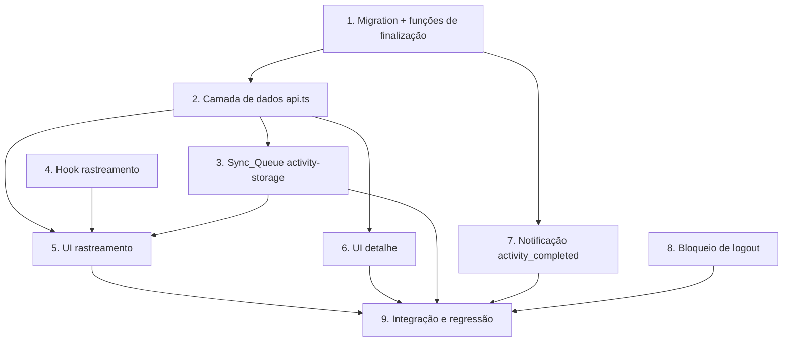

# Implementation Plan

Melhorias na Atividade Rastreada

## Overview

Este plano implementa as melhorias de forma incremental, começando pela
camada de banco (migration única e idempotente) que concentra os efeitos de
finalização, seguindo pela camada de dados (`api.ts`), armazenamento local
(`Sync_Queue`), hook de rastreamento (auto-pause e elevação) e, por fim, a
UI (exibição de elevação, indicador de auto-pause, notificações e bloqueio
de logout).

Cada tarefa referencia os requisitos e as propriedades de correção (P1–P9)
do `design.md`. Tarefas marcadas com `*` são testes opcionais (podem ser
adiadas sem bloquear a entrega funcional).

## Tasks

- [x] 1. Migration Supabase: coluna de elevação + funções de finalização
  - [x] 1.1 Criar nova migration idempotente em `supabase/migrations/`
    - `ALTER TABLE public.user_activities ADD COLUMN IF NOT EXISTS elevation_gain NUMERIC;`
    - Seguir o padrão incremental de `20260721000000_activity-type-and-map-snapshot.sql` (colunas opcionais)
    - Não editar migrations já aplicadas — criar arquivo novo com timestamp
    - _Requirements: 1.1, 1.4_
  - [x] 1.2 Criar `fn_map_activity_type_to_category(_type TEXT) RETURNS TEXT` (IMMUTABLE)
    - Mapear `caminhada→caminhada`, `pedalada→pedalada`, `trilha→trilha`, `outro/null→outro`
    - _Requirements: 4.2_
    - _Properties: P5_
  - [x] 1.3 Criar `fn_build_activity_post_text(_a public.user_activities) RETURNS TEXT`
    - Formatar distância (km/m) + duração (mm:ss / h:mm:ss) + descrição do usuário quando presente
    - _Requirements: 4.4_
  - [x] 1.4 Criar `fn_notify_activity_completed(_a public.user_activities) RETURNS VOID` (SECURITY DEFINER)
    - `INSERT ... SELECT` em `notifications` para cada `user_friends` com `status = 'accepted'` envolvendo o autor, escolhendo o "outro lado" como `recipient_id`
    - `type = 'activity_completed'`, `payload = jsonb_build_object('authorId', ..., 'activityId', ...)`
    - Espelhar o padrão de `notify_on_friend_request` (SECURITY DEFINER, sem policy de INSERT do cliente)
    - _Requirements: 5.1, 5.2, 5.5_
    - _Properties: P7_
  - [x] 1.5 Estender `finish_user_activity` com `_elevation_gain` e efeitos de finalização
    - Adicionar parâmetro opcional `_elevation_gain NUMERIC DEFAULT NULL` no fim da assinatura
    - Persistir `elevation_gain = COALESCE(_elevation_gain, elevation_gain)` no UPDATE
    - Após o UPDATE `status='completed'`: `INSERT` em `community_posts` (via `fn_map_activity_type_to_category` + `fn_build_activity_post_text`, imagem = `map_snapshot_url`), isolado em `BEGIN...EXCEPTION WHEN OTHERS THEN NULL`
    - Chamar `fn_notify_activity_completed(result)`, também isolado em `EXCEPTION`
    - _Requirements: 1.1, 4.1, 4.3, 4.4, 4.5, 5.1, 5.6, 5.8_
    - _Properties: P6, P8_
  - [ ]* 1.6 Testes de banco (pgTAP/SQL) para as funções de finalização
    - `fn_map_activity_type_to_category`: todo o domínio retorna categoria válida (P5)
    - `finish_user_activity`: falha no INSERT do post não reverte a atividade (P6)
    - Notificações com 0, 1 e N amigos `accepted`; ignorar `following`/`pending`/`blocked` (P7)
    - `updateActivityProgress` repetido → zero notificações; uma finalização → um conjunto (P8)
    - _Requirements: 4.2, 4.5, 5.1, 5.5, 5.8_
    - _Properties: P5, P6, P7, P8_

- [x] 2. Camada de dados (api.ts)
  - [x] 2.1 Adicionar `elevation_gain` ao tipo `UserActivity`
    - `elevation_gain: number | null;`
    - _Requirements: 1.2, 1.3_
  - [x] 2.2 Estender `finishActivity` com `elevation_gain` e repassar à RPC
    - Novo campo opcional no payload; passar `_elevation_gain` em `rpc('finish_user_activity', ...)`
    - _Requirements: 1.1, 1.4_
  - [x] 2.3 Garantir que `startActivity` aceita `activity_type` no fluxo de sync
    - Confirmar assinatura já existente `startActivity(destinationId, activityType)` usada pelo `flushQueue`
    - _Requirements: 2.3_

- [x] 3. Armazenamento local e Sync_Queue (activity-storage.ts)
  - [x] 3.1 Adicionar `elevationGain` a `ActivePersisted` e à validação
    - Campo `elevationGain: number` no tipo; validar como número finito `>= 0` **quando presente**, tratando ausência como `0` (retrocompat com registros antigos)
    - Atualizar `persist()` em `use-activity-tracker.ts` para gravar `elevationGain: elevationGainRef.current`
    - _Requirements: 1.4_
  - [x] 3.2 Expandir `QueuedActivity` com os campos completos
    - Adicionar `activity_type?`, `elevation_gain?`, `map_snapshot_blob?: Blob | null`
    - _Requirements: 2.1, 2.2, 1.4_
  - [x] 3.3 Atualizar `flushQueue` para preservar tipo, elevação e snapshot
    - Passar `item.activity_type` em `startActivity`
    - Fazer upload de `item.map_snapshot_blob` via `uploadActivityMapSnapshot` dentro de `try` interno, isolado (falha → snapshot ausente, sem bloquear o sync)
    - Passar `activity_type`, `elevation_gain` e `map_snapshot_url` (quando obtido) a `finishActivity`
    - _Requirements: 2.3, 2.4, 2.5, 1.4_
    - _Properties: P2, P3_
  - [ ]* 3.4 Property tests da Sync_Queue
    - Round-trip `enqueueActivity`/`listQueued` preservando novos campos incluindo `Blob` (P2)
    - `flushQueue` com upload de snapshot mockado para falhar: `finishActivity` ainda é chamado e item removido no sucesso (P3)
    - _Requirements: 2.1, 2.2, 2.3, 2.4, 2.5_
    - _Properties: P2, P3_

- [x] 4. Hook de rastreamento — elevação e auto-pause observável (use-activity-tracker.ts)
  - [x] 4.1 Retornar `elevationGain` em `finalize()`
    - Incluir `elevationGain: elevationGainRef.current` no retorno
    - Restaurar `elevationGain` no efeito de restauração automática a partir do `ActivePersisted`
    - _Requirements: 1.1_
  - [x] 4.2 Expor estado `autoPaused` observável
    - `const [autoPaused, setAutoPaused] = useState(false);` no retorno do hook
    - `setAutoPaused(true)` quando o auto-pause dispara; `setAutoPaused(false)` no auto-resume (dentro de `startWatch`)
    - `pause`/`resume`/`finalize`/`discard` limpam `autoPausedRef` e chamam `setAutoPaused(false)` (precedência da ação manual)
    - _Requirements: 3.1, 3.2, 3.3, 3.4, 3.5_
    - _Properties: P4_
  - [ ]* 4.3 Testes do auto-pause
    - Sequências de eventos (movimento/inatividade/pausa manual) validando exclusividade e precedência da ação manual sobre `autoPaused`
    - _Requirements: 3.1, 3.4, 3.5_
    - _Properties: P4_

- [x] 5. UI de rastreamento (atividade.rastrear.tsx)
  - [x] 5.1 Enfileirar payload completo no fallback offline
    - No `catch` de rede do `finishMut`, incluir `activity_type`, `elevation_gain` (de `result.elevationGain`) e `map_snapshot_blob` (o blob já gerado) em `enqueueActivity`
    - _Requirements: 2.1, 2.2, 1.4_
  - [x] 5.2 Passar `elevation_gain` em `finishActivity` no fluxo online
    - Usar `result.elevationGain` no payload de `finishActivity`
    - _Requirements: 1.1_
  - [x] 5.3 Indicador visual de pausa automática
    - Banner distinto (âmbar, "pausado automaticamente") exibido quando `tracker.autoPaused`, diferente do estado de pausa manual
    - Adicionar chaves i18n `activity.autoPaused` em `pt-BR` e `en`
    - _Requirements: 3.1, 3.2, 3.4_

- [x] 6. UI de detalhe da atividade (atividade.$activityId.tsx)
  - [x] 6.1 Exibir ganho de elevação no resumo
    - Card "Elevação": `Math.round(elevation_gain) + "m"` quando `> 0`; `"—"` quando ausente/zero (nunca `NaN`/`0m` derivado de ausência)
    - _Requirements: 1.2, 1.3_
    - _Properties: P1_
  - [ ]* 6.2 Property test da exibição de elevação
    - `elevation_gain` arbitrário (null, negativo, Infinity, grande): rótulo é sempre `"—"` ou `"<int>m"`
    - _Requirements: 1.2, 1.3_
    - _Properties: P1_

- [x] 7. Renderização da notificação de atividade concluída (notificacoes.tsx)
  - [x] 7.1 Adicionar ramo `activity_completed` em `renderNotification`
    - Resolver perfil do autor via `payload.authorId` (incluir em `relatedProfileIds`)
    - Exibir avatar + nome + texto descritivo (`t("notifications.activityCompletedText")`)
    - Card navega para `/atividade/$activityId` usando `payload.activityId`
    - Adicionar chaves i18n `notifications.activityCompletedText` em `pt-BR` e `en`
    - _Requirements: 5.3, 5.4_

- [x] 8. Bloqueio de logout com atividade em andamento (perfil.tsx)
  - [x] 8.1 Guarda de logout em `handleSignOut`
    - Re-checar `loadActive()`; se `status` for `tracking`/`paused` (inclui Auto_Pause), abrir diálogo e retornar sem executar nenhum efeito de logout
    - Extrair o logout real para `performSignOut()` (invalidatePush + signOut + navega)
    - Tratar `{corrupted:true}` como "sem atividade recuperável" → logout normal
    - _Requirements: 6.1, 6.5, 6.6_
    - _Properties: P9_
  - [x] 8.2 Diálogo de atividade em andamento
    - Opções: Finalizar (navega para `/atividade/rastrear`), Descartar (`clearActive()` + `performSignOut()`), Cancelar (fecha, mantém sessão/atividade)
    - Adicionar chaves i18n para o diálogo em `pt-BR` e `en`
    - _Requirements: 6.2, 6.3, 6.4_
  - [ ]* 8.3 Teste do bloqueio de logout
    - Com atividade ativa: `signOut`/`invalidatePushRegistration`/navegação não são chamados; sem atividade: logout normal
    - _Requirements: 6.1, 6.5, 6.6_
    - _Properties: P9_

- [x] 9. Verificação de integração e regressão
  - [x] 9.1 Validar fluxo online ponta a ponta
    - Elevação persistida e exibida; Community_Post criado com categoria/imagem corretas; notificação criada para um amigo `accepted`
    - _Requirements: 1.1, 1.2, 4.1, 4.2, 4.3, 4.4, 5.1_
  - [x] 9.2 Validar fluxo offline → online
    - Atividade enfileirada completa sincroniza gerando post e notificações no momento do sync; snapshot enviado quando disponível
    - _Requirements: 2.1, 2.2, 2.3, 2.4, 2.5, 4.6, 5.7_
  - [x] 9.3 Regressão de compatibilidade
    - Chamadas antigas de `finishActivity` sem `elevation_gain` continuam funcionando
    - `ActivePersisted`/`QueuedActivity` gravados antes desta mudança continuam válidos e sincronizáveis
    - _Requirements: 1.4, 2.1_

## Task Dependency Graph



```json
{
  "waves": [
    { "wave": 1, "tasks": ["1", "8"] },
    { "wave": 2, "tasks": ["2", "7"] },
    { "wave": 3, "tasks": ["3", "4", "6"] },
    { "wave": 4, "tasks": ["5"] },
    { "wave": 5, "tasks": ["9"] }
  ]
}
```

## Notes

- **Migration primeiro**: a task 1 concentra os efeitos de finalização
  (elevação + post + notificações) num só ponto de verdade (RPC
  `finish_user_activity`), do qual os fluxos online e offline dependem.
- **Task 8 (logout)** é independente das demais e pode ser feita em
  paralelo; depende apenas do `loadActive()`/`clearActive()` já existentes.
- **Task 7 (renderização)** depende só da migration (task 1) definir o
  `type = 'activity_completed'` e o formato de `payload`.
- **Testes opcionais** (`*`): P1–P9 mapeados às propriedades de correção do
  design; podem ser implementados após a entrega funcional das tasks pai.
- **Regra de migração Supabase**: sempre criar novo arquivo timestampado em
  `supabase/migrations/`, idempotente (`IF NOT EXISTS`, `CREATE OR REPLACE`,
  `DROP TRIGGER IF EXISTS`); nunca editar migrations já aplicadas.
- **i18n**: novas chaves (`activity.autoPaused`,
  `notifications.activityCompletedText`, diálogo de logout) devem ser
  adicionadas em `pt-BR` e `en`.
