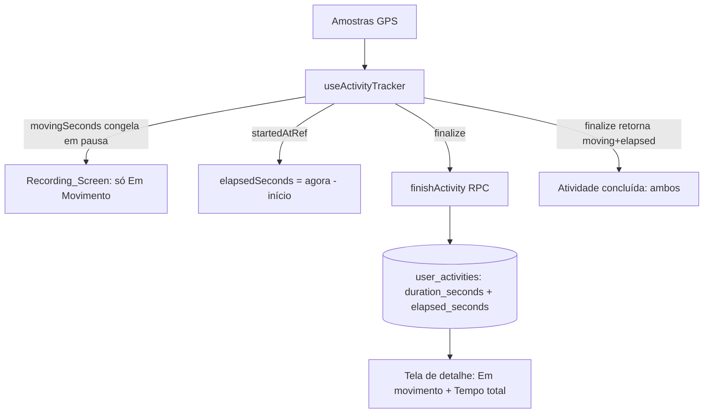

# Design Document

Atividade: Tempo em Movimento vs. Tempo Total

## Overview

O rastreador já mantém, hoje, um cronômetro (`durationRef`/`durationSeconds`)
que **congela na pausa manual e na auto-pausa por inatividade** — ou seja, ele
já é, na prática, o **Tempo em Movimento (Moving_Time)**. O `finalize()` já
aplica `max(contador, elapsedFromPoints(pontos))` para corrigir a suspensão do
timer em segundo plano. Portanto, o trabalho desta feature é **incremental**:

1. Introduzir o conceito explícito de **Tempo Total (Elapsed_Time)** — tempo de
   relógio do início ao fim, contando todas as paradas — calculado a partir de
   um `startedAtRef` (timestamp de início), imune à suspensão do timer.
2. Renomear semanticamente na UI: durante a gravação, mostrar só o Moving_Time
   rotulado "Em movimento"; **não** exibir o Elapsed_Time durante a gravação.
3. Persistir o Elapsed_Time (nova coluna `elapsed_seconds`) e exibir ambos no
   resumo final e na tela de detalhe.

Nada da captura/validação de pontos, distância, velocidade ou elevação muda.
O `useActivityTracker` é **estendido**, não reescrito (diretriz do projeto).

## Steering Alignment

- **roadmap-outvitar / HANDOFF:** confiabilidade estilo Strava é mandatória;
  não reescrever `use-activity-tracker.ts`, estender. Duração final continua
  usando `max(contador, elapsedFromPoints(pontos))` para o Moving_Time.
- **Testes:** funções puras em `src/lib/` (não importar do hook, que puxa
  Capacitor e trava o vitest). O cálculo do Elapsed_Time vai para
  `src/lib/activity-duration.ts` (que já existe e é puro).
- **Migrations Supabase:** arquivo novo timestampado, idempotente
  (`ADD COLUMN IF NOT EXISTS`, `CREATE OR REPLACE FUNCTION`), aplicado 2× +
  reload PostgREST; refletir no consolidado `migrations-pendentes.sql`.
- **i18n:** chaves novas com `defaultValue` em pt-BR e en.

## Architecture



## Components and Interfaces

### 1. `src/lib/activity-duration.ts` (puro — estende o existente)

Nova função pura para o Elapsed_Time, testável sem Capacitor:

```ts
/**
 * Tempo total (segundos) entre o início da atividade e agora/fim, contando
 * todas as paradas. Usa timestamps de relógio (imune à suspensão do timer).
 * `startedAtMs` é o Date.now() do start; `endMs` default = Date.now().
 * Nunca negativo/NaN. Piso: também considera o span dos pontos, para o caso
 * de startedAt ausente em restaurações antigas.
 */
export function elapsedTotalSeconds(
  startedAtMs: number | null,
  endMs: number,
  points: { ts: number }[],
): number
```

Regra: `max(0, round((endMs - startedAtMs)/1000))` quando `startedAtMs` válido;
senão cai para `elapsedFromPoints(points)`. O resultado final também garante
`>= elapsedFromPoints(points)` (invariante: total ≥ span dos pontos).

### 2. `useActivityTracker` (estender)

- Novo `startedAtRef = useRef<number | null>(null)`; setado em `start()` com
  `Date.now()` e **preservado** por todo o ciclo (não zera em pausa/resume).
- Persistir `startedAt` no `ActivePersisted` (novo campo opcional) e reidratar
  na restauração; se ausente (registros antigos), deriva do 1º ponto.
- Renomear a semântica exposta: manter `durationSeconds` como está, mas expor
  também `movingSeconds` (= `durationSeconds`, alias claro) e um getter de
  `elapsedSeconds` calculado on-demand (não precisa de state reativo próprio; a
  UI de gravação não mostra o total).
- `finalize()` passa a retornar também `elapsed`:
  ```ts
  const movingFinal = Math.max(durationRef.current, elapsedFromPoints(pointsRef.current));
  const elapsedFinal = elapsedTotalSeconds(startedAtRef.current, Date.now(), pointsRef.current);
  return { route, distance, duration: movingFinal, elapsed: Math.max(elapsedFinal, movingFinal), points, elevationGain };
  ```
  (o `duration` mantém o nome atual = Moving_Time, para não quebrar chamadas;
  acrescenta `elapsed`).

### 3. `Recording_Screen` (`atividade.rastrear.tsx`)

- O cronômetro grande passa a ser rotulado "Em movimento" (i18n
  `tracking.movingTime`). Continua exibindo `tracker.durationSeconds`.
- Garantir que **nenhum** elemento exibe o tempo total durante a gravação
  (hoje já não exibe; apenas confirmar e rotular).

### 4. Persistência

- **Migration** `supabase/migrations/<ts>_activity-elapsed-seconds.sql`:
  - `ALTER TABLE user_activities ADD COLUMN IF NOT EXISTS elapsed_seconds integer;`
  - `CREATE OR REPLACE FUNCTION finish_user_activity(...)` acrescentando o
    parâmetro `_elapsed integer DEFAULT NULL` e gravando em `elapsed_seconds`.
    (mantém a assinatura retrocompatível via default).
  - Refletir no consolidado `supabase/migrations-pendentes.sql`.
- **API** (`src/lib/api.ts`):
  - `finishActivity` payload ganha `elapsed_seconds?: number | null`, passado à
    RPC como `_elapsed`.
  - `saveActivityOffline` grava `elapsed_seconds`.
  - Tipo `UserActivity` ganha `elapsed_seconds: number | null`.

### 5. Exibição (resumo + detalhe)

- Tela de detalhe (`atividade.$activityId.tsx`): o card de duração passa a
  mostrar **Em movimento** (`duration_seconds`) e **Tempo total**
  (`elapsed_seconds`) lado a lado. Se `elapsed_seconds` for null (atividade
  antiga), exibe só "Em movimento" (retrocompat).
- Tela de atividade concluída (`atividade.concluida.$activityId.tsx`): idem —
  acrescenta o "Tempo total" como métrica informativa.

## Data Models

`user_activities` (adição):

| Coluna | Tipo | Observação |
|--------|------|------------|
| `elapsed_seconds` | `integer` NULL | Tempo total (início→fim, com paradas). NULL para atividades anteriores. |

`ActivePersisted` (adição): `startedAt?: number` (epoch ms do início).

`finalize()` retorno (adição): `elapsed: number`.

## Error Handling

- `elapsedTotalSeconds` nunca lança; retorna 0 para entradas inválidas.
- Ausência de `startedAt` (restauração antiga) → deriva do span dos pontos, sem
  erro.
- `elapsed_seconds` null na exibição → mostra só o Moving_Time (sem erro).
- Invariante `elapsed >= moving` garantido no `finalize()` com `Math.max`.

## Correctness Properties

### Property 1: Não-negatividade
Para quaisquer entradas, `elapsedTotalSeconds` e `elapsedFromPoints` retornam um
inteiro `>= 0`, nunca `NaN`/`Infinity`.
**Validates: Requirements 2.1, 2.2**

### Property 2: Total ≥ Movimento
Para a mesma atividade, o Elapsed_Time final é sempre `>= Moving_Time`
(garantido por `Math.max` no `finalize()`).
**Validates: Requirements 2.3**

### Property 3: Total ≥ span dos pontos
`elapsedTotalSeconds(startedAt, end, pts) >= elapsedFromPoints(pts)` — o total
nunca é menor que o intervalo entre o primeiro e o último ponto.
**Validates: Requirements 2.1**

### Property 4: Imunidade à suspensão do timer
O Elapsed_Time depende só de timestamps de relógio (`startedAt`/`now`), não do
contador incremental — logo não é subestimado quando o app fica em segundo
plano.
**Validates: Requirements 2.2**

### Property 5: Retrocompatibilidade
Com `elapsed_seconds = null`, a exibição usa apenas o Moving_Time sem erro; com
`startedAt` ausente, o cálculo cai no span dos pontos.
**Validates: Requirements 4.3**

## Testing Strategy

- **Unit (vitest, puro)** em `activity-duration.test.ts`:
  - `elapsedTotalSeconds` com startedAt válido; com null (fallback pontos);
    entradas inválidas (0/NaN); invariante `>= elapsedFromPoints`.
  - Property-based (fast-check): para quaisquer timestamps crescentes,
    `elapsedTotalSeconds >= 0` e `>= elapsedFromPoints`.
- **Migration:** aplicar 2× local (idempotência) + reload PostgREST.
- **Verificação:** `get_diagnostics` nos arquivos tocados + `build:native`.
- Não criar testes que importem o hook (puxa Capacitor).
