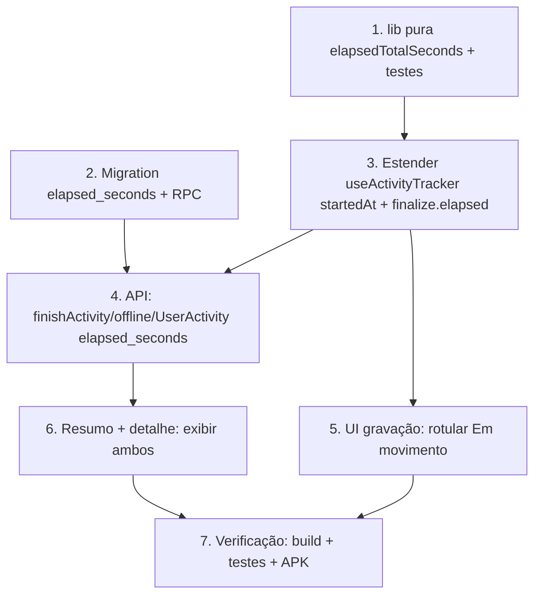

# Implementation Plan

Atividade: Tempo em Movimento vs. Tempo Total

## Overview

Plano incremental e de baixo risco: o cronômetro atual já é o Tempo em
Movimento (congela em pausa/auto-pausa). Adicionamos o cálculo puro do Tempo
Total (por relógio), persistimos numa coluna nova, rotulamos a UI de gravação e
exibimos ambos no resumo/detalhe. Sem tocar em captura/validação de pontos.

## Task Dependency Graph



```json
{
  "waves": [
    { "wave": 1, "tasks": ["1", "2"] },
    { "wave": 2, "tasks": ["3"] },
    { "wave": 3, "tasks": ["4", "5"] },
    { "wave": 4, "tasks": ["6"] },
    { "wave": 5, "tasks": ["7"] }
  ]
}
```

## Tasks

- [x] 1. Função pura `elapsedTotalSeconds` + testes
  - Em `src/lib/activity-duration.ts`, adicionar `elapsedTotalSeconds(startedAtMs, endMs, points)`:
    `max(0, round((endMs - startedAtMs)/1000))` quando `startedAtMs` válido; senão `elapsedFromPoints(points)`; resultado final `>= elapsedFromPoints(points)`; nunca NaN/negativo.
  - Criar `src/lib/activity-duration.test.ts` (vitest + fast-check): Properties 1–4 e casos startedAt null/inválido. (11 testes passando)
  - _Requisitos: 2.1, 2.2; Properties 1, 3, 4_

- [x] 2. Migration: coluna `elapsed_seconds` + RPC `finish_user_activity`
  - `supabase/migrations/20260926120000_activity-elapsed-seconds.sql` (idempotente): `ADD COLUMN IF NOT EXISTS elapsed_seconds` + RPC com `_elapsed INTEGER DEFAULT NULL`.
  - Refletido em `supabase/migrations-pendentes.sql` (item 45). Aplicado 2× + reload PostgREST.
  - _Requisitos: 2.5, 4.3_

- [x] 3. Estender `useActivityTracker` (startedAt + finalize.elapsed)
  - `startedAtRef` setado em `start()`, preservado em pause/resume, persistido/reidratado (fallback 1º ponto), resetado em discard/reset.
  - `finalize()` retorna `elapsed = max(elapsedTotalSeconds(startedAt, now, pts), movingFinal)`; `duration` = Moving_Time.
  - _Requisitos: 2.1, 2.3, 2.4, 4.1, 4.2, 4.4; Property 2_

- [x] 4. API: persistir e tipar `elapsed_seconds`
  - `finishActivity` payload `elapsed_seconds?` → `_elapsed`; `QueuedActivity`/`flushQueue` propagam; `UserActivity.elapsed_seconds`; `atividade.rastrear.tsx` passa `result.elapsed` (finish + offline).
  - _Requisitos: 2.5, 4.3_

- [x] 5. UI de gravação: rotular "Em movimento" e ocultar total
  - `atividade.rastrear.tsx`: rótulo do cronômetro → `activity.movingTime`; total não é exibido na gravação. i18n pt-BR/en.
  - _Requisitos: 1.1, 1.2_

- [x] 6. Resumo + detalhe: exibir Em movimento + Tempo total
  - `atividade.$activityId.tsx` e `atividade.concluida.$activityId.tsx`: card "Em movimento" + card "Tempo total" (só quando `elapsed_seconds` != null). Velocidade média segue no Moving_Time. i18n `activity.movingTime`/`activity.elapsedTime`.
  - _Requisitos: 3.1, 3.2, 3.3, 3.4; Property 5_

- [x] 7. Verificação e entrega
  - Diagnostics limpos; 11 testes da lib passando; `build:native` + `cap sync` + APK OK (9,98 MB).
  - Commit + push na main; roadmap atualizado.
  - _Requisitos: 4.1, 4.2, 4.3, 4.4_

## Notes

- Diretriz do projeto: NÃO reescrever `use-activity-tracker.ts`, apenas estender.
- Testes puros em `src/lib/` (não importar do hook, que puxa Capacitor e trava o vitest).
- Migration idempotente aplicada 2× + reload PostgREST; refletir em `migrations-pendentes.sql`.
- Build/APK conforme HANDOFF do roadmap; `git push` na `main`; atualizar o roadmap ao concluir.
- `tsc` costuma travar nesta máquina — preferir `get_diagnostics` + `build:native`.
