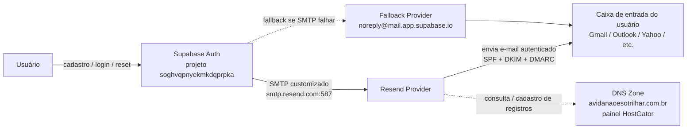
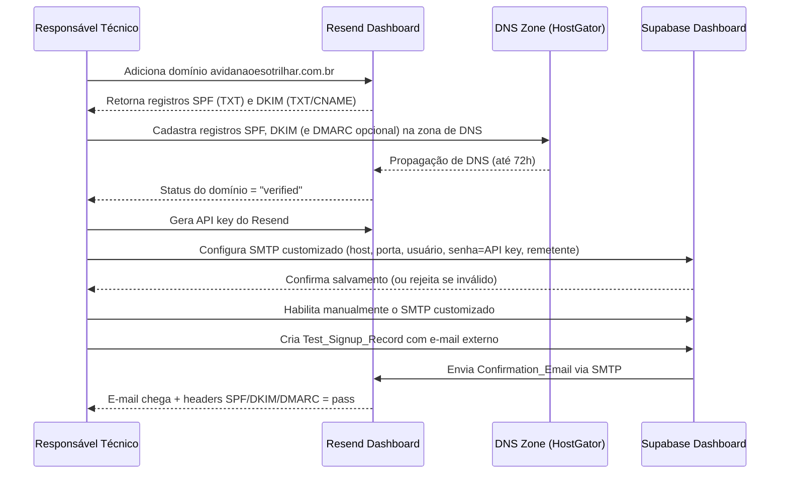

# Design Document

## Overview

Esta feature é uma tarefa de **configuração de infraestrutura/dashboard**, não de desenvolvimento de código de aplicação. Nenhum arquivo do repositório OutLife é alterado. O trabalho consiste em:

1. Gerar registros DNS de autenticação de e-mail (SPF, DKIM e, opcionalmente, DMARC) no painel do Resend para o domínio `avidanaoesotrilhar.com.br`.
2. Cadastrar esses registros na zona de DNS do domínio, gerenciada no painel de cliente do HostGator.
3. Aguardar a verificação do domínio no Resend.
4. Configurar o SMTP customizado no Supabase Dashboard (projeto `soghvqpnyekmkdqprpka`) apontando para o Resend.
5. Validar a entrega e a autenticação dos e-mails transacionais com um cadastro de teste usando um destinatário externo (Gmail/Outlook/Yahoo).

O resultado esperado é que `Confirmation_Email`, `Magic_Link_Email` e `Password_Reset_Email` passem a ser enviados com remetente `@avidanaoesotrilhar.com.br`, autenticados via SPF/DKIM/DMARC, chegando na caixa de entrada (não em spam), sem o limite de 2 e-mails/hora do provedor padrão do Supabase.

## Architecture

### Fluxo de envio (produção, após configuração)

### Fluxo de configuração (setup, uma vez)

Não há diagrama de arquitetura de software (camadas, classes, serviços de backend) porque nenhum componente de código é criado ou alterado. Os "componentes" deste design são recursos configurados em três painéis externos: HostGator (DNS), Resend (envio) e Supabase Dashboard (SMTP customizado).

## Components and Interfaces

### Sender_Domain
- **O quê**: `avidanaoesotrilhar.com.br`, domínio já registrado e hospedado no HostGator.
- **Papel**: domínio usado no endereço de remetente dos e-mails transacionais (ex.: `naoresponda@avidanaoesotrilhar.com.br` ou `contato@avidanaoesotrilhar.com.br`).
- **Onde é gerenciado**: painel de cliente do HostGator (`cliente.hostgator.com.br`), seção de gerenciamento de DNS/zona de DNS do domínio.
- **Decisão de remetente**: recomenda-se `naoresponda@avidanaoesotrilhar.com.br` para e-mails transacionais automáticos (convenção comum que sinaliza ao usuário que não deve responder). Não é necessário que essa caixa de e-mail exista de fato — o Resend envia "em nome de" esse endereço; a existência de uma caixa de recebimento correspondente é opcional e fica a critério do responsável técnico.

### Resend_Provider
- **O quê**: serviço de envio de e-mail transacional (resend.com).
- **Papel**: (a) gera os registros DNS de autenticação (SPF/DKIM) que precisam ser cadastrados na DNS_Zone; (b) verifica o status do domínio após a propagação; (c) atua como o servidor SMTP relay usado pelo Supabase Auth; (d) fornece a API key usada como senha SMTP; (e) fornece um painel de logs/eventos de envio, usado como diagnóstico alternativo (Requirement 3.6).
- **Interface exposta ao Supabase**: SMTP padrão (host/porta/usuário/senha), sem necessidade de integração por API/webhook para esta feature.

### DNS_Zone (HostGator)
- **O quê**: a zona de DNS do Sender_Domain, editável no painel do HostGator.
- **Papel**: hospeda os registros TXT (SPF, DKIM, DMARC) que autenticam o Resend a enviar e-mails em nome do Sender_Domain.
- **Registros necessários** (valores exatos são gerados pelo Resend no momento da adição do domínio e devem ser copiados literalmente):

| Registro | Tipo | Origem do valor | Onde é cadastrado | Obrigatório? |
|---|---|---|---|---|
| SPF | TXT | Painel Resend → Domains → adicionar domínio | Zona de DNS no HostGator, no host raiz (`@`) ou conforme instruído pelo Resend | Sim (Requirement 2.1) |
| DKIM | TXT (geralmente 1 registro com seletor `resend._domainkey` ou similar) | Painel Resend → Domains → adicionar domínio | Zona de DNS no HostGator | Sim (Requirement 2.2) |
| DMARC | TXT (`_dmarc.avidanaoesotrilhar.com.br`) | Definido pelo responsável técnico (ex.: `v=DMARC1; p=none; rua=mailto:contato@avidanaoesotrilhar.com.br`) alinhado às recomendações do Resend | Zona de DNS no HostGator | Opcional, mas recomendado (Requirement 1.5, 4.4) |

- Se o HostGator já tiver um registro SPF pré-existente para o domínio (ex.: de outro serviço de e-mail), o registro deve ser **combinado** em uma única linha SPF (múltiplos registros SPF TXT no mesmo host são inválidos) — ex.: `v=spf1 include:_spf.resend.com include:<outro-provedor> ~all`. Isso deve ser verificado antes de cadastrar o registro do Resend.

### SMTP_Configuration (Supabase Dashboard)
- **Onde**: Supabase Dashboard → projeto `soghvqpnyekmkdqprpka` → Authentication → Emails → SMTP Settings.
- **Parâmetros exatos**:

| Campo | Valor |
|---|---|
| Enable Custom SMTP | ligado (apenas após verificação do domínio + revisão manual) |
| Host | `smtp.resend.com` |
| Port | `587` |
| Username | `resend` |
| Password | API key gerada no Resend (ex.: `re_xxxxxxxxxxxxxxxxxxxxxxxx`) |
| Sender email | `naoresponda@avidanaoesotrilhar.com.br` (ou `contato@avidanaoesotrilhar.com.br`) — deve pertencer ao Sender_Domain e este deve estar `verified` no Resend no momento do salvamento |
| Sender name | `OutLife` (ou nome de exibição definido pela equipe) |

- **Ativação manual obrigatória**: mesmo após o domínio ficar `verified` no Resend, o SMTP_Configuration não deve ser habilitado automaticamente — a ativação do toggle "Enable Custom SMTP" é um passo manual do responsável técnico (Requirement 2.6).
- **Validação de entrada do próprio Supabase Dashboard**: campos como host/porta em formato inválido, remetente fora do Sender_Domain, ou credenciais rejeitadas pelo Resend causam rejeição do salvamento pelo próprio Dashboard, preservando a configuração anterior (Requirement 3.7) — este é um comportamento nativo do Supabase Dashboard, não algo a ser implementado nesta feature.

### Fallback_Provider
- **O quê**: o provedor de e-mail padrão do Supabase (remetente `noreply@mail.app.supabase.io`).
- **Papel**: comportamento nativo do Supabase Auth quando o SMTP_Configuration não está habilitado ou falha na validação/handshake. Não requer nenhuma configuração adicional nesta feature — é o estado atual do projeto antes desta mudança, e permanece disponível como contingência.
- **Limitação conhecida**: limite de 2 e-mails/hora no plano free, remetente sem SPF/DKIM/DMARC alinhados ao domínio próprio (por isso cai em spam). Essa limitação é aceita como comportamento do fallback, não como defeito a corrigir — o objetivo desta feature é reduzir a dependência dele, não eliminá-lo (Requirement 1.6, 1.7).

## Data Models

Não há modelos de dados de aplicação nesta feature (nenhuma tabela, entidade ou schema de código é criado). Os "dados" relevantes são os parâmetros de configuração já descritos em Components and Interfaces (registros DNS e campos do SMTP_Configuration) e os artefatos de validação abaixo, usados apenas como checklist de execução/documentação — não como modelos persistidos em banco:

### Registro de verificação de domínio (estado observado no Resend)

| Campo | Valores possíveis |
|---|---|
| Domain | `avidanaoesotrilhar.com.br` |
| Status | `pending` \| `verified` \| `failed` |
| SPF check | `pending` \| `pass` \| `fail` |
| DKIM check | `pending` \| `pass` \| `fail` |

### Registro de validação do Test_Signup_Record (checklist de Requirement 4)

| Campo | Descrição |
|---|---|
| E-mail de teste | endereço em provedor externo (Gmail/Outlook/Yahoo) |
| Horário de criação do cadastro | usado para calcular o limite de 30 minutos |
| Localização do e-mail recebido | caixa de entrada principal \| spam \| não recebido |
| SPF (Authentication_Headers) | `pass` \| outro |
| DKIM (Authentication_Headers) | `pass` \| outro |
| DMARC (Authentication_Headers) | `pass` \| outro \| não aplicável (DMARC não habilitado) |
| Resultado geral | aprovado \| reprovado (repetir teste) |

## Error Handling

| Cenário de falha | Comportamento esperado | Requisito relacionado |
|---|---|---|
| SPF/DKIM ficam inválidos após configuração inicial (ex.: alteração indevida na DNS_Zone) | Supabase_Auth continua permitindo cadastro, magic link e redefinição de senha normalmente; risco é o e-mail cair em spam até a correção — não é um bloqueio de fluxo | Req 1.4 |
| Validação do SMTP_Configuration falha (host/porta/credenciais/handshake TLS) | Supabase_Auth roteia automaticamente para o Fallback_Provider até correção e revalidação do SMTP_Configuration | Req 1.6 |
| Resend_Provider e Fallback_Provider ambos indisponíveis no momento do envio | Dados já submetidos pelo usuário (cadastro, solicitação de magic link/reset) são preservados; usuário pode solicitar reenvio após restabelecimento de ao menos um provedor | Req 1.7 |
| Status de verificação do domínio no Resend fica `pending` por mais de 72h, ou `failed`, ou o Resend está inacessível para consulta | SMTP_Configuration permanece desativado (não habilitar o toggle) até confirmação de `verified` | Req 2.5 |
| Domínio verificado, mas responsável técnico ainda não revisou | SMTP_Configuration permanece desativado — ativação é manual, nunca automática | Req 2.6 |
| Falha de envio de um e-mail transacional específico através do SMTP_Configuration já habilitado | Falha é registrada no Supabase Dashboard (destinatário + tipo de e-mail) para diagnóstico | Req 3.5 |
| Registro de falha no Supabase Dashboard indisponível ou também falho | Responsável técnico usa o painel de logs/eventos do Resend como fonte alternativa de diagnóstico | Req 3.6 |
| Valores inválidos ao salvar o SMTP_Configuration (host/porta malformados, remetente fora do domínio, credenciais rejeitadas) | Supabase Dashboard rejeita o salvamento, indica o campo inválido, preserva configuração anterior válida | Req 3.7 |
| Confirmation_Email de teste não chega (nem inbox nem spam) em 30 min | Tratado como falha de entrega; investigar SMTP_Configuration e logs do Resend; repetir com novo Test_Signup_Record | Req 4.6 |
| Authentication_Headers (SPF/DKIM/DMARC) não retornam `pass` | Corrigir DNS_Zone ou SMTP_Configuration; criar novo Test_Signup_Record; repetir validação até todos os resultados aplicáveis serem `pass` | Req 4.5 |

## Testing Strategy

**Property-based testing não se aplica a esta feature.** Não há código de aplicação, funções puras, parsers ou lógica de transformação de dados sobre os quais formular uma propriedade universal "para todo x". O comportamento correto depende de estado externo — propagação de DNS, verificação de domínio por um terceiro (Resend), aceitação de credenciais SMTP por um serviço externo — não de lógica implementada neste repositório. Por isso a seção de Correctness Properties foi omitida deste design, conforme orientação para features de configuração de infraestrutura/dashboard.

A verificação de corretude é feita por um **plano de validação manual/checklist**, executado uma vez ao final da configuração, conforme Requirement 4:

### Checklist de configuração (pré-requisitos antes do teste)
1. Domínio `avidanaoesotrilhar.com.br` adicionado no Resend.
2. Registros SPF e DKIM (e DMARC, se optado) cadastrados na DNS_Zone no HostGator.
3. Status do domínio no Resend = `verified` (aguardar até 72h de propagação; se ultrapassar isso ou `failed`, corrigir DNS antes de continuar).
4. API key do Resend gerada.
5. SMTP_Configuration salvo no Supabase Dashboard com os parâmetros exatos (host `smtp.resend.com`, porta `587`, usuário `resend`, senha = API key, remetente `@avidanaoesotrilhar.com.br`).
6. Toggle "Enable Custom SMTP" habilitado manualmente.

### Teste de ponta a ponta (Test_Signup_Record)
1. Criar um cadastro de teste (`Test_Signup_Record`) usando um e-mail em provedor **externo e independente** do Sender_Domain — recomendado Gmail e/ou Outlook (testar em ambos se possível, pois cada provedor de destino aplica suas próprias regras de spam).
2. Anotar o horário exato da criação do cadastro.
3. Aguardar até 30 minutos e verificar:
   - O `Confirmation_Email` chegou na **caixa de entrada principal** (não em spam/lixo eletrônico)?
   - Abrir o e-mail e inspecionar os cabeçalhos completos (ex.: "Mostrar original" no Gmail, "Exibir código-fonte da mensagem" no Outlook) para verificar `Authentication-Results`:
     - `spf=pass`
     - `dkim=pass`
     - `dmarc=pass` (se DMARC estiver habilitado na DNS_Zone)
4. Se qualquer resultado não for `pass`, ou o e-mail não chegar em 30 min (nem em spam): corrigir DNS_Zone/SMTP_Configuration, criar um **novo** `Test_Signup_Record` e repetir o passo 3 até todos os critérios aplicáveis passarem.
5. Repetir o teste também para o fluxo de `Password_Reset_Email` e, se aplicável ao app, `Magic_Link_Email`, para confirmar que o SMTP_Configuration cobre todos os tipos de `Transactional_Email` (não apenas o de confirmação de cadastro).

### Critério de conclusão da tarefa
A tarefa só é considerada concluída quando, para pelo menos um `Test_Signup_Record` criado **após** a habilitação do SMTP_Configuration:
- o `Confirmation_Email` chegou na caixa de entrada principal em até 30 minutos, **e**
- SPF = pass, DKIM = pass, e DMARC = pass (quando habilitado).

Testes anteriores à habilitação do SMTP_Configuration (ainda usando o Fallback_Provider) não contam para essa validação (Req 4.1).

## Descoberta durante execução (bloqueio identificado em 06/07/2026)

Após completar toda a configuração (DNS verificado no Resend, SMTP customizado salvo e habilitado no Supabase Dashboard), dois testes de cadastro consecutivos (`Test_Signup_Record`) mostraram que o `Confirmation_Email` continua sendo enviado com remetente `no-reply@auth.lovable-app.email` e domínio de autenticação (SPF/DKIM/DMARC) `auth.lovable-app.email` — não `avidanaoesotrilhar.com.br`. O `SMTP_Configuration` configurado no Supabase Dashboard está confirmado como salvo corretamente (toggle ativo, host/porta/usuário/remetente conforme especificado), mas não está sendo utilizado no envio real.

**Causa raiz identificada**: o projeto Supabase `soghvqpnyekmkdqprpka` foi originalmente provisionado através da plataforma **Lovable** (lovable.dev), via o recurso "Lovable Cloud". Segundo a documentação oficial da Lovable ([Send branded emails from your own domain](https://docs.lovable.dev/features/custom-emails)), a Lovable Cloud gerencia o envio de e-mails de autenticação através de uma Edge Function própria (`supabase/functions/auth-email-hook/`) implantada dentro do próprio projeto Supabase, que intercepta o envio antes de respeitar a configuração nativa de SMTP customizado do Supabase Auth. Quando não configurado um domínio próprio pelo fluxo da Lovable, o envio cai no "default Cloud Auth sender" — exatamente o comportamento observado.

Verificação feita em Authentication → Auth Hooks no Supabase Dashboard não mostrou nenhum hook registrado (lista vazia) — isso pode indicar que o mecanismo de interceptação da Lovable não usa o Auth Hook oficial do Supabase (Send Email Hook), ou que a UI não refletiu corretamente o estado devido a uma instabilidade da plataforma Supabase observada no momento (banner "We are investigating a technical issue" visível durante toda a sessão de configuração).

**Contexto adicional fornecido pelo usuário**: o projeto ainda não está em produção (os ~10 usuários existentes são de teste). O código-fonte já foi desacoplado da Lovable no repositório Git (fontes exclusivos, sem referências a pacotes `@lovable.dev/*` encontradas no `package.json`), mas uma cópia do projeto ainda existe na plataforma Lovable onde foi originalmente criado, e o projeto Supabase (`soghvqpnyekmkdqprpka`) permanece o mesmo usado por essa cópia — possivelmente ainda contendo a Edge Function/infraestrutura de e-mail provisionada pela Lovable.

**Decisão do usuário**: desvincular completamente o projeto da Lovable Cloud antes de seguir com a liberação de produção, ao invés de configurar um domínio próprio pelo fluxo pago da Lovable. Esse desvinculamento é tratado como um spec técnico separado (a ser criado), já que envolve investigação e possível remoção de Edge Functions/infraestrutura dentro do projeto Supabase, e não apenas configuração de SMTP. Este spec (`email-transacional-dominio-proprio`) permanece bloqueado — Requirement 4 (validação de entrega) não pode ser concluído até que a interceptação da Lovable seja removida.

## Riscos e Observações (fora do escopo de execução)

- O projeto Supabase `soghvqpnyekmkdqprpka` está atualmente no **plano free**, que pausa o projeto automaticamente após um período de inatividade. Isso é um risco operacional independente desta feature: se o projeto Supabase pausar, o SMTP customizado configurado aqui deixa de ser exercitado (assim como todo o restante do backend do OutLife).
- A migração do projeto Supabase para o plano Pro (que remove a pausa automática por inatividade) é tratada como tarefa central no spec **`outlife-production-plan`** (ver Fase 2 desse plano: "Upgrade para Supabase Pro (se free tier)").
- Essa migração de plano está **fora do escopo de execução (tasks) deste spec** (`email-transacional-dominio-proprio`). Este spec apenas documenta o risco, conforme Requirement 5; a ação de upgrade de plano deve ser rastreada e executada através do spec `outlife-production-plan`.
