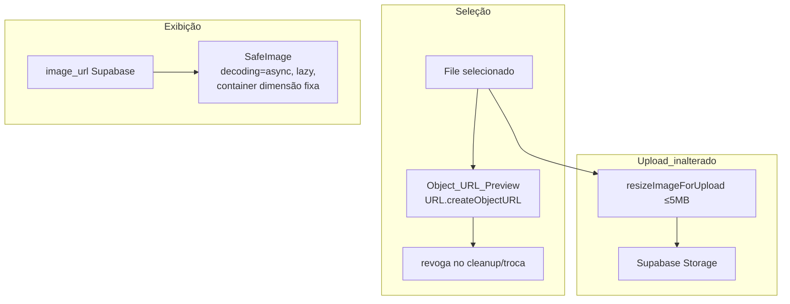

# Design Document

Estabilidade da Comunidade — crash por estouro de memória em fotos

## Overview

Este design corrige o crash por estouro de memória do WebView ao decodificar
imagens grandes na Comunidade (spec/bugfix `estabilidade-comunidade-midia`).
A investigação confirmou que o pipeline de **upload** já comprime imagens para
≤5 MB (`resizeImageForUpload` em `src/lib/api.ts`), então o crash está na
**decodificação para exibição/preview**, em dois pontos de `comunidade.tsx`:

1. **Preview** via `FileReader.readAsDataURL` — materializa a imagem inteira
   como base64 em memória.
2. **Feed** exibindo a imagem original sem teto de decodificação.

A correção é focada e de baixo risco: (1) trocar o preview para
`URL.createObjectURL` com revogação disciplinada; (2) introduzir um componente
`SafeImage` reutilizável que aplica atributos de decodificação seguros
(`decoding="async"`, `loading="lazy"`, container de dimensão fixa) para limitar
o custo de memória por imagem; (3) preservar integralmente upload, pipeline e
todas as funções da comunidade. Nenhuma mudança de schema ou de arquivo
persistido no Supabase.

## Glossary

- **SafeImage**: componente novo (`src/components/SafeImage.tsx`) que exibe
  imagens com atributos de decodificação seguros e container de dimensão fixa.
- **Object_URL_Preview**: preview via `URL.createObjectURL` (referência, sem
  cópia base64).
- **Decode_Dimension_Cap**: limite prático de decodificação imposto pelo
  container de dimensão fixa + `decoding="async"`/`loading="lazy"`.
- **Image_Resize_Pipeline**: `resizeImageForUpload` (`src/lib/api.ts`), já
  existente, que comprime imagens a ≤5 MB no upload.

## Bug Details

O crash ocorre ao decodificar imagens grandes em memória no WebView, em dois
pontos de `src/routes/comunidade.tsx`:

1. **Preview** — `handleFile` usa `FileReader.readAsDataURL(file)`, gerando uma
   string base64 da imagem inteira (custo ~1.33× o arquivo) mantida em estado
   React (`preview`). Para uma foto original de 10MB+, isso sozinho pode
   estourar o orçamento de memória.
2. **Feed** — cada Post_Image é um `` apontando para o
   arquivo original no Supabase, sem teto de decodificação. Decodificar várias
   imagens de alta resolução (mesmo com `loading="lazy"`) acumula memória.

## Expected Behavior

1. O preview referencia o arquivo via `URL.createObjectURL` e revoga o URL ao
   trocar/fechar/publicar/desmontar — sem materializar base64.
2. As Post_Images são exibidas via `SafeImage`, com container de dimensão fixa
   + `decoding="async"` + `loading="lazy"`, limitando o custo de memória por
   imagem, sem alterar o arquivo persistido.
3. Upload, pipeline de compressão e todas as funções da comunidade permanecem
   inalterados.

## Hypothesized Root Cause

A causa raiz é a **decodificação de imagens em resolução original sem
limite de memória**, agravada pelo preview em base64. Não é o upload (o
`Image_Resize_Pipeline` já comprime a ≤5 MB). Confirmado por leitura de
`comunidade.tsx` (`readAsDataURL` no `handleFile`; `` direto)
e de `api.ts` (`uploadCommunityPostImage` já aplica `resizeImageForUpload`).

## Fix Implementation

A correção tem três partes, detalhadas em "Components and Interfaces" abaixo:
(1) `SafeImage` novo; (2) preview via Object_URL com revogação disciplinada em
`comunidade.tsx`; (3) troca das `` do feed por `SafeImage`. Upload
inalterado.



Camadas tocadas:
- **Preview** (`comunidade.tsx`): `handleFile`/`closeDrawer` passam a usar
  Object_URL_Preview com revogação.
- **Exibição** (novo `src/components/SafeImage.tsx`): componente único usado
  pelas Post_Images do feed (e reutilizável em outras telas de mídia depois).
- **Upload** (`api.ts`): inalterado — apenas referenciado como preservação.

## Components and Interfaces

### 1. `src/components/SafeImage.tsx` (novo)

Componente de imagem que encapsula os atributos de decodificação seguros e um
container de dimensão fixa (o teto de decodificação prático), evitando
`layout shift` e limitando o custo de memória por imagem.

```tsx
export interface SafeImageProps {
  src: string;
  alt: string;
  /** Classe do container (define a caixa de exibição — o "cap" visual). */
  className?: string;
  /** Proporção do container (ex.: "4/5" no feed). */
  aspectClassName?: string;
  /** Fallback exibido em erro de carregamento (ex.: community1). */
  fallbackSrc?: string;
  onClick?: () => void;
}

export function SafeImage(props: SafeImageProps): JSX.Element;
```

Comportamento:
- Renderiza `` dentro de um
  container com dimensão/aspect fixos.
- `onError` → troca para `fallbackSrc` uma única vez (sem loop).
- Não decodifica antecipadamente: só quando entra na viewport (lazy).

### 2. Preview em `comunidade.tsx`

Substituição de `readAsDataURL` por Object_URL_Preview:

```ts
const previewUrlRef = useRef<string | null>(null);

function setPreviewFromFile(file: File) {
  if (previewUrlRef.current) URL.revokeObjectURL(previewUrlRef.current); // Req 1.3
  const url = URL.createObjectURL(file);
  previewUrlRef.current = url;
  setPreview(url);
  setSelectedFile(file);
}

function clearPreview() {
  if (previewUrlRef.current) {
    URL.revokeObjectURL(previewUrlRef.current); // Req 1.2
    previewUrlRef.current = null;
  }
  setPreview(null);
  setSelectedFile(null);
}
```

- `handleFile` chama `setPreviewFromFile`.
- `closeDrawer` e o `onSuccess` da publicação chamam `clearPreview`.
- `useEffect` de cleanup no unmount revoga o URL pendente (Req 1.2).

### 3. Uso no feed

As duas ocorrências de `` (post de atividade e post
manual) passam a usar `SafeImage`, preservando:
- `aspect-[4/5]` (mesma caixa atual → o container é o cap visual).
- fallback `community1` via `fallbackSrc`.
- `onClick` de navegação para o detalhe da atividade quando `activityId`.

## Data Models

Nenhuma mudança de schema nem de dados persistidos. `community_posts.image_url`
continua apontando para o arquivo no Supabase Storage; o teto aplica-se apenas
à decodificação no cliente (Req 2.4).

## Error Handling

- **Erro ao decodificar/carregar Post_Image**: `SafeImage.onError` troca para
  `fallbackSrc` uma única vez (guarda contra loop de erro).
- **Object_URL órfão**: sempre revogado em troca de foto, fechamento do
  formulário, sucesso de publicação e unmount (Req 1.2/1.3) — sem vazamento.
- **Pipeline de upload falhando**: comportamento existente preservado
  (fallback para arquivo original + validação de 5 MB) — Req 3.2/3.3.
- **Banner_Generator**: continua decodificando a imagem para compartilhar; não
  é alterado, e como o upload já limita a 5 MB, não reintroduz o crash (Req 4.4).

## Testing Strategy

- **Unit (Vitest + jsdom)** para `SafeImage`: renderiza `` com
  `decoding="async"` e `loading="lazy"`; `onError` aplica `fallbackSrc` uma
  única vez; `onClick` dispara quando fornecido.
- **Preview**: teste do ciclo `setPreviewFromFile`/`clearPreview` garantindo
  que `URL.createObjectURL` é usado e `URL.revokeObjectURL` é chamado em troca/
  limpeza (mockando as APIs de URL em jsdom).
- **Regressão**: garantir que publicar/curtir/comentar/seguir/excluir/
  compartilhar não quebram (as mutações não são tocadas; verificação manual +
  a suíte existente).

## Correctness Properties

### Property 1: Preview nunca usa base64
Após a correção, a geração do Image_Preview usa `URL.createObjectURL` e nunca
`FileReader.readAsDataURL`.
**Validates: Requirements 1.1**

### Property 2: Todo Object_URL criado é revogado
Para toda seleção de foto, o Object_URL correspondente é revogado exatamente
uma vez ao trocar a foto, fechar o formulário, concluir a publicação ou
desmontar o componente — sem vazamento e sem revogação dupla.
**Validates: Requirements 1.2, 1.3**

### Property 3: Exibição não altera o arquivo persistido
O Decode_Dimension_Cap aplicado por `SafeImage` afeta apenas a decodificação/
exibição no cliente; `community_posts.image_url` e o arquivo no Supabase
permanecem inalterados.
**Validates: Requirements 2.4**

### Property 4: Fallback de erro é idempotente
Quando uma Post_Image falha ao carregar, `SafeImage` troca para `fallbackSrc`
no máximo uma vez, sem entrar em loop de erro.
**Validates: Requirements 4.2**

### Property 5: Upload preservado
O Image_Resize_Pipeline e sua validação de 5 MB continuam sendo aplicados no
upload, com o mesmo fallback silencioso em falha.
**Validates: Requirements 3.1, 3.2, 3.3**

## Decisões e trade-offs

- **`SafeImage` com container fixo vs. transformação no Supabase Storage:**
  optamos pelo componente client-side porque a transformação de imagem do
  Supabase Storage exige plano/feature específico e nem sempre está habilitada;
  o container fixo + `decoding="async"` + `loading="lazy"` limita o custo de
  memória sem depender de infraestrutura adicional. Como os posts novos já são
  comprimidos a ≤5 MB no upload, o pior caso (posts legados grandes) é mitigado
  pela decodificação assíncrona e lazy. Se, no futuro, a transformação do
  Storage for habilitada, `SafeImage` pode passar a anexar parâmetros de
  resize à URL sem mudar os call sites.
- **Escopo mínimo:** não reescrevemos o upload nem o Banner_Generator — a
  correção é cirúrgica nos dois pontos que causam o crash, reduzindo risco
  antes do build iOS.
