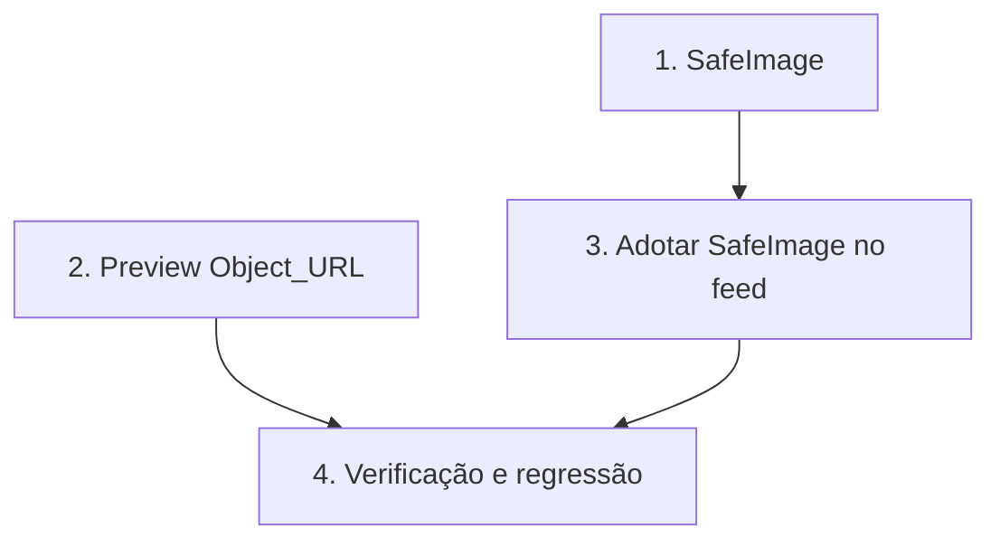

# Implementation Plan

Estabilidade da Comunidade — crash por estouro de memória em fotos

## Overview

Correção cirúrgica em três partes: componente `SafeImage` (exibição segura),
preview via `URL.createObjectURL` com revogação disciplinada, e adoção do
`SafeImage` no feed. Sem mudança de schema, sem alterar upload. Tarefas
marcadas com `*` são testes opcionais (recomendados antes de fechar o bloco).

## Tasks

- [x] 1. Componente `SafeImage` (exibição com teto de decodificação)
  - [x] 1.1 Criar `src/components/SafeImage.tsx`
    - Props: `src`, `alt`, `className`, `aspectClassName`, `fallbackSrc`, `onClick`
    - Renderiza `` em container de dimensão fixa
    - `onError` troca para `fallbackSrc` uma única vez (via `nextImageSrcOnError`, guarda contra loop)
    - _Requirements: 2.1, 2.2, 2.3, 2.4, 4.2_
    - _Properties: Property 3, Property 4_
  - [x]* 1.2 Testes de `SafeImage`
    - Lógica de fallback extraída para função pura `nextImageSrcOnError` (projeto não tem testing-library/jsdom); 5 testes passando incluindo Property 4
    - _Requirements: 2.1, 4.2_
    - _Properties: Property 4_

- [x] 2. Preview via Object_URL em `comunidade.tsx`
  - [x] 2.1 Substituir `readAsDataURL` por `URL.createObjectURL`
    - Regra encapsulada em `src/lib/object-url-preview.ts` (`createObjectUrlManager`); `setPreviewFromFile`/`clearPreview` usam o manager
    - `handleFile` usa `setPreviewFromFile`; `closeDrawer` (chamado no `onSuccess`) usa `clearPreview`; `useEffect` de cleanup no unmount
    - _Requirements: 1.1, 1.2, 1.3_
    - _Properties: Property 1, Property 2_
  - [x]* 2.2 Teste do ciclo de preview
    - `createObjectUrlManager` testado: create usado, revoke em troca/limpeza, sem dupla revogação; 5 testes passando
    - _Requirements: 1.1, 1.2, 1.3_
    - _Properties: Property 1, Property 2_

- [x] 3. Adotar `SafeImage` nas Post_Images do feed
  - [x] 3.1 Trocar as duas `` por `SafeImage`
    - Post de atividade (com `onClick` de navegação + `ariaLabel`) e post manual
    - `aspect-[4/5]` (default do SafeImage) e fallback `community1` via `fallbackSrc` preservados
    - _Requirements: 2.1, 4.1, 4.2, 4.3_
    - _Properties: Property 3, Property 4_

- [x] 4. Verificação e regressão
  - [x] 4.1 Type-check e testes
    - `npx tsc --noEmit`: código do bloco limpo (só restam os 6 erros pré-existentes de `use-local-push.ts`). `npm run test`: 10 testes novos passando
    - _Requirements: todos_
  - [x] 4.2 Regressão da comunidade
    - Nenhuma mutação tocada (publicar/curtir/comentar/seguir/excluir/compartilhar intactas); upload/pipeline inalterados; fallback `community1` e post de atividade preservados via props do SafeImage
    - _Requirements: 3.1, 3.2, 3.3, 4.1, 4.2, 4.3, 4.4_
    - _Properties: Property 5_
  - [x] 4.3 Atualizar o roadmap
    - Bloco B marcado ✅ em `docs/ROADMAP-FINALIZACAO-APP.md`
    - _Requirements: —_

## Task Dependency Graph



```json
{
  "waves": [
    { "wave": 1, "tasks": ["1", "2"] },
    { "wave": 2, "tasks": ["3"] },
    { "wave": 3, "tasks": ["4"] }
  ]
}
```

## Notes

- **Sem mudança de schema nem de upload** — correção cirúrgica na
  exibição/preview, os dois pontos que causam o crash.
- **`SafeImage` reutilizável** — pode ser adotado em outras telas de mídia
  (perfil, destinos) em blocos futuros, sem retrabalho.
- **Ao concluir**, atualizar `docs/ROADMAP-FINALIZACAO-APP.md` (regra do
  steering `roadmap-outvitar.md`).
