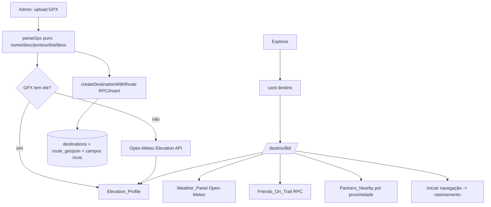

# Design Document

Explorar repaginado + Destinos ricos com rota (GPX) (Bloco 3 pré-lojas)

## Overview

Três frentes coesas, faseáveis e de baixo risco sobre a base existente:

1. **GPX_Import + campos ricos no destino** (fundação): parser puro de GPX
   (validado: Cachoeira Alta = 36 pts, 0,771 km), novos campos nullable em
   `destinations` (route_geojson, elevation_profile, is_paid/price_text,
   opening_hours, pet_friendly, category, start_lat/lng).
2. **Destination_Screen** (`/destino/$destinationId`): ficha rica com hero,
   badges, Weather_Panel (Open-Meteo), Elevation_Profile, mapa com o traçado,
   Friends_On_Trail, Partners_Nearby, favoritar, "Iniciar navegação".
3. **Explore repaginado**: busca + painel de filtros + botão "Criar rota",
   cards modernizados. Reusa mapa de amigos/panorama/parceiros existentes.
4. **Admin_Destination_Form**: upload de GPX + foto + dados → cria destino
   (approved para admin), com o fluxo de aprovação já existente para usuários.

A tabela `destinations` já tem name/description/lat/lng/region/state/difficulty/
type/trail_type/main_image_url/status/geog + trigger `sync_destination_geog`. Só
adicionamos colunas nullable. Nada do rastreamento é alterado.

## Steering Alignment

- Migrations idempotentes (ADD COLUMN IF NOT EXISTS), 2× + reload, refletidas em
  `migrations-pendentes.sql`.
- Leitura pública de destino segue restrita a `approved`/autor/admin (RLS atual).
- Mapa via Leaflet + tiles (Mapbox com token, OSM sem) — sem WebGL. Reusa
  `MapTileLayer`/`map-layers`.
- Rotas flat no routeTree manual (`/destino/$destinationId`), verificadas
  pós-build.
- Clima via Open-Meteo (sem chave, sem custo). i18n pt-BR/en com `defaultValue`.
- Parser de GPX é função PURA em `src/lib/` (testável, sem Capacitor).

## Architecture



## Components and Interfaces

### Fase A — Fundação (GPX + schema + Cachoeira Alta)

**`src/lib/gpx-import.ts`** (puro, testável):
```ts
export type GpxRoute = {
  name: string | null;
  description: string | null;
  points: { lat: number; lng: number; ele: number | null }[];
  distanceMeters: number;
  start: { lat: number; lng: number } | null;
  bounds: { minLat; maxLat; minLng; maxLng } | null;
  geojson: GeoJSON.LineString | null;   // >=2 pontos, senão null
};
export function parseGpx(xml: string): GpxRoute;      // valida >=2 pts
```
KML/KMZ ficam como extensão posterior (o parser aceita GPX no MVP; a assinatura
permite estender). Validação: rejeita <2 pontos ou coords inválidas.

**Migration** `<ts>_destinations-rich-route.sql` (idempotente):
```sql
ALTER TABLE destinations
  ADD COLUMN IF NOT EXISTS route_geojson jsonb,
  ADD COLUMN IF NOT EXISTS route_geog geography(LineString,4326),
  ADD COLUMN IF NOT EXISTS elevation_profile jsonb,   -- [{d_m, ele_m}] ou null
  ADD COLUMN IF NOT EXISTS distance_km numeric,
  ADD COLUMN IF NOT EXISTS category text,             -- cachoeira/pico/parque/...
  ADD COLUMN IF NOT EXISTS is_paid boolean,
  ADD COLUMN IF NOT EXISTS price_text text,
  ADD COLUMN IF NOT EXISTS opening_hours text,
  ADD COLUMN IF NOT EXISTS pet_friendly boolean,
  ADD COLUMN IF NOT EXISTS start_lat numeric(10,7),
  ADD COLUMN IF NOT EXISTS start_lng numeric(10,7);
-- trigger estende sync: quando route_geojson presente, popula route_geog
-- (ST_GeomFromGeoJSON) para consultas espaciais (Friends_On_Trail/Partners).
```

**API** (`src/lib/api.ts`): estender `DestinationDetail` com os campos novos;
`createDestinationFull(payload)` (insert com route_geojson + campos; status
'approved' se admin, 'pending' se usuário).

**Seed Cachoeira Alta:** script `scripts/seed-cachoeira-alta.mjs` (idempotente
por nome) que parseia o GPX do repo, busca elevação (Open-Meteo), e insere o
destino aprovado com foto (a foto entra depois via admin/URL). Removível — mas
como é seed real de produção, fica versionado em `scripts/`.

### Fase B — Destination_Screen (`/destino/$destinationId`)

- `src/routes/destino.$destinationId.tsx` (rota flat, routeTree manual).
- Componentes reutilizados/novos:
  - **Weather_Panel**: `src/lib/weather.ts` (`fetchWeather(lat,lng)` Open-Meteo:
    `current` + `hourly` temp/precip/uv + `daily` sunrise/sunset) + card estilo
    do print (gradiente azul, horária). `src/lib/weather-alerts.ts` (puro):
    deriva "situações agravantes" (chuva forte, UV alto, vento).
  - **Elevation_Profile**: `src/components/ElevationChart.tsx` (SVG puro, sem
    lib pesada) a partir de `elevation_profile`.
  - **Route map**: Leaflet + `MapTileLayer` + Polyline do `route_geojson` (início
    verde/fim vermelho), botão camadas.
  - **Friends_On_Trail**: RPC `fetch_friends_on_destination(_destination_id)`
    (SECURITY DEFINER) — amigos com atividade concluída cujo trajeto passou perto
    do destino (ST_DWithin com `route_geog`/`geog`).
  - **Partners_Nearby**: reusa parceiros com coords, filtra por proximidade
    (haversine) no cliente.
  - Favoritar: reusa `saved_destinations`.
  - "Iniciar navegação": navega para `/atividade/rastrear` com o destino
    associado (o rastreamento já aceita `destinationId`).

### Fase C — Explore repaginado

- `src/components/explore/ExploreFilters.tsx` (bottom sheet): região/cidade,
  dificuldade, categoria (chips), pet-friendly, pago/grátis, offline, curtidas,
  usar localização. Estado de filtro puro em `src/lib/explore-filters.ts`
  (função `applyDestinationFilters` testável).
- Botão "Criar rota" destacado → fluxo de segmento/desenho (reuso).
- Cards modernizados (badge dificuldade/categoria, distância até o início quando
  há localização — reusa `navigation-to`).
- Mantém `LiveFriendsList`, `ExplorePanorama`, `PartnerList`.

### Fase D — Admin_Destination_Form

- Tela admin (reusa hub `/admin`): form com upload GPX (usa `parseGpx`), preview
  do traçado no mapa, campos (nome/desc/dificuldade/categoria/pago/valor/
  horários/pet), upload de foto (bucket existente), salvar (approved).
- Aprovação de destinos pending de usuários (reuso do fluxo/notify existente).

## Data Models

`destinations` (adições nullable): `route_geojson jsonb`, `route_geog
geography(LineString)`, `elevation_profile jsonb`, `distance_km numeric`,
`category text`, `is_paid boolean`, `price_text text`, `opening_hours text`,
`pet_friendly boolean`, `start_lat/start_lng numeric`.

`elevation_profile`: `[{ d: number(m acumulado), e: number(m) }]` ou null.

## Error Handling

- `parseGpx` inválido (<2 pts) → lança com mensagem clara; o form mostra erro.
- Open-Meteo indisponível → Weather_Panel/elevação mostram estado neutro, sem
  bloquear a tela.
- Destino sem rota → mapa cai no ponto (geog) e "Iniciar navegação" segue
  disponível sem traçado.
- Seções sem dados (amigos/parceiros) → estado vazio discreto.

## Correctness Properties

### Property 1: Distância do GPX correta e não-negativa
Para um GPX válido, `parseGpx().distanceMeters` é a soma haversine dos segmentos
(>= 0) e o número de pontos é preservado na ordem.
**Validates: Requirements 1.1**

### Property 2: GeoJSON válido ou null
`parseGpx().geojson` é um LineString com >= 2 coordenadas `[lng,lat]` na ordem
dos pontos, ou `null` quando há menos de 2 pontos.
**Validates: Requirements 1.4, 6.2**

### Property 3: Filtros são subconjunto
`applyDestinationFilters(list, f)` retorna sempre um subconjunto de `list`
(nunca inventa itens) e é idempotente para o mesmo filtro.
**Validates: Requirements 3.1**

### Property 4: Alertas determinísticos
`deriveWeatherAlerts(weather)` é determinístico e só sinaliza quando os limiares
(chuva/UV/vento) são excedidos.
**Validates: Requirements 2.2**

### Property 5: Retrocompat de destinos
Destinos sem os campos novos (null) continuam listáveis e abríveis sem erro.
**Validates: Requirements 5.2**

## Testing Strategy

- **Unit (vitest, puro):** `gpx-import.test.ts` (Properties 1, 2 — inclui o GPX
  real da Cachoeira Alta como fixture: 36 pts / ~0,771 km), `explore-filters.test.ts`
  (Property 3), `weather-alerts.test.ts` (Property 4).
- **Seed:** `seed-cachoeira-alta.mjs` idempotente; validar no banco que o destino
  aparece aprovado com rota.
- **Migration:** aplicar 2× + reload; testar `route_geog` populado.
- **Verificação:** `get_diagnostics` + `build:native`; rotas flat verificadas.
- Sem testes que importem hooks/Capacitor.

## Faseamento (entrega incremental)

- **Fase A** entrega a Cachoeira Alta no ar (import GPX + schema + seed + card
  no Explorar levando à tela de detalhe mínima). É o pedido imediato do usuário.
- **Fases B/C/D** enriquecem (clima, elevação, amigos/parceiros, filtros, admin).
  Cada fase é commitável e testável isoladamente.
