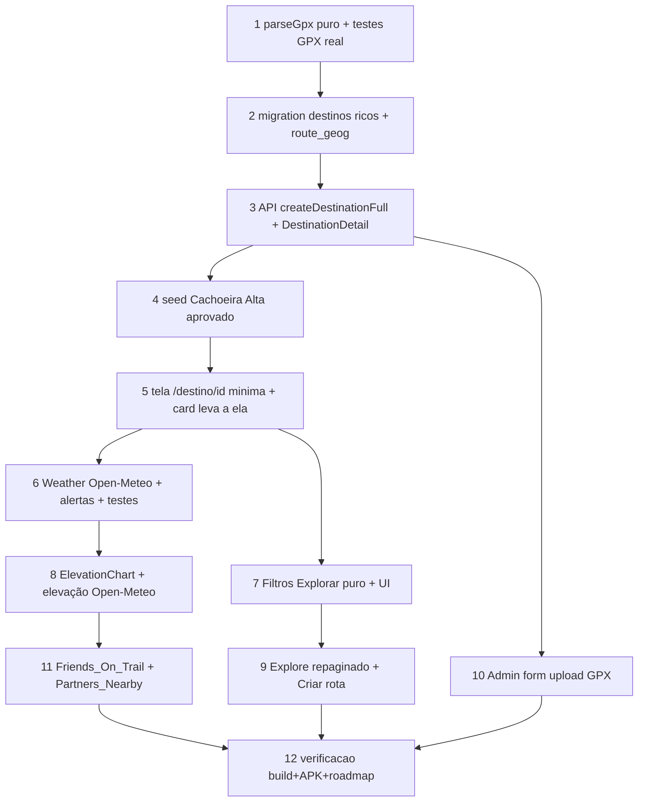

# Implementation Plan

Explorar repaginado + Destinos ricos com rota (GPX) (Bloco 3 pré-lojas)

## Overview

Entrega faseada. A Fase A (tarefas 1–5) já coloca a Cachoeira Alta no ar (import
GPX + schema + seed + tela de destino mínima). Fases B/C/D (tarefas 6–12)
enriquecem (clima, elevação, amigos/parceiros, filtros, admin). Cada fase é
commitável e testável.

## Task Dependency Graph



```json
{
  "waves": [
    { "wave": 1, "tasks": ["1", "2"] },
    { "wave": 2, "tasks": ["3"] },
    { "wave": 3, "tasks": ["4", "5"] },
    { "wave": 4, "tasks": ["6", "7"] },
    { "wave": 5, "tasks": ["8", "9", "10"] },
    { "wave": 6, "tasks": ["11"] },
    { "wave": 7, "tasks": ["12"] }
  ]
}
```

## Tasks

- [x] 1. (Fase A) Parser GPX puro + testes
  - `src/lib/gpx-import.ts`: `parseGpx(xml)` → nome/desc/pontos(ele?)/distância
    (haversine)/start/bounds/geojson (LineString ou null se <2 pts); valida coords.
  - `src/lib/gpx-import.test.ts`: fixture com o GPX real da Cachoeira Alta
    (36 pts, ~0,771 km) + Properties 1 e 2 (fast-check).
  - _Requisitos: 1.1, 1.4, 6.2; Properties 1, 2_

- [x] 2. (Fase A) Migration: destinos ricos + route_geog
  - `<ts>_destinations-rich-route.sql` (idempotente): colunas nullable
    (route_geojson, route_geog, elevation_profile, distance_km, category,
    is_paid, price_text, opening_hours, pet_friendly, start_lat/lng) + trigger
    que popula `route_geog` de `route_geojson`. 2× + reload; refletir consolidado.
  - _Requisitos: 5.1, 5.2_

- [x] 3. (Fase A) API: createDestinationFull + DestinationDetail estendido
  - `DestinationDetail` ganha os campos novos; `createDestinationFull(payload)`
    (insert com route_geojson + campos; status por papel).
  - _Requisitos: 1.4, 4.1_

- [x] 4. (Fase A) Seed Cachoeira Alta (aprovado)
  - `scripts/seed-cachoeira-alta.mjs` idempotente (por nome): parseia o GPX do
    repo, busca elevação (Open-Meteo), insere destino approved com dados reais
    (R$ 10, fins de semana/feriados 8h–17h, categoria cachoeira, dificuldade
    fácil, ES/São Vicente). Rodar e validar no banco.
  - _Requisitos: 5.4_

- [x] 5. (Fase A) Tela /destino/$id mínima + card do Explorar leva a ela
  - `src/routes/destino.$destinationId.tsx` (routeTree manual): hero, nome,
    badges, descrição, mapa com traçado, favoritar, "Iniciar navegação".
  - Card de destino no Explorar passa a navegar para `/destino/$id`.
  - _Requisitos: 2.1, 2.4, 2.6_

- [x] 6. (Fase B) Weather_Panel (Open-Meteo) + alertas
  - `src/lib/weather.ts` (fetch) + `src/lib/weather-alerts.ts` (puro) + testes
    (Property 4). Card de clima na tela de destino (estilo do print).
  - _Requisitos: 2.2; Property 4_

- [ ] 7. (Fase C) Filtros do Explorar (puro + UI)
  - `src/lib/explore-filters.ts` (`applyDestinationFilters`, puro) + testes
    (Property 3); `ExploreFilters.tsx` (bottom sheet) com região/dificuldade/
    categoria/pet/pago/offline/curtidas/localização.
  - _Requisitos: 3.1; Property 3_

- [x] 8. (Fase B) Elevation_Profile
  - `ElevationChart.tsx` (SVG) + preencher `elevation_profile` no seed/import via
    Open-Meteo Elevation quando o GPX não traz `<ele>`. Métricas (min/max/ganho).
  - _Requisitos: 1.3, 2.3_

- [ ] 9. (Fase C) Explore repaginado + Criar rota
  - Busca + botão filtros + botão "Criar rota"; cards modernizados (distância até
    início); mantém amigos/panorama/parceiros. Identidade preservada.
  - _Requisitos: 3.2, 3.3, 3.4, 3.5_

- [ ] 10. (Fase D) Admin_Destination_Form (upload GPX)
  - Form admin: upload GPX (parseGpx) + preview + campos + foto → cria destino
    approved; aprovação de pending de usuários (reuso notify).
  - _Requisitos: 1.1, 1.2, 1.5, 4.2_

- [x] 11. (Fase B) Friends_On_Trail + Partners_Nearby
  - RPC `fetch_friends_on_destination` (SECURITY DEFINER, ST_DWithin) + seção na
    tela; parceiros próximos por proximidade (cliente). Estados vazios.
  - _Requisitos: 2.5, 2.7_

- [ ] 12. Verificação e entrega
  - Diagnostics + testes puros; `build:native` + `cap sync` + APK; rotas flat
    verificadas; commit/push main; roadmap atualizado.
  - _Requisitos: 6.3_

## Notes

- Traçado só de GPX/segmento/desenho — NUNCA de imagem (Req 1.6).
- Migrations idempotentes 2× + reload; refletir em `migrations-pendentes.sql`.
- routeTree.gen.ts manual para `/destino/$destinationId` (rota dinâmica FLAT) —
  verificar no grep após o build que sobreviveu.
- Open-Meteo: sem chave, sem custo (weather + elevation).
- Testes puros em `src/lib/` (sem hooks/Capacitor).
- Fase A (tarefas 1–5) é a prioridade imediata (Cachoeira Alta no ar).
