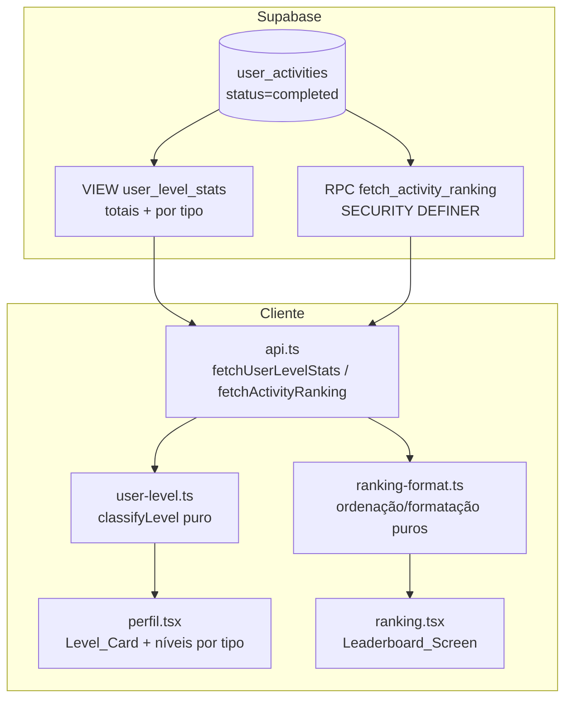

# Design Document

Gamificação: Níveis e Rankings

## Overview

Este design entrega dois recursos sobre as atividades reais:

- **Nível do usuário** (Iniciante/Intermediário/Avançado): a regra de faixas é
  uma **função pura testável** (`src/lib/user-level.ts`), alimentada por
  estatísticas agregadas que já existem em parte (`user_achievement_stats`) e
  são estendidas por uma nova VIEW `user_level_stats` (totais e por tipo). O
  perfil calcula o nível no cliente a partir dessas estatísticas — sem depender
  de manter `profiles.level` sincronizado por trigger.
- **Rankings** (distância / tempo / altimetria, escopo global ou seguidos,
  período semana/mês/ano/sempre, e por destino): como a RLS de
  `user_activities` não permite leitura entre usuários, os rankings são
  servidos por uma **RPC `SECURITY DEFINER`** (`fetch_activity_ranking`),
  espelhando o padrão de `grant_pending_achievements`. A RPC retorna só o
  necessário (nome, username, avatar, valor da métrica), limitado a Top N.

Princípio de projeto: **regra de negócio pura no cliente** (faixas de nível,
formatação, seleção de ordenação) + **agregação no banco** (SQL, isolada por
`SECURITY DEFINER`). Nada de reescrever atividades; só leitura agregada.

## Alinhamento com o código existente

| Arquivo | Papel hoje | Mudança |
|---------|-----------|---------|
| `user_achievement_stats` (view) | agrega km/atividades/destinos | referência; nova view `user_level_stats` (por tipo) |
| `achievement-records.sql` (RPC `SECURITY DEFINER`) | concede conquistas | padrão para a RPC de ranking |
| `src/routes/perfil.tsx` (Level_Card) | mostra `profiles.level` cru | passa a exibir nível derivado real + níveis por tipo |
| `src/lib/activity-metrics.ts` | fórmula pura de velocidade/pace | referência de estilo para `user-level.ts`/`ranking-format.ts` |
| `src/lib/api.ts` | leitura de atividades | novas `fetchUserLevelStats`, `fetchActivityRanking` |
| `src/routes/eventos`/detalhe de destino | — | seção de Destination_Ranking |
| `src/lib/user-level.ts` (novo) | — | classificação pura de nível |
| `src/lib/ranking-format.ts` (novo) | — | formatação/ordenação pura de ranking |
| `src/routes/ranking.tsx` (novo) | — | Leaderboard_Screen |

## Architecture



## Components and Interfaces

### 1. `src/lib/user-level.ts` (novo — puro)

```ts
export type UserLevel = "iniciante" | "intermediario" | "avancado";

export interface LevelStats {
  completedActivities: number; // nº de atividades concluídas
  totalKm: number;             // distância acumulada, km
  totalElevationGain: number;  // altimetria acumulada, m
}

// Faixas combinadas (OR): o usuário sobe ao atingir QUALQUER um dos limiares
// de uma faixa superior. Iniciante é o piso.
export const LEVEL_THRESHOLDS = {
  intermediario: { activities: 10, km: 50, elevation: 1000 },
  avancado: { activities: 50, km: 300, elevation: 8000 },
} as const;

/** Classifica o nível a partir das estatísticas. Total, puro, determinístico. */
export function classifyLevel(stats: LevelStats): UserLevel;

/** Progresso 0–100 rumo ao próximo nível (100 no nível máximo). */
export function levelProgress(stats: LevelStats): number;
```

Regra de `classifyLevel`: começa em `iniciante`; se atingir QUALQUER limiar de
`intermediario`, vira `intermediario`; se atingir QUALQUER limiar de
`avancado`, vira `avancado`. Valores nulos → tratados como 0 antes de entrar
(Req 7.1). `levelProgress`: fração do melhor eixo (atividades/km/altimetria)
rumo ao próximo limiar, saturada em 100; no `avancado`, 100.

### 2. `src/lib/ranking-format.ts` (novo — puro)

```ts
export type RankingMetric = "distancia" | "tempo" | "altimetria";
export type RankingScope = "global" | "seguidos";
export type RankingPeriod = "semana" | "mes" | "ano" | "sempre";

export interface RankingRow {
  userId: string;
  fullName: string | null;
  username: string | null;
  avatarUrl: string | null;
  value: number; // metros (distancia/altimetria) ou segundos (tempo)
}

/** Ordena as linhas conforme a métrica (desc p/ distancia/altimetria, asc p/ tempo). */
export function sortRanking(rows: RankingRow[], metric: RankingMetric): RankingRow[];

/** Formata o valor da métrica para exibição (km, mm:ss/hh:mm:ss, m). */
export function formatRankingValue(value: number, metric: RankingMetric): string;

/** Início da janela do período (ISO), determinístico; `sempre` → null. */
export function periodStartIso(period: RankingPeriod, now: Date): string | null;
```

Ordenação estável; empate desempatado por `userId` para determinismo (Req 3.2).
`periodStartIso`: semana começa na segunda-feira 00:00 local; mês/ano no dia 1;
documentado para bater com o filtro SQL (o cliente passa o ISO calculado à RPC,
mantendo uma única regra — Req 5.3).

### 3. `src/lib/api.ts` — leitura

```ts
export interface UserLevelStats {
  overall: LevelStats;
  byType: Partial<Record<ActivityType, LevelStats>>;
}
export async function fetchUserLevelStats(userId?: string): Promise<UserLevelStats>;

export async function fetchActivityRanking(params: {
  metric: RankingMetric;
  scope: RankingScope;
  period: RankingPeriod;
  destinationId?: string | null;
  limit?: number; // default TOP_N
}): Promise<RankingRow[]>;
```

`fetchUserLevelStats` lê a VIEW `user_level_stats` (linhas por usuário e tipo);
`fetchActivityRanking` chama a RPC `fetch_activity_ranking` passando o ISO de
período calculado por `periodStartIso` e o escopo. O cliente aplica
`sortRanking` como salvaguarda de ordenação/desempate (a RPC já ordena, mas a
regra fica também no puro).

### 4. `src/routes/ranking.tsx` (novo — Leaderboard_Screen)

Seletores no topo: métrica (segmented), escopo (global/seguidos), período
(semana/mês/ano/sempre). Lista de `Ranking_Entry` com posição, avatar, nome,
valor formatado. A linha do usuário logado é destacada (Req 3.6). Estado vazio
claro. Reusa `SafeImage` para avatares (disciplina de memória).

### 5. `perfil.tsx` — Level_Card real + níveis por tipo

- O Level_Card passa a exibir o rótulo traduzido de `classifyLevel(overall)` e
  a barra com `levelProgress(overall)` (Req 1.5). No `avancado`, 100% sem
  sugerir próximo nível.
- Abaixo, chips compactos com o nível por tipo (`caminhada`/`pedalada`/
  `trilha`), reutilizando `classifyLevel` sobre `byType[tipo]` (Req 2). Um
  atalho leva à Leaderboard_Screen.

### 6. Detalhe de destino — Destination_Ranking

Seção que chama `fetchActivityRanking({ destinationId, ... })`. Estado vazio
quando o destino não tem atividades (Req 6.4).

## Data Models

**Migração idempotente** (`supabase/migrations/AAAAMMDD..._gamificacao-niveis-rank.sql`):

```sql
-- VIEW de estatísticas por usuário e por tipo (para nível geral e por tipo).
CREATE OR REPLACE VIEW public.user_level_stats AS
SELECT
  ua.user_id,
  ua.activity_type,
  COUNT(*) FILTER (WHERE ua.status = 'completed')            AS completed_activities,
  COALESCE(SUM(ua.distance_meters) FILTER (WHERE ua.status='completed'),0)/1000 AS total_km,
  COALESCE(SUM(ua.elevation_gain) FILTER (WHERE ua.status='completed'),0)       AS total_elevation
FROM public.user_activities ua
GROUP BY ua.user_id, ua.activity_type;
-- (linha por (user_id, activity_type); o cliente soma para o total geral.)

-- RPC de ranking (SECURITY DEFINER — contorna a RLS de user_activities com
-- segurança, retornando só campos públicos). Ordena no banco por métrica.
CREATE OR REPLACE FUNCTION public.fetch_activity_ranking(
  _metric TEXT,               -- 'distancia' | 'tempo' | 'altimetria'
  _scope  TEXT,               -- 'global' | 'seguidos'
  _since  TIMESTAMPTZ,        -- início do período (NULL = sempre)
  _destination_id UUID DEFAULT NULL,
  _limit INTEGER DEFAULT 50
) RETURNS TABLE (
  user_id UUID, full_name TEXT, username TEXT, avatar_url TEXT, value NUMERIC
)
LANGUAGE sql SECURITY DEFINER SET search_path = public AS $$
  ... -- agrega user_activities status='completed', aplica filtros de período/
      -- destino/escopo (escopo 'seguidos' via user_friends do auth.uid()),
      -- soma por usuário (ou min duração p/ tempo), junta profiles, ORDER BY
      -- métrica, LIMIT _limit.
$$;
```

- VIEW só de leitura, sem dado sensível. RPC `SECURITY DEFINER` restringe a
  saída a campos públicos (Req 3.3). `_scope = 'seguidos'` usa `auth.uid()` +
  `user_friends` (tabela de seguir já existente) para restringir os usuários.
- `TOP_N` default 50 (Req 7.2). `tempo` usa MIN(duration) por usuário; as demais
  usam SUM.
- Nada de `profiles.level` é alterado (Req 8.3).

## Error Handling

- Estatística/ranking com colunas nulas → `COALESCE` para 0 no SQL e no puro
  (Req 7.1). Nunca `NaN`/`Infinity`.
- Escopo `seguidos` sem ninguém seguido → RPC ainda inclui o próprio usuário
  (Req 4.3).
- Destino sem atividades → RPC retorna vazio; UI mostra estado vazio (Req 6.4).
- Falha de rede na RPC → a tela mostra erro reexecutável (padrão react-query),
  sem quebrar o perfil.

## Testing Strategy

Vitest + fast-check nas funções puras (padrão do projeto, sem DOM):
- `user-level.test.ts`: `classifyLevel` (piso iniciante, faixas por OR,
  monotonicidade — mais atividade nunca rebaixa nível); `levelProgress`
  (0–100, 100 no máximo, nunca NaN).
- `ranking-format.test.ts`: `sortRanking` (ordem correta por métrica, desempate
  estável), `formatRankingValue` (km/tempo/metros), `periodStartIso` (limites
  de semana/mês/ano; `sempre` → null).
- Regressão: perfil/atividades/conquistas intactos; `tsc --noEmit` sem novos
  erros.

## Correctness Properties

### Property 1: Nível é total e determinístico
Para qualquer `LevelStats` (inclusive zeros/negativos tratados como 0),
`classifyLevel` retorna exatamente um de `iniciante|intermediario|avancado`,
sem lançar.
**Validates: Requirements 1.2, 1.3, 1.4, 7.1**

### Property 2: Nível é monotônico
Aumentar qualquer eixo (atividades, km ou altimetria) nunca rebaixa o
User_Level.
**Validates: Requirements 1.1, 2.1**

### Property 3: Progresso é limitado
`levelProgress` retorna sempre um número em [0, 100]; no `avancado` retorna
100.
**Validates: Requirements 1.5**

### Property 4: Ordenação do ranking respeita a métrica
`sortRanking` ordena decrescente para `distancia`/`altimetria` e crescente para
`tempo`, com desempate estável por `userId`.
**Validates: Requirements 3.2**

### Property 5: Janela de período é determinística
`periodStartIso` retorna um instante ≤ `now` para `semana|mes|ano` e `null`
para `sempre`; a mesma entrada sempre produz a mesma saída.
**Validates: Requirements 5.2, 5.3**

### Property 6: Formatação nunca produz valor inválido
`formatRankingValue` retorna string não-vazia para qualquer `value` finito ≥ 0
em qualquer métrica, nunca `NaN`/`Infinity`.
**Validates: Requirements 3.5, 7.1**

## Decisões e trade-offs

- **Nível derivado no cliente, não persistido**: evita um trigger a mais e o
  risco de dessincronia de `profiles.level` (Req 8.3). A regra de faixas fica
  numa função pura, testável e fácil de ajustar.
- **Faixas combinadas por OR**: reconhece perfis diferentes (quem faz muitas
  atividades curtas e quem faz poucas mas longas) — mais justo que um eixo só.
- **Ranking via RPC `SECURITY DEFINER`**: única forma segura de ranquear entre
  usuários sem afrouxar a RLS de `user_activities`; retorna só campos públicos.
- **Ordenação no banco + salvaguarda pura no cliente**: o banco é a fonte
  eficiente (LIMIT), e `sortRanking` garante determinismo/desempate testável.
- **`tempo` = melhor (MIN) por usuário**: menor tempo é uma marca pessoal, não
  soma; coerente com "menor tempo" pedido (item 12).
- **Atividades sem destino** entram nos rankings gerais mas não nos por destino
  (Req 6.3) — decisão explícita.
