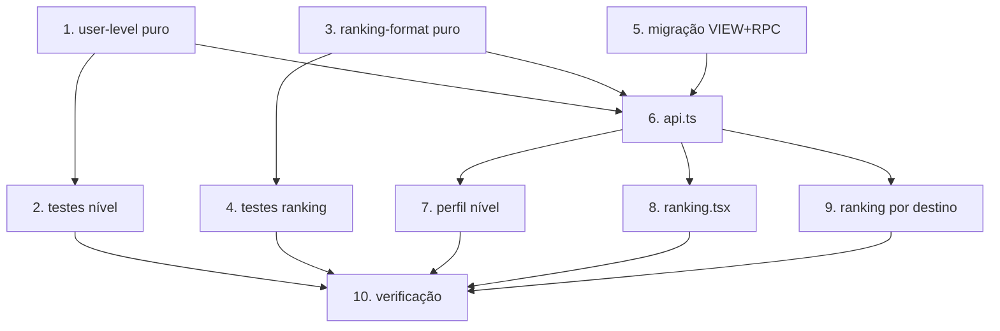

# Implementation Plan

## Overview

Gamificação: níveis (item 10) e rankings (item 12). Regra de negócio pura no
cliente (faixas de nível, ordenação, formatação, janela de período) + agregação
no banco (VIEW `user_level_stats` + RPC `SECURITY DEFINER`
`fetch_activity_ranking`). Sem reescrever atividades; só leitura agregada.
Lógica pura testável com Vitest + fast-check (sem jsdom).

## Tasks

- [x] 1. Módulo puro de nível do usuário
  - Criar `src/lib/user-level.ts`: `UserLevel`, `LevelStats`,
    `LEVEL_THRESHOLDS` (faixas combinadas por OR), `classifyLevel` (piso
    iniciante, total/determinístico, nulos→0) e `levelProgress` (0–100, 100 no
    máximo).
  - _Requirements: 1.1, 1.2, 1.3, 1.4, 1.5, 2.1, 2.3, 7.1_

- [x] 2. Testes do módulo de nível
  - Criar `src/lib/user-level.test.ts` (fast-check): totalidade,
    monotonicidade (mais atividade nunca rebaixa), progresso em [0,100] e 100
    no nível máximo, nunca NaN.
  - _Requirements: 1.2, 1.3, 1.4, 1.5, 2.1_

- [x] 3. Módulo puro de formatação/ordenação de ranking
  - Criar `src/lib/ranking-format.ts`: tipos `RankingMetric/Scope/Period`,
    `RankingRow`, `sortRanking` (desc distancia/altimetria, asc tempo,
    desempate estável por userId), `formatRankingValue` (km/tempo/metros),
    `periodStartIso` (semana=segunda 00:00 local, mês/ano dia 1; `sempre`→null).
  - _Requirements: 3.2, 3.5, 5.2, 5.3, 7.1_

- [x] 4. Testes do módulo de ranking
  - Criar `src/lib/ranking-format.test.ts` (fast-check): ordenação por métrica
    e desempate, formatação sempre string não-vazia p/ valor finito, limites de
    período determinísticos e `sempre`→null.
  - _Requirements: 3.2, 3.5, 5.2, 5.3_

- [x] 5. Migração Supabase (VIEW + RPC)
  - Criar `supabase/migrations/AAAAMMDD..._gamificacao-niveis-rank.sql`
    idempotente: `CREATE OR REPLACE VIEW user_level_stats` (por user_id +
    activity_type, só status='completed', COALESCE p/ 0); `CREATE OR REPLACE
    FUNCTION fetch_activity_ranking(...)` `SECURITY DEFINER` — filtra
    período/destino/escopo (seguidos via user_friends requester=auth.uid()
    status in following/accepted + self), agrega por usuário (SUM ou MIN p/
    tempo), junta profiles, ORDER BY métrica, LIMIT.
  - _Requirements: 3.3, 3.4, 4.2, 4.3, 6.2, 6.3, 7.2, 7.3_

- [x] 6. Camada de dados (api.ts)
  - Adicionar `UserLevelStats`, `fetchUserLevelStats(userId?)` (lê
    `user_level_stats`, soma total geral + mapa por tipo) e
    `fetchActivityRanking(params)` (chama a RPC com o ISO de `periodStartIso`,
    aplica `sortRanking` como salvaguarda). Nulos→0.
  - _Requirements: 3.1, 3.3, 4.1, 5.1, 6.1, 7.1_

- [x] 7. Level_Card real e níveis por tipo no perfil
  - `src/routes/perfil.tsx`: Level_Card usa `classifyLevel`/`levelProgress`
    sobre `overall`; chips de nível por tipo (`caminhada/pedalada/trilha`) via
    `byType`; atalho para a Leaderboard_Screen. i18n dos rótulos de nível.
  - _Requirements: 1.5, 2.1, 2.2, 8.1, 8.3_

- [x] 8. Leaderboard_Screen (ranking.tsx)
  - Criar `src/routes/ranking.tsx`: seletores métrica/escopo/período; lista de
    Ranking_Entry (posição, avatar via SafeImage, nome, valor formatado);
    destaque da linha do usuário logado; estado vazio; entrada no menu/atalho.
    i18n do bloco ranking.
  - _Requirements: 3.1, 3.5, 3.6, 4.1, 5.1_

- [x] 9. Ranking por destino
  - Adicionar seção de Destination_Ranking no detalhe do destino, chamando
    `fetchActivityRanking({ destinationId, ... })`; estado vazio claro.
  - _Requirements: 6.1, 6.2, 6.4_

- [x] 10. Verificação final e regressão
  - Rodar testes novos + `npx tsc --noEmit` (só os 6 erros pré-existentes de
    use-local-push.ts). Confirmar perfil/atividades/conquistas sem regressão.
  - _Requirements: 7.4, 8.1, 8.2_

## Task Dependency Graph



```json
{
  "waves": [
    { "wave": 1, "tasks": ["1", "3", "5"] },
    { "wave": 2, "tasks": ["2", "4", "6"] },
    { "wave": 3, "tasks": ["7", "8", "9"] },
    { "wave": 4, "tasks": ["10"] }
  ]
}
```

## Notes

- Faixas combinadas (OR): intermediário 10 ativ. / 50 km / 1000 m; avançado
  50 ativ. / 300 km / 8000 m. Ajustáveis (constantes em `user-level.ts`).
- `tempo` = MIN(duração) por usuário (marca pessoal); demais métricas = SUM.
- Escopo `seguidos` usa `user_friends` (requester_id = auth.uid(), status in
  'following'/'accepted') + o próprio usuário.
- Nível derivado no cliente; NÃO alterar `profiles.level` (evita trigger extra).
- TOP_N default 50. Ranking via RPC SECURITY DEFINER (RLS de user_activities
  bloqueia leitura entre usuários) — retorna só campos públicos.
- Rodar testes com output em arquivo (Vite server pendura o terminal):
  `npx vitest run <arquivo> --reporter=basic > out.txt 2>&1`.
