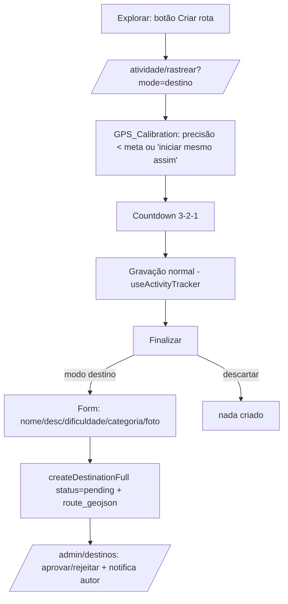

# Design Document

Gravar rota pelo Explorar → destino para aprovação

## Overview

Estende o fluxo de gravação existente com (1) calibração de GPS + contagem
regressiva antes de iniciar, e (2) um "modo destino": ao finalizar uma gravação
iniciada pelo botão "Criar rota" do Explorar, o usuário preenche nome/descrição/
dificuldade/foto e a rota vira um `destinations` com `status = 'pending'`, indo
para a moderação admin já existente. O card "Sugerir" é substituído por esse
caminho.

Reuso máximo: `useActivityTracker` (não reescrever), `createDestinationFull`
(já existe), moderação `/admin/destinos` + `notify_destination_approved`,
preview de traçado `DestinationRouteMap`.

## Steering Alignment

- Não reescrever `use-activity-tracker.ts`; estender via estado de UI.
- Sem migration nova prevista (usa `destinations` + `createDestinationFull` do
  Bloco 3). Se algo faltar, migration idempotente 2× + reload.
- i18n pt-BR/en; identidade verde-floresta + acento laranja.
- Rotas: reusa `/atividade/rastrear` com um parâmetro de modo (search param
  `mode=destino`), sem rota nova (evita mexer no routeTree).

## Architecture

## Components and Interfaces

### 1. Recording_Screen — calibração + contagem (Requisito 1)

- Novo estado local: `preStart: "idle" | "calibrating" | "countdown"`.
- Ao acionar iniciar: entra em `calibrating`, mostrando `tracker.smoothedSpeedMps`
  não — na verdade a **acurácia**. Como o tracker hoje expõe `gpsSignalState`
  ("aquisitando"/"ruim"/"ok"), usamos isso + um alvo textual. Um botão
  "iniciar mesmo assim" pula direto para `countdown`.
- `countdown`: 3→2→1 (setInterval de 1s), então chama `proceedStart()`.
- Não altera `useActivityTracker`; é um wrapper de UI antes do `start()`.

### 2. Modo destino (Requisitos 2, 3)

- O botão "Criar rota" do Explorar navega para
  `/atividade/rastrear` com `search: { mode: "destino" }` (validateSearch).
- `Recording_Screen` lê o search param; quando `mode === "destino"`:
  - Ao finalizar (trajeto válido), abre um **sheet de destino** (reusa Sheet)
    com campos: nome, descrição, dificuldade (chips), categoria (chips), foto
    (upload opcional via `uploadTrailImage`).
  - Confirmar → `createDestinationFull({ ..., status: 'pending', routeGeojson,
    distanceKm, startLat/Lng })` a partir de `tracker.finalize()`.
  - Toast: "Enviado para aprovação". Não navega para a atividade concluída
    (é um destino, não uma atividade do feed) — decisão: NÃO salvar atividade
    normal nesse modo (evita duplicar no feed); apenas cria o destino pendente.
  - Descartar → nada é criado (`tracker.discard()`).

### 3. Substituir "Sugerir" (Requisito 3)

- No Explorar, o card "Conhece um destino incrível? Sugerir" passa a chamar o
  fluxo de gravar rota (ou é removido, deixando o botão "Criar rota" como único
  caminho). Design: manter um texto curto "Grave a trilha indo até lá" apontando
  para "Criar rota".

### 4. Admin (Requisito 4)

- Já funciona: destinos `pending` aparecem em `/admin/destinos`. Acrescentar, se
  necessário, o preview do traçado no card de moderação (reuso
  `DestinationRouteMap`) — melhoria opcional.

## Data Models

Sem tabela nova. Usa `destinations` (Bloco 3) com `status='pending'`,
`route_geojson`, `distance_km`, `start_lat/lng`, `created_by`.

`/atividade/rastrear` ganha search param opcional `mode?: "destino"`.

## Error Handling

- Trajeto < 2 pontos ao finalizar em modo destino → erro claro, não cria destino.
- Falha no upload da foto → cria destino sem foto (não bloqueia).
- Falha no `createDestinationFull` → toast de erro; a rota gravada não se perde
  (permanece no tracker até o usuário descartar).
- Sem acurácia de GPS → calibração permite iniciar mesmo assim.

## Correctness Properties

### Property 1: Modo destino não cria atividade no feed
Uma gravação em `mode=destino` finalizada com sucesso cria exatamente 1 destino
`pending` e 0 posts/atividades no feed.
**Validates: Requirements 2.3, 2.6**

### Property 2: Descartar não cria nada
Descartar uma gravação (em qualquer modo) não cria destino nem atividade.
**Validates: Requirements 2.5**

### Property 3: Destino pendente exige nome + trajeto
`createDestinationFull` a partir de gravação só é chamado com nome não vazio e
trajeto >= 2 pontos.
**Validates: Requirements 4.1**

### Property 4: Só aprovados no Explorar
Destino criado por gravação nasce `pending` e não aparece no Explorar até
aprovação (RLS atual).
**Validates: Requirements 4.3**

## Testing Strategy

- **Unit (puro):** função que monta o payload de destino a partir do resultado
  do `finalize()` (distância/start/geojson) — testável sem UI.
- **Verificação:** `get_diagnostics` + `build:native`; testar no app o fluxo
  calibração→contagem→gravar→enviar; conferir destino pendente em `/admin/destinos`.
- Sem testes que importem o hook (Capacitor).
