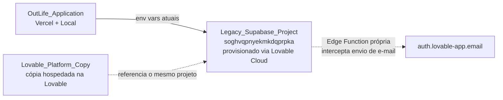
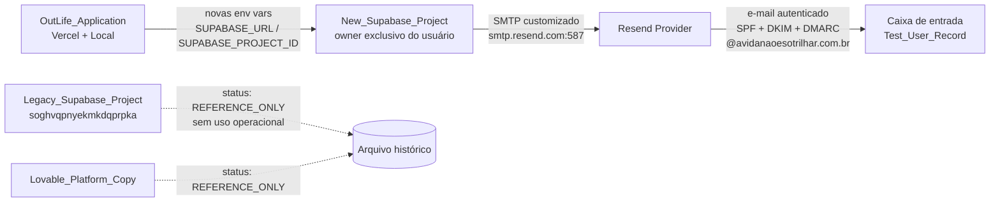
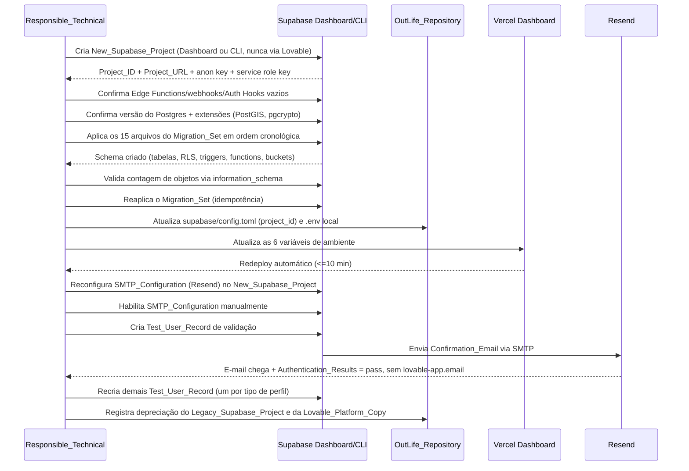

# Design Document

## Overview

Esta feature é primariamente uma tarefa de **infraestrutura/migração de dados**, não de desenvolvimento de funcionalidade de produto. A maior parte do trabalho ocorre fora do repositório (Supabase Dashboard, Supabase CLI, painel da Vercel), mas, diferente do spec irmão `email-transacional-dominio-proprio`, esta migração **também altera arquivos do OutLife_Repository** (`supabase/config.toml`, `.env` local) e **executa código SQL real** (o Migration_Set) contra um banco de dados novo. Por isso este design inclui, além dos componentes de infraestrutura, uma seção de Data Models descrevendo o schema resultante e um plano de execução do Migration_Set com estratégia de idempotência e rollback.

O trabalho cobre, em ordem:

1. Provisionar o New_Supabase_Project do zero, fora de qualquer fluxo da Lovable, com Owner exclusivo do usuário.
2. Aplicar o Migration_Set (15 arquivos SQL do OutLife_Repository) no New_Supabase_Project, recriando tabelas, enums, triggers, functions, RPCs `SECURITY DEFINER`, RLS policies e buckets de storage.
3. Reconectar a OutLife_Application ao New_Supabase_Project, atualizando o Vercel_Environment, o Local_Environment e `supabase/config.toml`.
4. Reconfigurar o SMTP_Configuration (Resend) já validado no spec `email-transacional-dominio-proprio`, agora apontando para o New_Supabase_Project.
5. Validar a entrega do Confirmation_Email a partir do New_Supabase_Project, confirmando a ausência da interceptação da Lovable_Cloud (`lovable-app.email`).
6. Recriar manualmente os Test_User_Record necessários para os testes funcionais.
7. Depreciar formalmente o Legacy_Supabase_Project (`soghvqpnyekmkdqprpka`) e a Lovable_Platform_Copy, sem excluí-los imediatamente.
8. Respeitar o sequenciamento/gating com os specs `email-transacional-dominio-proprio` (Requirement 4 permanece bloqueado até este spec concluir Requirements 1-5) e `outlife-production-plan` (nenhuma tarefa de liberação de produção avança com Requirements 1-7 deste spec incompletos).

O resultado esperado é um projeto Supabase novo, de propriedade exclusiva do usuário, com o mesmo schema funcional do projeto legado, sem nenhum artefato herdado da Lovable_Cloud, servindo como único backend da OutLife_Application em desenvolvimento e produção.

## Architecture

### Estado atual (antes da migração)

### Estado final (depois da migração)

### Fluxo de execução da migração (sequência)

## Components and Interfaces

### New_Supabase_Project
- **O quê**: projeto Supabase criado do zero, diretamente pelo Supabase Dashboard (app.supabase.com) ou pela Supabase CLI (`supabase projects create`), nunca por qualquer fluxo, botão ou integração da plataforma Lovable.
- **Requisitos de criação**: conta/organização Supabase cujo único Owner é o usuário, sem membros, método de cobrança ou vínculo de organização com a Lovable_Cloud.
- **Verificação pós-criação**: Authentication → Edge Functions, Database → Webhooks e Authentication → Auth Hooks devem estar vazios; Database → Extensions deve conter PostGIS habilitada; Settings → Infrastructure deve indicar a mesma versão major do Postgres do Legacy_Supabase_Project.
- **Saída**: `Project_ID`, `Project_URL` (`https://<project_id>.supabase.co`), `anon`/`publishable key` e `service_role key`, registrados pelo Responsible_Technical para uso nos Requirements 3 e 4.

### Migration_Set
- **O quê**: os 15 arquivos SQL existentes em `supabase/migrations/` no OutLife_Repository, listados abaixo em ordem cronológica de timestamp (nome do arquivo):

| # | Arquivo | Conteúdo principal |
|---|---|---|
| 1 | `20260521193007_88f5fd4b-*.sql` | Extensão PostGIS; enums `app_role`, `profile_status`, `destination_status`; tabelas `profiles`, `destinations`, `services`, `community_posts`; triggers `update_updated_at_column`, `handle_new_user`; RPC `find_similar_destinations`; seed de destinos e perfis de parceiros demo |
| 2 | `20260522173346_855f0749-*.sql` | Redeclaração completa do schema base do arquivo 1, acrescentando a tabela `reviews` |
| 3 | `20260522183549_3c04a894-*.sql` | Permite reviews de parceiro (`reviews.partner_id`), constraint "exatamente um alvo", índices |
| 4 | `20260522184926_2e12c581-*.sql` | Novos campos de exibição em `profiles` (gallery, tags, price, lat/lng); tabela `profile_contacts` (dados sensíveis isolados) |
| 5 | `20260522193933_e7c4a1c6-*.sql` | Enum `app_role_enum`; tabela `user_roles`; funções `has_role`/`is_admin`; trigger `protect_profile_trust_fields` |
| 6 | `20260522195415_1c06f770-*.sql` | Move `cadastur_number` para `profile_contacts`; default de `destinations.status` |
| 7 | `20260522200919_c36260b7-*.sql` | Bucket de storage `partner-gallery` + policies públicas de leitura/escrita por pasta do owner |
| 8 | `20260522211439_c83b9b10-*.sql` | Constraint `reviews_rating_range_check` (1 a 5) |
| 9 | `20260522214044_1d0f0a86-*.sql` | Tabela `user_activities`; RPC `finish_user_activity` (`SECURITY INVOKER`) |
| 10 | `20260522225211_dbec95db-*.sql` | Tabela `user_checklists` |
| 11 | `20260522230552_cde06732-*.sql` | Função `is_partner`; policies de `services` exigindo role parceiro; trigger `prevent_post_counter_tampering`; hardening de MIME types em `partner-gallery` |
| 12 | `20260525181443_68fbc422-*.sql` | Enum `location_sharing_mode`; campos de localização em `profiles`; tabela `user_friends`; função `are_friends`; view `public_user_locations` |
| 13 | `20260525185054_ec235c23-*.sql` | Campo `profiles.xp`; trigger `award_review_xp`; bucket de storage `review-photos` + policies |
| 14 | `20260525185851_65b197f2-*.sql` | Campos de métricas de parceiro (`profile_views`, `contact_clicks`, `trial_active`); RPCs `SECURITY DEFINER` `increment_partner_profile_view`/`increment_partner_contact_click` |
| 15 | `20260528113740_3d001014-*.sql` | Remove policy pública de `SELECT` em `review-photos` (bucket já é público via CDN) |

- **Extensões exigidas**: `postgis` (criada explicitamente pelos arquivos 1 e 2 via `CREATE EXTENSION IF NOT EXISTS postgis`). `pgcrypto` é usada implicitamente em todo o Migration_Set através de `gen_random_uuid()`, mas nenhum arquivo do Migration_Set contém `CREATE EXTENSION pgcrypto` — o Responsible_Technical deve confirmar, antes de aplicar o Migration_Set, que `pgcrypto` (ou o suporte nativo a `gen_random_uuid()` do Postgres 13+) já está disponível no New_Supabase_Project por padrão, conforme Requirement 1.5/1.6.
- **Risco identificado nos arquivos 1 e 2**: o arquivo 2 redeclara `CREATE TABLE public.profiles`, `public.destinations`, `public.services` e `public.community_posts` sem `IF NOT EXISTS` e sem `DROP TABLE` prévio — são as mesmas tabelas já criadas pelo arquivo 1. Executar os dois arquivos em sequência contra um banco **verdadeiramente vazio** falhará no arquivo 2 com erro `relation "profiles" already exists`. Isso é tratado explicitamente no plano de execução abaixo (ver "Plano de execução do Migration_Set").

### Vercel_Environment / Local_Environment
- **Variáveis afetadas** (idênticas nos dois ambientes, conforme `.env.example`): `SUPABASE_URL`, `SUPABASE_PUBLISHABLE_KEY`, `VITE_SUPABASE_URL`, `VITE_SUPABASE_PUBLISHABLE_KEY`, `SUPABASE_PROJECT_ID`, `VITE_SUPABASE_PROJECT_ID`.
- **Consumidores no código**: `src/integrations/supabase/client.ts` (client-side, usa `VITE_SUPABASE_URL`/`VITE_SUPABASE_PUBLISHABLE_KEY` com fallback para `SUPABASE_URL`/`SUPABASE_PUBLISHABLE_KEY` em SSR) e `src/integrations/supabase/client.server.ts` (admin client, usa `SUPABASE_URL` + `SUPABASE_SERVICE_ROLE_KEY` — esta última **não** está listada no Requirement 3.1/3.2 e deve ser atualizada também no Vercel_Environment e no Local_Environment para que o client admin continue funcionando após a migração, mesmo não sendo uma das seis variáveis obrigatórias pelo requisito).
- **`supabase/config.toml`**: contém hoje `project_id = "soghvqpnyekmkdqprpka"` e deve passar a conter exclusivamente o `Project_ID` do New_Supabase_Project (Requirement 3.6).
- **Redeploy**: a Vercel dispara redeploy automático a cada alteração de variável de ambiente do projeto; o Requirement 3.3 exige que essa implantação conclua em até 10 minutos sem erros antes das variáveis entrarem em vigor.

### SMTP_Configuration (reaplicação no New_Supabase_Project)
- **Onde**: Supabase Dashboard → New_Supabase_Project → Authentication → Emails → SMTP Settings.
- **Parâmetros** (idênticos aos já validados no spec `email-transacional-dominio-proprio`, Requirement 4.1): host `smtp.resend.com`, porta `587`, usuário `resend`, senha = API key do Resend já em uso, remetente `naoresponda@avidanaoesotrilhar.com.br`, nome de exibição `OutLife`.
- **Reaproveitamento de DNS**: como o Sender_Domain já está `verified` no Resend, não é necessário repetir a verificação de domínio nem o cadastro de registros DNS (Requirement 4.3) — apenas a configuração de SMTP dentro do novo projeto.
- **Ativação manual obrigatória**: assim como no projeto legado, o toggle "Enable Custom SMTP" é habilitado por uma ação explícita e distinta do salvamento dos campos (Requirement 4.2).

### Legacy_Supabase_Project e Lovable_Platform_Copy (depreciação)
- **O quê**: o projeto Supabase `soghvqpnyekmkdqprpka` e a cópia do projeto OutLife hospedada na plataforma Lovable.
- **Status atribuído**: `REFERENCE_ONLY` — mantidos como referência histórica, sem exclusão imediata e sem uso operacional (nenhum deploy aponta para eles após a migração).
- **Registro de depreciação**: documento no OutLife_Repository (ex.: `docs/` ou seção dedicada), contendo data da migração, status `REFERENCE_ONLY`, recursos afetados (banco de dados, Auth, Storage) e a confirmação de que o OutLife_Repository é a única fonte de verdade do código.

## Data Models

### Schema recriado pelo Migration_Set no New_Supabase_Project

**Enums**: `app_role` (`adventurer`, `partner`), `profile_status` (`active`, `inactive`, `pending_verification`), `destination_status` (`pending`, `approved`, `rejected`), `app_role_enum` (`admin`, `moderator`, `user`), `location_sharing_mode` (`none`, `friends`, `public`).

**Tabelas** (10, todas com RLS habilitada, exceto onde indicado):

| Tabela | Papel | Observações relevantes |
|---|---|---|
| `profiles` | Perfil público de usuário/parceiro | PK = `auth.users.id` (sem FK explícita, populada via trigger `handle_new_user`); campos de confiança (`rating`, `is_verified`, `xp` etc.) protegidos contra auto-inflação pelo trigger `protect_profile_trust_fields` |
| `profile_contacts` | Dados de contato sensíveis (telefone, Instagram, CNPJ, Cadastur) | Isolada de `profiles` por segurança; leitura restrita ao próprio owner |
| `destinations` | Destinos/trilhas cadastrados | Coluna `geog GEOGRAPHY(Point,4326)` sincronizada via trigger `sync_destination_geog`; RPC de deduplicação `find_similar_destinations` |
| `services` | Serviços oferecidos por parceiros | FK para `profiles` (partner) e `destinations`; policies exigem `role = 'partner'` via `is_partner()` |
| `community_posts` | Posts da comunidade | Contadores (`likes`, `comments_count`) protegidos contra alteração direta via trigger `prevent_post_counter_tampering` |
| `reviews` | Avaliações de destino ou de parceiro | Constraint `reviews_target_exactly_one` (exatamente um de `destination_id`/`partner_id`); constraint `rating BETWEEN 1 AND 5`; trigger `award_review_xp` concede XP ao autor |
| `user_roles` | Papéis administrativos (RBAC) | Distinta do campo `profiles.role`; consultada pelas funções `has_role`/`is_admin` |
| `user_activities` | Atividades registradas (trilhas percorridas) | Coluna `route GEOGRAPHY(LineString,4326)`; RPC `finish_user_activity` (`SECURITY INVOKER`) finaliza a atividade |
| `user_checklists` | Checklists de viagem do usuário | Campo `items JSONB` |
| `user_friends` | Relação de amizade entre usuários | Constraint de unicidade e de não auto-amizade; função `are_friends` usada pela view `public_user_locations` |

**View**: `public_user_locations` (`security_invoker=on`) — expõe localização de usuários que compartilharam com `public` ou `friends` nas últimas 24h.

**Buckets de storage** (2): `partner-gallery` (público, MIME types `image/jpeg|png|webp`) e `review-photos` (público, limite de 5 MB, mesmos MIME types), cada um com policies de INSERT/UPDATE/DELETE restritas à pasta do próprio owner (`(storage.foldername(name))[1] = auth.uid()`).

**Funções/RPCs relevantes**: `handle_new_user` (trigger `SECURITY DEFINER`, cria `profiles` ao inserir em `auth.users`), `has_role`/`is_admin`/`is_partner` (`SECURITY DEFINER`, checagem de papel), `protect_profile_trust_fields` e `prevent_post_counter_tampering` (triggers `SECURITY DEFINER` anti-adulteração), `award_review_xp` (trigger `SECURITY DEFINER`, concede XP), `increment_partner_profile_view`/`increment_partner_contact_click` (RPCs `SECURITY DEFINER`, métricas de parceiro), `finish_user_activity` (RPC `SECURITY INVOKER`, finaliza atividade), `find_similar_destinations`/`are_friends` (funções `STABLE`, consulta).

### Plano de execução do Migration_Set

1. **Pré-checagem de extensões**: confirmar `postgis` disponível e `pgcrypto`/`gen_random_uuid()` funcional no New_Supabase_Project antes de iniciar (Requirement 1.4-1.6).
2. **Execução recomendada via Supabase CLI**: usar `supabase link --project-ref <New_Supabase_Project_ID>` seguido de `supabase db push`, em vez de colar os arquivos manualmente no SQL Editor. A CLI aplica os arquivos em ordem cronológica de timestamp automaticamente, registra cada migration aplicada em uma tabela de histórico (`supabase_migrations.schema_migrations`) e interrompe a execução no primeiro arquivo que falhar, sem aplicar os arquivos subsequentes — satisfazendo a interrupção exigida pelo Requirement 2.5.
3. **Tratamento do conflito conhecido entre os arquivos 1 e 2**: antes de aplicar contra o New_Supabase_Project real, executar um **dry-run** do Migration_Set completo em um ambiente descartável (projeto Supabase de teste, ou `supabase start` local via CLI + `supabase db reset`) para confirmar se o erro de "relation already exists" descrito em Components and Interfaces realmente ocorre. Se ocorrer:
   - Interromper a execução no arquivo que falhou (arquivo 2), sem aplicar os arquivos 3-15 (Requirement 2.5).
   - Confirmar, via `information_schema`, que nenhuma alteração parcial do arquivo 2 foi persistida (o Postgres reverte automaticamente a transação de uma migration que falha no meio).
   - Corrigir a causa raiz criando uma versão de execução do arquivo 2 que aplique apenas o incremento real (a criação da tabela `reviews` e os índices associados), evitando redeclarar objetos já criados pelo arquivo 1 — essa correção é aplicada apenas no ambiente de teste/dry-run para decidir a estratégia; a decisão final (ajustar o arquivo, ou aplicar manualmente apenas o incremento faltante no New_Supabase_Project) deve ser registrada pelo Responsible_Technical antes de retomar a execução a partir do arquivo 2.
   - Retomar a execução do arquivo 2 (corrigido) até o arquivo 15, na mesma ordem cronológica.
4. **Validação de contagem de objetos**: após a execução completa, consultar `information_schema.tables`, `information_schema.triggers`, `pg_policies` e `information_schema.routines` e comparar com a contagem de instruções DDL correspondentes nos 15 arquivos, confirmando diferença zero (Requirement 2.6).
5. **Verificação de idempotência**: executar `supabase db push` uma segunda vez. Como a CLI já registrou os 15 arquivos como aplicados na tabela de histórico, a segunda execução deve ser um no-op (nenhum SQL reexecutado, nenhum erro, mesma contagem de objetos) — este comportamento da CLI é o que garante o Requirement 2.7, e não a idempotência intrínseca do SQL de cada arquivo (vários `CREATE TABLE` não têm `IF NOT EXISTS`).
6. **Rollback em caso de falha residual**: como o New_Supabase_Project é recém-criado e não contém dados de produção, a estratégia de rollback mais simples e segura, se uma falha não puder ser corrigida rapidamente, é excluir o New_Supabase_Project e recriá-lo do zero, repetindo o plano a partir do passo 1 — evitando deixar o projeto em um estado de schema parcial e inconsistente.

## Error Handling

| Cenário de falha | Comportamento esperado | Requisito relacionado |
|---|---|---|
| Fluxo de criação do New_Supabase_Project é iniciado via Lovable Cloud/duplicação/importação | Responsible_Technical aborta imediatamente, independente do progresso, e recria via Supabase Dashboard/CLI diretamente; nunca retoma o fluxo Lovable mesmo se a criação direta falhar | Req 1.3 |
| Versão do Postgres ou extensão (PostGIS/pgcrypto) do Legacy_Supabase_Project indisponível no New_Supabase_Project | Registrar a indisponibilidade e obter aprovação explícita antes de seguir com versão/extensões diferentes | Req 1.6 |
| Arquivo do Migration_Set falha (erro de SQL, dependência ausente, extensão não habilitada — incluindo o conflito conhecido entre os arquivos 1 e 2) | Interromper execução dos arquivos subsequentes; confirmar (via transação do Postgres/CLI) que nenhuma alteração parcial do arquivo com falha persiste; corrigir a causa raiz; retomar a partir do arquivo que falhou | Req 2.5 |
| Contagem de objetos no catálogo do Postgres diverge da contagem de DDLs do Migration_Set | Investigar arquivo(s) responsáveis pela divergência antes de considerar a aplicação do schema concluída | Req 2.6 |
| Segunda execução do Migration_Set gera erro ou contagem de objetos diferente da primeira | Investigar se a CLI está registrando corretamente as migrations já aplicadas (tabela de histórico); reconciliar antes de prosseguir | Req 2.7 |
| Variável do Vercel_Environment ausente, vazia ou ainda apontando para o Legacy_Supabase_Project no momento do redeploy | Redeploy é considerado falho; OutLife_Application continua operando com a última configuração de ambiente válida até correção | Req 3.8 |
| Fluxo de cadastro, login ou leitura de dados falha em produção ou local após atualização das variáveis | Exibir mensagem de erro observável ao usuário; não persistir dados parciais ou inconsistentes do fluxo que falhou | Req 3.7 |
| Tentativa de conexão direcionada ao Project_ID do Legacy_Supabase_Project enquanto o ambiente já está atualizado | Tratar como falha de configuração e rejeitar a tentativa | Req 3.9 |
| Salvamento ou habilitação do SMTP_Configuration rejeitado (host/porta/credenciais/remetente inválidos) no New_Supabase_Project | Corrigir o campo apontado pela mensagem de erro; manter inalterada qualquer configuração de SMTP válida aplicada anteriormente | Req 4.4 |
| Verificação do Sender_Domain ou cadastro de registros DNS ainda pendente | Concluir essa verificação/cadastro antes de habilitar o SMTP_Configuration no New_Supabase_Project | Req 4.5 |
| Confirmation_Email de um Test_User_Record não chega em 30 min, ou Authentication_Results não indica `pass` para SPF/DKIM/DMARC aplicáveis | Investigar SMTP_Configuration e repetir com novo Test_User_Record, respeitando o limite de 3 tentativas consecutivas | Req 5.5, 5.6 |
| 3 tentativas consecutivas de validação de e-mail falham | Suspender novas tentativas e escalar para revisão manual da DNS_Zone e do SMTP_Configuration antes de qualquer nova tentativa | Req 5.5 |
| Registro em `profiles` de um Test_User_Record recriado não tem nome não vazio ou tipo de perfil válido | Test_User_Record é considerado incompleto e não deve ser usado em testes funcionais até correção | Req 6.4 |
| Tarefa de liberação de produção do `outlife-production-plan` é iniciada com Requirements 1-7 deste spec ainda não concluídos | Interromper imediatamente essa tarefa e manter a liberação de produção suspensa até conclusão de todos os Requirements 1-7 | Req 8.4, 8.5 |

## Testing Strategy

**Property-based testing não se aplica integralmente a esta feature.** A análise de prework (critérios 1.1 a 8.5) mostrou que quase todos os critérios de aceitação descrevem ações de configuração de infraestrutura externa (Supabase Dashboard/CLI, Vercel, Resend) ou processos de documentação/gating entre specs — nenhum deles expõe uma função pura nossa cujo comportamento varie de forma interessante com um espaço amplo de entradas geradas aleatoriamente. O único critério com uma verificação de código genuína e automatizável (Requirement 3.6, conteúdo de `supabase/config.toml`) tem um valor esperado fixo (um único `Project_ID`), o que o torna um teste de exemplo, não uma propriedade universal. Por isso a seção "Correctness Properties" foi omitida deste design, seguindo a mesma orientação usada no spec irmão `email-transacional-dominio-proprio`.

A verificação de corretude combina **testes de exemplo automatizados** (para os poucos pontos que são código/arquivo do repositório) com um **plano de validação manual/checklist** (para a maior parte da migração, que depende de estado externo).

### Testes de exemplo automatizados

1. **Conteúdo de `supabase/config.toml`** (Requirement 3.6): teste que lê o arquivo e verifica que contém `project_id = "<Project_ID do New_Supabase_Project>"` e que a string `soghvqpnyekmkdqprpka` não aparece em nenhum lugar do arquivo.
2. **Presença das variáveis de ambiente exigidas** (Requirements 3.1, 3.2): teste que carrega `.env`/`.env.example` e verifica a presença das seis variáveis exigidas (mais `SUPABASE_SERVICE_ROLE_KEY`, usada por `client.server.ts`), sem asserir sobre os valores reais (que são segredos).
3. **Contagem de objetos do schema após o Migration_Set** (Requirements 2.2, 2.3, 2.4, 2.6): script de verificação (SQL ou via `supabase-js` com a `service_role key`) que consulta `information_schema.tables`/`pg_policies`/`information_schema.routines` e confirma a presença de cada tabela, bucket, policy, trigger e function esperados, listados na seção Data Models.
4. **Idempotência do Migration_Set** (Requirement 2.7): executar `supabase db push` uma segunda vez contra o New_Supabase_Project e confirmar saída sem erro e sem alteração na contagem de objetos do item 3.

### Checklist de validação manual (infraestrutura externa)

1. New_Supabase_Project criado com Owner exclusivo, sem Edge Functions/webhooks/Auth Hooks herdados, mesma versão major do Postgres e extensões do Legacy_Supabase_Project (Requirement 1).
2. Migration_Set aplicado com sucesso e validado pelos testes de exemplo acima (Requirement 2).
3. Vercel_Environment e Local_Environment atualizados; redeploy concluído em até 10 minutos; fluxos de cadastro, login e leitura de dados funcionando em produção e local exclusivamente contra o New_Supabase_Project (Requirement 3).
4. SMTP_Configuration reaplicado e habilitado manualmente no New_Supabase_Project (Requirement 4).
5. Um Test_User_Record de validação criado com destinatário externo (Gmail/Outlook/Yahoo); Confirmation_Email chega à caixa de entrada principal em até 30 minutos; `Authentication-Results` = `spf=pass`, `dkim=pass` e, se DMARC habilitado, `dmarc=pass`; nenhuma ocorrência de `lovable-app.email` no remetente ou nos mecanismos SPF/DKIM (Requirement 5).
6. Ao menos um Test_User_Record recriado por tipo de perfil exigido pelos testes funcionais, cada um com `profiles` válido (nome não vazio, tipo de perfil válido) e autenticação bem-sucedida (Requirement 6).
7. Documentação de depreciação do Legacy_Supabase_Project e da Lovable_Platform_Copy registrada em até 5 dias corridos após a validação, com status `REFERENCE_ONLY` (Requirement 7).
8. Confirmação de que o Requirement 4 do spec `email-transacional-dominio-proprio` permanece bloqueado até a conclusão dos Requirements 1-5 deste spec, e de que nenhuma tarefa do `outlife-production-plan` avança com Requirements 1-7 deste spec incompletos (Requirement 8).

### Critério de conclusão da tarefa

Esta migração é considerada concluída quando todos os 8 itens do checklist acima estiverem marcados como validados, os 4 testes de exemplo automatizados estiverem passando, e o registro de depreciação do Legacy_Supabase_Project e da Lovable_Platform_Copy estiver publicado na documentação do projeto.
