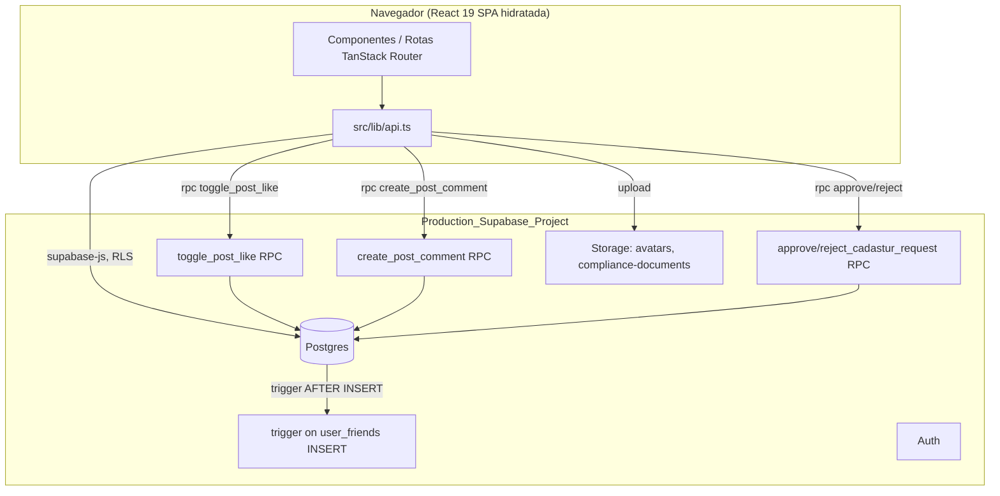

# Design Document

## Overview

Este design cobre a implementação técnica do spec `outlife-completar-funcionalidades`: conectar funcionalidades de backend já existentes a telas reais, criar as telas que faltam, substituir estado local por persistência real (curtidas, follows, comentários), e trocar a simulação de aprovação Cadastur por um fluxo real moderado por um `admin`.

Assim como no spec `outlife-production-plan`, todo o trabalho segue a mesma arquitetura cliente-servidor já estabelecida: React 19 + TanStack Router/Start (SSR via Nitro na Vercel), cliente falando diretamente com o Production_Supabase_Project via `supabase-js`, sem backend intermediário. Onde é necessário lógica com privilégios elevados ou atomicidade (contadores de `community_posts`, notificações, decisão de moderação), a solução usa funções/triggers Postgres — o mesmo padrão já usado por `award_review_xp`, `finish_user_activity`, `grant_pending_achievements` e `protect_profile_trust_fields`.

O trabalho se divide em seis frentes:

1. **Destino e navegação** (Requirement 1): nova rota `/destino/$destinationId` (Destination_Detail_Screen) e correção do link de `/explorar`.
2. **Ações de coleção já com backend pronto** (Requirements 2, 4, 5): wiring de UI para `saveDestination`/`unsaveDestination`, `favoritePartner`/`unfavoritePartner`, CRUD de `Partner_Service`, e formulário de sugestão de destino via `createPendingDestination`.
3. **Amizades** (Requirement 3): nova rota `/amigos` (Friends_Screen) sobre as funções já existentes (`fetchFriends`, `sendFriendRequest`, `acceptFriendRequest`, `removeFriend`) mais uma função de busca de perfis nova.
4. **Persistência real de comunidade** (Requirements 6, 7, 8): `Toggle_Post_Like_Function` (RPC), reuso de `user_friends` para `Post_Follow`, e uma tabela `post_comments` nova com sua própria RPC de incremento atômico — todas seguindo o padrão de bypass seguro do trigger `prevent_post_counter_tampering`.
5. **Notificações e configurações de perfil** (Requirements 9, 10): tabela `notifications` nova + trigger de criação em `user_friends`, nova rota `/notificacoes`, e nova rota `/configuracoes` reaproveitando `updateMyProfile` e o padrão de upload de imagem já existente.
6. **Moderação Cadastur real** (Requirement 11) e **remoção de decorativos** (Requirement 12): tabela `cadastur_verification_requests` nova, papel `admin` reaproveitando a infraestrutura `app_role_enum`/`user_roles`/`is_admin` já existente, nova rota `/admin/compliance`, filtro funcional em `/explorar`, gráfico do parceiro com dados reais, listas reais de seguidores/seguindo, ocultação condicional da previsão do tempo, e compartilhamento nativo/clipboard.

## Architecture



**Decisões de arquitetura por requirement:**

- **Destination_Detail_Screen (Req. 1)**: nova rota `src/routes/destino.$destinationId.tsx`, seguindo exatamente o padrão de `atividade.$activityId.tsx`/`checklist.$checklistId.tsx` (arquivo com `$param`, `useQuery` por `Route.useParams()`, skeleton de loading, estado "não encontrado"). A regra de visibilidade (approved para todos, pending só para o criador) já é a política de RLS existente em `destinations` (`status = 'approved' OR auth.uid() = created_by`) — a tela não precisa reimplementar essa regra, apenas tratar `null`/erro como "não encontrado".
- **Ações de coleção (Req. 2)**: nenhuma tabela nova. A UI passa a chamar `saveDestination`/`unsaveDestination`/`favoritePartner`/`unfavoritePartner` (já existentes desde o spec anterior) a partir de um novo componente de botão de toggle reutilizável, com guarda de autenticação consistente com o padrão já usado em `comunidade.tsx` (`if (!user) { toast; return; }`).
- **Friends_Screen (Req. 3)**: nova rota `src/routes/amigos.tsx`. A busca de usuários (3.2) precisa de uma função nova (`searchUsers`) em `api.ts`, pois não existe hoje — segue o padrão de `ILIKE` já usado implicitamente pela busca client-side de `busca.tsx`, mas server-side (Postgres `ILIKE` sobre `full_name`/`username`), para não expor toda a tabela `profiles` ao cliente.
- **Partner_Service_Management_Screen (Req. 4)**: seção nova dentro de `parceiro.painel.tsx` (não uma rota separada — reaproveita o mesmo `Sheet` já usado para editar perfil), usando `fetchMyServices`/`createService`/`deleteService` já existentes.
- **Sugestão de destino (Req. 5)**: novo componente de formulário (drawer/sheet), reaproveitando `createPendingDestination` já existente e o padrão de captura de coordenadas via `navigator.geolocation` já usado em `use-location-sharing.ts`.
- **Toggle_Post_Like_Function (Req. 6)**: nova tabela `post_likes` + função Postgres `toggle_post_like(_post_id uuid)` `SECURITY DEFINER`, que faz `INSERT`/`DELETE` em `post_likes` e `UPDATE likes = likes ± 1` em `community_posts` dentro da mesma transação — contornando `prevent_post_counter_tampering` porque o trigger só bloqueia alteração de `NEW.likes`/`NEW.comments_count` quando o comando de origem é um `UPDATE` do cliente; uma função `SECURITY DEFINER` que faz o `UPDATE` internamente também passa pelo trigger, então a função precisa rodar como um papel que o trigger reconhece como autorizado (mesmo mecanismo de `public.is_admin(auth.uid())` já usado em `protect_profile_trust_fields` — o trigger de `community_posts` é estendido para permitir a alteração quando invocado a partir da função `toggle_post_like`/`create_post_comment`, usando uma variável de sessão `SET LOCAL` como sinalizador, técnica já padrão para "bypass autorizado de trigger" em Postgres).
- **Post_Follow (Req. 7)**: nenhuma tabela nova — reaproveita `user_friends` com uma linha `status = 'accepted'` unidirecional não teria semântica de "seguir" (que é assimétrico) diferente de "amizade" (simétrica). Para não violar 7.1 ("sem duplicar o conceito de amizade") nem inventar uma tabela nova fora do espírito do requirement, a solução usa a **mesma tabela `user_friends`, mas com um novo status `following`** (assimétrico: `requester_id` segue `addressee_id`, sem exigir aceite, sem afetar `are_friends`/compartilhamento de localização que continuam filtrando estritamente por `status = 'accepted'`). Isso satisfaz "reaproveitar a Friendship existente" de forma literal e sem criar um grafo social novo.
- **Post_Comment (Req. 8)**: nova tabela `post_comments` + função `create_post_comment(_post_id uuid, _text text)`, mesmo mecanismo de bypass do trigger usado por `toggle_post_like`.
- **Notification (Req. 9)**: nova tabela `notifications` + trigger `AFTER INSERT` em `user_friends` (quando `status = 'pending'`) que insere uma notificação para `addressee_id`. Nova rota `src/routes/notificacoes.tsx`. O indicador do sino em `/` usa uma query leve (`count` de não lidas) já cacheada pelo React Query, invalidada ao marcar como lida — não precisa de realtime/websocket para este spec.
- **Profile_Settings_Screen (Req. 10)**: nova rota `src/routes/configuracoes.tsx`, reaproveitando `updateMyProfile` (já existente, já com allowlist de campos) e criando `uploadAvatarImage` seguindo exatamente o mesmo padrão de `uploadPartnerGalleryImage` (resize client-side, bucket dedicado `avatars`).
- **Moderação Cadastur (Req. 11)**: nova tabela `cadastur_verification_requests`. O papel `admin` **já existe** como infraestrutura (`app_role_enum`, tabela `user_roles`, funções `has_role`/`is_admin`, criados na migration `20260522193933`) mas nunca foi conectado a nenhuma tela nem usado por nenhuma tabela nova — este requirement é o primeiro a efetivamente utilizá-lo. Nova rota `src/routes/admin.compliance.tsx`, protegida tanto por RLS (`is_admin(auth.uid())`) quanto por um guard client-side que consulta o próprio papel do usuário. `compliance.tsx` é modificado para persistir a solicitação em vez de simular aprovação com `setTimeout`.
- **Decorativos (Req. 12)**: filtro de `/explorar` passa a ser estado React que filtra o array já carregado por `fetchDestinations` (sem nova query); `fetchPartnerChart` passa a agregar `profile_views`/`contact_clicks` reais por dia (nova coluna de série temporal, ver Data Models); seguidores/seguindo reaproveita `fetchFriends` filtrando por direção; previsão do tempo passa a ocultar a seção quando `forecast.length === 0` (já é o valor retornado hoje, só falta a UI respeitar isso); compartilhar usa `navigator.share`/`navigator.clipboard.writeText` com fallback.

## Components and Interfaces

### `src/lib/api.ts` (modificado)

Novas funções, seguindo exatamente o padrão de guarda de sessão + query/RPC já estabelecido:

```ts
// Amizades / busca (Requirement 3)
export async function searchUsers(query: string): Promise<UserSearchResult[]>;

// Comunidade — curtidas, follows, comentários (Requirements 6, 7, 8)
export async function togglePostLike(postId: string): Promise<{ liked: boolean; likes: number }>;
export async function toggleAuthorFollow(authorId: string): Promise<{ following: boolean }>;
export async function fetchMyFollowedAuthorIds(): Promise<string[]>;
export async function fetchPostComments(postId: string): Promise<PostComment[]>;
export async function createPostComment(postId: string, text: string): Promise<PostComment>;

// Notificações (Requirement 9)
export async function fetchNotifications(): Promise<Notification[]>;
export async function fetchUnreadNotificationCount(): Promise<number>;
export async function markNotificationsAsRead(ids: string[]): Promise<void>;

// Perfil (Requirement 10)
export async function uploadAvatarImage(file: File): Promise<string>;
export async function isUsernameTaken(username: string): Promise<boolean>;

// Compliance / admin (Requirement 11)
export async function submitCadasturRequest(input: {
  companyName: string; cnpj: string; cadastur: string; category: string;
  responsible: string; email: string; phone: string; description: string;
  documentUrl: string;
}): Promise<void>;
export async function fetchMyCadasturRequest(): Promise<CadasturRequest | null>;
export async function uploadComplianceDocument(file: File): Promise<string>;
export async function fetchPendingCadasturRequests(): Promise<CadasturRequest[]>;
export async function approveCadasturRequest(id: string): Promise<void>;
export async function rejectCadasturRequest(id: string): Promise<void>;
export async function fetchMyRole(): Promise<"adventurer" | "partner" | null>;
export async function isCurrentUserAdmin(): Promise<boolean>;
```

`fetchPartnerChart` (já existe) muda de corpo fixo para uma query real agregando `profile_views`/`contact_clicks` por dia (ver Data Models). `fetchFriends` continua igual; a Friends_Screen e a lista de seguidores/seguindo filtram o mesmo retorno por `status`/direção no cliente.

### Rotas novas (`src/routes/*.tsx`)

| Rota | Arquivo | Requirement |
|---|---|---|
| `/destino/$destinationId` | `destino.$destinationId.tsx` | 1 |
| `/amigos` | `amigos.tsx` | 3 |
| `/notificacoes` | `notificacoes.tsx` | 9 |
| `/configuracoes` | `configuracoes.tsx` | 10 |
| `/admin/compliance` | `admin.compliance.tsx` | 11 |

Todas seguem o padrão já estabelecido: `createFileRoute`, `head()` com meta tags (`robots: noindex` para as autenticadas, como já é feito em `perfil.tsx`/`parceiro.painel.tsx`), `useQuery`/`useMutation` do TanStack Query, guarda `useEffect` de redirect para `/login` quando a rota exige autenticação (mesmo padrão de `perfil.tsx`).

### Rotas modificadas

- **`explorar.tsx`**: card `Link to="/marketplace"` → `Link to="/destino/$destinationId" params={{ destinationId: d.id }}`; chips de filtro passam a ter `onClick` que atualiza um `useState<Difficulty | "all">` usado para filtrar `destinations` antes de renderizar.
- **`comunidade.tsx`**: `toggleLike`/`toggleFollow` (hoje só `setLocalOverrides`) passam a chamar `togglePostLike`/`toggleAuthorFollow` via `useMutation`, com `onMutate` otimista e `onError` de rollback (mesmo padrão de mutação já usado em `createMutation`); lista de comentários fixa é substituída por `useQuery(["post-comments", postId], () => fetchPostComments(postId))`, carregada só quando `showComments[id]` é `true`; o `input` de comentário passa a chamar `createPostComment`.
- **`parceiro.$partnerId.tsx`**: botão de coração no topo da galeria passa a refletir/chamar `favoritePartner`/`unfavoritePartner`; botão de compartilhar chama `navigator.share`/clipboard.
- **`parceiro.painel.tsx`**: nova seção "Meus serviços" (lista + formulário de criação em `Sheet`, botão de remoção com confirmação) usando `fetchMyServices`/`createService`/`deleteService`.
- **`perfil.tsx`**: ícone de engrenagem (hoje `<button>` sem `onClick`) passa a ser `<Link to="/configuracoes">`; sino de notificação em `index.tsx` passa a ser `<Link to="/notificacoes">` com indicador; botões de seguidores/seguindo abrem uma lista real em vez de `toast`.
- **`compliance.tsx`**: `onSubmit` passa a chamar `uploadComplianceDocument` + `submitCadasturRequest` em vez do `setTimeout` que sempre aprova; o estado do badge (`unverified`/`pending`/`verified`) passa a vir de `fetchMyCadasturRequest`/`profile.is_verified` em vez de estado local `useState`.

### `supabase/migrations/*` (novas)

- Migration A: `post_likes`, função `toggle_post_like`, extensão do trigger `prevent_post_counter_tampering` para permitir bypass sinalizado (Requirement 6).
- Migration B: novo status `following` em `user_friends` (ajuste do `CHECK`/enum de status), sem nova tabela (Requirement 7).
- Migration C: `post_comments`, função `create_post_comment`, mesmo bypass de trigger (Requirement 8).
- Migration D: `notifications`, trigger `AFTER INSERT ON user_friends` (Requirement 9).
- Migration E: bucket `avatars` + policies (Requirement 10).
- Migration F: `cadastur_verification_requests`, bucket `compliance-documents`, RLS restringindo aprovação/rejeição a `is_admin(auth.uid())` (Requirement 11).
- Migration G: colunas de série diária para o gráfico do parceiro (`partner_metric_daily`) ou view agregada sobre um log já existente (Requirement 12.2 — ver Data Models).

## Data Models

### `post_likes` (nova tabela)

```sql
CREATE TABLE public.post_likes (
  id UUID PRIMARY KEY DEFAULT gen_random_uuid(),
  post_id UUID NOT NULL REFERENCES public.community_posts(id) ON DELETE CASCADE,
  user_id UUID NOT NULL REFERENCES public.profiles(id) ON DELETE CASCADE,
  created_at TIMESTAMPTZ NOT NULL DEFAULT now(),
  UNIQUE (post_id, user_id)
);
```

`UNIQUE (post_id, user_id)` é o mecanismo que torna o toggle idempotente por construção: `toggle_post_like` faz `DELETE ... RETURNING` primeiro; se nenhuma linha foi removida, faz `INSERT` — nunca duas linhas para o mesmo par.

```sql
CREATE OR REPLACE FUNCTION public.toggle_post_like(_post_id uuid)
RETURNS TABLE(liked boolean, likes integer)
LANGUAGE plpgsql SECURITY DEFINER SET search_path = public
AS $$
DECLARE
  _uid uuid := auth.uid();
  _deleted_count int;
BEGIN
  IF _uid IS NULL THEN RAISE EXCEPTION 'not authenticated'; END IF;

  DELETE FROM public.post_likes WHERE post_id = _post_id AND user_id = _uid;
  GET DIAGNOSTICS _deleted_count = ROW_COUNT;

  PERFORM set_config('outlife.bypass_post_counters', 'true', true); -- SET LOCAL
  IF _deleted_count > 0 THEN
    UPDATE public.community_posts SET likes = GREATEST(likes - 1, 0) WHERE id = _post_id
      RETURNING false, likes INTO liked, likes;
  ELSE
    INSERT INTO public.post_likes (post_id, user_id) VALUES (_post_id, _uid);
    UPDATE public.community_posts SET likes = likes + 1 WHERE id = _post_id
      RETURNING true, likes INTO liked, likes;
  END IF;
  RETURN NEXT;
END;
$$;
```

O trigger `prevent_post_counter_tampering` é estendido para checar o sinalizador de sessão:

```sql
CREATE OR REPLACE FUNCTION public.prevent_post_counter_tampering()
RETURNS TRIGGER
LANGUAGE plpgsql SECURITY DEFINER SET search_path = public
AS $$
BEGIN
  IF current_setting('outlife.bypass_post_counters', true) = 'true' THEN
    RETURN NEW; -- alteração vem de toggle_post_like/create_post_comment, autorizada
  END IF;
  NEW.likes := OLD.likes;
  NEW.comments_count := OLD.comments_count;
  RETURN NEW;
END;
$$;
```

`set_config(..., true)` com o terceiro argumento `true` faz o valor valer apenas para a transação atual (`SET LOCAL`), então nenhum outro `UPDATE` fora dessas duas funções consegue alterar os contadores — mesmo que rode na mesma sessão, o sinalizador é limpo ao fim da transação.

### `post_comments` (nova tabela)

```sql
CREATE TABLE public.post_comments (
  id UUID PRIMARY KEY DEFAULT gen_random_uuid(),
  post_id UUID NOT NULL REFERENCES public.community_posts(id) ON DELETE CASCADE,
  author_id UUID NOT NULL REFERENCES public.profiles(id) ON DELETE CASCADE,
  text TEXT NOT NULL,
  created_at TIMESTAMPTZ NOT NULL DEFAULT now(),
  CONSTRAINT post_comments_text_not_blank CHECK (length(btrim(text)) > 0)
);

ALTER TABLE public.post_comments ENABLE ROW LEVEL SECURITY;

CREATE POLICY "Comments are viewable by everyone"
  ON public.post_comments FOR SELECT USING (true);

CREATE POLICY "Users create their own comments"
  ON public.post_comments FOR INSERT
  WITH CHECK (auth.uid() = author_id);
```

O `CHECK (length(btrim(text)) > 0)` é a última linha de defesa contra texto vazio/whitespace (Requirement 8.6) mesmo que a validação client-side seja contornada.

```sql
CREATE OR REPLACE FUNCTION public.create_post_comment(_post_id uuid, _text text)
RETURNS public.post_comments
LANGUAGE plpgsql SECURITY DEFINER SET search_path = public
AS $$
DECLARE
  _uid uuid := auth.uid();
  _row public.post_comments;
BEGIN
  IF _uid IS NULL THEN RAISE EXCEPTION 'not authenticated'; END IF;
  IF length(btrim(_text)) = 0 THEN RAISE EXCEPTION 'comment text is blank'; END IF;

  INSERT INTO public.post_comments (post_id, author_id, text)
  VALUES (_post_id, _uid, btrim(_text))
  RETURNING * INTO _row;

  PERFORM set_config('outlife.bypass_post_counters', 'true', true);
  UPDATE public.community_posts SET comments_count = comments_count + 1 WHERE id = _post_id;

  RETURN _row;
END;
$$;
```

### `user_friends` (modificada — novo status `following`)

```sql
-- status passa a aceitar 'pending' | 'accepted' | 'blocked' | 'following'
ALTER TABLE public.user_friends DROP CONSTRAINT IF EXISTS user_friends_status_check;
ALTER TABLE public.user_friends ADD CONSTRAINT user_friends_status_check
  CHECK (status IN ('pending', 'accepted', 'blocked', 'following'));
```

Uma linha `status = 'following'` com `requester_id = <quem segue>` e `addressee_id = <autor seguido>` representa exatamente o Post_Follow, sem afetar `are_friends` (que já filtra estritamente por `status = 'accepted'`) nem a Friends_Screen (que filtra por `accepted`/`pending`). `UNIQUE (requester_id, addressee_id)` já existente continua garantindo que seguir o mesmo autor duas vezes não duplica a linha — a "segunda vez" é tratada como toggle (remove).

### `notifications` (nova tabela)

```sql
CREATE TABLE public.notifications (
  id UUID PRIMARY KEY DEFAULT gen_random_uuid(),
  recipient_id UUID NOT NULL REFERENCES public.profiles(id) ON DELETE CASCADE,
  type TEXT NOT NULL, -- 'friend_request', extensível no futuro
  payload JSONB NOT NULL DEFAULT '{}'::jsonb,
  is_read BOOLEAN NOT NULL DEFAULT false,
  created_at TIMESTAMPTZ NOT NULL DEFAULT now()
);

CREATE INDEX notifications_recipient_idx ON public.notifications (recipient_id, created_at DESC);

ALTER TABLE public.notifications ENABLE ROW LEVEL SECURITY;

CREATE POLICY "Users view their own notifications"
  ON public.notifications FOR SELECT USING (auth.uid() = recipient_id);

CREATE POLICY "Users update read state of their own notifications"
  ON public.notifications FOR UPDATE
  USING (auth.uid() = recipient_id) WITH CHECK (auth.uid() = recipient_id);

CREATE OR REPLACE FUNCTION public.notify_on_friend_request()
RETURNS TRIGGER
LANGUAGE plpgsql SECURITY DEFINER SET search_path = public
AS $$
BEGIN
  IF NEW.status = 'pending' THEN
    INSERT INTO public.notifications (recipient_id, type, payload)
    VALUES (NEW.addressee_id, 'friend_request', jsonb_build_object('requesterId', NEW.requester_id, 'friendshipId', NEW.id));
  END IF;
  RETURN NEW;
END;
$$;

CREATE TRIGGER trg_notify_on_friend_request
  AFTER INSERT ON public.user_friends
  FOR EACH ROW EXECUTE FUNCTION public.notify_on_friend_request();
```

Não há política de `INSERT` para usuários comuns — apenas o trigger (`SECURITY DEFINER`) cria notificações, então um cliente não pode forjar uma notificação para outro usuário.

### `cadastur_verification_requests` (nova tabela)

```sql
CREATE TYPE public.cadastur_request_status AS ENUM ('pending', 'approved', 'rejected');

CREATE TABLE public.cadastur_verification_requests (
  id UUID PRIMARY KEY DEFAULT gen_random_uuid(),
  partner_id UUID NOT NULL REFERENCES public.profiles(id) ON DELETE CASCADE,
  company_name TEXT NOT NULL,
  cnpj TEXT NOT NULL,
  cadastur_number TEXT NOT NULL,
  category TEXT NOT NULL,
  responsible TEXT NOT NULL,
  email TEXT NOT NULL,
  phone TEXT NOT NULL,
  description TEXT NOT NULL,
  document_url TEXT NOT NULL,
  status public.cadastur_request_status NOT NULL DEFAULT 'pending',
  reviewed_by UUID REFERENCES public.profiles(id) ON DELETE SET NULL,
  reviewed_at TIMESTAMPTZ,
  created_at TIMESTAMPTZ NOT NULL DEFAULT now()
);

-- Garante Requirement 11.9: no máximo uma solicitação pending por parceiro.
CREATE UNIQUE INDEX cadastur_requests_one_pending_per_partner
  ON public.cadastur_verification_requests (partner_id)
  WHERE status = 'pending';

ALTER TABLE public.cadastur_verification_requests ENABLE ROW LEVEL SECURITY;

CREATE POLICY "Partners view their own requests"
  ON public.cadastur_verification_requests FOR SELECT
  USING (auth.uid() = partner_id OR public.is_admin(auth.uid()));

CREATE POLICY "Partners create their own pending request"
  ON public.cadastur_verification_requests FOR INSERT
  WITH CHECK (auth.uid() = partner_id AND status = 'pending');

CREATE POLICY "Admins update requests"
  ON public.cadastur_verification_requests FOR UPDATE
  USING (public.is_admin(auth.uid())) WITH CHECK (public.is_admin(auth.uid()));

CREATE OR REPLACE FUNCTION public.approve_cadastur_request(_id uuid)
RETURNS void
LANGUAGE plpgsql SECURITY DEFINER SET search_path = public
AS $$
DECLARE _partner_id uuid;
BEGIN
  IF NOT public.is_admin(auth.uid()) THEN RAISE EXCEPTION 'not authorized'; END IF;
  UPDATE public.cadastur_verification_requests
    SET status = 'approved', reviewed_by = auth.uid(), reviewed_at = now()
    WHERE id = _id AND status = 'pending'
    RETURNING partner_id INTO _partner_id;
  IF _partner_id IS NOT NULL THEN
    UPDATE public.profiles SET is_verified = true WHERE id = _partner_id;
  END IF;
END;
$$;

CREATE OR REPLACE FUNCTION public.reject_cadastur_request(_id uuid)
RETURNS void
LANGUAGE plpgsql SECURITY DEFINER SET search_path = public
AS $$
BEGIN
  IF NOT public.is_admin(auth.uid()) THEN RAISE EXCEPTION 'not authorized'; END IF;
  UPDATE public.cadastur_verification_requests
    SET status = 'rejected', reviewed_by = auth.uid(), reviewed_at = now()
    WHERE id = _id AND status = 'pending';
END;
$$;
```

`approve_cadastur_request`/`reject_cadastur_request` fazem a checagem de `is_admin` explicitamente (redundante com a RLS de `UPDATE`) porque também tocam `profiles.is_verified`, que não pertence à mesma tabela protegida pela política de `UPDATE` acima — a função precisa do próprio `SECURITY DEFINER` para escrever em `profiles` além de `protect_profile_trust_fields` já permitir isso a admins.

O índice único parcial (`WHERE status = 'pending'`) é o mecanismo que implementa Requirement 11.9 no nível de banco: a segunda tentativa de `INSERT` com `status = 'pending'` para o mesmo `partner_id` falha com violação de unicidade antes de qualquer lógica de aplicação, e a UI mapeia esse erro para a mensagem correspondente (mesmo padrão de `mapRateLimitErrorToMessage` para outros erros de banco codificados).

### `partner_metric_daily` (nova tabela, suporte ao gráfico real)

```sql
CREATE TABLE public.partner_metric_daily (
  id BIGSERIAL PRIMARY KEY,
  partner_id UUID NOT NULL REFERENCES public.profiles(id) ON DELETE CASCADE,
  day DATE NOT NULL,
  views INTEGER NOT NULL DEFAULT 0,
  contact_clicks INTEGER NOT NULL DEFAULT 0,
  UNIQUE (partner_id, day)
);
```

`increment_partner_profile_view`/`increment_partner_contact_click` (RPCs já existentes) passam a fazer, além do `UPDATE` já existente em `profiles`, um `INSERT ... ON CONFLICT (partner_id, day) DO UPDATE SET views = partner_metric_daily.views + 1` (ou `contact_clicks`) para o dia corrente (`CURRENT_DATE`). `fetchPartnerChart` passa a `SELECT day, views, contact_clicks FROM partner_metric_daily WHERE partner_id = $1 AND day >= CURRENT_DATE - 6 ORDER BY day`, preenchendo dias sem registro com zero no cliente (mesma técnica já usada por `fetchNextAdventure` ao tratar ausência como `null`).

### Buckets de storage (novos)

```sql
INSERT INTO storage.buckets (id, name, public, file_size_limit, allowed_mime_types)
VALUES ('avatars', 'avatars', true, 5242880, ARRAY['image/jpeg','image/png','image/webp'])
ON CONFLICT (id) DO NOTHING;

INSERT INTO storage.buckets (id, name, public, file_size_limit, allowed_mime_types)
VALUES ('compliance-documents', 'compliance-documents', false, 5242880, ARRAY['image/jpeg','image/png','application/pdf'])
ON CONFLICT (id) DO NOTHING;
```

`avatars` é público (mesma lógica de `partner-gallery`, pois avatares já aparecem publicamente em posts/reviews). `compliance-documents` é **privado** — apenas o próprio parceiro (upload) e admins (leitura, via policy `is_admin(auth.uid())`) acessam, seguindo `storage.foldername(name))[1] = auth.uid()::text` para o upload, igual ao padrão de `review-photos`/`partner-gallery`.

### Tipos TypeScript novos (`src/lib/api.ts`)

```ts
export type UserSearchResult = { id: string; full_name: string | null; username: string | null; avatar_url: string | null };
export type PostComment = { id: string; post_id: string; text: string; created_at: string; author: { full_name: string | null; avatar_url: string | null } | null };
export type Notification = { id: string; type: string; payload: Record<string, unknown>; is_read: boolean; created_at: string };
export type CadasturRequest = { id: string; status: "pending" | "approved" | "rejected"; created_at: string; reviewed_at: string | null; company_name: string; /* ...demais campos do formulário */ };
```

## Correctness Properties

*A property is a characteristic or behavior that should hold true across all valid executions of a system-essentially, a formal statement about what the system should do. Properties serve as the bridge between human-readable specifications and machine-verifiable correctness guarantees.*

### Property 1: Visibilidade de destino é exatamente `approved` ou próprio pendente

*For any* destino com status arbitrário (`approved`, `pending`, `rejected`), `created_by` arbitrário, e usuário visualizador arbitrário (não autenticado, autenticado diferente do criador, ou o próprio criador), a Destination_Detail_Screen SHALL exibir o conteúdo completo quando (status = `approved`) OU (viewer autenticado = `created_by`), e SHALL exibir "não encontrado" sem expor nenhum campo do registro em todos os demais casos — incluindo quando o `destinationId` não existe.

**Validates: Requirements 1.3, 1.4, 1.5, 5.3**

### Property 2: Lista de avaliações reflete exatamente `fetchReviewsByDestination`

*For any* destino e qualquer conjunto de reviews associadas (incluindo zero), a Destination_Detail_Screen SHALL exibir exatamente a lista retornada por `fetchReviewsByDestination`, incluindo a mensagem de lista vazia quando o conjunto for vazio.

**Validates: Requirements 1.2**

### Property 3: Toggle de Saved_Destination_Action é consistente e idempotente por par

*For any* destino, usuário autenticado, e sequência arbitrária de ativações do controle de Saved_Destination_Action, o estado exibido do controle após cada ativação SHALL alternar exatamente entre "salvo" (chamando `saveDestination`) e "não salvo" (chamando `unsaveDestination`), e uma sequência de duas ativações consecutivas SHALL retornar ao estado original.

**Validates: Requirements 2.1, 2.2, 2.3**

### Property 4: Toggle de Favorite_Partner_Action é consistente e idempotente por par

*For any* parceiro, usuário autenticado, e sequência arbitrária de ativações do controle de Favorite_Partner_Action, o estado exibido SHALL alternar exatamente entre "favoritado" (`favoritePartner`) e "não favoritado" (`unfavoritePartner`), retornando ao estado original após duas ativações consecutivas.

**Validates: Requirements 2.4, 2.5, 2.6**

### Property 5: Guarda de autenticação bloqueia mutações de coleção/comunidade sem sessão

*For any* uma das operações mutáveis protegidas por autenticação (Saved_Destination_Action, Favorite_Partner_Action, curtir post, seguir autor, comentar post), quando não há usuário autenticado, a OutLife_Application SHALL solicitar login e SHALL não invocar a função/RPC correspondente (`saveDestination`, `unsaveDestination`, `favoritePartner`, `unfavoritePartner`, `togglePostLike`, `toggleAuthorFollow`, `createPostComment`), para qualquer entidade de destino escolhida.

**Validates: Requirements 2.7, 6.5, 7.5, 8.5**

### Property 6: `fetchFriends` reflete exatamente as Friendship `accepted` do usuário autenticado

*For any* conjunto de registros `user_friends` com status e usuários variados, a Friends_Screen SHALL listar exatamente as Friendship com `status = 'accepted'` envolvendo o usuário autenticado, nunca incluindo Friendship de outro par de usuários.

**Validates: Requirements 3.1**

### Property 7: `searchUsers` retorna exatamente os perfis correspondentes ao texto de busca

*For any* texto de busca e conjunto arbitrário de perfis (com nomes/usernames variados, incluindo nenhuma correspondência), `searchUsers` SHALL retornar exatamente o subconjunto de perfis cujo `full_name` ou `username` contém o texto de busca (comparação sem distinção de maiúsculas/minúsculas), nunca incluindo perfis sem correspondência nem omitindo perfis com correspondência.

**Validates: Requirements 3.2**

### Property 8: Máquina de estados de Friendship é consistente para qualquer sequência de ações

*For any* par de usuários distintos e qualquer sequência válida de ações (enviar solicitação, aceitar, remover), o estado da Friendship SHALL transicionar exatamente conforme: inexistente → (`sendFriendRequest`) → `pending` → (`acceptFriendRequest`) → `accepted` → (`removeFriend`) → inexistente; e uma tentativa de `sendFriendRequest` de um usuário para si mesmo, ou para um usuário com quem já existe Friendship em qualquer status, SHALL ser bloqueada pela Friends_Screen sem invocar `sendFriendRequest`.

**Validates: Requirements 3.3, 3.4, 3.5, 3.6**

### Property 9: CRUD de Partner_Service é um round-trip completo

*For any* parceiro autenticado e dados válidos de Partner_Service (destino, título, descrição, preço), criar um serviço via `createService` SHALL fazer com que `fetchMyServices` e `fetchServicesByPartner` (para o mesmo parceiro) incluam exatamente esse serviço imediatamente após, e remover esse serviço via `deleteService` SHALL fazer com que ambas as funções deixem de incluí-lo, retornando ao conjunto original.

**Validates: Requirements 4.1, 4.2, 4.3, 4.5**

### Property 10: Validação do formulário de Partner_Service bloqueia submissão com qualquer campo obrigatório inválido

*For any* combinação de destino selecionado/ausente, título preenchido/vazio, descrição preenchida/vazia, e preço válido/ausente/inválido, a Partner_Service_Management_Screen SHALL impedir a submissão e indicar todos os campos pendentes/inválidos, sem invocar `createService`, exceto quando todos os quatro campos são válidos simultaneamente.

**Validates: Requirements 4.4**

### Property 11: Validação do formulário de sugestão de destino bloqueia submissão com nome ou localização inválidos

*For any* combinação de nome preenchido/vazio e coordenadas geográficas válidas/inválidas/ausentes, a OutLife_Application SHALL impedir a submissão do formulário de sugestão de destino e indicar os campos pendentes/inválidos, sem invocar `createPendingDestination`, exceto quando nome e localização são ambos válidos.

**Validates: Requirements 5.4**

### Property 12: Toggle de curtida é consistente, idempotente por par e persistido

*For any* Community_Post, usuário autenticado, e sequência arbitrária de ativações do controle de curtida, `togglePostLike` SHALL alternar exatamente entre "curtido" (com `likes` incrementado em 1 em relação ao valor anterior) e "não curtido" (com `likes` decrementado em 1), o estado final após a sequência SHALL ser consistente com a paridade do número de ativações, e uma nova leitura de `fetchCommunityPosts` após qualquer sequência SHALL refletir exatamente esse estado persistido (nunca reiniciando para "não curtido").

**Validates: Requirements 6.1, 6.2, 6.3, 6.4**

### Property 13: Toggle de seguir autor é consistente, idempotente por par e persistido

*For any* autor de Community_Post, usuário autenticado distinto do autor, e sequência arbitrária de ativações do controle de seguir, `toggleAuthorFollow` SHALL alternar exatamente entre "seguindo" e "seguir" sem criar ou afetar nenhuma Friendship de status `accepted`/`pending` entre os mesmos dois usuários, e uma nova leitura após qualquer sequência SHALL refletir exatamente esse estado persistido.

**Validates: Requirements 7.2, 7.3, 7.4**

### Property 14: Criação de comentário é refletida no fetch e incrementa o contador atomicamente

*For any* Community_Post e qualquer sequência de N comentários não vazios submetidos por usuários autenticados, após a sequência `fetchPostComments` SHALL retornar exatamente os N comentários criados (com autor e texto corretos) e `comments_count` do post (via `fetchCommunityPosts`) SHALL ser exatamente o valor inicial mais N — independentemente de tentativas concorrentes de `UPDATE` direto do cliente sobre `comments_count`, que SHALL continuar sendo revertidas pelo trigger.

**Validates: Requirements 8.2, 8.3, 8.4**

### Property 15: Comentário vazio ou composto apenas de espaços é sempre rejeitado

*For any* string composta inteiramente de caracteres de espaço em branco (incluindo a string vazia), submeter essa string como comentário SHALL ser rejeitado pela OutLife_Application sem invocar `createPostComment`, e *for any* string com ao menos um caractere não-espaço, a submissão SHALL proceder normalmente.

**Validates: Requirements 8.6**

### Property 16: Enviar solicitação de amizade cria exatamente uma Notification para o destinatário

*For any* par de usuários distintos sem Friendship pré-existente, `sendFriendRequest` do primeiro para o segundo SHALL fazer com que exista exatamente uma nova Notification do tipo `friend_request` para o segundo usuário, e nenhuma Notification SHALL ser criada para o primeiro usuário (quem enviou) nem para qualquer terceiro usuário.

**Validates: Requirements 9.2**

### Property 17: `fetchNotifications` reflete exatamente as Notification do usuário autenticado em ordem cronológica decrescente

*For any* conjunto de Notification pertencentes a múltiplos usuários com timestamps arbitrários, `fetchNotifications` SHALL retornar exatamente as Notification do usuário autenticado, ordenadas por `created_at` decrescente, nunca incluindo Notification de outro usuário.

**Validates: Requirements 9.3**

### Property 18: Indicador do sino reflete exatamente a existência de Notification não lida

*For any* conjunto de Notification do usuário autenticado com estados de leitura arbitrários, o sino de notificação SHALL exibir o indicador visual de pendência se e somente se existir ao menos uma Notification com `is_read = false`.

**Validates: Requirements 9.5, 9.6**

### Property 19: Abrir a Notifications_Screen marca como lidas e remove o indicador imediatamente

*For any* conjunto de Notification não lidas do usuário autenticado exibidas na Notifications_Screen, após a abertura da tela todas essas Notification SHALL passar a `is_read = true`, e o indicador visual do sino SHALL ser removido imediatamente no estado client-side, sem depender de um novo carregamento da página inicial.

**Validates: Requirements 9.7, 9.8**

### Property 20: Atualização de avatar é um round-trip simples

*For any* URL de imagem retornada por `uploadAvatarImage`, atualizar o perfil do usuário autenticado com essa URL SHALL fazer com que uma consulta subsequente a `fetchMyProfile` retorne exatamente essa `avatar_url`, e a Profile_Settings_Screen/`/perfil` SHALL exibi-la após a confirmação.

**Validates: Requirements 10.4**

### Property 21: Unicidade de username é respeitada e mapeada corretamente

*For any* conjunto de perfis existentes e um novo valor de username escolhido pelo usuário autenticado, a submissão SHALL ser rejeitada com mensagem de "username em uso" se e somente se esse valor já pertencer a outro perfil, e SHALL proceder normalmente (persistindo o novo username) em qualquer outro caso, incluindo quando o valor é igual ao username atual do próprio usuário.

**Validates: Requirements 10.6**

### Property 22: Submissão de compliance sempre cria solicitação `pending`, nunca aprovada automaticamente

*For any* submissão válida do formulário de compliance por um parceiro autenticado sem solicitação `pending` pré-existente, `submitCadasturRequest` SHALL persistir exatamente uma nova Cadastur_Verification_Request com `status = 'pending'`, e essa solicitação SHALL permanecer `pending` imediatamente após a submissão (nunca transicionar automaticamente para `approved`).

**Validates: Requirements 11.2**

### Property 23: Segunda submissão de compliance com solicitação pendente existente é sempre bloqueada

*For any* parceiro autenticado com uma Cadastur_Verification_Request `status = 'pending'` já existente, uma nova tentativa de `submitCadasturRequest` SHALL ser rejeitada sem criar uma segunda solicitação, e essa restrição SHALL deixar de se aplicar assim que a solicitação existente transicionar para `approved` ou `rejected`.

**Validates: Requirements 11.9**

### Property 24: Listagem e controle de acesso do Admin_Compliance_Screen dependem exatamente do Admin_Role

*For any* usuário (não autenticado, autenticado sem Admin_Role, ou autenticado com Admin_Role) e qualquer conjunto de Cadastur_Verification_Request com status variados, `fetchPendingCadasturRequests` SHALL retornar exatamente as solicitações com `status = 'pending'` quando o usuário possui Admin_Role, e SHALL ser negado (erro/lista vazia por RLS) para qualquer usuário sem Admin_Role.

**Validates: Requirements 11.4, 11.8**

### Property 25: Decisão de aprovação/rejeição admin é determinística e afeta exatamente os campos esperados

*For any* Cadastur_Verification_Request `pending` e decisão de um usuário com Admin_Role (aprovar ou rejeitar), aprovar SHALL transicionar o status para `approved` e definir `is_verified = true` no perfil do parceiro correspondente, rejeitar SHALL transicionar o status para `rejected` sem alterar `is_verified`, e nenhuma das duas operações SHALL afetar qualquer outra Cadastur_Verification_Request ou perfil.

**Validates: Requirements 11.5, 11.6**

### Property 26: Filtro de dificuldade em Explorar restringe a lista exatamente ao critério selecionado

*For any* conjunto de destinos com dificuldades arbitrárias e qualquer filtro de dificuldade selecionado (incluindo "todos"), a lista exibida em `/explorar` SHALL conter exatamente os destinos cuja dificuldade corresponde ao filtro selecionado, ou todos os destinos quando o filtro selecionado for "todos".

**Validates: Requirements 12.1**

### Property 27: Gráfico do parceiro varia com os dados reais de `profile_views`/`contact_clicks`

*For any* dois conjuntos distintos de registros diários de `profile_views`/`contact_clicks` para o mesmo parceiro, `fetchPartnerChart` SHALL retornar séries de pontos diferentes correspondentes a cada conjunto (nunca a mesma série fixa independentemente do dado real), com cada ponto refletindo exatamente o valor agregado do dia correspondente.

**Validates: Requirements 12.2**

### Property 28: Listas de seguidores/seguindo exibem exatamente a Friendship reaproveitada e nunca ambas simultaneamente

*For any* conjunto de Friendship `accepted` de um usuário autenticado, selecionar o botão "seguidores" SHALL exibir exatamente a lista de usuários com Friendship `accepted` envolvendo o usuário atual, selecionar "seguindo" SHALL exibir a mesma lista (relação simétrica) substituindo qualquer lista anteriormente exibida pelo outro botão, e nenhuma das duas listas SHALL ser exibida simultaneamente.

**Validates: Requirements 12.3**

### Property 29: Seção de previsão do tempo é ocultada exatamente quando não há forecast

*For any* resultado de `fetchNextAdventure`, a seção de previsão do tempo em `/perfil` SHALL ser renderizada se e somente se `forecast.length > 0`, nunca exibindo um espaço vazio proveniente de um array vazio.

**Validates: Requirements 12.4**

## Error Handling

A estratégia segue o padrão já estabelecido em `src/lib/api.ts`/`src/start.ts` (herdado do spec `outlife-production-plan`): erros de dados/negócio propagam (`throw`) para a UI decidir; guardas de sessão retornam vazio/nulo antes de qualquer chamada de rede; erros de RPC/constraint de banco são mapeados para mensagens específicas na UI.

| Cenário | Camada | Comportamento |
|---|---|---|
| `destinationId` inexistente, ou pending de outro usuário | `destino.$destinationId.tsx` | RLS de `destinations` já retorna `null` para a query — tela exibe "não encontrado" sem distinguir os dois casos (evita vazar se o registro existe) |
| Usuário não autenticado ativa Saved_Destination_Action / Favorite_Partner_Action / curtida / seguir / comentário | Componentes correspondentes | `toast` solicitando login; nenhuma função de mutação é chamada (guarda antes da chamada, mesmo padrão de `openDrawer` em `comunidade.tsx`) |
| `sendFriendRequest` para si mesmo ou par com Friendship existente | `amigos.tsx` (client) + `user_friends_distinct`/`user_friends_unique` (banco, defesa em profundidade) | Client bloqueia antes da chamada com mensagem explicativa; se contornado, a constraint do banco rejeita e o erro é propagado |
| `createPostComment`/`create_post_comment` com texto vazio/whitespace | Client + `post_comments_text_not_blank` CHECK (banco, defesa em profundidade) | Client bloqueia o botão de enviar; se contornado, a função RPC lança exceção explícita antes de qualquer INSERT |
| Segunda Cadastur_Verification_Request `pending` para o mesmo parceiro | `cadastur_requests_one_pending_per_partner` (índice único parcial) | `INSERT` falha com violação de unicidade; `submitCadasturRequest` mapeia esse erro específico para "você já tem uma solicitação em análise" |
| Username já em uso | `profiles_username_key` (UNIQUE já existente) | `updateMyProfile` mapeia a violação de unicidade para "nome de usuário já está em uso"; `isUsernameTaken` permite validação prévia no formulário antes da submissão |
| Usuário sem Admin_Role acessa `/admin/compliance` ou chama `approve_cadastur_request`/`reject_cadastur_request` | Guard client-side (`isCurrentUserAdmin`) + RLS + `RAISE EXCEPTION 'not authorized'` nas funções | Client redireciona/nega renderização; RLS impede leitura mesmo se a rota for acessada diretamente; função RPC rejeita explicitamente como defesa em profundidade |
| Falha ao chamar `createPendingDestination`/`submitCadasturRequest`/`createService` (erro de rede/infra) | Componentes de formulário | `toast` de erro, formulário permanece preenchido, nenhuma confirmação de sucesso é exibida |
| `navigator.share` indisponível (desktop/navegador sem suporte) | Botão de compartilhar | Fallback para `navigator.clipboard.writeText(url)` com toast de "link copiado"; se ambos falharem, toast de erro |
| Upload de avatar/documento de compliance falha na validação (tipo/tamanho) | `uploadAvatarImage`/`uploadComplianceDocument` | Lança erro descritivo antes de qualquer chamada de rede, mesmo padrão de `uploadPartnerGalleryImage`/`uploadReviewPhoto` |

## Testing Strategy

**Abordagem dual**: testes unitários/exemplo cobrem wiring de UI, navegação e cenários concretos de erro; testes de propriedade (property-based) cobrem as 29 Correctness Properties listadas acima.

**Biblioteca de PBT**: `fast-check` (já em uso no projeto). Cada property é implementada como um único teste, configurado para no mínimo 100 execuções (`fc.assert(fc.property(...), { numRuns: 100 })` ou `fc.asyncProperty` para as assíncronas), comentado com a tag:

`// Feature: outlife-completar-funcionalidades, Property N: <texto da property>`

**Isolamento de dependências externas**: properties sobre `src/lib/api.ts` usam o client Supabase mockado via `vi.mock('@/integrations/supabase/client')`, seguindo exatamente o padrão já estabelecido em `tests/property/user-data-functions.property.test.ts` (mock de `.from().select().eq().order()` reproduzindo a semântica do Postgres em memória). Properties sobre lógica que reside em função/trigger SQL (toggle de curtida, criação de comentário com contador, decisão de moderação admin, notificação por trigger, filtro de status de destino) rodam contra um banco de teste local/efêmero (Postgres local ou container descartável via `supabase start`), nunca contra o Production_Supabase_Project real.

### Testes de propriedade (novos)

| Property | Arquivo sugerido | Alvo |
|---|---|---|
| 1, 2 | `tests/property/destination-detail.property.test.ts` | RLS de `destinations` (banco de teste) + `fetchReviewsByDestination` (mock) |
| 3, 4, 5 | `tests/property/collection-toggles.property.test.ts` | `saveDestination`/`unsaveDestination`/`favoritePartner`/`unfavoritePartner` (mock) |
| 6, 7, 8 | `tests/property/friends.property.test.ts` | `fetchFriends`, `searchUsers`, máquina de estados de `user_friends` (banco de teste) |
| 9, 10 | `tests/property/partner-services.property.test.ts` | `createService`/`deleteService`/`fetchMyServices`/`fetchServicesByPartner` (mock) |
| 11 | `tests/property/destination-suggestion-validation.property.test.ts` | validação client-side do formulário de sugestão |
| 12, 13, 14, 15 | `tests/property/community-persistence.property.test.ts` | `toggle_post_like`, `create_post_comment`, status `following` (banco de teste) |
| 16, 17, 18, 19 | `tests/property/notifications.property.test.ts` | trigger `notify_on_friend_request`, `fetchNotifications`, indicador de leitura (banco de teste + mock) |
| 20, 21 | `tests/property/profile-settings.property.test.ts` | `uploadAvatarImage` + `updateMyProfile`, unicidade de username (mock + banco de teste) |
| 22, 23, 24, 25 | `tests/property/cadastur-moderation.property.test.ts` | `submit/approve/reject_cadastur_request`, RLS por Admin_Role (banco de teste) |
| 26 | `tests/property/explore-filter.property.test.ts` | função pura de filtro de dificuldade extraída de `explorar.tsx` |
| 27 | `tests/property/partner-chart.property.test.ts` | `fetchPartnerChart` (mock) |
| 28, 29 | `tests/property/profile-decorative-fixes.property.test.ts` | listas de seguidores/seguindo (mock de `fetchFriends`), condição de renderização do forecast (função pura extraída) |

### Testes unitários/exemplo (novos, complementares)

- `destino.$destinationId.tsx`: snapshot/render de estado "não encontrado" vs. conteúdo completo; navegação a partir do card em `/explorar`.
- `comunidade.tsx`: submissão de review com `targetType: "destination"` chamando `submitReview` corretamente.
- Botão de compartilhar: mock de `navigator.share` presente/ausente, verificando fallback para clipboard.
- `configuracoes.tsx`/`admin.compliance.tsx`: navegação a partir da engrenagem em `/perfil` e do sino em `/`; guard de redirecionamento para usuários sem Admin_Role.
- Buckets `avatars`/`compliance-documents`: smoke test único confirmando existência/configuração (mesmo padrão de `tests/storage-buckets.test.ts` já existente).
