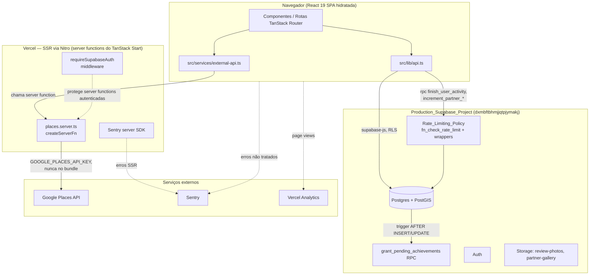

# Design Document

## Overview

Este design cobre a implementação técnica do `outlife-production-plan`: fechar a lacuna entre o estado atual da OutLife_Application (Fundação_De_Infraestrutura e migração para o Production_Supabase_Project já concluídas) e um estado apto a receber usuários reais em produção.

O trabalho se divide em quatro frentes que compartilham a mesma arquitetura cliente-servidor já estabelecida (React 19 + TanStack Router/Start com SSR, cliente falando diretamente com o Production_Supabase_Project via `supabase-js`, sem backend intermediário):

1. **Dados e schema** (Requirements 1, 3, 5, 12): Seed_Script versionado, documentação do Production_Readiness_Gate, nova tabela `achievement_records` com sua lógica de avaliação, e uma Rate_Limiting_Policy nas RPCs públicas.
2. **Substituição de mocks por dados reais** (Requirements 4, 5, 6): as seis Mocked_Data_Function em `src/lib/api.ts` passam a consultar o Production_Supabase_Project; a Google_Places_Integration ganha uma implementação server-side real por trás dos stubs existentes em `src/services/external-api.ts`.
3. **Qualidade de produto** (Requirements 7, 8, 11): PWA instalável, SEO (sitemap, meta tags por página, remoção da Social_Preview_Image hospedada na Lovable), otimização de imagens.
4. **Observabilidade e testes** (Requirements 2, 9, 10): validação E2E do fluxo funcional completo, Error_Monitoring_Service (Sentry) e Analytics_Service (Vercel Analytics), e a E2E_Test_Suite (Playwright).

Nenhuma dessas frentes introduz um servidor de aplicação novo. Onde é estritamente necessário executar código fora do navegador (proteger a Google_Places_Credential, aplicar Rate_Limiting_Policy, avaliar Achievement_Rule com privilégios elevados), a solução usa os dois mecanismos já existentes no projeto: **TanStack Start server functions** (`createServerFn`, já usado pelo padrão `requireSupabaseAuth`/`attachSupabaseAuth` em `src/integrations/supabase/`) e **funções/triggers Postgres no próprio Production_Supabase_Project** (já é o padrão de todas as migrations existentes, ex. `award_review_xp`, `finish_user_activity`).

## Architecture



**Decisões de arquitetura por requirement:**

- **Seed_Script (Req. 1)**: um script Node/TypeScript (`scripts/seed.ts`, executado com `tsx`) que usa `supabaseAdmin` (service role, já existente em `client.server.ts`) para fazer upsert do Seed_Dataset. Upsert por chave natural determinística (UUIDs fixos, já usados nos dados seed atuais) garante idempotência sem precisar de lógica de deduplicação adicional.
- **Production_Readiness_Gate (Req. 3)**: puramente documental (`docs/production-readiness.md`), não é software. A "invalidação de marcação prematura" é operacionalizada como uma regra de processo (checklist com evidência exigida), não uma função de código.
- **Achievement_Record (Req. 5)**: nova tabela `achievement_records` + uma função Postgres `grant_pending_achievements(_user_id uuid)` que centraliza a avaliação de todas as Achievement_Rule contra as estatísticas reais do usuário (view `user_achievement_stats`). É chamada por triggers `AFTER INSERT/UPDATE` em `reviews` e `user_activities` (mesmos pontos que já disparam `award_review_xp` e `finish_user_activity`), garantindo que a concessão ocorre exatamente quando a atividade real do usuário muda — nunca a partir de código client-side, o que fecha a possibilidade de um usuário se autoconceder um achievement.
- **Mocked_Data_Function (Req. 4)**: cada função passa a ser uma query Supabase real, seguindo exatamente o padrão já usado por `fetchUserActivities`/`fetchUserChecklists` (guarda de sessão → `array vazio`/`null`, depois `select` filtrado por `user_id = auth.uid()`, confiando na RLS como segunda camada de defesa).
- **Google_Places_Integration (Req. 6)**: os stubs em `external-api.ts` passam a delegar para uma TanStack Start server function (`fetchDestinationsFromGooglePlaces`/`fetchPlacesPhotosFromGooglePlaces` em `src/services/places.server.ts`), a única camada que lê `process.env.GOOGLE_PLACES_API_KEY` (sem prefixo `VITE_`, portanto nunca embutida no bundle do cliente, seguindo o mesmo padrão de `SUPABASE_SERVICE_ROLE_KEY`). As funções em `external-api.ts` continuam sendo o ponto de chamada usado pela UI, preservando a assinatura já definida.
- **PWA (Req. 7)**: `public/manifest.json` estático + Service Worker mínimo (`public/sw.js`, registrado no client entry) fazendo apenas cache-first de assets estáticos. Não introduz um framework de PWA novo (ex. vite-plugin-pwa) para manter a superfície de build simples e compatível com o preset `vercel` do Nitro já configurado.
- **SEO (Req. 8)**: `sitemap.xml` servido como arquivo estático gerado em build-time (`scripts/generate-sitemap.ts`, roda no `prebuild`) a partir de uma lista explícita de rotas públicas. Meta tags por rota usam o mecanismo `head()` que o TanStack Router já oferece (usado hoje só no `__root.tsx`), estendido para cada rota pública.
- **Observabilidade (Req. 9)**: Sentry inicializado tanto no client entry quanto no server entry (padrões oficiais `@sentry/tanstackstart-react`), envolto em `try/catch` para satisfazer 9.3. Vercel Analytics via o componente oficial `@vercel/analytics/react`, montado no `RootComponent`.
- **E2E_Test_Suite (Req. 10)**: Playwright configurado com `npm run test:e2e`, testes em `tests/e2e/`, distintos da suíte Vitest existente em `tests/`.
- **Otimização de imagens (Req. 11)**: redimensionamento/compressão client-side antes do upload (usando `<canvas>`, sem dependência nativa nova, compatível com o ambiente de navegador onde `uploadReviewPhoto`/`uploadPartnerGalleryImage` já rodam) e `loading="lazy"` nos componentes de imagem de listagem.
- **Rate_Limiting_Policy (Req. 12)**: tabela `rpc_rate_limit_log` + função Postgres `fn_check_rate_limit(_user_id, _rpc_name, _max_calls, _window_seconds)` chamada no início de cada RPC (`finish_user_activity`, `increment_partner_profile_view`, `increment_partner_contact_click`), que lança uma exceção Postgres (`RAISE EXCEPTION` com `ERRCODE` dedicado) quando o limite é excedido — o cliente já trata erros de RPC via `if (error) throw error`, então a UI só precisa mapear esse código de erro específico para a mensagem de "limite atingido".

## Components and Interfaces

### `src/lib/api.ts` (modificado)

As seis Mocked_Data_Function trocam o corpo fixo por queries reais. Assinaturas e tipos de retorno exportados **não mudam** (preserva os consumidores existentes em `src/routes/perfil.tsx` e componentes relacionados):

```ts
export async function fetchUserTrails(): Promise<UserTrail[]>;
export async function fetchSavedDestinations(): Promise<SavedDestination[]>;
export async function fetchFavoritePartners(): Promise<FavoritePartner[]>;
export async function fetchUserAchievements(): Promise<Achievement[]>;
export async function fetchNextAdventure(): Promise<NextAdventure>;
```

Novas funções de mutação necessárias para Requirement 4 (salvar destino / favoritar parceiro), já que hoje não existe nenhuma forma de o usuário gerar esses dados:

```ts
export async function saveDestination(destinationId: string): Promise<void>;
export async function unsaveDestination(destinationId: string): Promise<void>;
export async function favoritePartner(partnerId: string): Promise<void>;
export async function unfavoritePartner(partnerId: string): Promise<void>;
```

### `src/services/external-api.ts` (modificado) + `src/services/places.server.ts` (novo)

`external-api.ts` mantém as assinaturas públicas (`fetchDestinationsFromGoogle`, `fetchPlacesPhotos`) e apenas delega:

```ts
// external-api.ts
export async function fetchDestinationsFromGoogle(
  params: FetchDestinationsParams,
): Promise<GooglePlacesDestination[]> {
  return fetchDestinationsFromGooglePlaces(params); // server function
}
```

```ts
// places.server.ts (novo)
export const fetchDestinationsFromGooglePlaces = createServerFn({ method: "GET" })
  .validator((params: FetchDestinationsParams) => params)
  .handler(async ({ data }) => { /* chama Google Places, mapeia, nunca lança */ });

export const fetchPlacesPhotosFromGooglePlaces = createServerFn({ method: "GET" })
  .validator((params: FetchPlacesPhotosParams) => params)
  .handler(async ({ data }) => { /* idem, inclui attributions */ });
```

Ambos os handlers seguem o mesmo contrato de resiliência: nunca lançam, resolvem com `[]` em qualquer falha (credencial ausente, erro de rede, erro de log).

### `supabase/migrations/*` (novas)

- Migration A: tabelas `saved_destinations`, `favorite_partners` (Requirement 4.2, 4.3) com RLS por `user_id = auth.uid()`.
- Migration B: tabela `achievement_records`, view `user_achievement_stats`, função `grant_pending_achievements`, triggers de disparo (Requirement 5).
- Migration C: tabela `rpc_rate_limit_log`, função `fn_check_rate_limit`, alteração das três RPCs para chamá-la (Requirement 12).

### `scripts/seed.ts` (novo)

Script standalone (`tsx scripts/seed.ts`), usa `supabaseAdmin`, roda contra `SUPABASE_URL`/`SUPABASE_SERVICE_ROLE_KEY` do ambiente. Comando dedicado: `npm run seed`.

### `scripts/generate-sitemap.ts` (novo)

Gera `public/sitemap.xml` a partir de uma constante `PUBLIC_ROUTES` (lista explícita, mesma fonte usada para validar 8.3). Roda no hook `prebuild` do `package.json`.

### Rotas (`src/routes/*.tsx`, modificadas)

Cada rota pública (`index`, `explorar`, `marketplace`, `busca`, `comunidade`, `compliance`) ganha um `head()` próprio com `title`/`description` específicos, seguindo o mesmo formato já usado em `__root.tsx`.

### `src/routes/__root.tsx` (modificado)

- `og:image`/`twitter:image` passam a apontar para `/social-preview.png` (arquivo novo em `public/`, gerado a partir de um asset existente do projeto — não referencia mais `lovable.app`).
- Novo `<link rel="manifest" href="/manifest.json">`.
- Registro do Service Worker via um pequeno script inline ou hook `useEffect` no `RootComponent`.
- Montagem do componente `<Analytics />` do `@vercel/analytics/react`.

### `src/start.ts` (modificado)

Adição do middleware de captura de erro do Sentry ao lado do `errorMiddleware` já existente, sem alterar o comportamento atual (Sentry apenas observa, não substitui o log existente).

## Data Models

### `achievement_records` (nova tabela)

```sql
CREATE TABLE public.achievement_records (
  id UUID PRIMARY KEY DEFAULT gen_random_uuid(),
  user_id UUID NOT NULL REFERENCES public.profiles(id) ON DELETE CASCADE,
  rule_code TEXT NOT NULL,          -- ex: 'summit', '100km', '500km', 'top_reviewer'
  achieved_at TIMESTAMPTZ NOT NULL DEFAULT now(),
  UNIQUE (user_id, rule_code)
);
```

A restrição `UNIQUE (user_id, rule_code)` é o mecanismo que impede a duplicação exigida pelo Requirement 5.2 — `grant_pending_achievements` usa `INSERT ... ON CONFLICT (user_id, rule_code) DO NOTHING`, tornando a concessão idempotente por construção, não apenas por convenção de código.

`rule_code` referencia um catálogo de Achievement_Rule mantido em código (`src/lib/achievement-rules.ts`), não em tabela separada — as regras (limiares) não precisam ser editáveis em runtime neste spec, e manter em código facilita testar `grant_pending_achievements` com regras conhecidas.

### `user_achievement_stats` (view, suporte à avaliação de regras)

```sql
CREATE VIEW public.user_achievement_stats AS
SELECT
  p.id AS user_id,
  COALESCE(SUM(ua.distance_meters) / 1000, 0) AS total_km,
  COUNT(ua.id) AS completed_activities_count,
  COUNT(DISTINCT ua.destination_id) AS distinct_destinations_count,
  COUNT(r.id) FILTER (WHERE r.image_url IS NOT NULL) AS photo_reviews_count
FROM public.profiles p
LEFT JOIN public.user_activities ua ON ua.user_id = p.id AND ua.status = 'completed'
LEFT JOIN public.reviews r ON r.author_id = p.id
GROUP BY p.id;
```

### `saved_destinations` / `favorite_partners` (novas tabelas)

```sql
CREATE TABLE public.saved_destinations (
  id UUID PRIMARY KEY DEFAULT gen_random_uuid(),
  user_id UUID NOT NULL REFERENCES public.profiles(id) ON DELETE CASCADE,
  destination_id UUID NOT NULL REFERENCES public.destinations(id) ON DELETE CASCADE,
  created_at TIMESTAMPTZ NOT NULL DEFAULT now(),
  UNIQUE (user_id, destination_id)
);

CREATE TABLE public.favorite_partners (
  id UUID PRIMARY KEY DEFAULT gen_random_uuid(),
  user_id UUID NOT NULL REFERENCES public.profiles(id) ON DELETE CASCADE,
  partner_id UUID NOT NULL REFERENCES public.profiles(id) ON DELETE CASCADE,
  created_at TIMESTAMPTZ NOT NULL DEFAULT now(),
  UNIQUE (user_id, partner_id)
);
```

Ambas com RLS: `SELECT`/`INSERT`/`DELETE` restritos a `auth.uid() = user_id`.

`fetchNextAdventure` (Req. 4.4) não precisa de tabela nova: "próxima atividade agendada" é derivado de `user_activities` com um novo status `'scheduled'` e um `start_time` no futuro (a coluna `start_time` já existe; o `CHECK` de `status` em `user_activities` é estendido para incluir `'scheduled'`).

### `rpc_rate_limit_log` (nova tabela, suporte à Rate_Limiting_Policy)

```sql
CREATE TABLE public.rpc_rate_limit_log (
  id BIGSERIAL PRIMARY KEY,
  user_id UUID NOT NULL,
  rpc_name TEXT NOT NULL,
  called_at TIMESTAMPTZ NOT NULL DEFAULT now()
);

CREATE INDEX rpc_rate_limit_log_lookup_idx
  ON public.rpc_rate_limit_log (user_id, rpc_name, called_at DESC);
```

`fn_check_rate_limit` conta linhas de `rpc_rate_limit_log` para `(user_id, rpc_name)` com `called_at > now() - _window_seconds`; se `count >= _max_calls`, lança exceção; senão, insere a linha atual e permite a chamada.

### Tipos TypeScript (client-side, `src/lib/api.ts`)

Os tipos existentes (`UserTrail`, `SavedDestination`, `FavoritePartner`, `Achievement`, `NextAdventure`, `PartnerChartPoint`) permanecem como estão — são a interface pública já consumida pela UI. `Achievement` ganha um campo opcional `achievedAt: string` (mapeado de `achieved_at`) para permitir ordenação cronológica futura, sem quebrar consumidores que só leem `id`/`key`/`label`.

## Correctness Properties

*A property is a characteristic or behavior that should hold true across all valid executions of a system-essentially, a formal statement about what the system should do. Properties serve as the bridge between human-readable specifications and machine-verifiable correctness guarantees.*

**Reflexão de redundância** (aplicada antes da lista final abaixo):

- 4.5 ("usuário não autenticado retorna vazio/null sem erro") não gera uma property isolada: é absorvida em cada property de 4.1-4.4 tratando "sessão ausente" como um dos casos do espaço de geração (junto com "sessão de outro usuário" e "múltiplos registros próprios").
- 5.4 ("sem Achievement_Record retorna array vazio") é o caso trivial (zero registros gerados) do gerador da Property de 5.3 — não é property separada.
- 5.6 ("atividade de usuário não autenticado nunca gera Achievement_Record") é garantida estruturalmente por `user_id NOT NULL` + RLS em `user_activities`/`reviews`, não por uma decisão de `grant_pending_achievements` sobre "autenticado ou não" — coberta como edge case de integração, não como property.
- 6.4 ("credencial ausente retorna vazio sem chamar a API") é absorvida como um dos "tipos de falha" gerados pela Property de resiliência do Requirement 6.5 — ambas testam o mesmo contrato ("qualquer motivo de não sucesso resolve com `[]`, nunca lança").
- 12.2 ("chamada excedente rejeitada sem persistir efeito") não duplica a Property 8 (decisão do rate limiter): a não persistência do efeito é garantida pela ordem de execução dentro da mesma transação SQL (checagem antes do efeito), não por uma regra de decisão adicional a testar.

### Property 1: Filtro de destinos por status approved

*For any* conjunto de destinos inserido no Production_Supabase_Project com uma combinação arbitrária de status (`approved`, `pending`, `rejected`) e proprietários, o resultado de `fetchDestinations` SHALL conter exclusivamente destinos com status `approved`, independentemente de quantos destinos `pending`/`rejected` existirem.

**Validates: Requirements 2.2**

### Property 2: Cálculo de XP de avaliação segue a tabela de regras

*For any* combinação de presença/ausência de comentário (incluindo strings vazias ou compostas apenas de espaços) e presença/ausência de URL de foto em uma avaliação submetida, o XP concedido (`xp_awarded`) SHALL ser exatamente 10 quando não há comentário válido, 30 quando há comentário válido sem foto, e 50 quando há comentário válido e foto.

**Validates: Requirements 2.3**

### Property 3: Rejeição de rating fora do intervalo válido

*For any* valor de rating fora do intervalo [1, 5] (incluindo negativos, zero, valores acima de 5, `NaN` e não-inteiros fora do intervalo), `submitReview` SHALL rejeitar a submissão sem executar nenhuma operação de escrita em `reviews`; e *for any* valor dentro de [1, 5], a submissão SHALL proceder normalmente.

**Validates: Requirements 2.4**

### Property 4: `fetchUserTrails` reflete exatamente as atividades completed do usuário autenticado

*For any* conjunto de `user_activities` com status e usuários variados (incluindo nenhuma sessão autenticada, sessão de um usuário sem nenhuma atividade `completed`, e sessão de um usuário com atividades de múltiplos status), `fetchUserTrails` SHALL retornar exatamente o subconjunto `status = 'completed'` pertencente ao usuário autenticado (array vazio quando não há sessão ou não há atividade completed), mapeado corretamente para `UserTrail`.

**Validates: Requirements 4.1, 4.5**

### Property 5: `fetchSavedDestinations` reflete exatamente os destinos salvos pelo usuário autenticado

*For any* conjunto de registros em `saved_destinations` pertencentes a múltiplos usuários (incluindo nenhuma sessão autenticada e um usuário sem nenhum destino salvo), `fetchSavedDestinations` SHALL retornar exatamente os destinos salvos pelo usuário autenticado, nunca incluindo destinos salvos por outro usuário.

**Validates: Requirements 4.2, 4.5**

### Property 6: `fetchFavoritePartners` reflete exatamente os parceiros favoritados pelo usuário autenticado

*For any* conjunto de registros em `favorite_partners` pertencentes a múltiplos usuários (incluindo nenhuma sessão autenticada e um usuário sem nenhum parceiro favoritado), `fetchFavoritePartners` SHALL retornar exatamente os parceiros favoritados pelo usuário autenticado, nunca incluindo favoritos de outro usuário.

**Validates: Requirements 4.3, 4.5**

### Property 7: `fetchNextAdventure` seleciona a atividade agendada futura mais próxima

*For any* conjunto de `user_activities` com status `scheduled` e `start_time` arbitrários (passados, futuros, ou conjunto vazio) pertencentes ao usuário autenticado, `fetchNextAdventure` SHALL retornar exatamente a atividade com o menor `start_time` estritamente futuro, ou `null` quando não existir nenhuma atividade agendada futura (incluindo quando não há sessão autenticada).

**Validates: Requirements 4.4, 4.5**

### Property 8: Concessão de Achievement_Record é completa, correta e sem duplicação

*For any* combinação de estatísticas de usuário (distância total, contagem de atividades concluídas, contagem de regiões distintas, presença de reviews com foto) e qualquer subconjunto pré-existente de `achievement_records` já concedidos para esse usuário, ao executar `grant_pending_achievements`: toda Achievement_Rule cujo limiar é atingido pelas estatísticas e que ainda não possui registro SHALL ser concedida exatamente uma vez; nenhuma Achievement_Rule cujo limiar não é atingido SHALL ser concedida; e nenhuma Achievement_Rule já possuída SHALL ser duplicada, independentemente de quantas vezes a função for executada para o mesmo usuário e mesmas estatísticas.

**Validates: Requirements 5.2**

### Property 9: `fetchUserAchievements` reflete exatamente os Achievement_Record do usuário autenticado

*For any* conjunto de `achievement_records` pertencentes a múltiplos usuários (incluindo zero registros para o usuário autenticado), `fetchUserAchievements` SHALL retornar exatamente os registros do usuário autenticado, mapeados corretamente para `Achievement`, nunca incluindo registros de outro usuário.

**Validates: Requirements 5.3, 5.4**

### Property 10: Falha na consulta de Achievement_Record é sempre propagada

*For any* erro simulado retornado pelo client Supabase (erro de conexão, timeout, falha de permissão, consulta malformada, com mensagens/códigos arbitrários) ao consultar `achievement_records`, `fetchUserAchievements` SHALL sempre propagar (rejeitar com) o erro original, nunca retornando um array vazio que mascare a falha.

**Validates: Requirements 5.5**

### Property 11: Resiliência da Google_Places_Integration a qualquer falha

*For any* tipo de falha injetada — credencial ausente ou não resolvível, erro de rede, erro HTTP da Google Places API, ou falha no próprio mecanismo de registro de diagnóstico — `fetchDestinationsFromGooglePlaces` e `fetchPlacesPhotosFromGooglePlaces` SHALL sempre resolver com um array vazio, nunca lançar uma exceção não tratada, e nunca executar uma chamada de rede à Google Places API quando a falha for de credencial ausente.

**Validates: Requirements 6.4, 6.5**

### Property 12: Redimensionamento de imagem respeita o limite de tamanho e preserva proporção

*For any* imagem de entrada com dimensões (largura, altura) e tamanho em bytes arbitrários (incluindo já abaixo do limite, ligeiramente acima e muito acima de 5 MB), a função de redimensionamento/compressão usada por `uploadReviewPhoto`/`uploadPartnerGalleryImage` SHALL produzir um arquivo final com tamanho menor ou igual a 5 MB, SHALL preservar a proporção largura/altura original dentro de uma tolerância de 1%, e SHALL não alterar o arquivo quando ele já estiver abaixo do limite.

**Validates: Requirements 11.1**

### Property 13: Decisão da Rate_Limiting_Policy nunca permite exceder o limite por janela

*For any* sequência arbitrária de timestamps de chamadas de um usuário a uma das RPCs limitadas (variando quantidade e distribuição temporal, incluindo chamadas concentradas dentro da mesma janela e espalhadas em janelas distintas), a função de decisão do rate limiter (`fn_check_rate_limit`) SHALL permitir no máximo N chamadas dentro de qualquer janela deslizante de duração T, para qualquer valor de N e T configurados, rejeitando toda chamada que excederia esse limite.

**Validates: Requirements 12.1**

## Error Handling

A estratégia de tratamento de erro segue o padrão já estabelecido no código existente (`src/lib/api.ts`, `src/start.ts`): erros de dados/negócio propagam (`throw`) para o chamador decidir a UI; erros de infraestrutura auxiliar (monitoramento, analytics, integrações externas best-effort) são isolados para nunca quebrar a experiência do usuário.

| Cenário | Camada | Comportamento |
|---|---|---|
| Rating fora de [1,5] ou comentário > 2000 caracteres | `submitReview` (client) | Lança erro síncrono antes de qualquer chamada ao Supabase (já implementado; mantido) |
| Usuário não autenticado chama `fetchUserTrails`/`fetchSavedDestinations`/`fetchFavoritePartners`/`fetchNextAdventure` | `src/lib/api.ts` | Retorna `[]`/`null` imediatamente, sem consultar o banco (guarda de sessão, mesmo padrão de `fetchUserActivities`/`fetchUserChecklists`) |
| Falha real de consulta a `achievement_records` (conexão, permissão, timeout) | `fetchUserAchievements` | Propaga o erro (`throw`) — nunca faz `catch` silencioso, para não mascarar falhas reais como "usuário sem conquistas" (Requirement 5.5) |
| Google_Places_Credential ausente ou não resolvível | `places.server.ts` | Retorna `[]` sem chamar a API externa; loga um aviso server-side |
| Falha de rede/cota/credencial inválida na chamada real à Google Places API | `places.server.ts` | Captura a exceção, tenta registrar via `console.error`/Sentry como melhor esforço (envolto em `try/catch` próprio, para uma falha no log nunca impedir o retorno), e resolve com `[]` |
| Limite da Rate_Limiting_Policy excedido | RPC Postgres (`fn_check_rate_limit`) | `RAISE EXCEPTION` com código dedicado (ex. `ERRCODE = 'P0429'`) → client recebe `error` do `supabase.rpc()` → `src/lib/api.ts` relança → camada de UI mapeia esse código para toast "Limite atingido, tente novamente em alguns instantes" |
| Falha ao inicializar Sentry no client/server | `src/start.ts` / client entry | `try/catch` ao redor de `Sentry.init`; falha é logada via `console.error`, aplicação continua o carregamento normal (Requirement 9.3) |
| Falha ao carregar o script do Vercel Analytics | `RootComponent` | O componente `<Analytics />` já falha silenciosamente por design da biblioteca; nenhum tratamento adicional é necessário além de não bloquear a árvore de renderização (Requirement 9.4) |
| Erro não tratado em uma rota (render ou execução) | `ErrorComponent` (já existe em `__root.tsx`) | Continua exibindo a UI de erro amigável ao usuário; adicionalmente reporta ao Sentry com a rota atual como tag, antes ou junto do `console.error` já existente |
| Falha ao redimensionar imagem no cliente (`<canvas>` indisponível, arquivo corrompido) | Upload de imagem | Faz fallback para o arquivo original e deixa a validação de tamanho (5 MB) já existente em `uploadReviewPhoto`/`uploadPartnerGalleryImage` rejeitar caso ainda exceda o limite |

## Testing Strategy

**Abordagem dual**: testes unitários/exemplo cobrem cenários concretos, pontos de integração e casos de erro; testes de propriedade (property-based) cobrem as 13 Correctness Properties listadas acima, validando comportamento universal sobre um espaço grande de entradas geradas.

**Biblioteca de PBT**: `fast-check`, já é o padrão de mercado para TypeScript/JavaScript e mencionado como convenção em specs anteriores do workspace. Cada property é implementada como um único teste `fast-check`, configurado para no mínimo 100 execuções (`fc.assert(fc.property(...), { numRuns: 100 })`), e comentado com a tag:

`// Feature: outlife-production-plan, Property N: <texto da property>`

**Isolamento de dependências externas nos testes de propriedade**: as properties que envolvem o Production_Supabase_Project (1, 2, 4, 5, 6, 7, 9, 10) usam um cliente Supabase mockado (mesma técnica já usada implicitamente pelo padrão de `client.ts`/`client.server.ts` — injeção via módulo) ou, quando a lógica reside em SQL (Properties 2, 8, 13), rodam contra um banco de teste local/efêmero (ex. instância Postgres via `supabase start` local ou container descartável), nunca contra o Production_Supabase_Project real.

### Testes de propriedade (novos)

| Property | Arquivo sugerido | Alvo |
|---|---|---|
| 1 | `tests/property/fetch-destinations.property.test.ts` | `fetchDestinations` |
| 2 | `tests/property/review-xp.property.test.ts` | trigger SQL `award_review_xp` (via banco de teste) |
| 3 | `tests/property/submit-review-validation.property.test.ts` | `submitReview` |
| 4, 5, 6, 7 | `tests/property/user-data-functions.property.test.ts` | `fetchUserTrails`, `fetchSavedDestinations`, `fetchFavoritePartners`, `fetchNextAdventure` |
| 8 | `tests/property/achievement-rules.property.test.ts` | função SQL `grant_pending_achievements` (via banco de teste) |
| 9, 10 | `tests/property/user-achievements.property.test.ts` | `fetchUserAchievements` |
| 11 | `tests/property/google-places-resilience.property.test.ts` | `places.server.ts` (mock de `fetch`/Google client) |
| 12 | `tests/property/image-resize.property.test.ts` | função pura de cálculo de redimensionamento (extraída para ser testável sem `<canvas>` real, operando sobre `{width, height, sizeBytes}`) |
| 13 | `tests/property/rate-limit.property.test.ts` | função SQL `fn_check_rate_limit` (via banco de teste) |

### Testes unitários/exemplo (novos, complementares)

- Seed_Script: idempotência (rodar 2x contra banco de teste, comparar contagens) e validação de bounds geográficos/categoria dos dados fixos do próprio script.
- Buckets `review-photos`/`partner-gallery`: smoke test único via API do Supabase confirmando existência e acessibilidade.
- `manifest.json`: parse e validação de `name`, `icons` (≥2 tamanhos), `theme_color`.
- `sitemap.xml`: validação de XML bem formado e presença exata das rotas públicas esperadas.
- Meta tags por rota: iterar sobre as rotas públicas conhecidas e verificar `title`/`description` distintos do root.
- Ausência de `lovable.app` nas meta tags `og:image`/`twitter:image` do `__root.tsx`.
- `GOOGLE_PLACES_API_KEY` sem prefixo `VITE_` e ausente do bundle de cliente buildado (grep no output de `vite build`).
- Falha simulada de `Sentry.init`/carregamento do script de Analytics: aplicação continua renderizando.
- `loading="lazy"` presente nos componentes de imagem de listagem fora do viewport inicial.
- `playwright.config.ts` e script `test:e2e` existem e são distintos de `test`.

### E2E_Test_Suite (Playwright, novo — Requirement 10)

- Comando dedicado: `npm run test:e2e` (Playwright), separado de `npm test` (Vitest).
- Fluxos cobertos, cada um como teste concreto (exemplo, não propriedade):
  1. Cadastro de novo usuário → perfil criado com `full_name` não vazio e `role` válido.
  2. Login com usuário existente → redirecionamento para área autenticada.
  3. Submissão de uma avaliação (rating + comentário) → avaliação persistida e XP refletido na UI.
- Execução contra uma instância de teste dedicada (branch/preview da Vercel apontando para um schema ou projeto Supabase de teste, nunca o Production_Supabase_Project com dados reais).
- Relatório de falha do Playwright (já nativo da ferramenta) satisfaz o Requirement 10.3 sem trabalho adicional.

### Testes de integração (novos)

- Fluxo de cadastro completo contra o Production_Supabase_Project (trigger `handle_new_user`), com 1-2 variações de metadata.
- Chamada real (ou contra sandbox) à Google Places API para `fetchDestinationsFromGooglePlaces`/`fetchPlacesPhotosFromGooglePlaces`, com 1-3 exemplos de resposta mockada da API para validar o mapeamento de campos e atribuições.
- Sentry: disparo de erro controlado em ambiente de preview, confirmação de captura com stack trace e rota via dashboard/API do Sentry.
- Vercel Analytics: navegação por 2-3 rotas em preview, confirmação de page views no dashboard.
