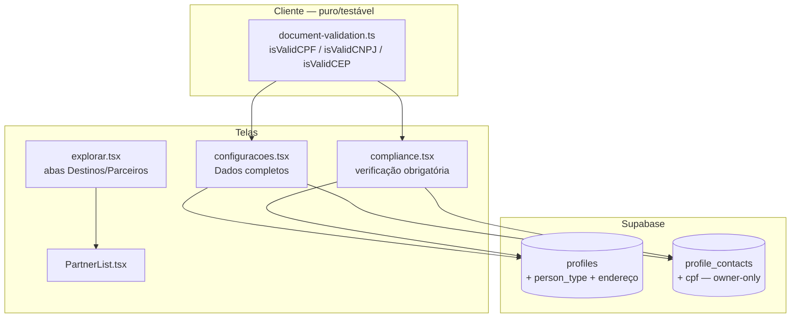

# Design Document

Parceiros e Cadastros Completos

## Overview

Este bloco entrega, sobre a base existente, sem reescrever o que já funciona:

- **Cadastros completos (item 13)**: novas colunas de documento e endereço,
  validação real de CPF/CNPJ (dígito verificador) numa função pura testável,
  edição na tela de Configurações (para todos) e obrigatoriedade só no fluxo de
  verificação do parceiro (Compliance).
- **Parceiros em Explorar (item 8)**: abas Destinos/Parceiros na Explore_Screen,
  reutilizando `fetchPartners`; as rotas antigas seguem intactas.
- **Parceiro = conta (item 2)**, **busca da Home (item 9)** e **avaliações
  (item 3)**: já existem — este bloco garante/documenta e não regride.

Princípio: **validação pura no cliente** (`document-validation.ts`) +
**persistência segura** (documentos/telefone em `profile_contacts` owner-only,
nunca em colunas públicas) + **migração idempotente** (colunas nullable).

## Alinhamento com o código existente

| Arquivo | Papel hoje | Mudança |
|---------|-----------|---------|
| `profiles` | perfil público | + `person_type` (nullable) e endereço estruturado nullable |
| `profile_contacts` (owner-only) | phone/instagram/cnpj/cadastur_number | + `cpf` |
| `src/lib/api.ts` | `updateMyProfile` (allowlist) | + `updateMyContacts` (owner-only), `fetchMyContacts`, allowlist de perfil ampliada (person_type, endereço) |
| `src/routes/configuracoes.tsx` | edita nome/username/location/avatar | + seção "Dados completos" (PF/PJ, documento, endereço, telefone) |
| `src/routes/compliance.tsx` | Cadastur (CNPJ/regex) | validação de dígito verificador + persistência do endereço/documento no perfil |
| `src/routes/explorar.tsx` | só destinos | abas Destinos/Parceiros |
| `src/components/PartnerList.tsx` (novo) | — | grid de parceiros reutilizável (extraído do marketplace) |
| `src/lib/document-validation.ts` (novo) | — | validação pura CPF/CNPJ/CEP |
| `src/routes/marketplace.tsx` | lista completa c/ filtros | inalterada (rota antiga preservada) |

## Architecture



## Components and Interfaces

### 1. `src/lib/document-validation.ts` (novo — puro)

```ts
/** true se o CPF (com ou sem máscara) é válido por dígito verificador. */
export function isValidCPF(value: string | null | undefined): boolean;
/** true se o CNPJ (com ou sem máscara) é válido por dígito verificador. */
export function isValidCNPJ(value: string | null | undefined): boolean;
/** true se o CEP tem 8 dígitos (formato). */
export function isValidCEP(value: string | null | undefined): boolean;
/** Só dígitos (helper). */
export function onlyDigits(value: string | null | undefined): string;
/** Máscaras de exibição. */
export function maskCPF(value: string): string;
export function maskCNPJ(value: string): string;
export function maskCEP(value: string): string;
```

Regras determinísticas: rejeita nulo/vazio, tamanho ≠ 11 (CPF) / 14 (CNPJ),
todos os dígitos iguais, e dígito verificador incorreto. Nunca lança.

### 2. `src/lib/api.ts` — perfil e contatos

```ts
export type PersonType = "pf" | "pj";

// Allowlist de profiles AMPLIADA (campos públicos não sensíveis):
// + person_type, address_zip, address_street, address_number,
//   address_complement, address_neighborhood, address_city, address_state
// (endereço não é dado sensível de contato; documento/telefone vão p/ contacts)

export interface MyContacts {
  phone: string | null;
  phoneSecondary: string | null; // opcional (WhatsApp/2º)
  cnpj: string | null;
  cpf: string | null;
  cadasturNumber: string | null;
  instagram: string | null;
}
export async function fetchMyContacts(): Promise<MyContacts>;
export async function updateMyContacts(patch: Partial<MyContacts>): Promise<void>;
```

`updateMyContacts` faz `upsert` em `profile_contacts` (owner-only por RLS),
validando CPF/CNPJ antes de gravar (recusa inválido — Req 4.4). Não toca em
campos de confiança. `updateMyProfile` continua filtrando pela allowlist (agora
com person_type + endereço).

### 3. `src/routes/configuracoes.tsx` — seção "Dados completos"

- Seletor Person_Type (PF/PJ). PF mostra CPF; PJ mostra CNPJ (CPF do
  responsável opcional). Máscaras via `document-validation`.
- Endereço estruturado (CEP, logradouro, número, complemento, bairro, cidade,
  UF). Telefone(s).
- Salva perfil (person_type + endereço) via `updateMyProfile` e owner-only
  (documento/telefone) via `updateMyContacts`. Pré-preenche de
  `fetchMyProfile` + `fetchMyContacts` (Req 5.3). Invalida cache (Req 5.4).
- Obrigatoriedade: aqui é **parcial/opcional** (Req 4.1/4.3) — só valida o que
  foi preenchido (documento inválido bloqueia salvar aquele campo, Req 4.4).

### 4. `src/routes/compliance.tsx` — verificação obrigatória

- Mantém o fluxo atual (CNPJ, CADASTUR, doc, foto), mas:
  - troca a validação de CNPJ de regex para `isValidCNPJ` (dígito verificador);
  - adiciona endereço obrigatório do parceiro;
  - persiste documento/endereço no perfil/contacts (não só na
    `cadastur_verification_requests`), para o cadastro completo do parceiro
    (Req 4.2). Campos faltantes → mensagem clara.

### 5. `src/components/PartnerList.tsx` (novo)

Grid compacto de parceiros (extraído do card de listagem do marketplace),
recebendo `partners` + `onSelect`/links. Reutilizado pela aba Parceiros da
Explore_Screen. O `marketplace.tsx` permanece como está (não é refatorado
agora, para evitar regressão — só a Explore usa o novo componente).

### 6. `src/routes/explorar.tsx` — abas Destinos/Parceiros (item 8)

- Toggle no topo: **Destinos** (conteúdo atual: mapa + amigos ao vivo + grid de
  destinos + filtros) e **Parceiros** (novo: `PartnerList` com `fetchPartners`
  + campo de busca simples). Um link "ver todos os filtros" leva ao
  `/marketplace` completo (Req 6.2/6.3).
- Tocar num parceiro → `/parceiro/:id` (Req 6.4).

## Data Models

**Migração idempotente** (`supabase/migrations/AAAAMMDD..._cadastros-completos.sql`):

```sql
-- Endereço estruturado + tipo de pessoa em profiles (nullable; endereço não é
-- dado sensível de contato, então pode ficar no perfil).
ALTER TABLE public.profiles
  ADD COLUMN IF NOT EXISTS person_type TEXT
    CHECK (person_type IS NULL OR person_type IN ('pf','pj')),
  ADD COLUMN IF NOT EXISTS address_zip TEXT,
  ADD COLUMN IF NOT EXISTS address_street TEXT,
  ADD COLUMN IF NOT EXISTS address_number TEXT,
  ADD COLUMN IF NOT EXISTS address_complement TEXT,
  ADD COLUMN IF NOT EXISTS address_neighborhood TEXT,
  ADD COLUMN IF NOT EXISTS address_city TEXT,
  ADD COLUMN IF NOT EXISTS address_state TEXT;

-- Documento PF e 2º telefone em profile_contacts (owner-only).
ALTER TABLE public.profile_contacts
  ADD COLUMN IF NOT EXISTS cpf TEXT,
  ADD COLUMN IF NOT EXISTS phone_secondary TEXT;
```

- Tudo nullable → perfis existentes intactos (Req 3.4/8.3). `person_type` com
  CHECK que aceita NULL.
- Documento/telefone em `profile_contacts` (RLS owner-only já existente) —
  nunca em coluna pública (Req 2.7/8.1). Endereço pode ficar em `profiles` (não
  é dado sensível de contato como telefone/documento).
- O trigger `protect_profile_trust_fields` não cobre as novas colunas — o
  usuário pode editá-las livremente, e nenhuma delas é campo de confiança
  (Req 8.2 preservado).

## Error Handling

- CPF/CNPJ inválido → `updateMyContacts`/compliance recusam antes de gravar,
  com mensagem clara; nada é persistido (Req 4.4).
- CEP malformado → validação de formato avisa, mas não bloqueia salvar os
  demais campos (endereço parcial permitido fora da verificação — Req 4.3).
- Entrada nula/vazia nas funções puras → retornam `false`/string vazia, nunca
  lançam (Req 2.6).
- Falha de gravação (rede/RLS) → toast de erro reexecutável, sem quebrar a
  tela.

## Testing Strategy

Vitest + fast-check nas funções puras (sem DOM):
- `document-validation.test.ts`: `isValidCPF`/`isValidCNPJ` (casos válidos
  conhecidos, dígitos repetidos, tamanho errado, verificador errado, com/sem
  máscara); `isValidCEP`; `onlyDigits`/máscaras idempotentes. Property:
  qualquer string retorna boolean, nunca lança; um documento válido mascarado e
  o mesmo sem máscara têm o mesmo resultado.
- Regressão: perfil/marketplace/busca/avaliações intactos; `tsc --noEmit` sem
  novos erros.

## Correctness Properties

### Property 1: Validação de documento é total
Para qualquer string (ou null/undefined), `isValidCPF`/`isValidCNPJ`/`isValidCEP`
retornam `boolean`, nunca lançam.
**Validates: Requirements 2.6**

### Property 2: Máscara não altera validade
Para um documento válido, `isValidCPF(maskCPF(x)) === isValidCPF(x)` (idem
CNPJ) — a validação ignora a máscara.
**Validates: Requirements 2.4, 2.5**

### Property 3: Dígitos repetidos e tamanho errado são inválidos
CPF/CNPJ com todos os dígitos iguais, ou com quantidade de dígitos ≠ 11/14,
são sempre inválidos.
**Validates: Requirements 2.4, 2.5**

### Property 4: onlyDigits é idempotente e só-dígitos
`onlyDigits(onlyDigits(x)) === onlyDigits(x)` e o resultado contém apenas
`[0-9]`.
**Validates: Requirements 2.4, 2.5, 3.2**

### Property 5: Documento sensível nunca vai para coluna pública
A allowlist de `updateMyProfile` NÃO inclui cpf/cnpj/telefone; esses só são
graváveis via `updateMyContacts` (owner-only).
**Validates: Requirements 2.7, 8.1**

## Decisões e trade-offs

- **Documento/telefone em `profile_contacts`, endereço em `profiles`**:
  telefone e documento são dados sensíveis de contato (padrão owner-only já
  estabelecido); endereço estruturado não é mais sensível que a `location`
  pública que já existe, então fica no perfil, simplificando a leitura em
  telas.
- **Validação com dígito verificador**: só formato (regex) aceita documentos
  falsos; o item 13 pede cadastro "válido", então implementamos o verificador
  real numa função pura testável.
- **Obrigatório só na verificação**: cadastro completo opcional para
  aventureiro reduz atrito (decisão do usuário 1(a)); o parceiro preenche tudo
  quando pede o selo (fluxo Compliance já é o gate natural).
- **PF/PJ**: guia autônomo é PF (CPF + CADASTUR), empresa é PJ (CNPJ). O
  CADASTUR continua sendo o que concede o selo verificado, para ambos.
- **`PartnerList` novo em vez de refatorar o marketplace**: extrair só o grid
  reutilizável evita mexer no marketplace (com featured/filtros/slider) e o
  risco de regressão; a Explore ganha a aba Parceiros com o essencial e um
  link para os filtros avançados.
- **Rotas antigas preservadas**: `/marketplace` e `/mercado` continuam; só o
  caminho de descoberta principal muda para Explorar.
