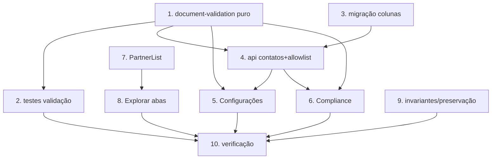

# Implementation Plan

## Overview

Bloco F — parceiros e cadastros completos (itens 2, 3, 8, 9, 13). Validação
pura de CPF/CNPJ/CEP (dígito verificador), colunas nullable de documento
(owner-only) e endereço (perfil), edição em Configurações, obrigatoriedade só
na verificação (Compliance), e abas Destinos/Parceiros em Explorar. Itens 2/9/3
já existem — preservados. Lógica pura testável com Vitest + fast-check.

## Tasks

- [x] 1. Módulo puro de validação de documentos
  - Criar `src/lib/document-validation.ts`: `onlyDigits`, `isValidCPF`,
    `isValidCNPJ` (dígito verificador real), `isValidCEP` (8 dígitos),
    `maskCPF`/`maskCNPJ`/`maskCEP`. Total: nunca lança; nulo/vazio → false.
  - _Requirements: 2.4, 2.5, 2.6, 3.2_

- [x] 2. Testes do módulo de validação
  - Criar `src/lib/document-validation.test.ts` (fast-check): documentos
    válidos conhecidos, dígitos repetidos, tamanho errado, verificador errado,
    com/sem máscara; propriedade máscara-não-altera-validade; onlyDigits
    idempotente; qualquer entrada → boolean sem lançar.
  - _Requirements: 2.4, 2.5, 2.6, 3.2_

- [x] 3. Migração Supabase (colunas de documento e endereço)
  - Criar `supabase/migrations/AAAAMMDD..._cadastros-completos.sql` idempotente:
    `profiles` + `person_type` (CHECK pf/pj, nullable) + endereço estruturado
    nullable; `profile_contacts` + `cpf` + `phone_secondary`.
  - _Requirements: 2.7, 3.1, 3.4, 8.1, 8.3_

- [x] 4. Camada de dados: contatos + allowlist ampliada (api.ts)
  - Adicionar `PersonType`, `MyContacts`, `fetchMyContacts`, `updateMyContacts`
    (upsert owner-only, valida CPF/CNPJ antes de gravar — recusa inválido).
    Ampliar `PROFILE_EDITABLE_FIELDS` com person_type + campos de endereço.
  - _Requirements: 2.7, 4.4, 5.2, 8.1, 8.2_

- [x] 5. Edição do cadastro completo em Configurações
  - `src/routes/configuracoes.tsx`: seção "Dados completos" — Person_Type
    (PF/PJ), documento (CPF/CNPJ conforme tipo, com máscara/validação),
    endereço estruturado, telefone(s). Pré-preenche de fetchMyProfile +
    fetchMyContacts; salva via updateMyProfile + updateMyContacts; invalida
    cache. Opcional/parcial (não bloqueia). i18n.
  - _Requirements: 4.1, 4.3, 4.4, 5.1, 5.2, 5.3, 5.4_

- [x] 6. Validação e persistência no fluxo de verificação (Compliance)
  - `src/routes/compliance.tsx`: trocar validação de CNPJ para `isValidCNPJ`
    (dígito verificador); adicionar endereço obrigatório; persistir documento/
    endereço no perfil/contacts além da request. Campos faltantes → mensagem
    clara. Obrigatoriedade do parceiro (Req 4.2).
  - _Requirements: 2.1, 2.2, 2.3, 2.5, 4.2, 4.4_

- [x] 7. Componente PartnerList reutilizável
  - Criar `src/components/PartnerList.tsx`: grid compacto de parceiros
    (posição/foto/nome/rating/preço/verificado) com links para /parceiro/:id.
    Extraído do padrão do marketplace, sem alterar o marketplace.
  - _Requirements: 6.2, 6.4_

- [x] 8. Abas Destinos/Parceiros em Explorar (item 8)
  - `src/routes/explorar.tsx`: toggle Destinos (atual) / Parceiros (PartnerList
    + busca simples + link "todos os filtros" → /marketplace). Sem regressão de
    destinos/mapa/amigos ao vivo. i18n das abas.
  - _Requirements: 6.1, 6.2, 6.3, 6.4_

- [x] 9. Garantir invariante parceiro=conta e preservações
  - Confirmar/documentar item 2 (parceiro é role='partner' sobre conta auth;
    seed é exceção). Verificar que busca da Home (item 9) e avaliações (item 3)
    seguem sem regressão. Sem código novo além de documentação/checagem.
  - _Requirements: 1.1, 1.2, 1.3, 7.1, 7.2_

- [x] 10. Verificação final e regressão
  - Rodar testes novos + `npx tsc --noEmit` (só os 6 erros pré-existentes de
    use-local-push.ts). Confirmar perfil/marketplace/explorar/compliance/busca
    sem regressão.
  - _Requirements: 8.3, 8.4_

## Task Dependency Graph



```json
{
  "waves": [
    { "wave": 1, "tasks": ["1", "3", "7"] },
    { "wave": 2, "tasks": ["2", "4"] },
    { "wave": 3, "tasks": ["5", "6", "8", "9"] },
    { "wave": 4, "tasks": ["10"] }
  ]
}
```

## Notes

- Documento/telefone → `profile_contacts` (owner-only). Endereço/person_type →
  `profiles` (nullable; não é dado sensível de contato como a `location` já
  pública).
- Validação de CPF/CNPJ com dígito verificador (não só regex de formato).
- PF → CPF; PJ → CNPJ (+ CPF do responsável opcional). CADASTUR concede o selo
  para ambos.
- Cadastro completo opcional em geral; obrigatório só no fluxo de verificação
  do parceiro.
- `marketplace.tsx`/`/mercado` preservados; Explorar vira o caminho principal.
- Rodar testes com output em arquivo (Vite server pendura o terminal):
  `npx vitest run <arquivo> --reporter=basic > out.txt 2>&1`.
