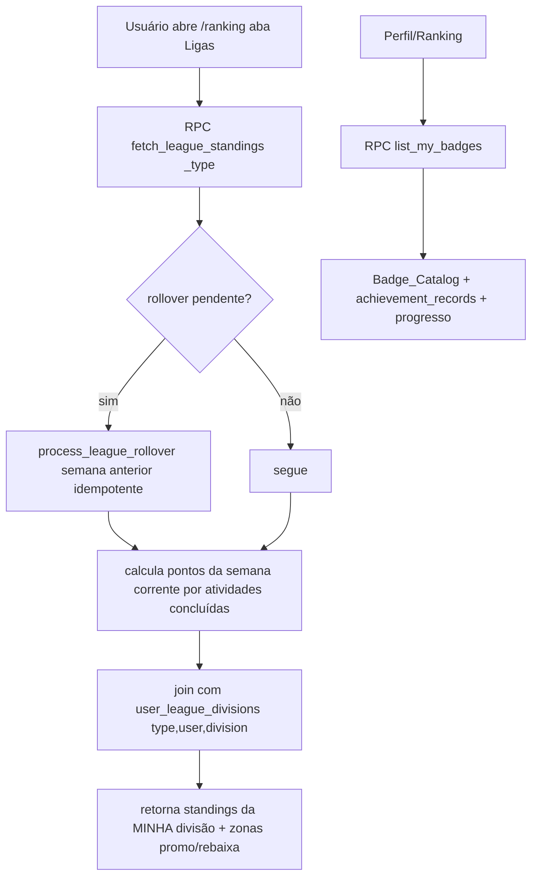

# Design Document

Ranking: Ligas Semanais + Badges (Bloco 2 pré-lojas)

## Overview

Adiciona duas frentes ao Ranking existente, sem regressão:

1. **Ligas semanais** (Bronze → Prata → Ouro → Diamante), por Activity_Type,
   com promoção/rebaixamento ao virar a semana. O ranking da liga é **derivado
   determinísticamente** das atividades concluídas da semana (não há placar
   acumulado frágil); só a **divisão** do usuário é estado persistido, evoluída
   pelo rollover semanal idempotente.
2. **Tela de Conquistas (Badges)** que exibe as `achievement_records` já
   concedidas (obtidas x a obter, com progresso), reaproveitando o mecanismo
   `SECURITY DEFINER` existente, e amplia o catálogo.

A base atual (métrica/escopo/período/abas por tipo) permanece. As Ligas entram
como uma **aba** dentro de `/ranking` (barra inferior mantida).

## Steering Alignment

- Ranking cross-usuário só via RPC `SECURITY DEFINER` (RLS não permite leitura
  cruzada de `user_activities`) — mesmo padrão de `fetch_activity_ranking`.
- Migrations novas timestampadas e idempotentes, 2× + reload PostgREST,
  refletidas em `migrations-pendentes.sql`.
- Sem cron disponível → rollover semanal por RPC sob demanda com trava de
  idempotência por semana (mesma ideia usada em outras rotinas do projeto).
- Identidade verde-floresta + acento laranja; i18n pt-BR/en com `defaultValue`.
- Não tocar na captura/validação/distância/elevação (integridade Strava).

## Architecture



## Components and Interfaces

### Banco (migrations)

**`user_league_divisions`** — divisão atual por usuário e tipo:
```
user_id uuid, activity_type text NULL (NULL = "geral/todos"),
division text CHECK (bronze|prata|ouro|diamante) DEFAULT 'bronze',
updated_week date,  -- segunda-feira da semana do último rollover aplicado
PRIMARY KEY (user_id, activity_type)
```
RLS: usuário lê a própria linha; escrita só via RPC `SECURITY DEFINER`.

**`league_rollover_log`** — trava de idempotência do rollover:
```
week_start date, activity_type text NULL, processed_at timestamptz,
PRIMARY KEY (week_start, activity_type)
```

**Pontuação (função pura SQL)** `league_points_expr(distance_meters, elevation_gain)`:
`round(distance_meters/100) + round(coalesce(elevation_gain,0))` (1 ponto por
100 m percorridos + 1 ponto por metro de elevação). Determinística; definida no
design e testável por um teste puro TS equivalente em `src/lib/league-points.ts`.

**RPCs (`SECURITY DEFINER`):**
- `fetch_league_standings(_activity_type text, _limit int)` →
  para o `auth.uid()`: resolve a semana corrente (seg→dom, America/Sao_Paulo),
  garante a divisão do usuário (insere `bronze` se ausente), soma os pontos da
  semana por usuário DENTRO da mesma divisão do solicitante, retorna a lista
  ordenada (pos, user, nome, avatar, pontos), + a divisão e os limites de
  promoção/rebaixamento. Chama `process_league_rollover` para semanas fechadas
  ainda não processadas (idempotente via `league_rollover_log`).
- `process_league_rollover(_week_start date, _activity_type text)` →
  idempotente: se já há linha em `league_rollover_log`, retorna sem efeito;
  senão, para cada divisão, ordena os participantes daquela semana por pontos,
  promove os top N (sobe divisão, exceto diamante) e rebaixa os bottom M (desce,
  exceto bronze), grava `updated_week`, e registra o log. Inatividade: quem não
  pontuou não é promovido; rebaixamento por inatividade só se a divisão estiver
  cheia (regra conservadora — não pune quem acabou de entrar).
- `list_my_badges()` → retorna o catálogo com flag `earned` e `progress`
  (0..1) por badge para o `auth.uid()`, cruzando `achievement_records` +
  estatísticas (`user_achievement_stats`, streak, destinos, contagem por tipo).
- Ampliar `grant_pending_achievements` com novas regras por tipo/streak
  (ex.: `streak_7`, `streak_30`, `pedalada_10`, `corrida_10`, `trilha_10`),
  mantendo `ON CONFLICT DO NOTHING`.

### Frontend

- `src/lib/league.ts` — tipos + `fetchLeagueStandings(activityType)` e
  `fetchMyBadges()`; `src/lib/league-points.ts` — `leaguePoints(distance, elev)`
  (puro, espelha a SQL, testável).
- `src/routes/ranking.tsx` — nova aba de topo **"Liga"** ao lado do ranking
  clássico. Na aba Liga: card da divisão (medalha + nome), lista de standings da
  minha divisão com destaque do "Você", zonas de promoção (topo, verde) e
  rebaixamento (base, vermelho), contador "faltam X dias para fechar a semana".
  Respeita a aba de Activity_Type já existente.
- `src/routes/conquistas.tsx` (nova rota flat, routeTree manual) —
  Achievements_Screen: grid de badges obtidas (coloridas) e a obter (esmaecidas
  + barra de progresso). Link a partir do Perfil (seção "App"/"Minhas coisas") e
  um atalho no Ranking.
- i18n `league.*` e `achievements.*` (pt-BR/en).

## Data Models

| Tabela | Campos | RLS |
|--------|--------|-----|
| `user_league_divisions` | user_id, activity_type(NULL=geral), division, updated_week | SELECT próprio; escrita via RPC |
| `league_rollover_log` | week_start, activity_type, processed_at | sem acesso ao cliente (só RPC) |

Standings e pontos são **derivados** (não persistidos) — recalculados por RPC.

## Error Handling

- `fetch_league_standings` sem atividade na semana → retorna lista vazia +
  divisão do usuário (estado vazio na UI, sem erro).
- Rollover concorrente → `INSERT ... ON CONFLICT (week_start, activity_type) DO
  NOTHING` garante processamento único.
- Badge sem critério mensurável → `progress` = 0/1 (obtida ou não), sem barra.
- Falha de rede nas RPCs → React Query error state com retry (padrão do app).

## Correctness Properties

### Property 1: Idempotência do rollover
Processar o rollover da mesma `(week_start, activity_type)` duas vezes produz o
mesmo estado final (promoções/rebaixamentos aplicados uma única vez).
**Validates: Requirements 1.7**

### Property 2: Determinismo da pontuação
Para as mesmas atividades da semana, `leaguePoints` retorna sempre o mesmo total
(inteiro >= 0), sem depender de estado acumulado.
**Validates: Requirements 2.4**

### Property 3: Pontos só do próprio tipo
Uma atividade do tipo X contribui apenas para a liga do tipo X (e para a geral),
nunca para a liga de outro tipo.
**Validates: Requirements 2.3**

### Property 4: Divisão dentro do domínio
A divisão resultante do rollover está sempre em {bronze,prata,ouro,diamante};
diamante nunca "sobe" e bronze nunca "desce".
**Validates: Requirements 1.4**

### Property 5: Sem regressão do ranking clássico
As chamadas existentes de `fetch_activity_ranking` continuam funcionando com a
mesma assinatura e resultados.
**Validates: Requirements 4.1**

## Testing Strategy

- **Unit (vitest, puro):** `league-points.test.ts` — Properties 2 e 3
  (determinismo, não-negatividade, isolamento por tipo via cálculo por lista).
- **Migration:** aplicar 2× local (idempotência do schema e do rollover via
  `league_rollover_log`) + reload PostgREST.
- **Verificação:** `get_diagnostics` + `build:native`; rotas flat verificadas
  após o build (routeTree manual para `/conquistas`).
- Não criar testes que importem hooks/Capacitor.
