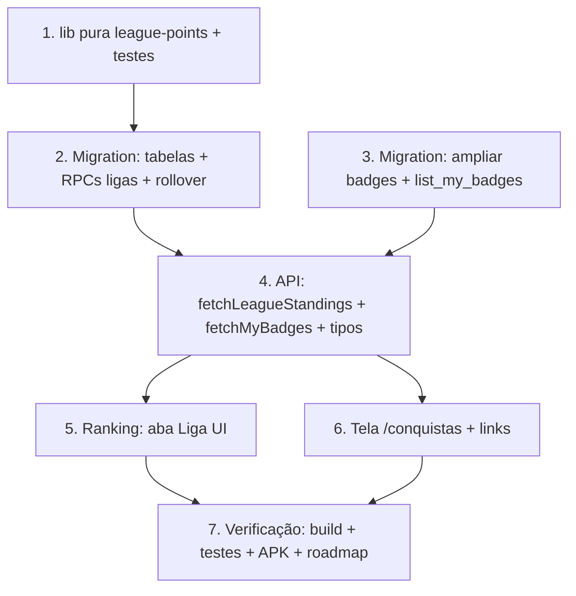

# Implementation Plan

Ranking: Ligas Semanais + Badges (Bloco 2 pré-lojas)

## Overview

Adiciona ligas semanais (Bronze→Diamante, por tipo, promo/rebaixa idempotente) e
uma tela de conquistas que exibe as badges já concedidas + amplia o catálogo.
Ranking clássico intacto; barra inferior mantida (Liga vira aba do Ranking).

## Task Dependency Graph



```json
{
  "waves": [
    { "wave": 1, "tasks": ["1"] },
    { "wave": 2, "tasks": ["2", "3"] },
    { "wave": 3, "tasks": ["4"] },
    { "wave": 4, "tasks": ["5", "6"] },
    { "wave": 5, "tasks": ["7"] }
  ]
}
```

## Tasks

- [x] 1. Função pura de pontuação + testes
  - `src/lib/league-points.ts`: `leaguePoints(distanceMeters, elevationGain)` =
    `round(distance/100) + round(max(0,elev))`; `sumLeaguePoints(activities[])`.
  - `src/lib/league-points.test.ts` (vitest + fast-check): Property 2
    (determinismo/não-negatividade) e Property 3 (isolamento por tipo via soma
    filtrada por tipo).
  - _Requisitos: 2.4, 2.3; Properties 2, 3_

- [x] 2. Migration: ligas (tabelas + RPCs + rollover)
  - `<ts>_league-weekly.sql` (idempotente): `user_league_divisions`,
    `league_rollover_log` (+RLS), `league_points_expr(...)`,
    `fetch_league_standings(_activity_type, _limit)` e
    `process_league_rollover(_week_start, _activity_type)` (SECURITY DEFINER).
  - Semana seg→dom America/Sao_Paulo; promo top N / rebaixa bottom M; diamante
    não sobe, bronze não desce; rollover idempotente via log.
  - Aplicar 2× + reload; refletir em `migrations-pendentes.sql`.
  - _Requisitos: 1.1–1.7, 2.1, 2.2, 5.1; Properties 1, 4_

- [x] 3. Migration: badges (catálogo + list_my_badges + novas regras)
  - `<ts>_badges-catalog.sql` (idempotente): `list_my_badges()` retornando
    catálogo (code/título/desc/ícone) + `earned` + `progress` cruzando
    `achievement_records`/`user_achievement_stats`/streak/destinos/por-tipo.
  - Ampliar `grant_pending_achievements` com `streak_7`, `streak_30`,
    `pedalada_10`, `corrida_10`, `trilha_10` (ON CONFLICT DO NOTHING).
  - Aplicar 2× + reload; refletir em `migrations-pendentes.sql`.
  - _Requisitos: 3.4, 3.5, 5.1_

- [x] 4. API + tipos
  - `src/lib/league.ts`: `fetchLeagueStandings(activityType)`, `fetchMyBadges()`,
    tipos `LeagueStanding`/`LeagueDivision`/`BadgeItem`.
  - _Requisitos: 1.3, 3.1, 3.2_

- [x] 5. Ranking: aba "Liga"
  - `ranking.tsx`: alternador de topo (Clássico | Liga). Aba Liga: card da
    divisão, standings da minha divisão (destaque "Você"), zonas promo (verde)/
    rebaixa (vermelho), dias até fechar a semana; respeita aba de tipo. Estado
    vazio sem erro. i18n `league.*`.
  - _Requisitos: 1.3, 4.1, 4.2, 4.3, 4.4_

- [x] 6. Tela de Conquistas
  - `src/routes/conquistas.tsx` (rota flat, routeTree manual): grid obtidas x a
    obter + progresso. Links do Perfil e atalho no Ranking. i18n `achievements.*`.
  - _Requisitos: 3.1, 3.2, 3.3_

- [x] 7. Verificação e entrega
  - `get_diagnostics` + testes puros; `build:native` + `cap sync` + APK; rotas
    flat verificadas após build. Commit + push main; atualizar roadmap.
  - _Requisitos: 4.1_

## Notes

- Cross-usuário só via RPC SECURITY DEFINER (RLS não permite leitura cruzada).
- Migrations idempotentes 2× + reload; refletir em `migrations-pendentes.sql`.
- routeTree.gen.ts editado MANUALMENTE para `/conquistas` (rota flat); verificar
  no grep após o build que sobreviveu.
- Testes puros em `src/lib/` (não importar hooks/Capacitor).
- Rollover sem cron: disparado sob demanda em `fetch_league_standings`, com
  trava por `league_rollover_log`.
