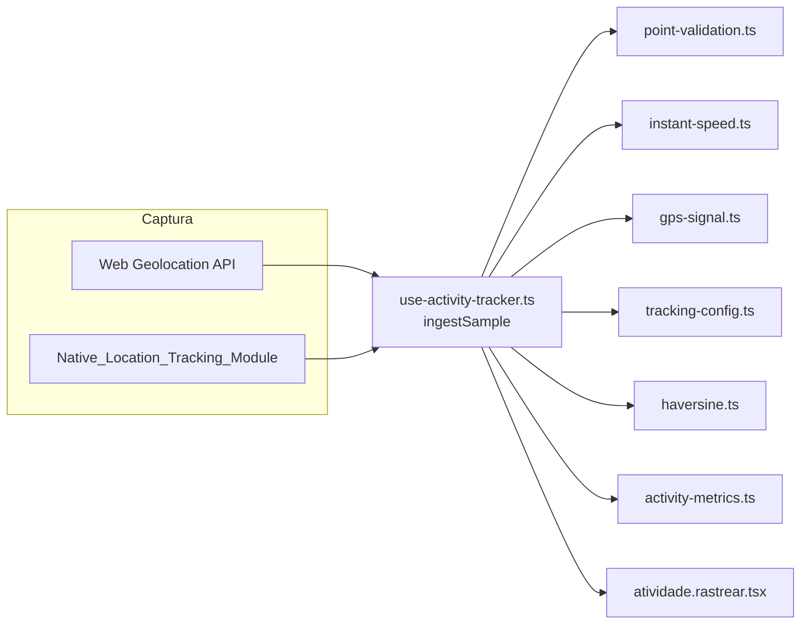
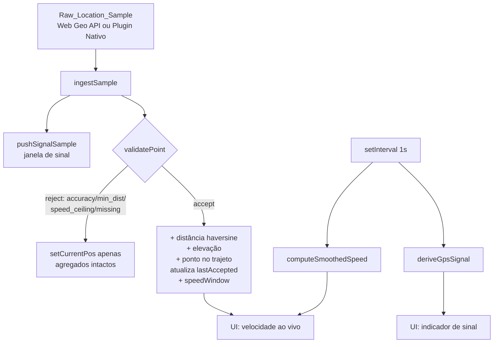

# Design Document

Rastreamento Preciso de GPS (confiabilidade estilo Strava)

## Overview

Este design introduz uma **camada pura de validação e derivação de métricas**
entre a captura bruta de localização (Web Geolocation API ou
Native_Location_Tracking_Module) e a acumulação de distância/trajeto/velocidade
no `use-activity-tracker.ts`. O objetivo é que distância, trajeto, velocidade
e tempo reflitam o movimento real do usuário, com qualidade comparável ao
Strava, corrigindo os dois problemas observados: velocidade de "corrida"
enquanto se caminha, e trajeto distorcido por ruído de GPS.

Decisão central de arquitetura: **toda a lógica de decisão é extraída para
funções puras** em novos módulos `src/lib/`, testáveis isoladamente (Vitest +
fast-check), enquanto o hook `use-activity-tracker.ts` apenas orquestra estado
e chama essas funções. Isso segue o padrão já existente no projeto
(`activity-metrics.ts`, `location-checkpoint.ts`, `haversine.ts` são puros) e
evita reescrever a base de rastreamento.

Nenhuma mudança de schema/banco é necessária: o trajeto continua persistido
como `route_geojson` (LineString) e a distância/elevação nos campos já
existentes de `user_activities`. A filtragem apenas decide **quais amostras
entram** nesses agregados.

## Architecture

A arquitetura separa **decisão pura** (funções sem I/O em `src/lib/`) de
**orquestração de estado** (o hook `use-activity-tracker.ts`). A camada de
captura (Web Geolocation API fora do shell nativo; Native_Location_Tracking_Module
dentro dele) permanece inalterada e passa a alimentar um único ponto de
entrada de processamento (`ingestSample`) no hook, que delega toda a lógica de
aceitar/rejeitar ponto, suavizar velocidade e derivar sinal às funções puras.



Camadas:
- **Configuração** (`tracking-config.ts`): limiares por Activity_Type.
- **Validação** (`point-validation.ts`): aceita/rejeita amostra.
- **Métricas ao vivo** (`instant-speed.ts`, reuso de `activity-metrics.ts`).
- **Sinal** (`gps-signal.ts`): estado de qualidade do GPS.
- **Orquestração** (`use-activity-tracker.ts`): estado React, refs, timers.
- **Apresentação** (`atividade.rastrear.tsx`): consome estados expostos.

### Alinhamento com o código existente

| Arquivo | Papel hoje | Mudança neste design |
|---------|-----------|----------------------|
| `src/hooks/use-activity-tracker.ts` | captura pontos, acumula distância/elevação, timer, auto-pause, persistência | passa a delegar a decisão de aceitar/rejeitar ponto e a derivar velocidade às funções puras; mantém orquestração |
| `src/lib/haversine.ts` | distância entre 2 coords | reutilizado como está |
| `src/lib/activity-metrics.ts` | Average_Speed/Pace a partir de totais | reutilizado; ganha companhia de `instant-speed.ts` para velocidade ao vivo |
| `src/lib/activity-storage.ts` | persistência local + Sync_Queue | ganha campo opcional para restaurar a "última posição de referência" (retrocompat) |
| `native/.../definitions.ts` | contrato do plugin nativo | inalterado (já expõe `accuracy`, `altitude`, `speed`) |
| `src/routes/atividade.rastrear.tsx` | UI de rastreamento | consome novos estados: `smoothedSpeed`, `gpsSignalState` |

## Components and Interfaces

Novos módulos (todos puros, sem I/O):

### 1. `src/lib/tracking-config.ts` — parâmetros calibráveis por tipo

Fonte única dos limiares, calibrados por Activity_Type. Valores default
escolhidos a partir de faixas típicas de GPS de smartphone e velocidades
plausíveis por modalidade:

```ts
export interface TrackingProfile {
  /** Accuracy_Radius máximo aceitável, em metros (Requirement 1). */
  maxAccuracyMeters: number;
  /** Deslocamento mínimo entre pontos aceitos, em metros (Requirement 3). */
  minDistanceMeters: number;
  /** Speed_Ceiling: velocidade máxima plausível, em m/s (Requirement 2). */
  maxSpeedMps: number;
}

// Limiar de acurácia default: 12m (Requirement 1.4 — mais estrito que 20m).
// Faixa configurável permitida: [5, 20] metros.
export const ACCURACY_MIN = 5;
export const ACCURACY_MAX = 20;

// Política para amostra sem accuracy (Requirement 1.3): rejeitar por padrão.
export const MISSING_ACCURACY_POLICY: "accept" | "reject" = "reject";

export const TRACKING_PROFILES: Record<ActivityType, TrackingProfile> = {
  // caminhada: ~1.4 m/s normal; teto 4 m/s (~14 km/h) cobre corrida leve.
  // minDistance 1.5m: estritamente < 2m atual (Req 3.5) sem impedir passos.
  caminhada: { maxAccuracyMeters: 12, minDistanceMeters: 1.5, maxSpeedMps: 4 },
  // pedalada: teto 25 m/s (~90 km/h) cobre descidas
  pedalada:  { maxAccuracyMeters: 15, minDistanceMeters: 5, maxSpeedMps: 25 },
  // trilha: caminhada em terreno irregular; teto 6 m/s
  trilha:    { maxAccuracyMeters: 15, minDistanceMeters: 1.5, maxSpeedMps: 6 },
  // outro: conservador porém permissivo; teto 30 m/s
  outro:     { maxAccuracyMeters: 15, minDistanceMeters: 2, maxSpeedMps: 30 },
};

export const DEFAULT_PROFILE: TrackingProfile = TRACKING_PROFILES.outro;
```

**Decisão sobre deslocamento mínimo (Requirement 3):** `caminhada`/`trilha`
usam `minDistanceMeters = 1.5` (estritamente menor que o valor fixo atual de
2m, atendendo Req 3.5, sem impedir uma passada real). A redução efetiva da
deriva com o usuário parado vem da combinação de três filtros: **acurácia**
(12m descarta leituras ruins), **Speed_Ceiling** (rejeita saltos implausíveis)
e o próprio deslocamento mínimo. Nenhum filtro isolado resolve; juntos, eliminam
a inflação que faz "andar" virar "correr".

### 2. `src/lib/point-validation.ts` — decisão de aceitar/rejeitar

Função pura que decide o destino de uma amostra, dado o estado de referência:

```ts
export type RejectionReason = "accuracy" | "min_distance" | "speed_ceiling" | "missing_accuracy";

export interface ValidationRefState {
  /** Última Accepted_Point (referência), ou null se ainda não há origem. */
  lastAccepted: { lat: number; lng: number; ts: number } | null;
}

export interface RawSample {
  lat: number; lng: number; ts: number;
  accuracy?: number | null; // metros
  altitude?: number | null;
  speed?: number | null;
}

export type ValidationResult =
  | { accepted: true }
  | { accepted: false; reason: RejectionReason };

export function validatePoint(
  sample: RawSample,
  ref: ValidationRefState,
  profile: TrackingProfile,
  missingAccuracyPolicy: "accept" | "reject",
): ValidationResult;
```

Ordem de avaliação (determinística):
1. **Acurácia** (Req 1): se `accuracy == null` → aplica `missingAccuracyPolicy`.
   Se `accuracy > maxAccuracyMeters` → `reject:accuracy`.
2. **Primeira origem** (Req 2.6/5.3): se `ref.lastAccepted == null` → `accept`
   (vira a origem; não avalia distância nem velocidade).
3. **Speed_Ceiling** (Req 2): `dt = (sample.ts - lastAccepted.ts)/1000`. Se
   `dt <= 0` → `reject:speed_ceiling` (Req 2.4, política determinística). Senão
   `v = haversineMeters(lastAccepted, sample)/dt`; se `v > maxSpeedMps` →
   `reject:speed_ceiling`.
4. **Deslocamento mínimo** (Req 3): `d = haversineMeters(lastAccepted, sample)`;
   se `d < minDistanceMeters` → `reject:min_distance`.
5. Caso contrário → `accept`.

Regra-chave (Req 2.7/3.6): **o chamador só atualiza `lastAccepted` quando o
resultado é `accept`.** Amostras rejeitadas nunca movem a referência.

### 3. `src/lib/instant-speed.ts` — velocidade instantânea suavizada

```ts
export interface SpeedWindowPoint { lat: number; lng: number; ts: number; }

export const SPEED_WINDOW_SIZE = 5;         // nº de Accepted_Points na janela
export const SPEED_STALE_MS = 5_000;        // validade da última leitura (Req 4.7)

/**
 * Smoothed_Speed em m/s a partir dos últimos Accepted_Points (média móvel
 * ponderada pela distância/tempo da janela). Retorna null quando não há
 * pontos suficientes ou a janela está velha (Req 4.3, 4.7).
 */
export function computeSmoothedSpeed(
  window: SpeedWindowPoint[],
  nowTs: number,
): number | null;
```

Algoritmo: soma as distâncias haversine entre pontos consecutivos da janela e
divide pela soma dos `dt` correspondentes (isto é, velocidade média da janela
curta — suaviza o ruído sem depender do `speed` cru do sensor, Req 4.2). Se
`window.length < 2` → `null` (Req 4.3). Se `nowTs - último.ts > SPEED_STALE_MS`
→ `null` (Req 4.7). Durante pausa (auto/manual) o hook força exibição de zero
(Req 4.4/4.5) sem chamar esta função.

### 4. `src/lib/gps-signal.ts` — estado de qualidade do sinal

```ts
export type GpsSignalState = "aquisitando" | "bom" | "fraco" | "sem_sinal";

export const SIGNAL_WINDOW_SIZE = 5;
export const NO_SIGNAL_TIMEOUT_MS = 8_000;

export function deriveGpsSignal(input: {
  recentAccuracies: number[];   // Accuracy_Radius das últimas amostras
  msSinceLastSample: number;
  hasFirstAcceptedPoint: boolean;
  maxAccuracyMeters: number;
}): GpsSignalState;
```

Precedência determinística (Req 6.6): `sem_sinal` (msSinceLastSample >
NO_SIGNAL_TIMEOUT_MS) → `aquisitando` (!hasFirstAcceptedPoint) → `fraco`
(todas as acurácias recentes > maxAccuracyMeters) → `bom`.

## Integração no `use-activity-tracker.ts`

O handler de cada amostra (hoje duplicado no ramo nativo e no ramo web de
`startWatch`) passa a chamar um **único caminho de processamento**:

```ts
function ingestSample(sample: RawSample) {
  // 1. registra chegada para GPS_Signal_State (timestamp + accuracy na janela)
  pushSignalSample(sample);
  const profile = TRACKING_PROFILES[activityTypeRef.current ?? "outro"] ?? DEFAULT_PROFILE;
  const res = validatePoint(sample, { lastAccepted: lastAcceptedRef.current }, profile, MISSING_ACCURACY_POLICY);

  // posição exibida no mapa pode atualizar mesmo se rejeitado (Req 3.7)
  setCurrentPos({ lat: sample.lat, lng: sample.lng, ts: sample.ts, ... });

  if (!res.accepted) return; // referência e agregados intactos (Req 1.1, 2.3, 3.1)

  const prev = lastAcceptedRef.current;
  if (prev) {
    distanceRef.current += haversineMeters(prev, sample);
    setDistance(distanceRef.current);
    // elevação: mesma regra atual (subida > limiar), só entre Accepted_Points
  }
  lastAcceptedRef.current = { lat: sample.lat, lng: sample.lng, ts: sample.ts };
  pointsRef.current = [...pointsRef.current, acceptedPoint];
  setPoints(pointsRef.current);
  pushSpeedWindow(acceptedPoint);
  lastMovementTsRef.current = Date.now(); // alimenta auto-pause existente
}
```

Novas refs/estados no hook:
- `lastAcceptedRef` — última Accepted_Point (substitui o uso de
  `pointsRef.current[last]` para validação; é a "referência" do Req 2.7/3.6).
- `speedWindowRef` — janela de Accepted_Points para Smoothed_Speed.
- `signalSamplesRef` + `lastSampleTsRef` — para GPS_Signal_State.
- `smoothedSpeed: number | null` (estado exposto).
- `gpsSignalState: GpsSignalState` (estado exposto).

Recálculo de `smoothedSpeed`/`gpsSignalState`: num `setInterval` de 1s já
existente (o mesmo do timer) para evitar re-render por ponto e aplicar
`SPEED_STALE_MS`/`NO_SIGNAL_TIMEOUT_MS`.

**Restauração (Req 7.4/7.5):** ao restaurar `ActivePersisted`,
`lastAcceptedRef` é reidratado a partir do **último ponto de `points`**
(que, por construção, só contém Accepted_Points). Assim não há salto
artificial ao voltar. Se `points` vazio → `lastAcceptedRef = null` (próxima
amostra vira origem).

## Data Models

**Nenhuma mudança de schema no banco.** O trajeto continua persistido como
`route_geojson` (LineString) em `public.user_activities`, com distância e
elevação nos campos já existentes. A filtragem apenas decide quais amostras
compõem esses agregados.

**Persistência local (`activity-storage.ts`) — sem novo campo.**
`ActivePersisted.points` passa a conter, por construção, apenas
Accepted_Points. A "última posição de referência" para validação é derivada
de `points[points.length - 1]` na restauração — não é necessário persistir um
campo novo. Retrocompatibilidade total: registros antigos continuam válidos e
seus pontos são tratados como Accepted_Points.

Tipos em memória (não persistidos), definidos nos módulos puros:

| Tipo | Módulo | Papel |
|------|--------|-------|
| `TrackingProfile` | `tracking-config.ts` | limiares por Activity_Type |
| `RawSample` | `point-validation.ts` | amostra bruta normalizada (web/nativo) |
| `ValidationRefState` | `point-validation.ts` | referência (`lastAccepted`) |
| `ValidationResult` | `point-validation.ts` | `accept` ou `reject:reason` |
| `SpeedWindowPoint` | `instant-speed.ts` | ponto da janela de velocidade |
| `GpsSignalState` | `gps-signal.ts` | `aquisitando`/`bom`/`fraco`/`sem_sinal` |

A `RawSample` normaliza as duas fontes: o plugin nativo usa `-1` para
`altitude`/`speed` indisponíveis (converter para `null`); a Web Geolocation
API usa `null`. `accuracy` do plugin é sempre presente; da Web pode faltar
(aplica `MISSING_ACCURACY_POLICY`).

## Error Handling

- **Amostra sem acurácia:** política determinística `MISSING_ACCURACY_POLICY`
  = `"reject"` (Req 1.3). Nunca comportamento indefinido.
- **Intervalo de tempo não-positivo (`dt <= 0`):** `validatePoint` retorna
  `reject:speed_ceiling` sem dividir por zero (Req 2.4, Property 4).
- **Janela de velocidade insuficiente ou velha:** `computeSmoothedSpeed`
  retorna `null`; a UI exibe "—" (Req 4.3/4.7). Nunca `NaN`/`Infinity`.
- **Warmup sem fixação dentro do tempo máximo:** mantém atividade ativa, sem
  origem, exibindo `aquisitando`/aviso de sinal; fixa assim que uma amostra
  válida chegar (Req 5.5).
- **Config inválida:** `Limiar_Acuracia` fora de `[ACCURACY_MIN, ACCURACY_MAX]`
  é rejeitado na configuração (Req 1.4, Property 9).
- **Falhas offline/persistência:** inalteradas — o design não introduz novas
  chamadas de rede; validação é 100% local (Req 7.7).

## Testing Strategy

Testes unitários e property-based com **Vitest + fast-check**, concentrados
nas funções puras (determinísticas, sem I/O), seguindo o padrão já usado no
projeto para `activity-metrics.ts`/`location-checkpoint.ts`:

- `point-validation.test.ts` — cada `RejectionReason`; bordas de igualdade nos
  limiares; `dt <= 0`; primeira origem; referência preservada após rejeição.
- `instant-speed.test.ts` — janela insuficiente → `null`; janela velha →
  `null`; property: resultado sempre `null` ou finito >= 0.
- `gps-signal.test.ts` — precedência determinística dos estados.
- `tracking-config.test.ts` — invariantes (caminhada < pedalada; defaults na
  faixa válida).
- Property tests transversais: nenhuma sequência de amostras produz
  `NaN`/`Infinity`; Rejected_Points nunca alteram distância/trajeto.

Verificação de integração manual/emulada no `use-activity-tracker.ts` cobre a
orquestração (restauração sem salto, atualização de mapa em rejeição, pausa
força velocidade zero).

## Diagrama de fluxo



## Correctness Properties

### Property 1: Rejeição não altera agregados
Para qualquer amostra que `validatePoint` rejeite, distância, trajeto e
elevação permanecem idênticos aos valores anteriores.
**Validates: Requirements 1.1, 2.3, 3.1, 3.7**

### Property 2: Referência estável
A `lastAccepted` de referência só muda quando uma amostra é aceita; amostras
rejeitadas nunca a movem.
**Validates: Requirements 2.7, 3.6**

### Property 3: Speed_Ceiling por tipo
Para todo par de amostras cujo deslocamento implica `v > maxSpeedMps` do
perfil, o resultado é `reject:speed_ceiling`; e `maxSpeedMps(caminhada) <
maxSpeedMps(pedalada)`.
**Validates: Requirements 2.1, 2.5**

### Property 4: dt não-positivo é seguro
Quando `dt <= 0`, `validatePoint` retorna rejeição determinística e nunca
divide por zero nem produz Infinity.
**Validates: Requirements 2.4**

### Property 5: Primeira origem
Quando `lastAccepted == null`, uma amostra que passa na acurácia é sempre
aceita, sem avaliar distância/velocidade.
**Validates: Requirements 2.6, 5.3**

### Property 6: Velocidade nunca inválida
`computeSmoothedSpeed` retorna `null` ou um número finito >= 0 — nunca
NaN/Infinity — para qualquer entrada.
**Validates: Requirements 4.2, 4.3, 4.7**

### Property 7: Coerência final
O Average_Speed final derivado dos totais (Accepted_Points) é o mesmo
`computeActivityMetrics` já usado ao vivo — sem divergência além de
arredondamento.
**Validates: Requirements 4.1, 4.6**

### Property 8: Sinal determinístico
`deriveGpsSignal` respeita a precedência `sem_sinal > aquisitando > fraco >
bom` para qualquer combinação de entradas.
**Validates: Requirements 6.6**

### Property 9: Limiar de acurácia válido
O `maxAccuracyMeters` default é < 20 e dentro de `[ACCURACY_MIN,
ACCURACY_MAX]`; valores fora da faixa são rejeitados na configuração.
**Validates: Requirements 1.4**

### Property 10: Distância só de aceitos
A distância acumulada é sempre a soma das distâncias haversine entre
Accepted_Points consecutivos, sem contribuição de Rejected_Points.
**Validates: Requirements 4.1, 7.2**

## Decisões e trade-offs

- **Média móvel vs. Kalman:** optamos por média móvel curta sobre
  Accepted_Points (simples, determinística, testável) em vez de filtro de
  Kalman (mais preciso, porém mais complexo e difícil de testar/validar em
  property tests). A combinação acurácia + speed ceiling + min distance já
  resolve a inflação de velocidade que causa o "andar vira correr". Kalman
  fica como evolução futura, se necessário, sem quebrar este design.
- **Limiar de acurácia 12m (caminhada):** compromisso entre descartar ruído e
  não interromper o rastreamento em céu aberto. Configurável em `[5,20]`.
- **Não persistir referência separada:** derivá-la de `points[last]` evita
  novo campo e mantém retrocompatibilidade total do `ActivePersisted`.
- **Sem mudança nativa:** o plugin já entrega `accuracy`; nenhuma alteração em
  Swift/Kotlin é necessária, reduzindo risco antes do build iOS.
