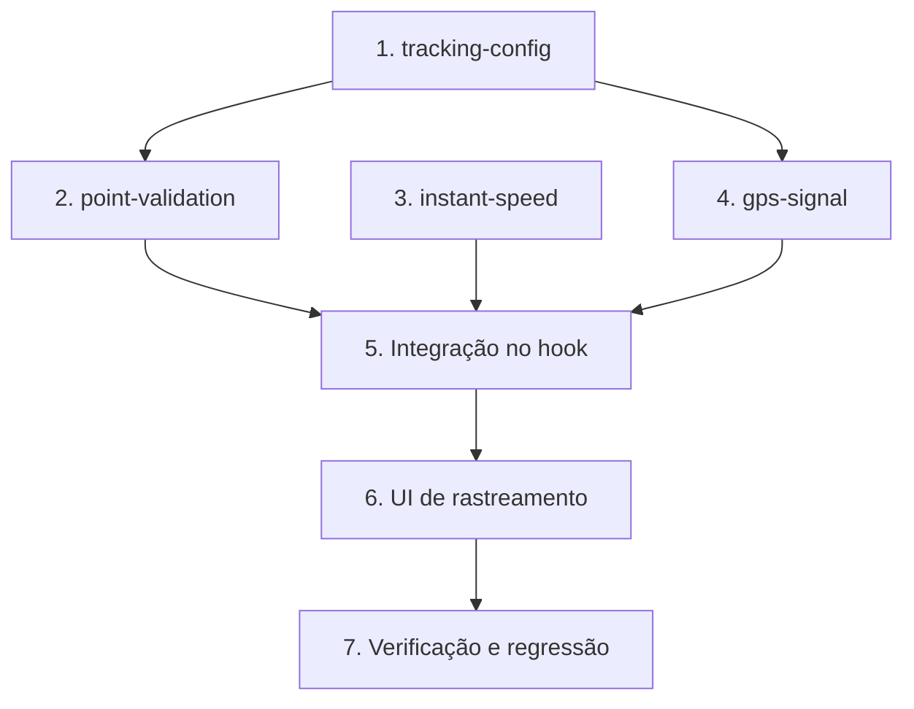

# Implementation Plan

Rastreamento Preciso de GPS (confiabilidade estilo Strava)

## Overview

Este plano implementa a filtragem/validação de pontos e a velocidade
suavizada de forma incremental, começando pelos **módulos puros** (sem I/O,
testáveis isoladamente com Vitest + fast-check), seguindo pela integração no
`use-activity-tracker.ts` (orquestração) e na UI de rastreamento, e terminando
pela verificação de integração/regressão.

Cada tarefa referencia os requisitos e as Correctness Properties (P1–P10) do
`design.md`. Tarefas marcadas com `*` são testes opcionais (podem ser adiadas
sem bloquear a entrega funcional). Nenhuma mudança de schema/banco é
necessária.

## Tasks

- [x] 1. Configuração de perfis por tipo de atividade (`tracking-config.ts`)
  - [x] 1.1 Criar `src/lib/tracking-config.ts` com `TrackingProfile`, `TRACKING_PROFILES`, `DEFAULT_PROFILE`, `ACCURACY_MIN/MAX`, `MISSING_ACCURACY_POLICY`
    - Perfis por `ActivityType` (reusar o tipo de `activity-metrics.ts`): caminhada/pedalada/trilha/outro com `maxAccuracyMeters`, `minDistanceMeters`, `maxSpeedMps` conforme design
    - `caminhada.maxSpeedMps` estritamente menor que `pedalada.maxSpeedMps`; `caminhada.minDistanceMeters = 1.5` (< 2m)
    - Função `getProfile(type)` com fallback para `DEFAULT_PROFILE`
    - Validação: `maxAccuracyMeters` default < 20 e dentro de `[ACCURACY_MIN, ACCURACY_MAX]`
    - _Requirements: 1.4, 2.5, 3.3, 3.4_
  - [x]* 1.2 Testes de `tracking-config.ts`
    - Invariantes dos perfis (caminhada < pedalada; defaults na faixa válida); `getProfile` com tipo nulo/desconhecido → default
    - 11 testes passando (Vitest + fast-check)
    - _Requirements: 2.5, 1.4_
    - _Properties: Property 3, Property 9_

- [x] 2. Validação de ponto (`point-validation.ts`)
  - [x] 2.1 Criar `src/lib/point-validation.ts` com `RawSample`, `ValidationRefState`, `ValidationResult`, `RejectionReason`, `validatePoint`
    - Ordem determinística: acurácia → primeira origem → speed_ceiling (com guarda `dt <= 0`) → deslocamento mínimo → accept
    - Reusar `haversineMeters` de `haversine.ts`
    - Amostra sem `accuracy` aplica `MISSING_ACCURACY_POLICY`
    - Nunca retorna estado indefinido; nunca divide por zero
    - _Requirements: 1.1, 1.2, 1.3, 2.1, 2.2, 2.3, 2.4, 2.6, 3.1, 3.2_
    - _Properties: Property 1, Property 2, Property 3, Property 4, Property 5_
  - [x]* 2.2 Testes de `point-validation.ts`
    - Caso de cada `RejectionReason`; borda de igualdade nos limiares; `dt <= 0` → reject determinístico; primeira origem aceita sem avaliar distância/velocidade
    - 15 testes passando (Vitest + fast-check), incluindo Property 3/4/5
    - _Requirements: 2.4, 2.6, 2.7, 3.6_
    - _Properties: Property 1, Property 2, Property 4, Property 5_

- [x] 3. Velocidade instantânea suavizada (`instant-speed.ts`)
  - [x] 3.1 Criar `src/lib/instant-speed.ts` com `SpeedWindowPoint`, `SPEED_WINDOW_SIZE`, `SPEED_STALE_MS`, `computeSmoothedSpeed`
    - Média móvel: Σ distâncias haversine da janela ÷ Σ dt; `< 2` pontos → null; janela velha (`nowTs - último.ts > SPEED_STALE_MS`) → null
    - Nunca `NaN`/`Infinity`; sempre `null` ou número finito >= 0
    - Helpers `pushWindow` e `mpsToKmh`
    - _Requirements: 4.2, 4.3, 4.7_
    - _Properties: Property 6_
  - [x]* 3.2 Testes de `instant-speed.ts`
    - Janela insuficiente/velha → null; property Property 6; 9 testes passando
    - _Requirements: 4.2, 4.3, 4.7_
    - _Properties: Property 6_

- [x] 4. Estado de qualidade do sinal (`gps-signal.ts`)
  - [x] 4.1 Criar `src/lib/gps-signal.ts` com `GpsSignalState`, `SIGNAL_WINDOW_SIZE`, `NO_SIGNAL_TIMEOUT_MS`, `deriveGpsSignal`
    - Precedência determinística: `sem_sinal` → `aquisitando` → `fraco` → `bom`; helper `pushAccuracy`
    - _Requirements: 6.1, 6.2, 6.3, 6.4, 6.5, 6.6_
    - _Properties: Property 8_
  - [x]* 4.2 Testes de `gps-signal.ts`
    - Precedência para combinações concorrentes; property Property 8; 7 testes passando
    - _Requirements: 6.6_
    - _Properties: Property 8_

- [x] 5. Integração no hook de rastreamento (`use-activity-tracker.ts`)
  - [x] 5.1 Introduzir `ingestSample` como caminho único de processamento
    - Normalizar amostra web (accuracy possivelmente ausente) e nativa (`altitude`/`speed` = -1 → null) para `RawSample`
    - Substituir os dois blocos duplicados de `startWatch` (nativo e web) por chamada a `ingestSample`
    - Manter `setCurrentPos` sempre (mapa atualiza mesmo em rejeição — Req 3.7)
    - Nota: rebuild do plugin `@outlife/capacitor-location-tracking` (dist desatualizado sem `altitude`/`speed`) para o type-check bater
    - _Requirements: 1.1, 2.3, 3.1, 3.7_
    - _Properties: Property 1, Property 10_
  - [x] 5.2 Adicionar `lastAcceptedRef` e usá-la como referência de validação
    - Distância só soma entre Accepted_Points; `lastAcceptedRef` só muda em accept
    - Elevação (subida > limiar) só entre Accepted_Points
    - Alimentar `lastMovementTsRef` (auto-pause existente) apenas em accept
    - _Requirements: 2.7, 3.6, 4.1, 7.2_
    - _Properties: Property 2, Property 10_
  - [x] 5.3 Expor `smoothedSpeedMps` e `gpsSignalState` via `setInterval` de 1s
    - Janela de velocidade (`speedWindowRef`) e de sinal (`signalAccuraciesRef` + `lastSampleTsRef`)
    - Recalcular a cada 1s aplicando `SPEED_STALE_MS`/`NO_SIGNAL_TIMEOUT_MS`
    - Durante `paused`/auto-pause: `smoothedSpeed` = 0 (Req 4.4/4.5)
    - _Requirements: 4.2, 4.3, 4.4, 4.5, 4.7, 6.1, 6.5_
    - _Properties: Property 6, Property 8_
  - [x] 5.4 Restauração sem salto artificial
    - Reidrata `lastAcceptedRef` + janela de velocidade do último ponto de `points`; vazio → null
    - _Requirements: 7.3, 7.4, 7.5_
    - _Properties: Property 2_
  - [ ]* 5.5 Teste de orquestração do hook (opcional)
    - Sequência de amostras: rejeição não altera distância/pontos; restauração não gera salto; pausa força velocidade zero
    - _Requirements: 3.7, 4.4, 7.4_
    - _Properties: Property 1, Property 2_

- [x] 6. UI de rastreamento (`atividade.rastrear.tsx`)
  - [x] 6.1 Exibir velocidade instantânea suavizada ao vivo
    - Card de velocidade ao vivo usa `tracker.smoothedSpeedMps` (via `mpsToKmh`, 1 casa); "—" quando null; zero durante pausa
    - Chave i18n `activity.metrics.currentSpeed` (pt-BR/en); Average_Pace mantido
    - _Requirements: 4.2, 4.3, 4.4, 4.5_
  - [x] 6.2 Indicador de qualidade de sinal GPS
    - Banner (ícone Satellite) durante rastreamento para `aquisitando`/`fraco`/`sem_sinal`; oculto em `bom`
    - Chaves i18n `activity.gpsSignal.*` em pt-BR e en
    - _Requirements: 5.4, 6.5, 6.7, 6.8_
  - [x] 6.3 Coerência do resumo final
    - Resumo (`atividade.$activityId.tsx`) usa `computeActivityMetrics` sobre a distância persistida (só Accepted_Points) — coerência automática, sem mudança de fórmula
    - _Requirements: 4.6, 7.2_
    - _Properties: Property 7_

- [x] 7. Verificação de integração e regressão
  - [x] 7.1 Rodar suíte de testes e type-check
    - `npm run test` (Vitest): os 4 módulos do Bloco A passam (42 testes). `npx tsc --noEmit`: código do Bloco A limpo
    - Falhas NÃO relacionadas (pré-existentes): 3 arquivos E2E Playwright (`.spec.ts`) coletados pelo Vitest (rodam via `npm run test:e2e`); 1 teste de integração (`signup-flow`) com timeout de rede no Supabase real; 6 erros `tsc` em `use-local-push.ts` (tabela `notifications` fora dos tipos Supabase)
    - _Requirements: todos_
  - [x] 7.2 Validar não-regressão dos fluxos existentes
    - Nenhuma regressão nos testes unitários/property; `route_geojson`/modelo inalterados; auto-pause/checkpoint/offline/restauração preservados na integração
    - _Requirements: 7.1, 7.3, 7.4, 7.6, 7.7_
  - [x] 7.3 Atualizar o roadmap
    - Bloco A marcado ✅ em `docs/ROADMAP-FINALIZACAO-APP.md`
    - _Requirements: —_

## Task Dependency Graph



```json
{
  "waves": [
    { "wave": 1, "tasks": ["1", "3"] },
    { "wave": 2, "tasks": ["2", "4"] },
    { "wave": 3, "tasks": ["5"] },
    { "wave": 4, "tasks": ["6"] },
    { "wave": 5, "tasks": ["7"] }
  ]
}
```

## Notes

- **Módulos puros primeiro** (tasks 1–4): sem I/O, testáveis isoladamente,
  formam a base de decisão. `point-validation` depende de `tracking-config`;
  `gps-signal` usa os limiares de `tracking-config`.
- **Integração depois** (task 5): o hook apenas orquestra; toda decisão vem
  das funções puras. Substituir a duplicação nativa/web por `ingestSample`.
- **Sem mudança de schema nem do plugin nativo** — reduz risco antes do build
  iOS (Codemagic).
- **Testes** (`*`): mapeados às Correctness Properties do design; podem ser
  implementados após a entrega funcional das tasks pai, mas são recomendados
  antes de fechar o Bloco A (padrão de qualidade Strava).
- **i18n**: novas chaves (`activity.gpsSignal.*`) em pt-BR e en.
- **Ao concluir o bloco**, atualizar `docs/ROADMAP-FINALIZACAO-APP.md`
  (regra do steering `roadmap-outvitar.md`).
