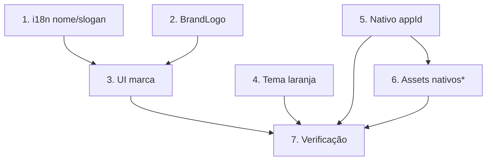

# Implementation Plan

Rebranding OutLife → OutVitar

## Overview

Rebranding em 6 frentes: i18n (nome/slogan), `BrandLogo`, metadados de rota,
tema (acento laranja), config nativa (appId/appName/gradle), e assets nativos.
A tarefa de assets nativos depende do arquivo `assets/logo-outvitar.png`
(1024×1024) fornecido pelo usuário — marcada como bloqueada até lá. Tarefas
com `*` são testes opcionais (recomendados). Referências internas técnicas a
"outlife" (localforage storeName, buckets Supabase) são preservadas.

## Tasks

- [x] 1. i18n — nome e slogan (`public/locales/{pt-BR,en}/translation.json`)
  - [x] 1.1 Adicionar bloco `brand` (`name`, `slogan`, `ecosystem`) em pt-BR e en
    - `slogan` = "VIVER É DIFERENTE DE ESTAR VIVO"; `home.slogan` legado mantido como texto de hero estilizado
    - _Requirements: 1.3, 2.1, 2.3_
  - [x] 1.2 Substituir todas as ocorrências de "Outlife" por "OutVitar" nos dois JSONs
    - 8 ocorrências por idioma substituídas, restante da string preservado
    - _Requirements: 1.1, 1.3, 7.1_
  - [x]* 1.3 Teste de guarda i18n
    - `src/lib/i18n-brand.test.ts`: falha se qualquer string contiver "Outlife"; 4 testes passando
    - _Requirements: 7.1_
    - _Properties: Property 1_

- [x] 2. Componente `BrandLogo` (`src/components/BrandLogo.tsx`)
  - [x] 2.1 Criar `BrandLogo` com props `size`/`className`/`withWordmark`
    - Wordmark "OutVitar" via `t("brand.name")`; símbolo condicional (`logoSrc` undefined até asset existir); `onError` → só wordmark; função pura `shouldShowLogoSymbol`
    - _Requirements: 3.1, 3.2, 3.3, 3.4_
    - _Properties: Property 3_
  - [x]* 2.2 Teste da função pura de fallback do `BrandLogo`
    - `src/components/BrandLogo.test.ts`: 3 testes passando
    - _Requirements: 3.2, 3.3_
    - _Properties: Property 3_

- [x] 3. Aplicar marca na UI
  - [x] 3.1 Home (`src/routes/index.tsx`): usar `BrandLogo` no hero e `t("brand.slogan")` na seção de slogan
    - `Mountain`+"Outlife" → `BrandLogo`; rodapé → `t("brand.ecosystem")`; slogan → `t("brand.slogan")`; meta tags da Home atualizadas
    - _Requirements: 1.2, 2.1, 2.2, 3.1_
    - _Properties: Property 2_
  - [x] 3.2 Metadados de rota: substituir "Outlife" por "OutVitar" nos `head()` de todas as rotas
    - 28 arquivos de rota atualizados (metadados + textos de UI); termos técnicos `Outlife_Native_Shell`/`OutLife_Application`/`[OutLife]` preservados (Req 7.2)
    - _Requirements: 1.4, 7.1_
    - _Properties: Property 1_

- [x] 4. Tema — acento laranja/sol (`src/styles.css`)
  - [x] 4.1 Reapontar `--accent`/`--accent-foreground` para o laranja da logo (claro e escuro)
    - `--accent` claro `oklch(0.70 0.17 55)`, escuro `oklch(0.72 0.16 58)`; `--mountain` mantido; comentário → "OutVitar palette"; `--accent-foreground` claro para contraste
    - _Requirements: 4.1, 4.2, 4.3, 4.4_

- [x] 5. Identidade técnica nativa — DECISÃO REVISADA: só nome exibido
  - **Decisão do usuário (08/09/2026):** manter o `appId` técnico como
    `app.outlife.mobile` para NÃO quebrar Firebase/backend/deep links. O
    rebranding é só de nome exibido no front. Portanto:
  - [x] 5.1 `capacitor.config.ts`: `appId` MANTIDO `app.outlife.mobile`; só `appName` → "OutVitar" (rótulo sob o ícone, não quebra nada)
    - _Requirements: 5.1 (revisado), 5.3_
  - [x] 5.2 `android/app/build.gradle`: `namespace`/`applicationId` MANTIDOS `app.outlife.mobile` (revertidos)
    - _Requirements: 5.4 (revisado)_
  - [x] 5.3 `strings.xml`: `app_name`/`title` → "OutVitar" (nome exibido); `package_name`/`custom_url_scheme` MANTIDOS `app.outlife.mobile`; pasta Java revertida para `app/outlife/mobile/`
    - Firebase/deep links preservados → sem pendência externa; push (FCM) intacto
    - _Requirements: 5.2 (revisado)_

- [~] 6. Assets nativos (ícone/splash) — OPCIONAL, aguarda `assets/logo-outvitar.png`
  - [ ] 6.1 Verificar/validar `assets/logo-outvitar.png` (1024×1024, sem alpha) e abortar se inválido
    - _Requirements: 6.3, 6.4_
  - [ ] 6.2 Gerar assets com `@capacitor/assets` (ícone + splash, Android/iOS)
    - `npm i -D @capacitor/assets`; `npx capacitor-assets generate`
    - Não bloqueia o funcionamento do app; o ícone atual permanece até o logo ser fornecido
    - _Requirements: 6.1, 6.2_

- [x] 7. Verificação e regressão
  - [x] 7.1 `npx tsc --noEmit` (só os 6 erros pré-existentes de use-local-push) + `npm run test` (7 testes de rebranding passando)
    - _Requirements: 7.4_
  - [x] 7.2 Busca por "Outlife" em `src/` → sobraram só referências técnicas internas documentadas (`*_Native_Shell`, `_Application`, `[OutLife]`, storeName localforage, import `com.outlife.*`)
    - _Requirements: 7.1, 7.2, 7.3_
    - _Properties: Property 1, Property 5_
  - [x] 7.3 Atualizar o roadmap
    - Bloco C ✅ (escopo front); tarefa 6 opcional aguardando logo
    - _Requirements: —_

## Task Dependency Graph



```json
{
  "waves": [
    { "wave": 1, "tasks": ["1", "2", "4", "5"] },
    { "wave": 2, "tasks": ["3", "6"] },
    { "wave": 3, "tasks": ["7"] }
  ]
}
```

## Notes

- **Assets nativos (tarefa 6) bloqueada** até o usuário fornecer
  `assets/logo-outvitar.png` (1024×1024). O resto do rebranding (UI, tema,
  nome, appId) não depende disso e pode ser concluído antes.
- **Referências internas "outlife" preservadas** (localforage storeName,
  buckets Supabase) — documentado no design/roadmap; não trocar.
- **Sem mudança de schema.** A troca de `appId` é segura pois nada foi
  publicado.
- **Ao concluir**, atualizar `docs/ROADMAP-FINALIZACAO-APP.md`.
