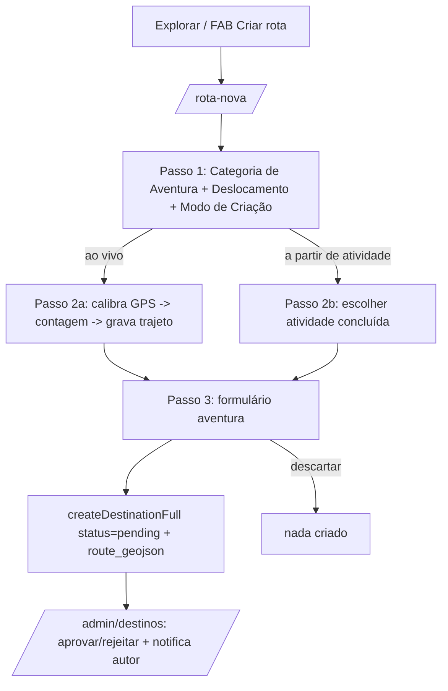

# Design Document

## Overview

Criar uma tela/fluxo com identidade própria para "Criar rota" (Rota-Destino da
comunidade), separada da tela de atividade diária. Reaproveita o rastreador
(`useActivityTracker`), a criação de destino (`createDestinationFull`,
`buildDestinationDraft`) e a moderação existente (`/admin/destinos`). A
atividade diária (aba "Gravar") permanece intacta.

Decisões:
- Nova rota flat **`/rota-nova`** (registro manual no `routeTree.gen.ts`, nome
  com hífen exige os 8 pontos). Substitui o antigo `?mode=destino` da tela de
  rastrear (o modo destino é removido de `atividade.rastrear.tsx` para não
  poluir a tela diária).
- O FAB "Criar rota" do Explorar passa a navegar para `/rota-nova`.
- Reuso máximo: gravação ao vivo usa `useActivityTracker`; "a partir de
  atividade" usa `fetchUserPublicActivities`/rota já salva; o payload final usa
  `buildDestinationDraft` + `createDestinationFull(status:'pending')`.
- Sem migration nova prevista (usa `destinations` + `createDestinationFull`). Se
  faltar campo, migration idempotente 2× + reload.

## Architecture

## Components and Interfaces

- **Rota nova** `src/routes/rota-nova.tsx` (`RotaNovaScreen`):
  - Estado de passo: `config` → (`recording` | `pick-activity`) → `form`.
  - **Passo 1 (config)**: chips de Categoria de Aventura (cachoeira/pico/
    montanha/parque/trilha/travessia/escalada) + toggle Deslocamento (a pé /
    bicicleta) + escolha do Modo de Criação (ao vivo / a partir de atividade).
    Bloqueia avanço sem categoria + deslocamento (Req 2.3).
  - **Passo 2a (recording)**: reusa `useActivityTracker`. Overlays de calibração
    de GPS e contagem 3-2-1 (extraídos/replicados do que já existe). Mapa +
    métricas ao vivo simples. Botão finalizar → `tracker.finalize()` → passo
    form.
  - **Passo 2b (pick-activity)**: lista `fetchUserPublicActivities(user.id)` com
    trajeto válido; ao escolher, carrega `route_geojson` da atividade e vai ao
    form.
  - **Passo 3 (form)**: nome (obrigatório), descrição, dificuldade, categoria
    (editável), foto (`uploadTrailImage`), pago/valor, horário, pet. Enviar →
    `createDestinationFull`.
- **Mapeamento Deslocamento → activity_type** (`src/lib/adventure-route.ts`,
  puro + testes): `bike → "pedalada"`, `foot → "trilha"`. Também expõe as listas
  de categorias/deslocamentos e um `buildAdventureDraft(points)` que delega a
  `buildDestinationDraft` (reuso) — mantém a lógica pura testável sem Capacitor.
- **Explorar** (`explorar.tsx`): FAB navega para `/rota-nova`.
- **atividade.rastrear.tsx**: remover o `?mode=destino` e todo o código do sheet
  de destino/estado relacionado (a responsabilidade migra para `/rota-nova`),
  deixando a tela diária limpa. Manter calibração/contagem só se ainda usados
  pela atividade normal; caso contrário, mover para a nova tela.

## Data Models

Sem novos modelos. Usa `destinations` (colunas ricas já existentes: category,
difficulty, route_geojson, distance_km, start_lat/lng, is_paid, price_text,
opening_hours, pet_friendly, status). `createDestinationFull` já grava tudo.

## Error Handling

- Trajeto < 2 pontos (gravado ou reaproveitado) → erro claro, não cria destino.
- Falha no upload da foto → cria sem foto.
- Falha no `createDestinationFull` → toast; o trajeto não se perde (permanece no
  estado até o usuário descartar).
- Sem GPS na gravação ao vivo → calibração permite iniciar mesmo assim.

## Correctness Properties

### Property 1: Rota-Destino pendente exige nome + trajeto
O envio só chama `createDestinationFull` com nome não vazio e >= 2 pontos.
**Validates: Requirements 3.4, 4.2**

### Property 2: Deslocamento → activity_type coerente
`toActivityType("bike") === "pedalada"` e `toActivityType("foot")` é um tipo de
caminhada/trilha; nunca uma categoria de aventura.
**Validates: Requirements 2.4**

### Property 3: Não cria atividade no feed
O fluxo não chama `finishActivity` como resultado da criação da Rota-Destino.
**Validates: Requirements 4.3**

## Testing Strategy

- Unit/property (Vitest + fast-check) em `src/lib/adventure-route.ts`:
  `toActivityType`, listas, `buildAdventureDraft` (delegando a
  `buildDestinationDraft`). Testes puros, sem importar o hook.
- Verificação de build (`build:native`) valida imports/rota nova.
- get_diagnostics nos arquivos tocados.
