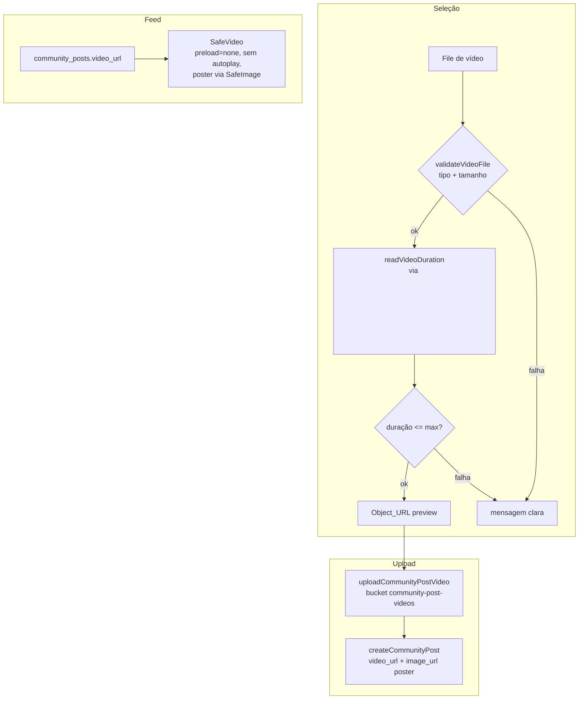

# Design Document

Vídeo na Atividade e na Comunidade

## Overview

Este design adiciona suporte a **vídeo curto** nas publicações da comunidade
(e no fluxo de finalização de atividade), reaproveitando o padrão de mídia já
existente (upload por usuário no Supabase Storage + coluna na
`community_posts` + exibição segura no feed). A prioridade de projeto é
**estabilidade de memória** — lição do Bloco B: vídeo é muito mais pesado que
imagem, então a estratégia é **validar e recusar** (tamanho + duração +
tipo) em vez de transcodificar no cliente, e **exibir sem autoplay/preload**,
mostrando um poster até o usuário dar play.

Decisão central: **não transcodificar/comprimir vídeo no navegador** (é caro,
instável e aumenta o risco de crash — justamente o que combatemos no Bloco B).
Em vez disso, limites claros: `Max_Video_Bytes = 30 MB` e
`Max_Video_Duration_Seconds = 60`. Vídeos além disso são recusados com
mensagem clara.

## Alinhamento com o código existente

| Arquivo | Papel hoje | Mudança |
|---------|-----------|---------|
| `community_posts` (Supabase) | `image_url` | + coluna `video_url` (nullable) |
| bucket `community-post-images` | imagens | novo bucket `community-post-videos` |
| `src/lib/api.ts` `uploadCommunityPostImage` | upload de imagem | novo `uploadCommunityPostVideo` + `createCommunityPost` aceita `video_url` |
| `src/components/SafeImage.tsx` (Bloco B) | imagem segura | reutilizado como poster; base para `SafeVideo` |
| `src/routes/comunidade.tsx` | criar/exibir post | seletor de vídeo + `SafeVideo` no feed |
| `src/routes/atividade.rastrear.tsx` | finish sheet (foto) | vídeo opcional no finish |
| `src/lib/video-validation.ts` (novo) | — | validação pura de tamanho/tipo |

## Architecture



## Components and Interfaces

### 1. `src/lib/video-validation.ts` (novo — puro)

```ts
export const MAX_VIDEO_BYTES = 30 * 1024 * 1024;   // 30 MB
export const MAX_VIDEO_DURATION_SECONDS = 60;      // 60 s
export const ALLOWED_VIDEO_TYPES: Record<string, string> = {
  "video/mp4": "mp4",
  "video/webm": "webm",
  "video/quicktime": "mov",
};

export type VideoValidationResult =
  | { ok: true; ext: string }
  | { ok: false; reason: "type" | "size" | "duration" };

/** Valida tipo e tamanho (puro, sem DOM). Duração é validada à parte (precisa do <video>). */
export function validateVideoFileMeta(
  file: { type: string; size: number },
  maxBytes?: number,
): VideoValidationResult;

/** Valida a duração já lida (puro). */
export function validateVideoDuration(
  seconds: number,
  maxSeconds?: number,
): { ok: boolean };
```

A leitura da duração em si (que exige DOM: `<video>.loadedmetadata`) fica num
helper fino não-puro em `api.ts`/componente; a **decisão** é pura e testável.
Política do Req 2.5 (duração indeterminável): tratar como **falha**
(`{ ok: false }`) — recusa por segurança.

### 2. `src/lib/api.ts` — upload e criação

```ts
export const MAX_COMMUNITY_POST_VIDEO_BYTES = 30 * 1024 * 1024;

async function uploadCommunityPostVideo(file: File): Promise<string>;
// valida tipo/tamanho (validateVideoFileMeta), sobe para
// bucket "community-post-videos" em `${uid}/${Date.now()}.${ext}`,
// retorna publicUrl. Lança erro claro em tipo/tamanho inválido.

// createCommunityPost passa a aceitar video_url?: string
```

Regra Req 3.3 (falha de upload): **o vídeo é enviado ANTES de criar o post**;
se o upload falhar, `createCommunityPost` não é chamado com `video_url`
inválido — a UI mostra erro e o usuário pode publicar sem vídeo ou tentar de
novo. Nunca persiste `video_url` quebrado.

### 3. `src/components/SafeVideo.tsx` (novo)

Player seguro de memória, análogo ao `SafeImage`:

```tsx
export interface SafeVideoProps {
  src: string;
  posterSrc?: string;      // Video_Poster (imagem do post) via SafeImage
  className?: string;
  aspectClassName?: string; // default "aspect-[4/5]"
}
export function SafeVideo(props: SafeVideoProps): JSX.Element;
```

- `<video preload="none" controls playsInline poster={posterSrc}>` — **sem
  autoplay, sem preload** (Req 4.1): o vídeo só é buscado/decodificado quando o
  usuário toca em play. No scroll, só o poster (imagem leve) é exibido.
- Enquanto não há play, mostra o `posterSrc` via `SafeImage` (container de
  dimensão fixa — Req 4.3). `onError` → mostra poster/fallback sem loop (Req 4.5).
- Decisão de fallback extraída para função pura testável (padrão do Bloco B).

### 4. `comunidade.tsx` — seleção e exibição

- **Seleção**: novo input `accept="video/mp4,video/webm,video/quicktime"`
  (`capture` disponível no mobile para gravar). Reusa o
  `createObjectUrlManager` do Bloco B para o preview do vídeo (Req 1.2), com
  revogação disciplinada.
- **Precedência (Req 1.3)**: se o post tem `video_url`, o feed renderiza
  `SafeVideo` (usando `image_url` como `posterSrc` quando houver); senão,
  mantém `SafeImage` como hoje (Req 4.4).
- **Publicação**: se há vídeo selecionado, `uploadCommunityPostVideo` antes de
  `createCommunityPost({ ..., video_url })`.

### 5. `atividade.rastrear.tsx` — vídeo no finish (Req 5)

- Adiciona um seletor de vídeo opcional ao `Activity_Finish_Sheet` (mesmas
  regras/limites da comunidade).
- O post automático gerado ao finalizar inclui `video_url` quando houver
  (Req 5.2).
- **Offline (Req 5.4)**: nesta entrega, o vídeo é **desabilitado no fluxo
  offline** com aviso claro ("vídeo requer conexão") — enfileirar vídeos
  grandes na `Sync_Queue` (IndexedDB) pesaria e arriscaria a estabilidade. O
  restante da atividade (trajeto, foto, snapshot) sincroniza normalmente.

## Data Models

**Migração Supabase idempotente** (`supabase/migrations/AAAAMMDD..._community-post-video.sql`):

```sql
ALTER TABLE public.community_posts ADD COLUMN IF NOT EXISTS video_url text;

INSERT INTO storage.buckets (id, name, public)
VALUES ('community-post-videos', 'community-post-videos', true)
ON CONFLICT (id) DO UPDATE SET public = EXCLUDED.public;

-- Políticas espelhando community-post-images: leitura pública; upload/
-- update/delete restritos à pasta do próprio usuário; MIME de vídeo.
-- (CREATE POLICY IF NOT EXISTS / DROP POLICY IF EXISTS ... idempotente)
```

- `video_url` nullable → posts existentes intactos (Req 3.4).
- `toUIPost` em `comunidade.tsx` passa a mapear `video_url` (opcional).

## Error Handling

- **Tipo/tamanho inválido**: `uploadCommunityPostVideo` lança erro claro; a UI
  exibe toast (Req 2.1/2.3), sem travar.
- **Duração acima do limite ou indeterminável**: recusa antes do upload
  (Req 2.2/2.5).
- **Falha de upload**: não cria post com `video_url` quebrado (Req 3.3).
- **Vídeo não carrega no feed**: `SafeVideo` mostra poster/fallback sem loop
  (Req 4.5).
- **Object_URL do preview**: revogado via `createObjectUrlManager` (Bloco B).
- **Offline com vídeo**: desabilitado com aviso; demais dados sincronizam.

## Testing Strategy

Vitest + fast-check nas funções puras (padrão do projeto, sem DOM):
- `video-validation.test.ts`: `validateVideoFileMeta` (tipo/tamanho, bordas);
  `validateVideoDuration` (limite, indeterminável → falha). Property: qualquer
  entrada retorna resultado tipado, nunca exceção.
- `SafeVideo`: função pura de fallback testada (como `SafeImage`).
- Regressão: `SafeImage`/imagem/mutações da comunidade intactos; `tsc --noEmit`
  sem novos erros.

## Correctness Properties

### Property 1: Validação de vídeo é total e tipada
Para qualquer `{ type, size }`, `validateVideoFileMeta` retorna `ok:true+ext`
ou `ok:false+reason` — nunca lança nem retorna estado indefinido.
**Validates: Requirements 2.1, 2.3, 2.4**

### Property 2: Duração indeterminável recusa
`validateVideoDuration` com valor não-finito/≤0 ou acima do máximo retorna
`ok:false`; dentro do limite retorna `ok:true`.
**Validates: Requirements 2.2, 2.5**

### Property 3: Vídeo nunca faz autoplay/preload
O `SafeVideo` renderiza `<video preload="none">` sem `autoplay`; o poster é a
única mídia decodificada até o play.
**Validates: Requirements 4.1, 4.2**

### Property 4: Sem vídeo, comportamento inalterado
Um Community_Post sem `video_url` renderiza exatamente como hoje (SafeImage/
fallback), sem SafeVideo.
**Validates: Requirements 4.4, 6.1, 6.2**

### Property 5: Nunca persiste video_url quebrado
Se o upload do vídeo falha, o post não é criado com `video_url` inválido.
**Validates: Requirements 3.3**

### Property 6: Poster de vídeo usa exibição segura
Quando há poster, ele é exibido pela estratégia de imagem segura do Bloco B
(SafeImage/container fixo), sem estourar memória.
**Validates: Requirements 4.3, 4.5**

## Decisões e trade-offs

- **Validar e recusar, não transcodificar**: compressão de vídeo no navegador
  (ffmpeg.wasm) é pesada e instável — o oposto do objetivo de estabilidade.
  Limites claros (30 MB / 60 s) resolvem sem risco.
- **`preload="none"` + poster**: garante que rolar o feed não decodifica
  vídeos; só o que o usuário toca é carregado — evita o crash do Bloco B
  amplificado por vídeo.
- **Bucket separado (`community-post-videos`)**: isola política/limites de MIME
  e facilita cotas; espelha o padrão de imagens.
- **Offline sem vídeo nesta entrega**: enfileirar blobs de dezenas de MB na
  Sync_Queue arriscaria memória/armazenamento; o vídeo exige conexão, o resto
  da atividade não. Documentado.
- **Reuso do Bloco B**: `SafeImage` (poster) e `createObjectUrlManager`
  (preview) são reaproveitados, mantendo a disciplina de memória.
