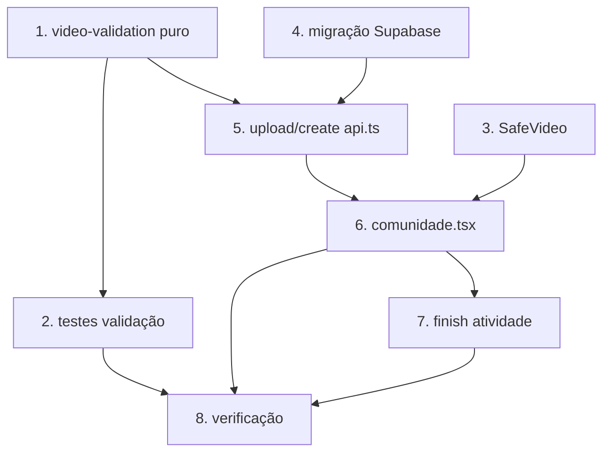

# Implementation Plan

## Overview

Vídeo na Atividade e na Comunidade (item 6). Cada tarefa é incremental,
referencia requisitos e prioriza estabilidade de memória (lição do Bloco B).
Lógica pura testável com Vitest + fast-check; sem testing-library/jsdom.
Estratégia central: validar e recusar (30 MB / 60 s / tipo), exibir sem
autoplay/preload com poster.

## Tasks

- [x] 1. Módulo puro de validação de vídeo
  - Criar `src/lib/video-validation.ts` com `MAX_VIDEO_BYTES` (30 MB),
    `MAX_VIDEO_DURATION_SECONDS` (60 s), `ALLOWED_VIDEO_TYPES`
    (mp4/webm/quicktime), `validateVideoFileMeta({type,size})` e
    `validateVideoDuration(seconds)`. Funções totais e tipadas (nunca lançam).
  - Duração não-finita/≤0 → `ok:false` (recusa por segurança).
  - _Requirements: 2.1, 2.2, 2.3, 2.4, 2.5_

- [x] 2. Testes do módulo de validação
  - Criar `src/lib/video-validation.test.ts` (Vitest + fast-check): tipo,
    tamanho (bordas exatas), duração (limite/indeterminável). Property:
    qualquer entrada retorna resultado tipado, nunca exceção.
  - _Requirements: 2.1, 2.2, 2.3, 2.4, 2.5_

- [x] 3. Componente SafeVideo (player seguro de memória)
  - Criar `src/components/SafeVideo.tsx` com `<video preload="none" controls
    playsInline>` sem autoplay, `poster` via `posterSrc`, container de
    dimensão fixa. Extrair decisão de fallback para função pura
    `nextVideoStateOnError` (padrão do `nextImageSrcOnError`), testável.
  - Criar `src/components/SafeVideo.test.ts` para a função pura de fallback.
  - _Requirements: 4.1, 4.2, 4.3, 4.5_

- [x] 4. Migração Supabase (coluna + bucket + políticas)
  - Criar `supabase/migrations/AAAAMMDD..._community-post-video.sql`
    idempotente: `ADD COLUMN IF NOT EXISTS video_url text`; bucket
    `community-post-videos` (INSERT ... ON CONFLICT); políticas de leitura
    pública + escrita restrita à pasta do usuário, espelhando imagens.
  - _Requirements: 3.1, 3.2, 3.4_

- [x] 5. Upload e criação de post com vídeo (api.ts)
  - Adicionar `MAX_COMMUNITY_POST_VIDEO_BYTES`, `uploadCommunityPostVideo(file)`
    (valida via `validateVideoFileMeta`, sobe para `community-post-videos` em
    `${uid}/${Date.now()}.${ext}`, retorna publicUrl). `createCommunityPost`
    passa a aceitar `video_url?`. Upload antes do insert; nunca persistir
    `video_url` quebrado.
  - _Requirements: 3.1, 3.3, 6.1_

- [x] 6. Seleção e exibição de vídeo na comunidade
  - `src/routes/comunidade.tsx`: input `accept` de vídeo (com `capture` no
    mobile), preview via `createObjectUrlManager` (reuso Bloco B, revogação),
    validação de duração via `<video>` metadata antes do upload. `toUIPost`
    mapeia `video_url`. Feed: se `video_url`, renderiza `SafeVideo`
    (`posterSrc = image_url`); senão `SafeImage` como hoje.
  - _Requirements: 1.1, 1.2, 1.3, 1.4, 4.4, 6.1, 6.2_

- [x] 7. Vídeo no finish de atividade
  - `src/routes/atividade.rastrear.tsx`: seletor de vídeo opcional no
    Activity_Finish_Sheet (mesmas regras/limites). Post automático inclui
    `video_url` quando houver. Offline: vídeo desabilitado com aviso claro.
  - _Requirements: 5.1, 5.2, 5.3, 5.4_

- [x] 8. Verificação final e regressão
  - Rodar testes novos + `npx tsc --noEmit` (só os 6 erros pré-existentes de
    use-local-push.ts). Confirmar que imagem/curtir/comentar/compartilhar
    (Banner_Generator) seguem sem regressão.
  - _Requirements: 6.1, 6.2, 6.3, 6.4_

## Task Dependency Graph



```json
{
  "waves": [
    { "wave": 1, "tasks": ["1", "3", "4"] },
    { "wave": 2, "tasks": ["2", "5"] },
    { "wave": 3, "tasks": ["6"] },
    { "wave": 4, "tasks": ["7"] },
    { "wave": 5, "tasks": ["8"] }
  ]
}
```

## Notes

- Constantes concretas: `MAX_VIDEO_BYTES = 30 MB`, `MAX_VIDEO_DURATION_SECONDS
  = 60`, tipos mp4/webm/quicktime. Consistentes entre cliente e política do
  bucket.
- Reuso do Bloco B: `SafeImage` (poster) e `createObjectUrlManager` (preview).
- Offline nesta entrega: vídeo desabilitado no fluxo offline (não enfileirar
  blobs grandes na Sync_Queue).
- Rodar testes com output em arquivo por causa do Vite server que pendura o
  terminal: `npx vitest run <arquivo> --reporter=basic > out.txt 2>&1`.
